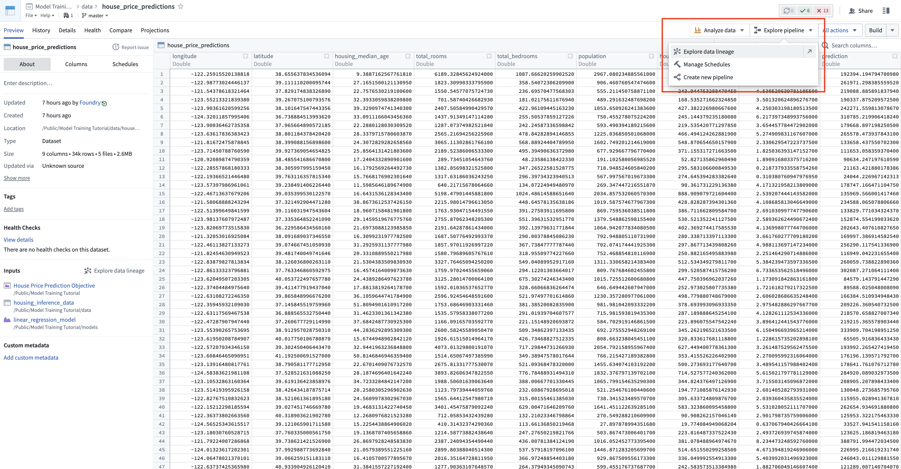
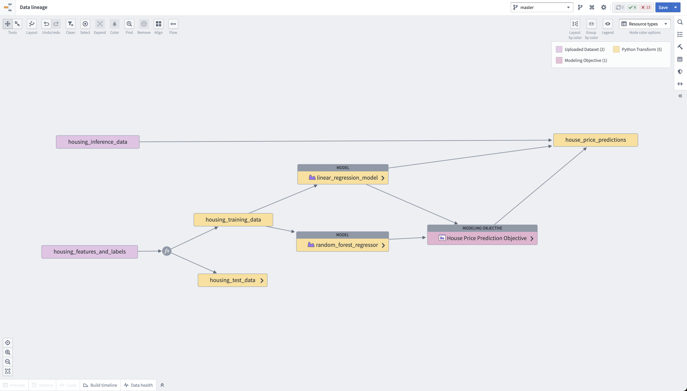

<!-- source: https://palantir.com/docs/foundry/model-integration/tutorial-conclusion/ · mirrored 2026-08-26 from Palantir Foundry docs -->

# Conclusion and next steps

In this tutorial, we created a supervised machine learning project in Foundry, in which we:

* Created a project for iterative model experimentation and development,
* Performed initial feature preparation and pipelining,
* Trained a production-ready model,
* Deployed our model to a live-hosted endpoint and a batch pipeline that automatically updates.

Foundry automatically tracks the lineage of all resources you produce in the platform. At the end of this tutorial, you will have a pipeline resembling the below screenshots.

**Action:** Navigate to your `house_price_predictions` dataset, select **Explore pipelines > Explore data lineage**.

## Next steps

The next step is to convert this example workflow to a real workflow at your organization.

This typically includes:

1. Integrate data from a range of data sources into Foundry to create a `features_and_labels` dataset that can be used for training and testing different models.
2. Try different model architectures, parameters, and features to get the best performance for your model.
3. Integrate your model's predictions into the Foundry Ontology for use in operational applications either through a batch deployment, live deployment, or Python transforms.
4. [Create pre-release checks](/docs/foundry/manage-models/set-up-checks/) in your modeling objectives to ensure models are approved before release.
5. [Create "writeback" actions](/docs/foundry/action-types/overview/) to capture user actions as a new dataset and use this data for continuous re-training and improvement of your model.
6. [Create a model inference history](/docs/foundry/manage-models/model-inference-history/) to improve and iterate on your model for more accurate performance and usage.
