<!-- source: https://palantir.com/docs/foundry/model-integration/tutorial-evaluate-manage-models/ · mirrored 2026-08-26 from Palantir Foundry docs -->

# 3. Tutorial - Evaluate a model in the Modeling Objectives application

Before starting this tutorial, you should have already completed the [modeling project setup](/docs/foundry/model-integration/tutorial-set-up-project/) and trained a model in a [Jupyter® notebook](/docs/foundry/model-integration/tutorial-train-jupyter-notebook/) or in [Code Repositories](/docs/foundry/model-integration/tutorial-train-code-repositories/); at this point, you should have at least one model in your modeling objective.

In this step of the tutorial, we will evaluate the performance of our model and release that model in the modeling objective. This step is recommended, but will not impact subsequent steps of this tutorial and can be returned to later. This will cover:

1. [What is a modeling objective?](#31-what-is-a-modeling-objective)
2. [Configuring automatic model evaluation](#32-how-to-configure-automatic-model-evaluation)
3. [Building metrics pipelines](#33-how-to-build-metrics-pipelines)
4. [Evaluating models in the evaluation dashboard](#34-how-to-evaluate-models-in-the-evaluation-dashboard)

## 3.1 What is a modeling objective?

A modeling objective can be thought of as a catalog of potential production-worthy model versions. Submitting models to an objective adds a model to that catalog and makes it available for evaluation and review in the context of a specific modeling problem or goal. Each model submission, whether eventually productionized or not, helps track progress of a modeling project and maintains a history of experimentation and learning around a project space.

**There are no required actions for this step of the tutorial.**

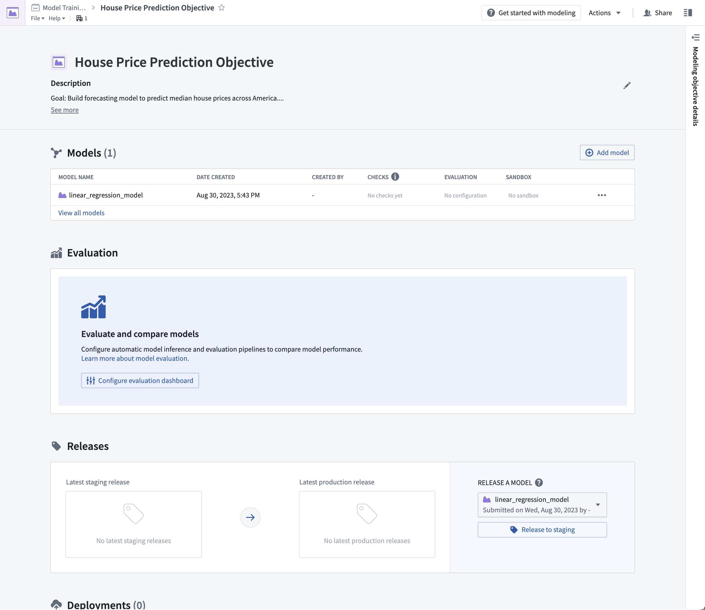

## 3.2 How to configure automatic model evaluation

Now that we have a model candidate in our modeling objective, we can evaluate how well this model performs by generating model performance metrics inside this modeling objective. Performance metrics are an important tool in understanding how well your model performs and why your model acts the way that it does.

As the objective of this tutorial is to estimate a number (the average house price in an American census district), our modeling problem can be categorized as a regression modeling problem. For a regression modeling problem, it is common to look at evaluation metrics such as **Mean absolute error**, **Root mean squared error**. These metrics, among others, are included in Foundry's [default regression evaluator](/docs/foundry/evaluate-models/evaluator-regression/) and so, we will use this library to evaluate the performance of our model submissions.

**Action:** From the modeling objective, select **Configure evaluation dashboard**.

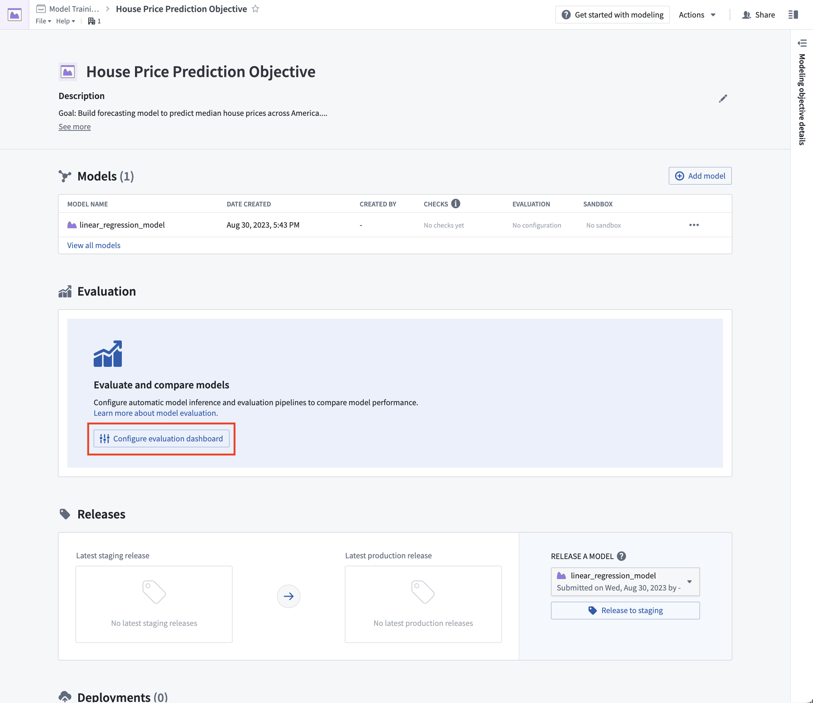

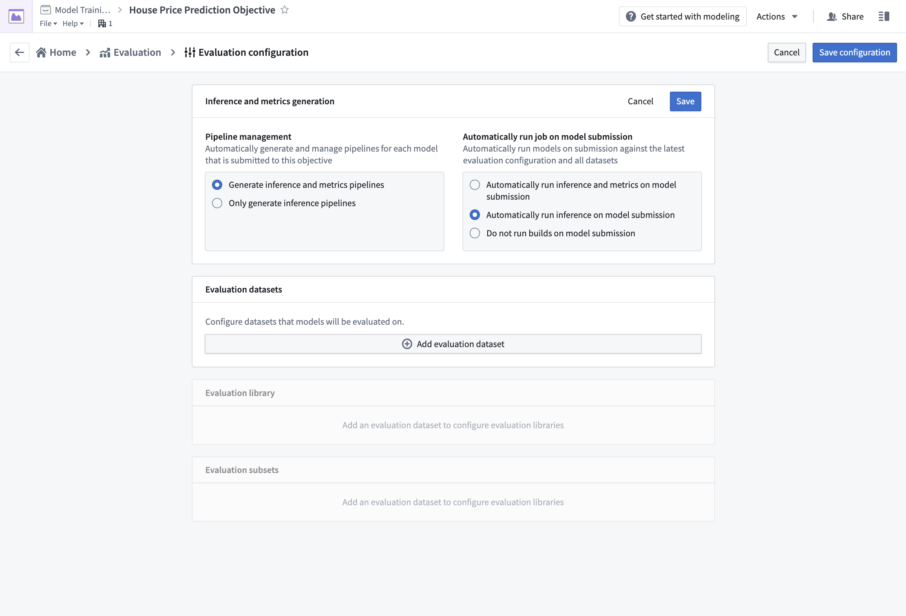

### Configure model evaluation

Automatic model evaluation is a useful way to ensure that models are evaluated in a standardized manner. Standardization ensures consistent model comparison and that allows you to confidently choose which model is best to use in production.

If evaluation pipeline management is enabled; Foundry will automatically generate one inference dataset for each combination of model submission and evaluation dataset. The inference dataset is the result of running inferences (generating predictions) for your model against an evaluation dataset. An evaluation dataset is defined by a user as a standardized test set for your model and requires both the features (used to generate predictions) and labels (used to compare model inferences with the ground-truth labels).

**Action:** To configure pipeline management, select **Edit** and then select both the following options: **Generate inference and metrics pipelines** and **Automatically run inference and metrics on model submission**. Then, **Save** to confirm your pipeline management settings.

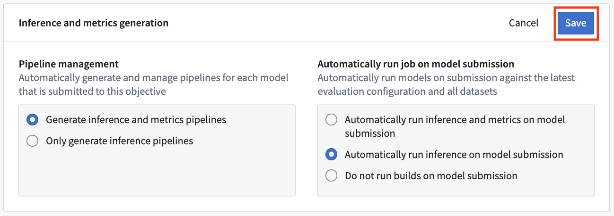

**Action:** To configure an evaluation dataset, select **Add evaluation dataset**, then the **`housing_test_data` dataset** that you created in the [model training](/docs/foundry/model-integration/tutorial-train-code-repositories/) tutorial as your evaluation dataset. Select your `data` folder as the inference destination and metrics destination. Confirm your selection by choosing **Select dataset and folders**.

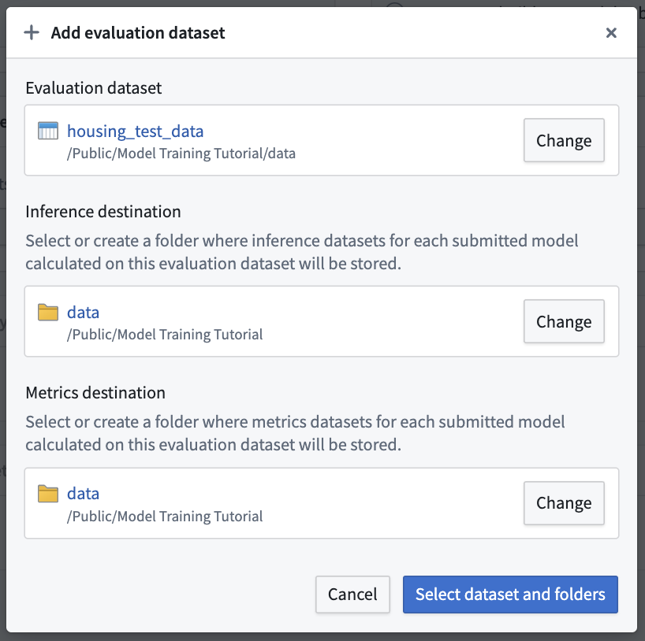

### Configure evaluation library

The evaluation library is a parameterizable Foundry library that can be used to take an inference dataset and produce evaluation metrics that will be added to an evaluation dashboard in a modeling objective. Foundry comes with default evaluation libraries for [regression](/docs/foundry/evaluate-models/evaluator-regression/) and [binary classification](/docs/foundry/evaluate-models/evaluator-binary-classification/) but it is also possible to [create custom evaluation libraries](/docs/foundry/evaluate-models/evaluator-custom/) for your specific modeling problem.

To evaluate all models added to this modeling objective, all model submissions must generate their evaluation scores consistently. In this modeling objective, we will expect that all models generate an inference column named `prediction` that is a `float`.

**Action:** Choose **Select evaluation library** and then **Regression default library**. Configure the inference\_field as `prediction` of type `float`, the actual\_field (the property we are trying to estimate) as `median_house_value` and leave **histogram\_bins** empty. **Save** to save evaluation library configuration.

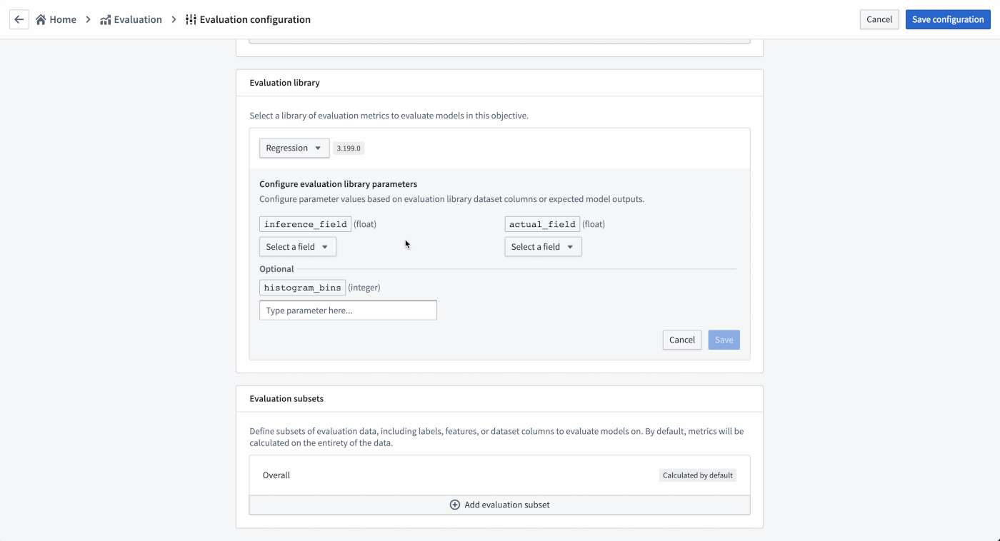

### Configure evaluation subsets

Setting up evaluation subsets is an optional step in model evaluation that allows you to independently generate metrics for specific portions of the evaluation data. These metrics can all be separately analyzed in the evaluation dashboard.

You may want to enable evaluation subsets if:

* You want to understand if there are segments of your data where your model performs better than others. This can inform the bounds where this model should be used in production.
* You want to understand if there are areas where your model performs poorly, allowing you to focus future development efforts.
* You want to ensure your model is not biased against a protected group in your evaluation data.

In this case, we will examine how the model performs where the average house age is less than 5 years or more than 30 years.

**Action:** Select **Add evaluation subset** and then the `housing_median_age` field. As this is a numeric field, we can define the quantitative bucketing strategy to use. In this example, we will use a **Range cut-off** with the buckets `5` and `30`.

**Action:** **Save** the subset configuration.

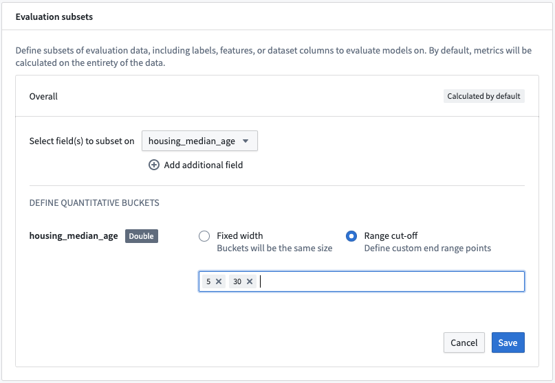

This subset configuration will evaluate the models on four different sets of data on each evaluation dataset.

* `Overall`: This is the entire evaluation dataset.
* `housing_median_age (<5)`: The evaluation dataset filtered to where the `housing_median_age` is less than 5.
* `housing_median_age (>= 5, < 30)`: The evaluation dataset filtered to where the `housing_median_age` is greater than or equal to 5 but less than 30.
* `housing_median_age (>= 30)`: The evaluation dataset filtered to where the `housing_median_age` is greater than or equal to 30.

This will allow us to determine whether the model is behaving similarly on records where the `housing_median_age` differs.

**Action:** Select **Save configuration** at the top-right of the page to save and return to the evaluation dashboard. From now, any model that you submit to this objective will automatically produce and build inference and metrics datasets that you can use to evaluate your models.

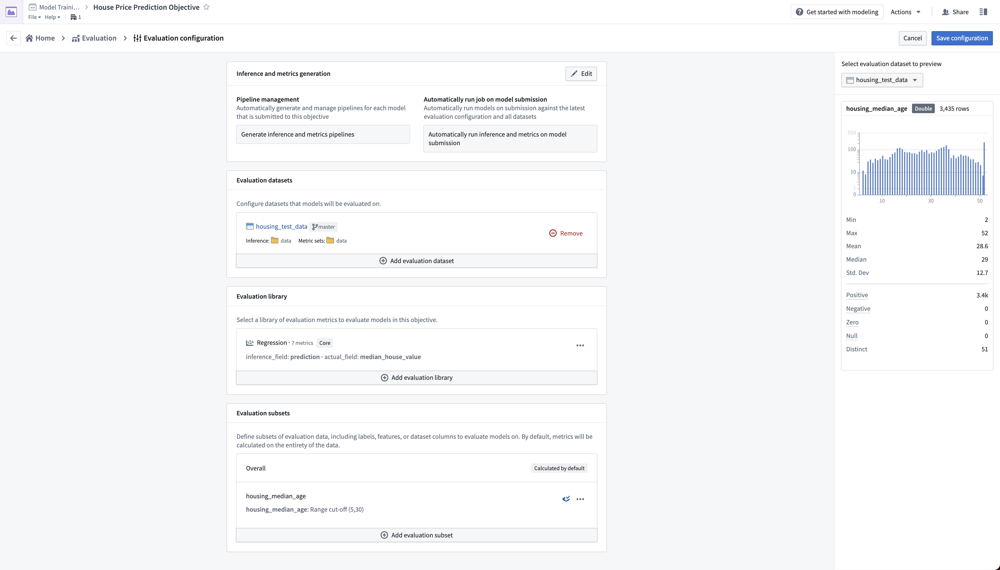

## 3.3 How to build metrics pipelines

After configuring your metrics pipelines, an inference dataset and metrics dataset will be created and started every time you make a model submission to this modeling objective. If configured to do so, Foundry will also automatically run those datasets and add metrics to the evaluation dashboard in your modeling objective.

In this case, as we had already added the model to this objective we will need to manually start the build of those datasets.

**Action:** Select **Build Evaluation** at the top right of the evaluation dashboard, then choose **housing\_test\_data** as the evaluation dashboard and **linear\_regression\_model** as the model to evaluate. Then, **Build** to start the inference and metrics builds.

:::callout{title="Note"}
It might take a few minutes for your evaluation pipelines to be created; you may need to wait until the **Build** action becomes active.
:::

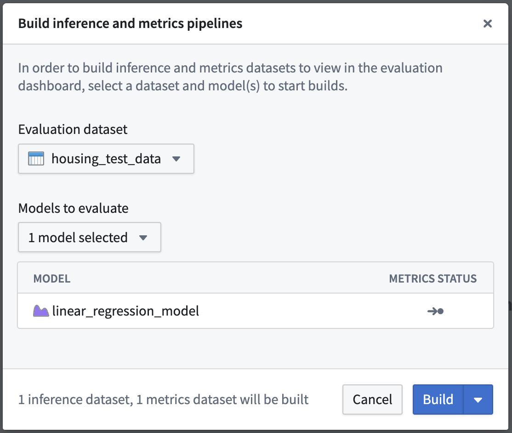

Once your build is started, you can see the progress of those builds from the evaluation dashboard by looking at the recent builds dropdown at the top-right of the evaluation dashboard.

:::callout{title="Note"}
Depending on the load of your Foundry instance, running evaluation pipelines may take a few minutes.
:::

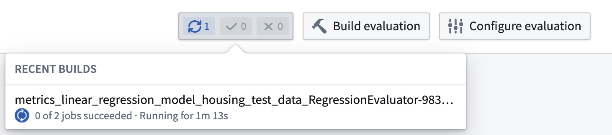

## 3.4 How to evaluate models in the evaluation dashboard

Before moving on with this tutorial, your evaluation dashboard should have successfully completed builds of your inference and metrics datasets that you created earlier. Once metrics have completed, you will be able to see and compare the metrics for all models that you have added to this modeling objective. This creates a centralized source of the performance of your modeling project.

In the regression evaluation library, we generated a range of metrics that are available in the evaluation dashboard. These metrics give us an understanding of how accurately our model is able to predict the labels (the median house price for a census district) on unseen test data.

Determining what metrics to use and what adequate performance means will vary by project. This process usually requires discussion with stakeholders, but for our fictional example, we will say this model performs well enough. In this case a Root Mean Squared Error of 82639.10 means that, on average, the model predictions are $82,639.10 away from the label in our unseen test data.

**Action:** Refresh the page, select the **`housing_test_dataset` dataset** in the dataset selector on the left-side bar, then select **linear\_regression\_model** from the model selector.

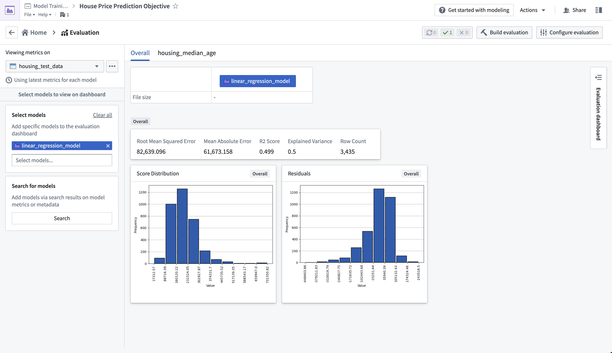

The evaluation dashboard also shows us model performance broken down by the subsets that we defined earlier. The tabs in our evaluation dashboard reflect the available subset groups we can see metrics for. In this case, we can see that our model performs best where the median house age is between 5 and 30 years old.

**Action:** Select the **housing\_median\_age** tab at the top of the evaluation dashboard.

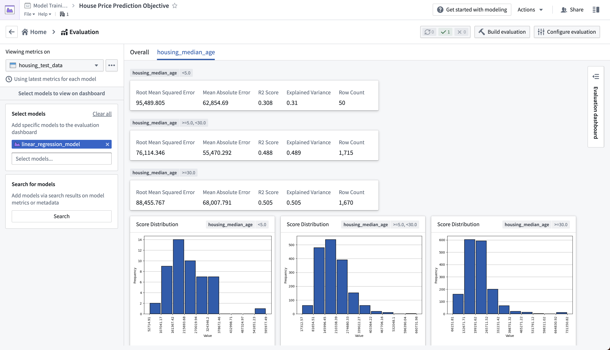

## Next step

Now that we have evaluated our machine learning model, we can integrate this model into a production application. Review the how to [Productionize a model](/docs/foundry/model-integration/tutorial-productionize/) tutorial.
