<!-- source: https://palantir.com/docs/foundry/model-integration/tutorial-productionize/ · mirrored 2026-08-26 from Palantir Foundry docs -->

# 4. Tutorial - Productionize a model

Before moving on with this tutorial, you should have completed the [modeling project setup](/docs/foundry/model-integration/tutorial-set-up-project/) and [model training](/docs/foundry/model-integration/tutorial-train-code-repositories/) and, optionally, the [model evaluation](/docs/foundry/model-integration/tutorial-evaluate-manage-models/) tutorials. At this point, you should have at least one model in your modeling objective.

In this step of the tutorial, you take your machine learning model and set up a production usage of that model.

1. [Release a model in a modeling objective](#41-release-a-model-in-modeling-objective).
2. [Create a batch deployment for batch processing](#42-how-to-create-a-batch-deployment-for-batch-processing).
3. [Create an interactive live endpoint for your model](#43-how-to-create-an-interactive-live-endpoint-for-your-model).

## 4.1 Release a model in modeling objective

Now that we have a model, it can be deployed to production. Depending on the intended use of this model we might want to productionize it in one of a few ways. Models can be deployed from Modeling Objectives, which offer full-featured release and model management including documentation, evaluation and support for comparing submissions from multiple backing models.

Deployment from Modeling Objectives can be done in the following ways:

* **In a batch deployment:** Generate predictions for a dataset, recommended for calculating predictions for a group of records at once.
* **In a live deployment:** Host the model behind a REST endpoint, recommended for using the model from an external system or if you require real-time interactivity with your model.
* **In a Python transform:** Useful for quick iteration in a transform.

Alternatively, users who favor a more lightweight setup can import their model in a transform for batch inference as [described in the tutorial on running batch inference in Code Repositories](/docs/foundry/model-integration/tutorial-train-code-repositories/#2c4-how-to-run-batch-inference), or deploy it behind a REST endpoint using [direct deployments](/docs/foundry/manage-models/create-a-model-deployment/) without creating a modeling objective.

Learn more about [the differences between live deployments in Modeling Objectives and direct deployments](/docs/foundry/manage-models/create-a-model-deployment/#comparison-direct-model-deployments-vs-modeling-objective-live-deployments).

### What is a release in a modeling objective?

Batch and live deployments are backed by model releases. If you release a new model in a modeling objective, the deployments in that modeling objective will be automatically upgraded to use the newly released model.

This allows model consumers to use the model without worrying about its specific implementation. Data scientists can focus on making the model better while application developers focus on building useful applications.

### Release management

Releases and deployments are categorized into staging and production. Model developers can release a model to the staging environment before production release. This upgrades staging deployments while leaving production deployments unchanged. A data scientist or application builder can then test the new model in the staging environment before the model is productionized.

All releases, as well as the individual who released the model, are recorded to ensure teams can keep a track of which model was used at what time. This can help answer regulatory questions such as those required by GDPR or the EU AI Act.

**Action:** Navigate to the home page in your modeling objective and scroll to the releases section. Select **Release to staging**, then select the arrow icon to release the model to production. You will need to give the release a release number, such as "1.0".

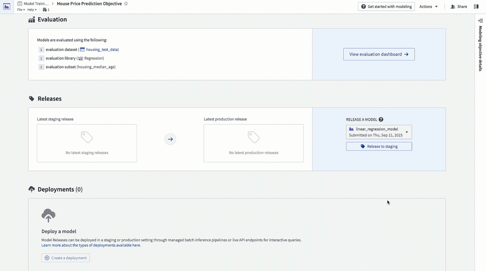

## 4.2 How to create a batch deployment for batch processing

A batch deployment will create a Foundry transform from an input dataset. The output of a batch deployment is dataset that is the result of running inference (generating predictions) on the input dataset with the model.

**Action:** **Click create deployment** and configure a production batch deployment. Give the deployment a name `Batch deployment` and a description `Production batch deployment`. Select the `housing_inference_data` dataset that you created earlier as your input dataset, and create a new output dataset in your `data` folder named `house_price_predictions`. Select **Create deployment** to save the configuration.

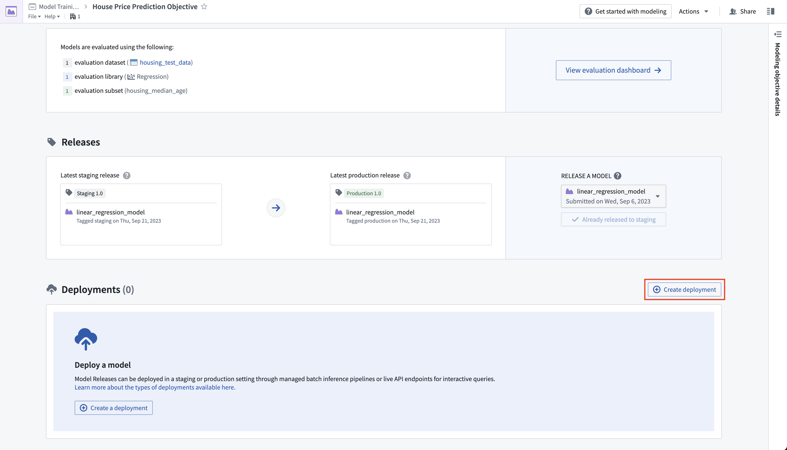

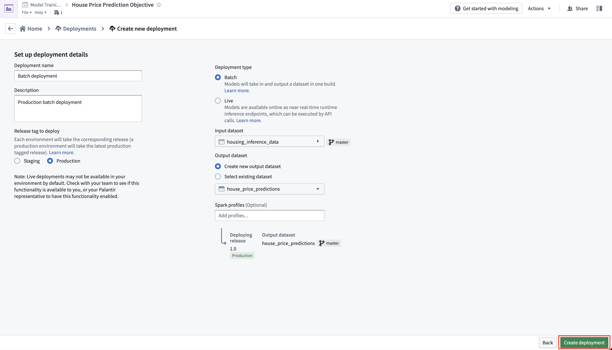

Now, you can schedule the batch deployment so that your output dataset will update automatically whenever a new model is released - ensuring that you are always using the best predictions. Add a schedule on the output dataset so that the output dataset will rebuild whenever it receives new logic.

**Action:** Select your batch deployment in the deployments table. Select the output dataset named `house_price_predictions`. Under `All actions`, select **Manage schedules**. On the `house_price_predictions` dataset, select **Create new schedule -> When multiple time or event conditions are met**, when the `house_price_predictions` dataset receives `New logic`. Finally, select **Save** to save the schedule.

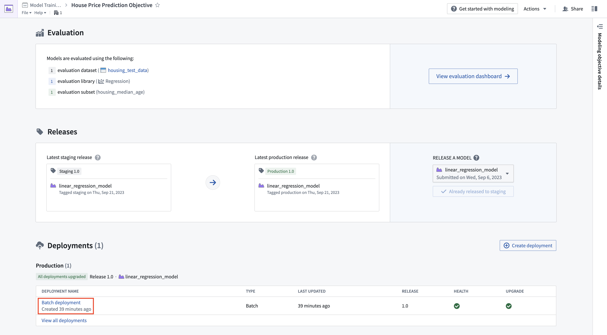

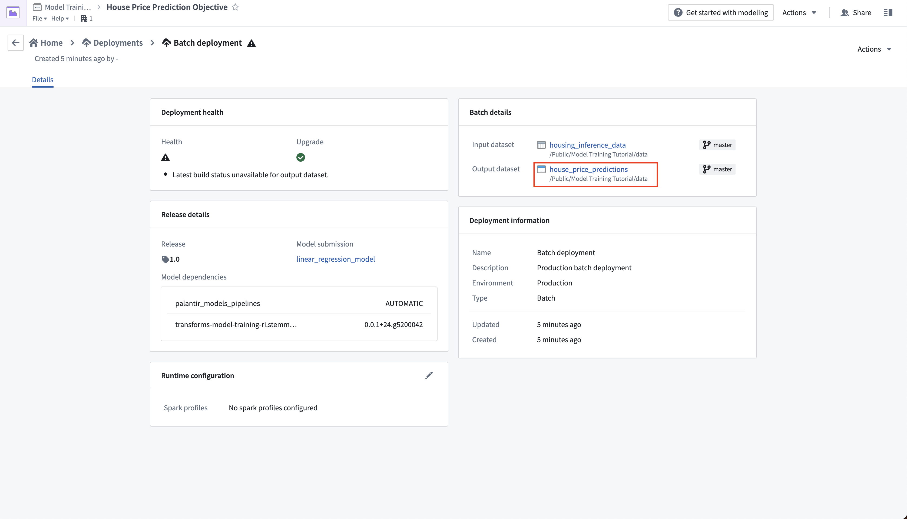

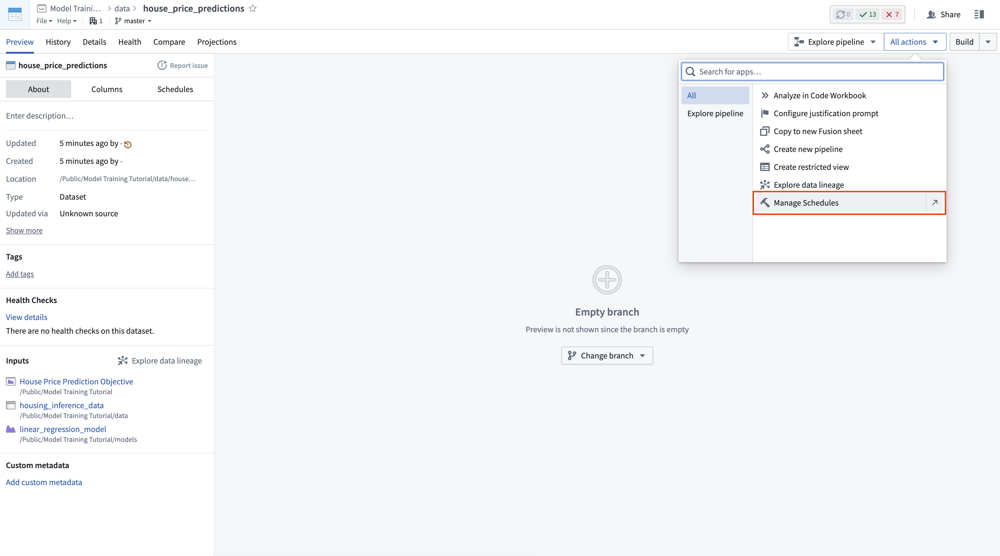

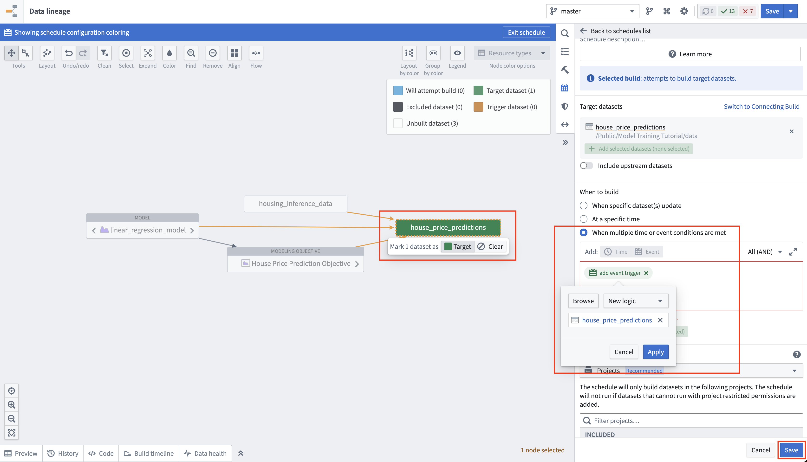

Lastly, as we have not updated the `house_price_predictions` dataset, we can run this to generate predictions. After the build has completed, you can open the `house_price_predictions` dataset to see the newly-derived predictions in the `prediction` column.

**Action:** Select **Run now** in the schedule view to build the `house_price_predictions` dataset. After the build is completed, you can open the output dataset to see the generated predictions by right-clicking the `house_price_predictions` dataset and then choosing **Open**.

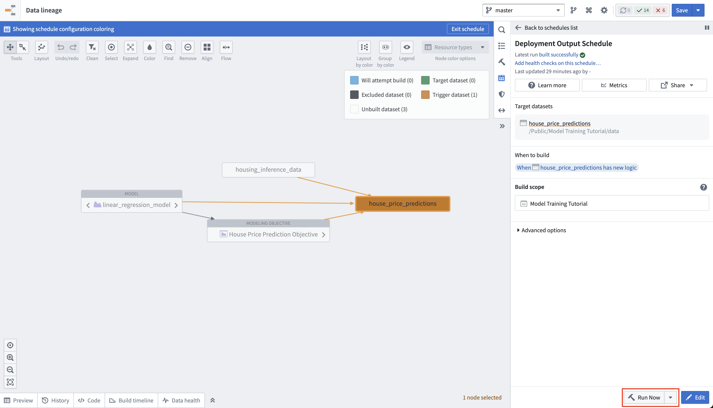

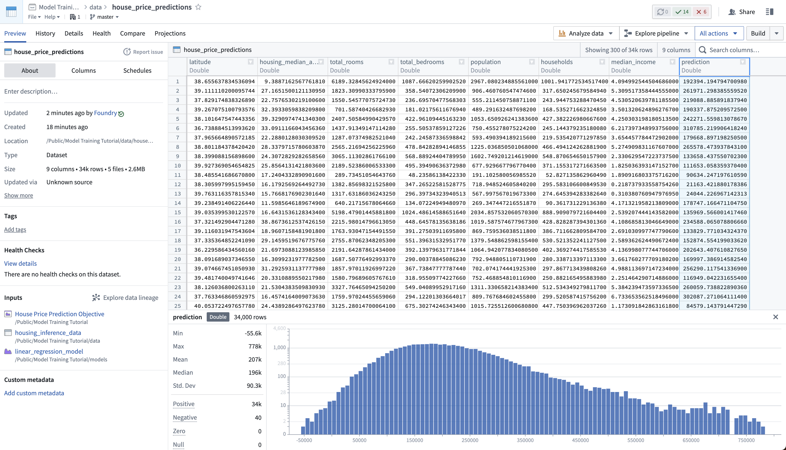

## 4.3 How to create an interactive live endpoint for your model

A live deployment is a queryable endpoint that hosts the production model behind a REST endpoint. A live deployment is useful when you want to interact with a model interactively and can be queried from:

* **Functions on Models:** [Functions on Models](/docs/foundry/functions/functions-on-models/) enables querying models directly from [Slate](/docs/foundry/slate/overview/) or [Workshop](/docs/foundry/workshop/overview/) applications in Foundry.
* **A real-time external system:** Such as a website that needs to generate a live prediction from user behavior.
* **CURL:** For local testing of your model.

In this example, you might want to build an interactive dashboard that allows a user to enter details about a census district and see how this impacts the median house price.

The ability to create live deployments [can be permissioned separately from the ability to create batch deployments](/docs/foundry/manage-models/live-faq/#can-i-restrict-who-can-create-live-deployments-on-my-instance), so this option may be unavailable even though you were able to create the batch deployment above. If it is unavailable, contact Palantir Support.

**Action:** From the objective home page, **Click Create Deployment** and configure a production live deployment. Give the deployment a name `Live deployment` and a description `Production live deployment`. **Click Create deployment** to save the configuration.

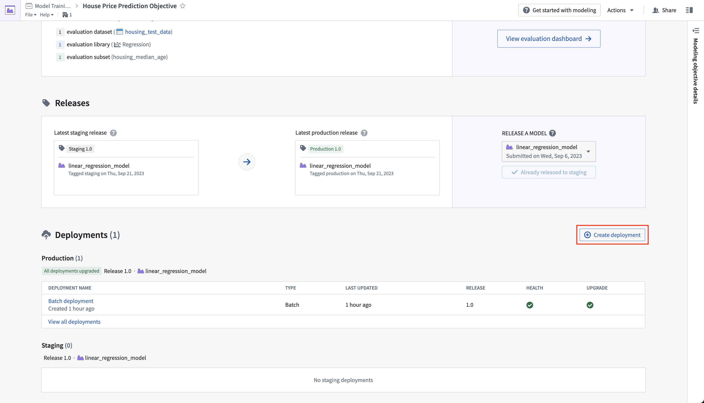

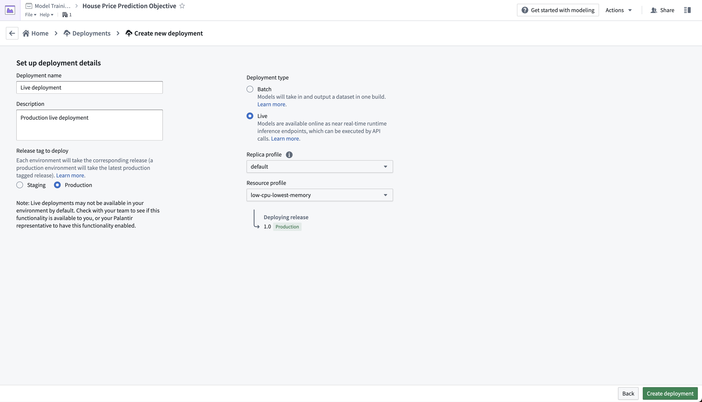

The live deployment may take a few minutes to start. Once it is initialized, you can set up real-time operational applications to connect to the model.

**Action:** Select your live deployment. When the deployment has upgraded, open the **Query** tab. Paste in the below example and select **Run** to test the model.

```json
{
  "df_in": [
    {
    "housing_median_age": 33.4,
    "total_rooms": 1107.0,
    "total_bedrooms": 206,
    "population": 515.3,
    "households": 200.9,
    "median_income": 4.75
    }
  ]
}
```

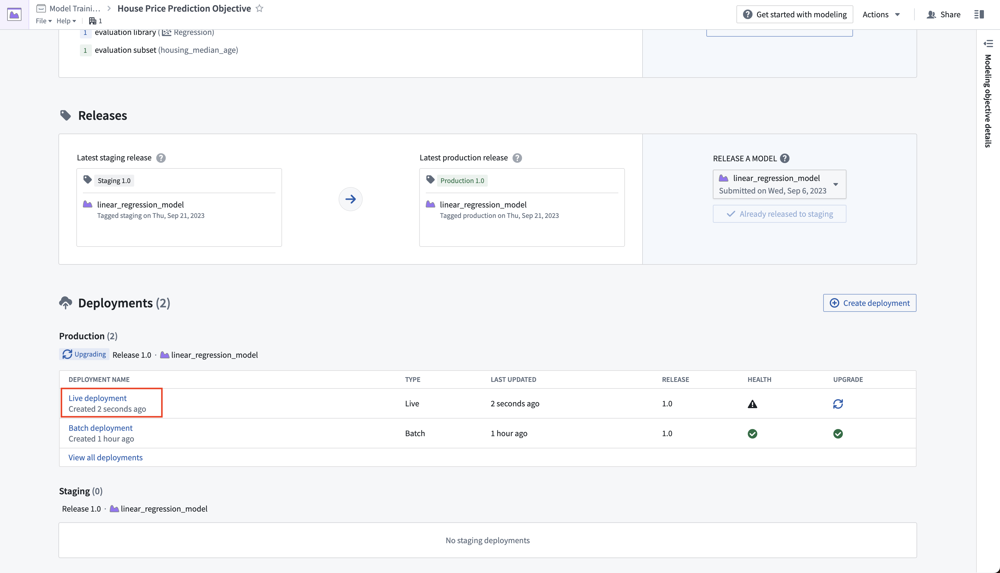

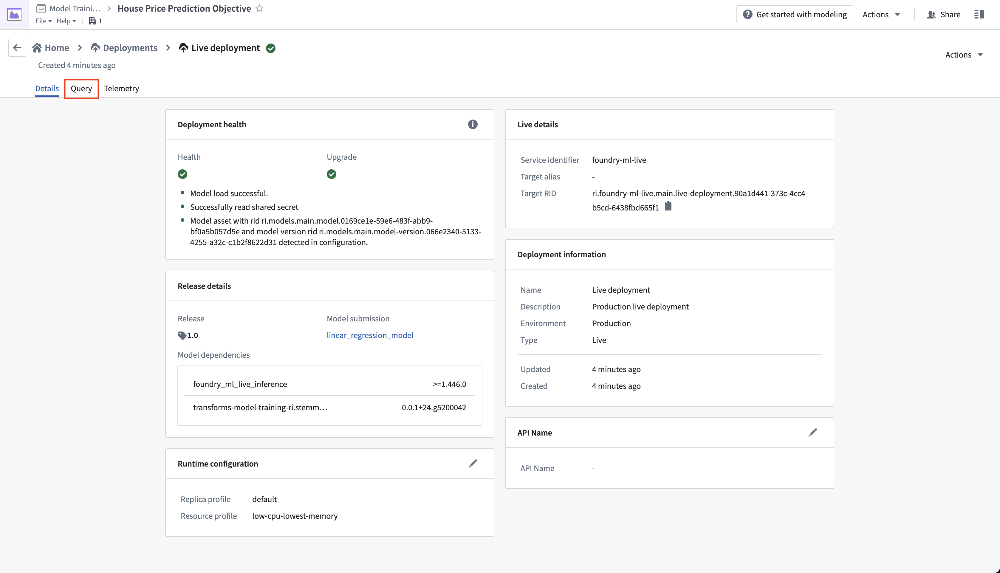

**Optional:** With the example query in the query text box, select the copy icon to copy an example CURL request that you can use to test the model locally. You will need to update \<BEARER\_TOKEN>, <STACK>, and the \<DEPLOYMENT\_RID> to match the your Foundry environment and live deployment. You can generate a \<BEARER\_TOKEN> following the [generate user token documentation](/docs/foundry/platform-security-third-party/user-generated-tokens/).

```bash
curl --http2 -H "Content-Type: application/json" -H "Authorization: <BEARER_TOKEN>" -d '{"requestData":[ { "housing_median_age": 33.4, "total_rooms": 1107.0, "total_bedrooms": 206, "population": 515.3, "households": 200.9, "median_income": 4.75 } ], "requestParams":{}}' --request POST <STACK>/foundry-ml-live/api/inference/transform/<DEPLOYMENT_RID>
```

:::callout{title="Warning"}
Live deployments are backed by a continually running server. Once started, Foundry will not terminate a staging or production deployment automatically. Live deployments may be expensive, so make sure to disable or delete this live deployment after you have completed the tutorial. Note that [direct deployments](/docs/foundry/manage-models/create-a-model-deployment/) can be configured to scale down to zero and start servers as needed, although the first calls will take longer to respond while the server(s) spins up.

You can disable or delete a live deployment through the actions dropdown in the live deployment view.
:::

## Next step

At this point, we have successfully set up a machine learning project, built a new model, evaluated its performance, and deployed it so the model is now ready for operational use.

Before reading the [tutorial conclusion](/docs/foundry/model-integration/tutorial-conclusion/), consider training a new version of your model, evaluating it, and then updating your deployments by creating a new production release. You can use the following logic to train a random forest regressor with `scikit-learn` and a new, derived property `housing_age_per_income` instead. You will not need to update your model adapter logic for the below code.

```python
from transforms.api import transform, Input
from palantir_models.transforms import ModelOutput
from main.model_adapters.adapter import SklearnRegressionAdapter


def derive_housing_age_per_income(X):
    X['housing_age_per_income'] = X['housing_median_age'] / X['median_income']
    return X


def train_model(training_df):
    from sklearn.ensemble import RandomForestRegressor
    from sklearn.impute import SimpleImputer
    from sklearn.pipeline import Pipeline
    from sklearn.preprocessing import StandardScaler, FunctionTransformer

    numeric_features = ['median_income', 'housing_median_age', 'total_rooms']

    numeric_transformer = Pipeline(
        steps=[
            ("rooms_per_person_transformer", FunctionTransformer(derive_housing_age_per_income, validate=False)),
            ("imputer", SimpleImputer(strategy="median")),
            ("scaler", StandardScaler())
        ]
    )

    model = Pipeline(
        steps=[
            ("preprocessor", numeric_transformer),
            ("regressor", RandomForestRegressor())
        ]
    )
    X_train = training_df[numeric_features]
    y_train = training_df['median_house_value']
    model.fit(X_train, y_train)

    return model

@transform.using(
    training_data_input=Input("<YOUR_PROJECT_PATH>/data/housing_training_data"),
    model_output=ModelOutput("<YOUR_PROJECT_PATH>/models/random_forest_regressor_model"),
)
def compute(training_data_input, model_output):
    training_df = training_data_input.pandas()
    model = train_model(training_df)

    # Wrap the trained model in a ModelAdapter
    foundry_model = SklearnRegressionAdapter(model)

    # Publish and write the trained model to Foundry
    model_output.publish(
        model_adapter=foundry_model
    )
```
