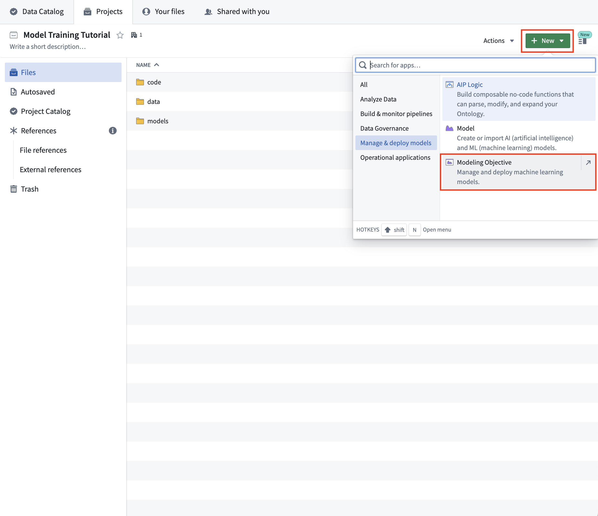
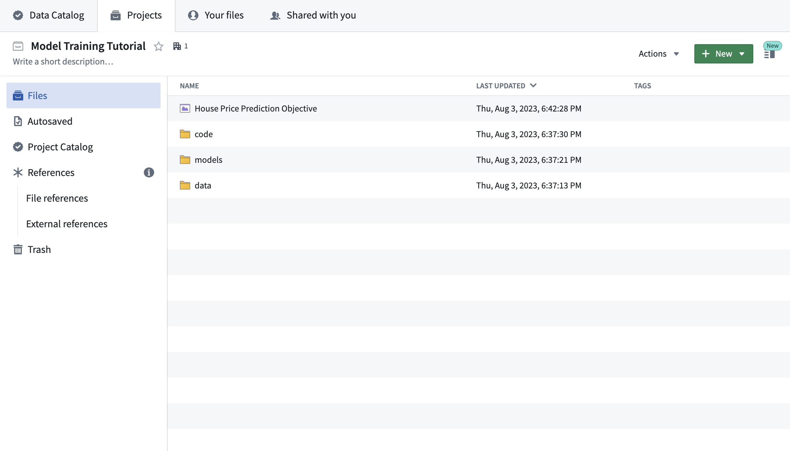
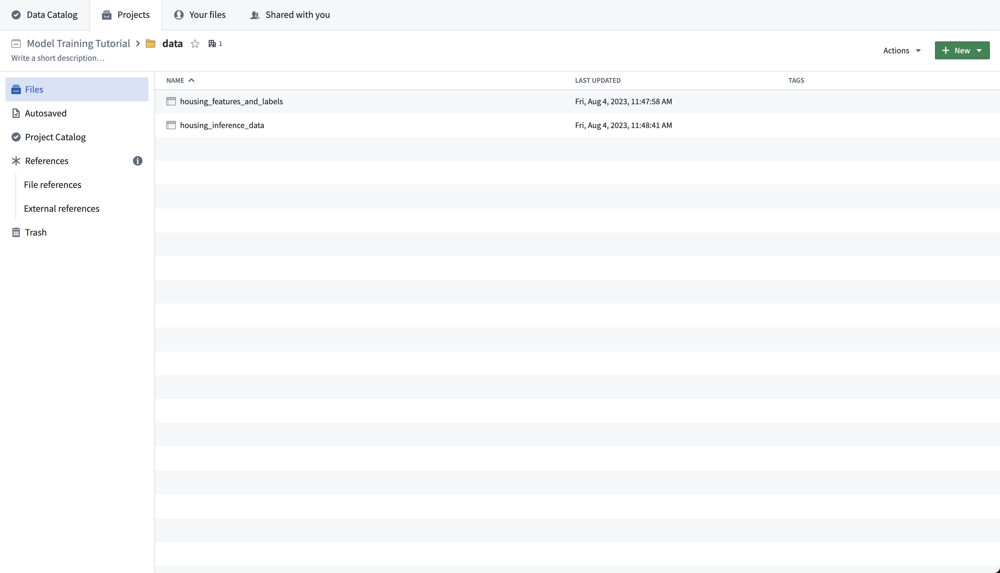
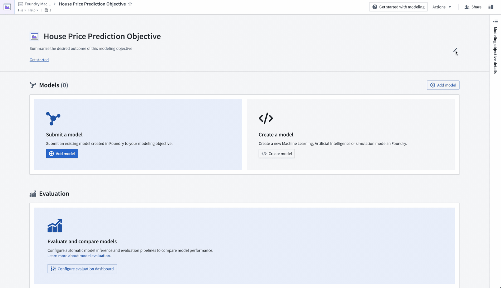

<!-- source: https://palantir.com/docs/foundry/model-integration/tutorial-set-up-project/ · mirrored 2026-08-26 from Palantir Foundry docs -->

# 1. Tutorial - Set up a machine learning project in Foundry

In this step of the tutorial, you will create a machine learning project in Foundry. This step is required and will cover:

1. [Structuring a Foundry project for machine learning](#11-how-to-structure-a-foundry-project-for-machine-learning)
2. [Managing data for machine learning](#12-how-to-manage-data-for-machine-learning)
3. [Managing machine learning models in Foundry](#13-how-to-manage-machine-learning-models)
4. [Managing machine learning projects in Foundry](#14-how-to-manage-machine-learning-projects)

## 1.1 How to structure a Foundry project for machine learning

Foundry projects are folder structures to store related work. We recommend having an individual Foundry project for each machine learning project. This project should have:

* A `data` folder to store datasets used in this project,
* A `models` folder to store models in this project,
* A `code` folder to store model training logic used in this project, and,
* A modeling objective to manage and deploy production models.

If you do not have permissions to create a new project, you can create a new folder in an existing project to act as the root directory of your machine learning project.

**Action:** Create a [new Foundry project](/docs/foundry/compass/create-a-project/) for this tutorial and create the above folders - [see how](/docs/foundry/compass/create-a-project/). If you are unable to create a new Foundry project, create an empty folder in an existing project to mimic the root of a new project instead.

**Action:** In your Foundry project, Select **+New > Modeling Objective**. The modeling objective should be named in relation to the name of the machine learning problem you are attempting to solve. In this case, name the objective "House Price Prediction Objective".



### Completed project structure



## 1.2 How to manage data for machine learning

In this tutorial, we are going to build a machine learning model to estimate the median house price in American census districts.

We will take feature data (historical details about the American census districts) and labels (the median house price in that census district at that time) to uncover the relationship between the features and labels and then save that relationship as a reusable model in Foundry. In the future, when we have up-to-date feature data (details about an American census district) but not the up-to-date labels (the median house price), we can apply the model on the feature data for a census district to find an estimate of the house price in that census district. This type of machine learning project is called supervised machine learning and is the most common type of machine learning project.

In Foundry, a supervised machine learning project should have two datasets:

1. A **labeled dataset** that can be used for model training and testing, and,
2. An **unlabeled dataset** that contains up-to-date features but no labels. We will apply the model on this dataset to generate inferences (predictions of our label).

These datasets often come from [data connections to production sources](/docs/foundry/data-connection/overview/) or your [Ontology](/docs/foundry/ontology/overview/). However, for this tutorial, we will upload CSV files to simulate those production sources.

**Action:** Download the [labeled American Housing data source](/docs/resources/foundry/model-integration/housing_features_and_labels.csv) and upload it in the `data` folder as `housing_features_and_labels`. Download the [unlabeled American Census data source](/docs/resources/foundry/model-integration/housing_inference_data.csv) and upload it to the `data` folder as `housing_inference_data`. You can upload a CSV file into Foundry by dragging it into the folder structure - for this tutorial, upload it as a structured dataset.

### Completed data folder



## 1.3 How to manage machine learning models

Models that are trained in Foundry are linked to the data, code, and development environment that was used to train them. This is useful as to provide a governed record of how all models were produced as well as to record and share the details of historical experimentation.

Machine learning models can be trained in Foundry in the Code Repositories application.

### Code Repositories

The Code Repositories application is a web-based development environment for authoring data pipelines and machine learning logic. For machine learning, Foundry provides a **Model Integration** repository with a **Model Training** language template.

Code Repositories support Git for local code iteration but require committed code for running builds within Foundry. The Code Repositories application is best for authoring production and reproducible data pipelines and machine learning logic.

### Integrate an existing model

If you already have a model trained outside of Foundry that you want to use in Foundry, you can integrate that existing model by:

* [Publishing a model from pre-trained model files](/docs/foundry/integrate-models/model-asset-files/), such as a `.pkl` file trained in a local development environment, in [Code Workspaces](/docs/foundry/code-workspaces/jupyterlab/), or in a legacy system. Refer to the worked [scikit-learn example](/docs/foundry/integrate-models/model-asset-files-iris/) for a step-by-step walkthrough.
* Importing [pre-trained model files from Hugging Face](/docs/foundry/integrate-models/import-huggingface-models/)
* Uploading a [container image as a model](/docs/foundry/integrate-models/container-overview/)
* Creating a model to proxy an [externally hosted model](/docs/foundry/integrate-models/external-model-connection/)

**There are no required actions for this step of the tutorial.**

## 1.4 How to manage machine learning projects

In Foundry, machine learning projects are managed with the Modeling Objectives application. A modeling objective suggests best practices to manage machine learning projects by:

* Orienting the machine learning project around a specific problem
* Creating a standard for systematic model evaluation
* Enabling multiparty review of models before production use
* Maintaining a historic record of all models used in production
* Integrating model development with deployment to either batch pipelines or real-time hosted inference

In this tutorial, the modeling objective is to predict the median house price in a census district.

**Action:** Navigate to the "House Price Prediction Objective" modeling objective created earlier. Add project context in the header portion of the modeling objective to describe the problem for other teams. Select the pen icon on the right of the header to enter edit mode and add a summary and description for your objective. The description field supports Markdown. An example of suggested content is below:

```
#### Goal: Build forecasting model to predict median house prices across America.

#### Data

This dataset was derived from the California responses in the 1990 U.S. census, using one row per census block group. A block group is the smallest geographical unit for which the U.S. Census Bureau publishes sample data (a block group typically has a population of 600 to 3,000 people).

The target variable is the **median_house_value** for California districts.

#### Reference

Pace, R. Kelley, and Ronald Barry, "Sparse Spatial Autoregressions," Statistics and Probability Letters,
Volume 33, Number 3, May 5 1997, p. 291-297.

Data derived from StatLib repository. <http://lib.stat.cmu.edu/datasets/>
```



## Next step

Now that we have structured our machine learning project, we will move onto model training. In this tutorial, your next step is to either [train a model in Model Studio](/docs/foundry/model-integration/tutorial-train-model-studio/), [train a model in a Jupyter® notebook](/docs/foundry/model-integration/tutorial-train-jupyter-notebook/) or [train a model in Code Repositories](/docs/foundry/model-integration/tutorial-train-code-repositories/). Jupyter® notebooks are recommended for fast and iterative model development, while Code Repositories are recommended for production-grade data and model pipelines.
