<!-- source: https://palantir.com/docs/foundry/model-integration/tutorial-train-code-repositories/ · mirrored 2026-08-26 from Palantir Foundry docs -->

# 2c. Tutorial: Train a model in Code Repositories

Before starting this step of the tutorial, you should have completed the [modeling project set up](/docs/foundry/model-integration/tutorial-set-up-project/). In this tutorial, you can choose to either train a model [in a Jupyter® notebook](/docs/foundry/model-integration/tutorial-train-jupyter-notebook/) or in Code Repositories. Jupyter® notebooks are recommended for fast and iterative model development whereas code repositories are recommended for production-grade data and model pipelines.

In this step of the tutorial, we will train a model in [Code Repositories](/docs/foundry/code-repositories/overview/). This step will cover:

1. [Creating a code repository for model training](#2c1-how-to-create-a-code-repository-for-model-training)
2. [Splitting feature data for testing and training](#2c2-how-to-split-feature-data-for-testing-and-training)
3. [Authoring model training logic in Code Repositories](#2c3-how-to-author-model-training-logic-in-code-repositories)
4. [Running batch inference](#2c4-how-to-run-batch-inference)
5. [Viewing a model and submit it to a modeling objective](#2c6-how-to-view-a-model-and-submit-it-to-a-modeling-objective)

## 2c.1 How to create a code repository for model training

The Code Repositories application in Foundry is a web-based development environment for authoring production-grade data and machine learning pipelines. For machine learning, Foundry provides a **Model Integration** repository with a **Model Training** language template.

**Action:** In the `code` folder you created during the previous step of this tutorial, select **+ New > Code repository**. Your code repository should be named in relation to the model that you are training. In this case, name the repository `median_house_price_model_repo`. Select **Model Integration** under **Repository type** and **Model Training** under **Language template**, then select **Initialize repository**.

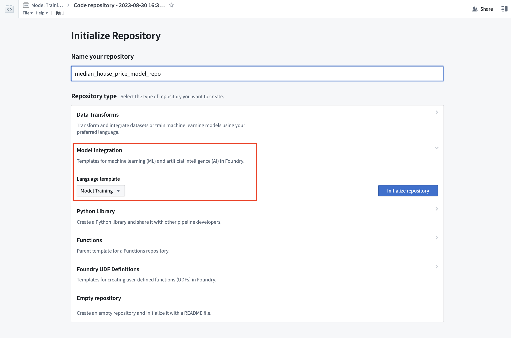

The model training template contains an example structure that we will adapt for this tutorial. You can expand the files on the left side to see an example project.

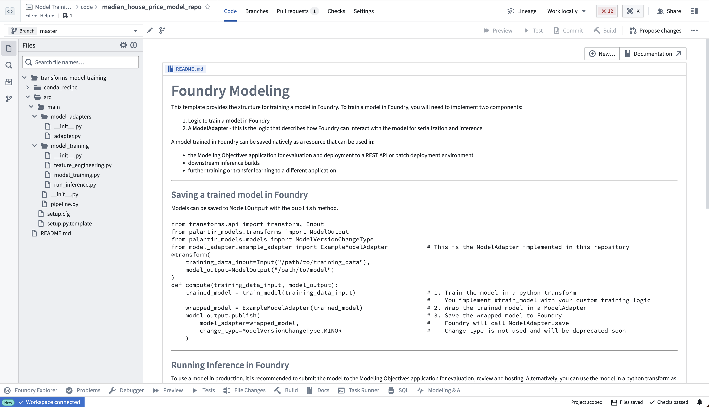

## 2c.2 How to split feature data for testing and training

The first step in a supervised machine learning project is to split our labeled feature data into separate datasets for training and testing. Eventually, we will want to create performance metrics (estimates of how well our model performs on new data) so we can decide whether this model is good enough to use in a production setting and so we can communicate how much to trust the results of this model with other stakeholders. We must use separate data for this validation to help ensure that the performance metrics are representative of what we will see in the real world.

As such, we are going to write a [Python transform](/docs/foundry/transforms-python/overview/) that takes our labeled feature data and splits this into our two training and testing datasets.

```python
from transforms.api import transform, Input, Output


@transform.spark.using(
    features_and_labels_input=Input("<YOUR_PROJECT_PATH>/data/housing_features_and_labels"),
    training_output=Output("<YOUR_PROJECT_PATH>/data/housing_training_data"),
    testing_output=Output("<YOUR_PROJECT_PATH>/data/housing_test_data"),
)
def compute(features_and_labels_input, training_output, testing_output):
    # Converts this TransformInput to a PySpark DataFrame
    features_and_labels = features_and_labels_input.dataframe()

    # Randomly split the PySpark dataframe with 80% training data and 20% testing data
    training_data, testing_data = features_and_labels.randomSplit([0.8, 0.2], seed=0)

    # Write training and testing data back to Foundry
    training_output.write_dataframe(training_data)
    testing_output.write_dataframe(testing_data)
```

If your enrollment uses [classification-based access controls (CBAC)](/docs/foundry/security/classification-based-access-controls/), transforms cannot create their own output resources, and building a transform whose output does not yet exist fails with an error stating that dataset creation is not allowed when classification-based access control is enabled. Because the remaining steps of this tutorial declare outputs that do not exist yet, create each one before you build and set a file classification on it as required for newly created resources: the `housing_training_data`, `housing_test_data`, and `housing_testing_data_inferences` datasets with **+ New > Dataset** in your `data` folder, and the `linear_regression_model` model with **+ New > Model** in your `models` folder. Then point the transforms in the following steps at those existing paths.

**Action:** Open the `feature_engineering.py` file in your repository and copy the above code into the repository. Update the paths to correctly point to the datasets you uploaded in the previous step of this tutorial. Select **Build** at the top left to run the code. You can, optionally, select **Preview** to test this logic on a subset of the data for faster iteration.

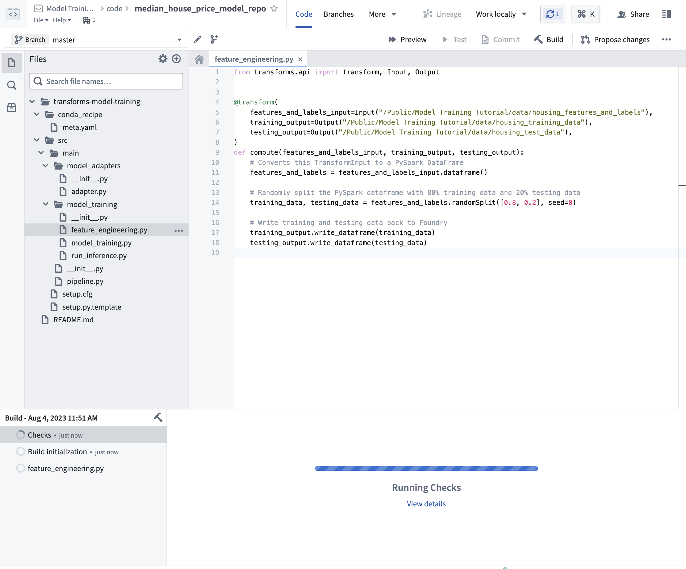

You can continue with `2c.3` while this build executes.

## 2c.3 How to author model training logic in Code Repositories

[Models in Foundry](/docs/foundry/model-integration/models/#architecture) are comprised of two components, model artifacts (the model files produced in a model training job), and a model adapter (a Python class that describes how Foundry should interact with the model artifacts to perform inference).

The model training template consists of two modules, `model_training` for the training job and `model_adapters` for the model adapter.

### Model dependencies

Model training will almost always require adding Python dependencies that contain model training, serialization, inference, or evaluation logic. Foundry supports adding dependency specifications through conda. These dependency specifications are used to create a resolved Python environment for executing model training jobs.

In Foundry, these resolved dependencies are automatically packaged with your models to ensure that your model automatically has all of the logic required to perform inference (generate predictions). In this example, we will use `pandas` and `scikit-learn` to produce our model and `dill` to save our model.

**Action:** On the left side bar, select **Libraries** and add dependencies for `scikit-learn`, `pandas`, and `dill`. Then select **Commit** to create a resolved Python environment.

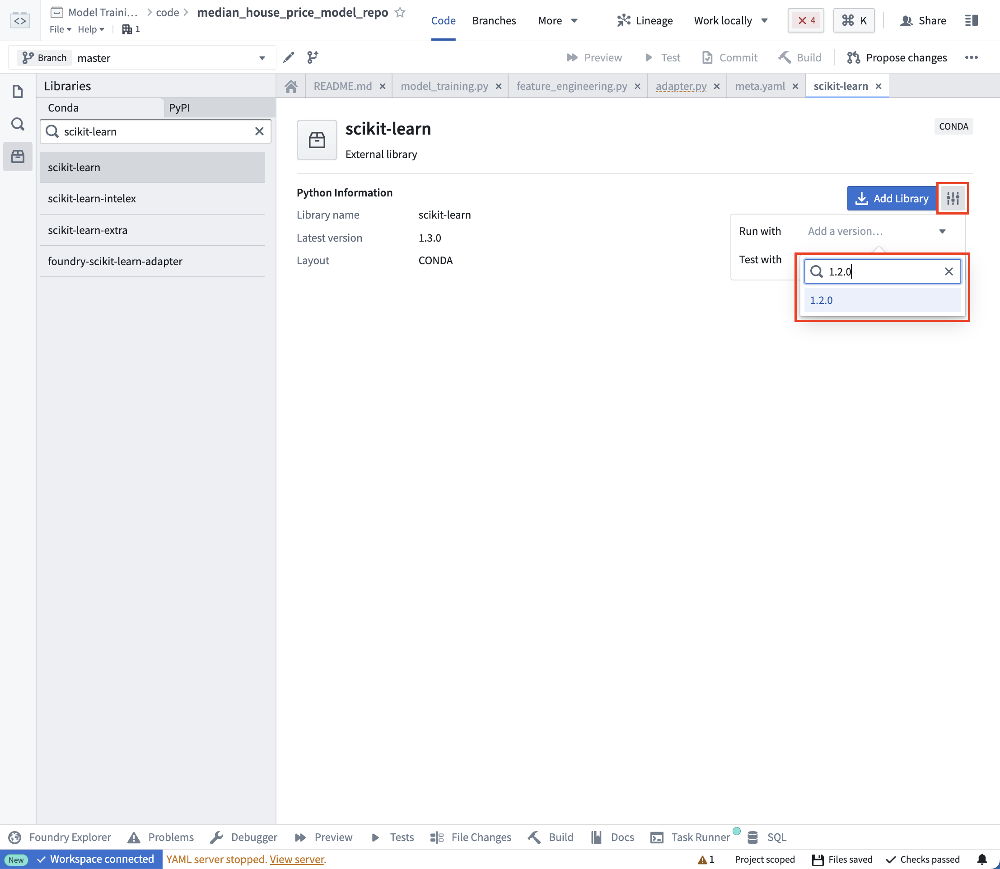

### Model adapter logic

[Model adapters](/docs/foundry/integrate-models/model-adapter-overview/) provide a standard interface for all models in Foundry. The standard interface ensures that all models can be used immediately in production applications as Foundry will handle the infrastructure to load the model, its Python dependencies, expose its API, and interface with your model.

To enable this, you must create an instance of a `ModelAdapter` class to act as this communication layer.

There are 4 functions to implement:

1. **Model save and load:** In order to reuse your model, you need to define how your model should be saved and loaded. Palantir provides many [default methods](/docs/foundry/integrate-models/serialization/#auto-serialization) of serialization (saving), and in more complex cases you can [implement custom serialization](/docs/foundry/integrate-models/model-adapter-reference/#model-save-and-load) logic.
2. **api:** Defines the API of your model and tells Foundry what type of input data your model requires.
3. **predict:** Called by Foundry to provide data to your model. This is where you can pass input data to the model and generate inferences (predictions).

```python
import palantir_models as pm


class SklearnRegressionAdapter(pm.ModelAdapter):

    @pm.auto_serialize
    def __init__(self, model):
        self.model = model

    @classmethod
    def api(cls):
        columns = [
            ('median_income', float),
            ('housing_median_age', float),
            ('total_rooms', float),
        ]
        return {"df_in": pm.Pandas(columns)}, \
               {"df_out": pm.Pandas(columns + [('prediction', float)])}

    def predict(self, df_in):
        df_in['prediction'] = self.model.predict(
            df_in[['median_income', 'housing_median_age', 'total_rooms']]
        )
        return df_in

```

**Action** Open the `model_adapters/adapter.py` file and paste the above logic into the file.

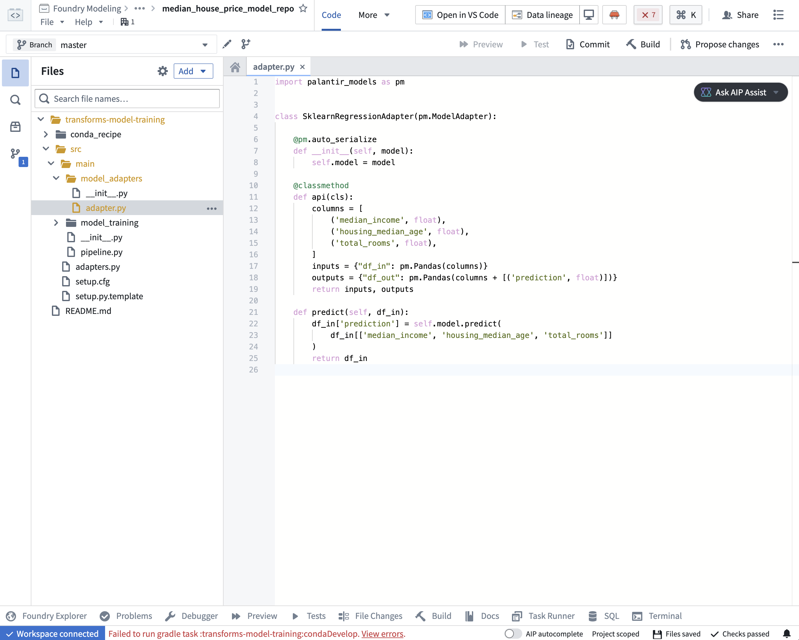

### Model training Logic

Now that our dependencies are set and we have written a model adapter, we can train a model in Foundry.

```python
from transforms.api import transform, Input
from palantir_models.transforms import ModelOutput
from main.model_adapters.adapter import SklearnRegressionAdapter


def train_model(training_df):
    from sklearn.impute import SimpleImputer
    from sklearn.linear_model import LinearRegression
    from sklearn.pipeline import Pipeline
    from sklearn.preprocessing import StandardScaler

    numeric_features = ['median_income', 'housing_median_age', 'total_rooms']
    numeric_transformer = Pipeline(
        steps=[
            ("imputer", SimpleImputer(strategy="median")),
            ("scaler", StandardScaler())
        ]
    )

    model = Pipeline(
        steps=[
            ("preprocessor", numeric_transformer),
            ("classifier", LinearRegression())
        ]
    )
    X_train = training_df[numeric_features]
    y_train = training_df['median_house_value']
    model.fit(X_train, y_train)

    return model

@transform.using(
    training_data_input=Input("<YOUR_PROJECT_PATH>/data/housing_training_data"),
    model_output=ModelOutput("<YOUR_PROJECT_PATH>/models/linear_regression_model"),
)
def compute(training_data_input, model_output):
    training_df = training_data_input.pandas()
    model = train_model(training_df)

    # Wrap the trained model in a ModelAdapter
    foundry_model = SklearnRegressionAdapter(model)

    # Publish and write the trained model to Foundry
    model_output.publish(
        model_adapter=foundry_model
    )
```

**Optional:** When you are iterating on model training and model adapter logic, it can be useful to test your changes on a subset of your training data before running a build. Select **Preview** at the top left to test your code.

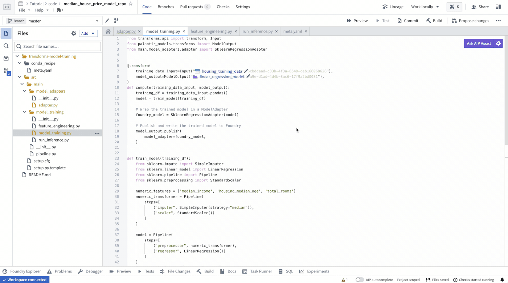

**Action:** Open the `model_training/model_training.py` file in your repository and copy the above code into the repository. Update the paths to correctly point to the training dataset and model folder you created in the [step 1.1](/docs/foundry/model-integration/tutorial-set-up-project/#11-how-to-structure-a-foundry-project-for-machine-learning). Select **Build** at the top left to run the code.

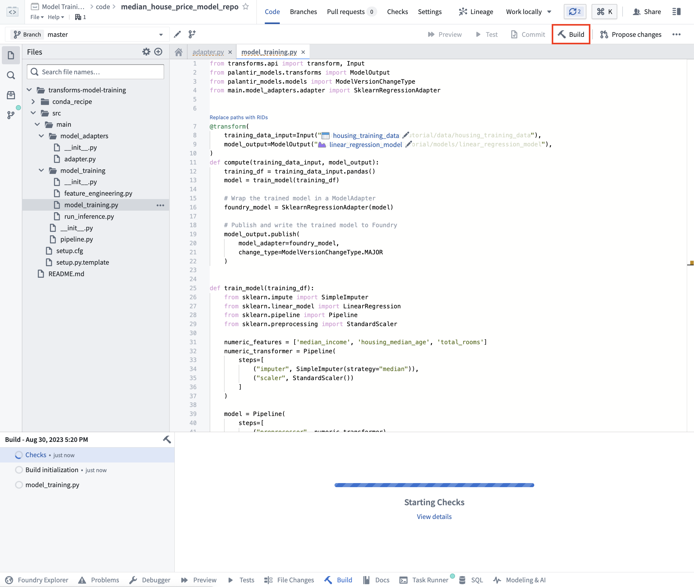

### (Optional) Log metrics and hyperparameters to a model experiment

[Model experiments](/docs/foundry/model-integration/experiments/) is a lightweight framework for logging metrics and hyperparameters produced during a model training run, which can then be published alongside a model and persisted in the model page.

[Learn more about creating and writing to experiments.](/docs/foundry/integrate-models/experiments-overview/)

## 2c.4 How to run batch inference

### In Code Repositories

Once your model training logic has finished running, you can generate predictions (also known as inferences) directly in your code repository.

```python
from transforms.api import transform, Input, Output, LightweightInput, LightweightOutput
from palantir_models.transforms import ModelInput
from palantir_models import ModelAdapter

@transform.using(
    testing_data_input=Input("<YOUR_PROJECT_PATH>/data/housing_test_data"),
    model_input=ModelInput("<YOUR_PROJECT_PATH>/models/linear_regression_model"),
    predictions_output=Output("<YOUR_PROJECT_PATH>/data/housing_testing_data_inferences")
)
def compute(
        testing_data_input: LightweightInput,
        model_input: ModelAdapter,
        predictions_output: LightweightOutput
    ):
    inference_outputs = model_input.transform(testing_data_input)
    predictions_output.write_pandas(inference_outputs.df_out)
```

:::callout{theme="neutral"}
To run a model within a transform repository in which the model was not defined, set `use_sidecar = True` in `ModelInput`. This will automatically import the model adapter and its dependencies, while running them in a separate environment to prevent dependency conflicts. Review [the `ModelInput` class reference](/docs/foundry/integrate-models/transform-model-input/) for more details.

If `use_sidecar` is not set to `True`, the model adapter and its dependencies must be imported into or defined within the current code repository.
:::

**Action:** Open the `model_training/run_inference.py` file in your repository and copy the above code into the repository. Update the paths to correctly point to the model asset and test dataset you created earlier. Select **Build** at the top left to run the code.

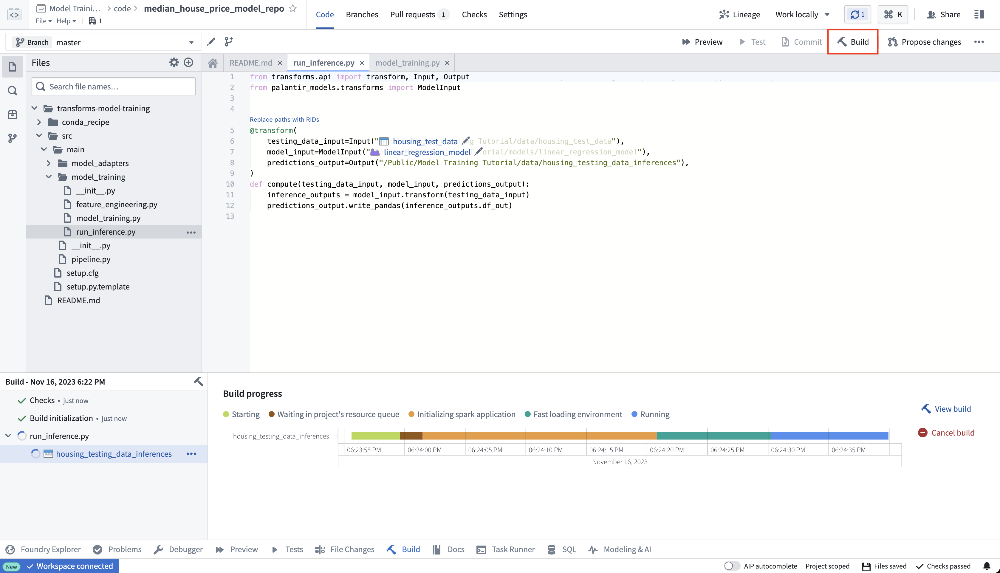

Once your build is complete, you can review the generated predictions in the build output panel.

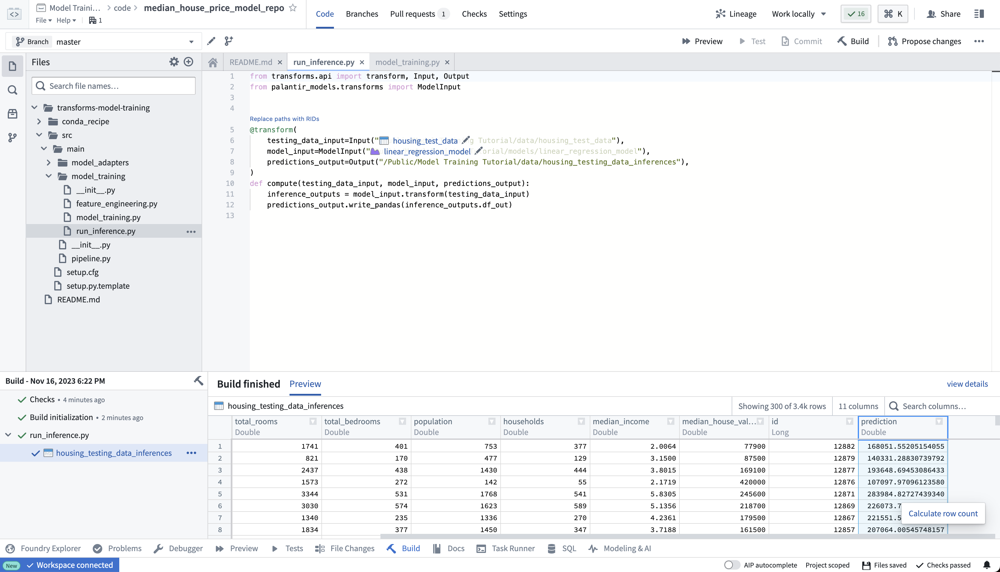

### In Pipeline Builder

Learn how to [use the model in Pipeline Builder](/docs/foundry/pipeline-builder/transforms-trained-model/).

## 2c.5 Optional: Configure live inference

Optionally, this model can be consumed as a REST API via a direct deployment. [Learn how to configure a direct deployment](/docs/foundry/manage-models/create-a-model-deployment/).

## 2c.6 How to view a model and submit it to a modeling objective

After your model is built you can open the model either by selecting `linear_regression_model` in the `model_training/model_training.py` file or by navigating to the model in the folder structure we created earlier.

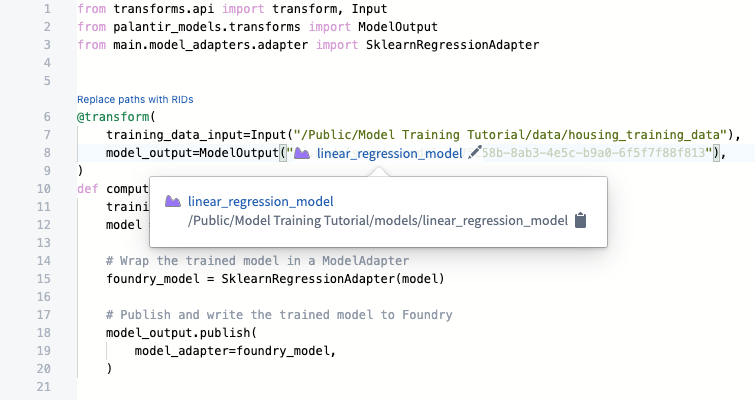

The model view has the source of where the model was trained, the training datasets used to produce this model, the model API, and the model adapter this model was published as. Importantly, you can publish many different versions to the same model; these model versions are available in the dropdown menu on the left sidebar.

As the model version is connected to the specific model adapter used during training, you need to republish and build your model training process to apply any changes to the model adapter logic.

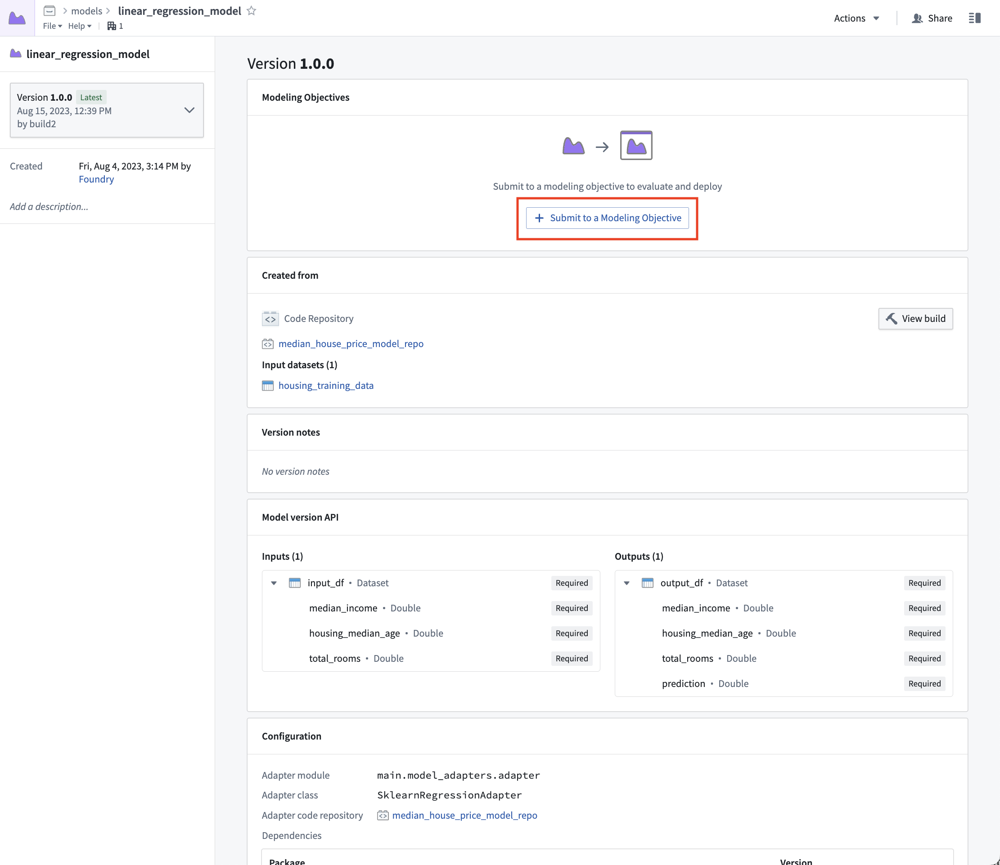

Now that we have a model, we can submit that model to our modeling objective for management, evaluation, and release to operational applications.

**Action:** Select **linear\_regression\_model** in the code to navigate to the model asset you have created, select **Submit to a Modeling Objective** and submit that model to the modeling objective you created in [step 1 of this tutorial](/docs/foundry/model-integration/tutorial-set-up-project/#11-how-to-structure-a-foundry-project-for-machine-learning). You will be asked to provide a submission name and submission owner. This is metadata that is used to track the model uniquely inside the modeling objective. Name the model `linear_regression_model` and mark yourself as the submission owner.

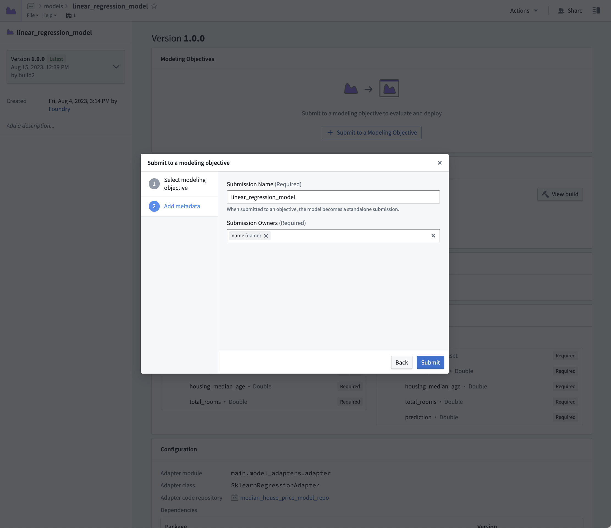

## Next step

Now that you have trained a model in Foundry, you can move onto model management, testing, and model evaluation. Here are some examples of additional steps you can take in Modeling Objectives:

* [Automatic model evaluation](/docs/foundry/evaluate-models/model-evaluation-automatic/)
* [Configuring checks for model submissions](/docs/foundry/manage-models/set-up-checks/)
* [Live](/docs/foundry/manage-models/set-up-live/) and [batch inference](/docs/foundry/manage-models/set-up-batch/) can also be configured from the modeling objective.
* [No-code batch inference in Pipeline Builder](/docs/foundry/pipeline-builder/transforms-trained-model/)

Optionally, you can also [train a model in a Jupyter® notebook with the Code Workspaces application](/docs/foundry/model-integration/tutorial-train-jupyter-notebook/) for fast and iterative model development.
