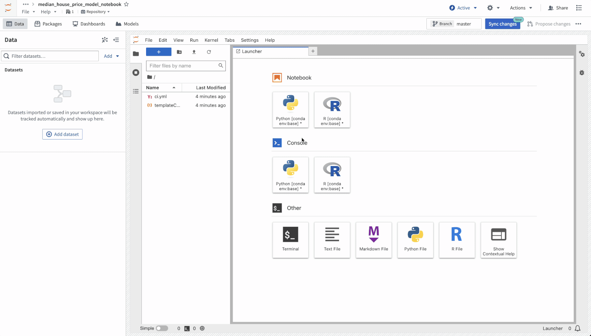
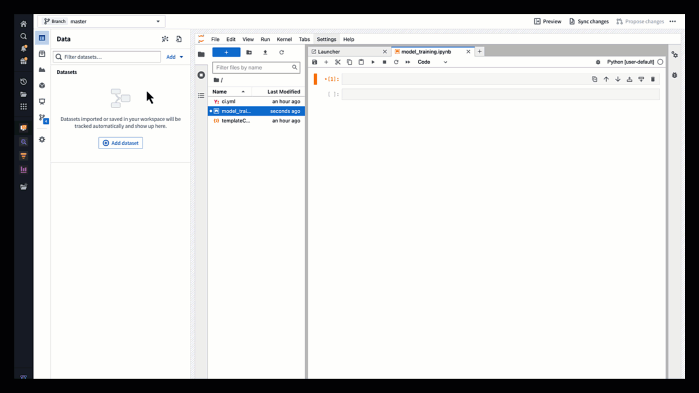
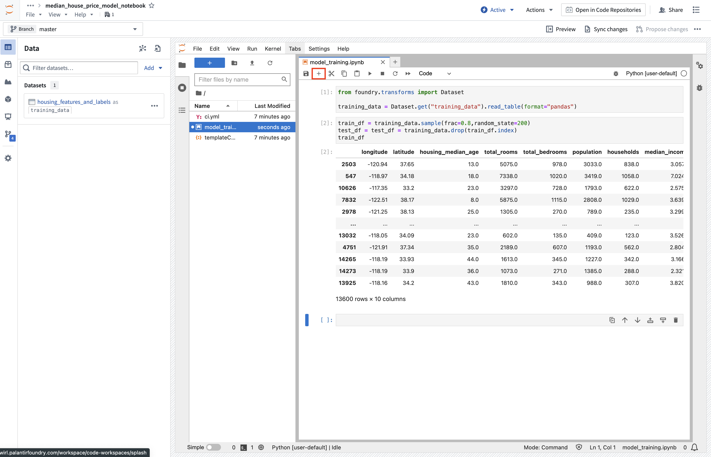
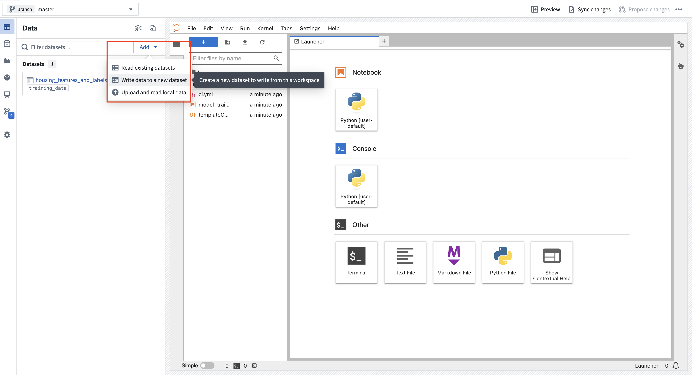
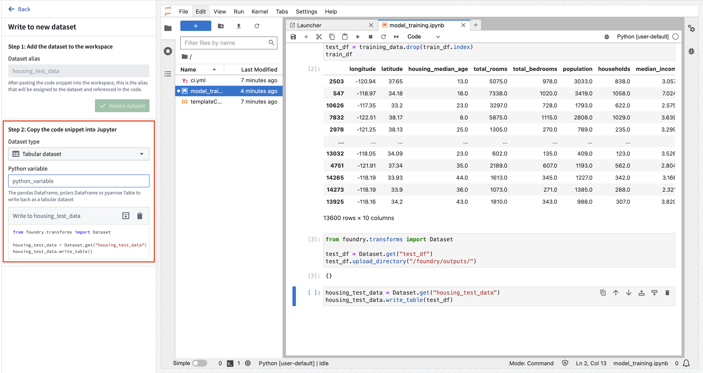
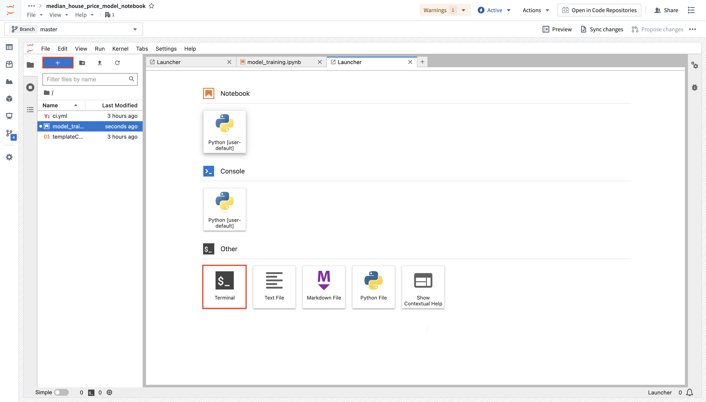
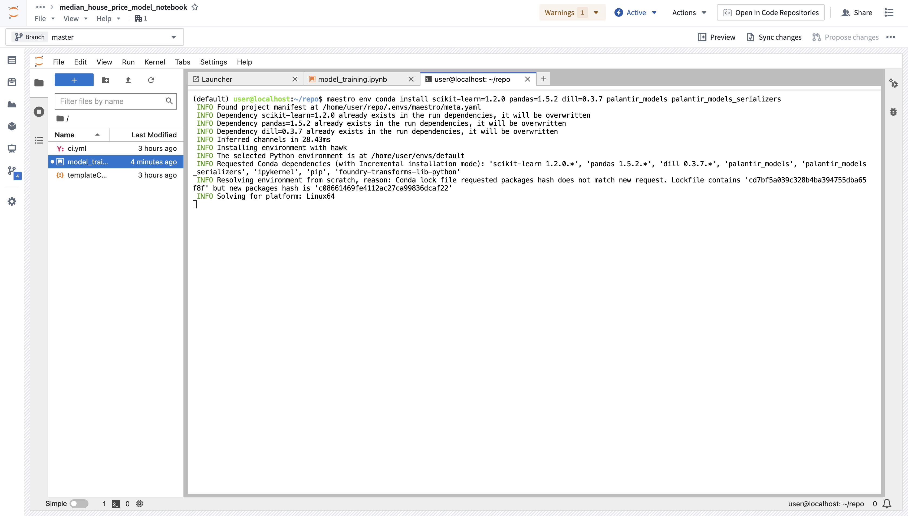
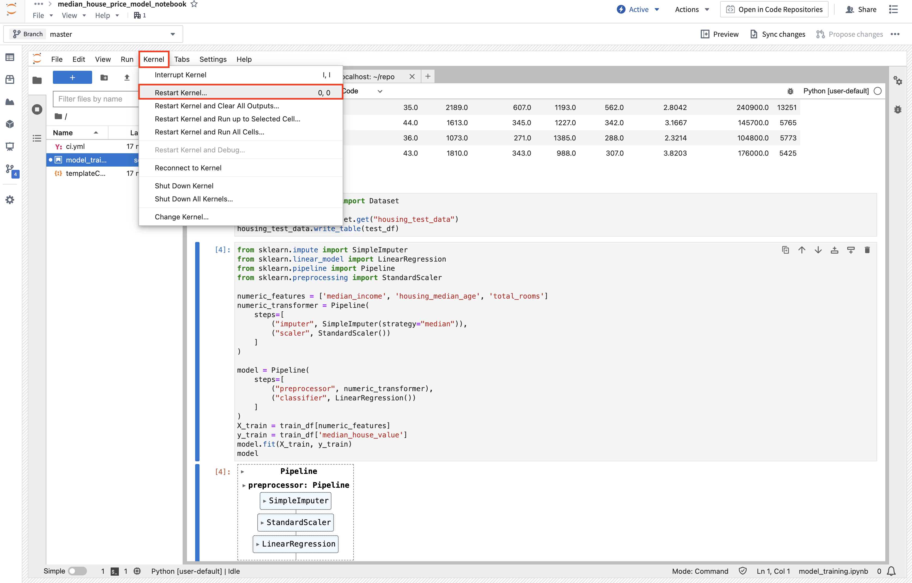
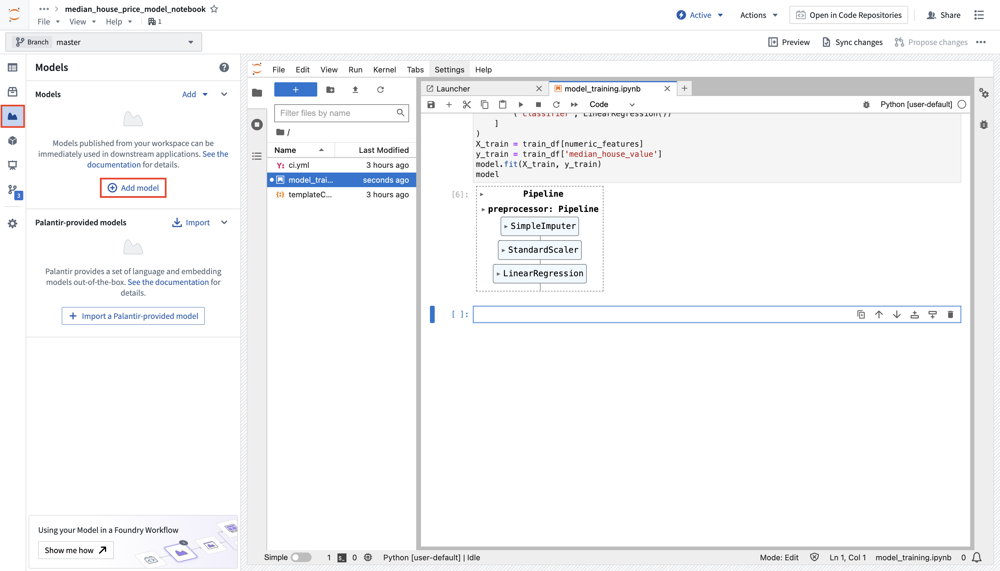
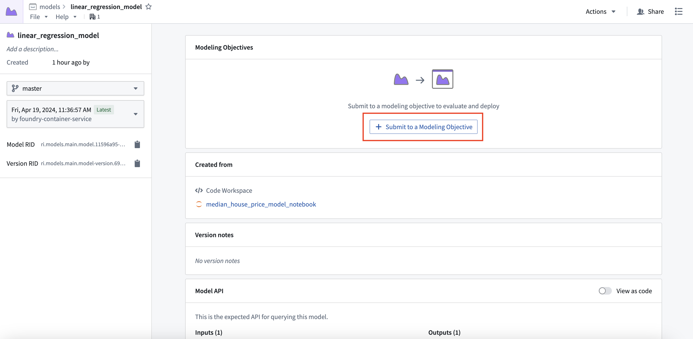

<!-- source: https://palantir.com/docs/foundry/model-integration/tutorial-train-jupyter-notebook/ · mirrored 2026-08-26 from Palantir Foundry docs -->

# 2b. Tutorial: Train a model in a Jupyter® notebook

Before starting this step of the tutorial, you should have completed the [modeling project set up](/docs/foundry/model-integration/tutorial-set-up-project/). In this tutorial, you can choose to either train a model in a Jupyter® notebook or in [Code Repositories](/docs/foundry/model-integration/tutorial-train-code-repositories/). Jupyter® notebooks are recommended for fast and iterative model development whereas code repositories are recommended for production-grade data and model pipelines.

In this step of the tutorial, we will train a model in a Jupyter® notebook with [Code Workspaces](/docs/foundry/code-workspaces/overview/). This step will cover:

1. [Creating a Jupyter® Code Workspace for model training](#2b1-how-to-create-a-notebook-for-model-training)
2. [Splitting feature data for testing and training](#2b2-how-to-split-feature-data-for-testing-and-training)
3. [Training a model in Code Workspaces](#2b3-how-to-train-a-model-in-code-workspaces)
4. [Publishing a model from Code Workspaces](#2b4-how-to-publish-a-model-from-code-workspaces)
5. [Viewing a model and submit it to a modeling objective](#2b6-how-to-view-a-model-and-submit-it-to-a-modeling-objective)

## 2b.1 How to create a notebook for model training

The Code Workspaces application in Foundry is a web-based development environment that provides third-party IDEs for data analysis and model development. You can directly publish models from Jupyter® notebooks within Foundry that can be used in downstream applications.

Code Workspaces provide an interactive development environment by securing continually available compute resources while you are using the workspace. Code Workspaces enable you to configure your Python environment, transform data, plot charts, and train models without waiting for compute resources or packaging a Python environment.

**Action:** In the `code` folder you created during the previous step of this tutorial, select **+ New > Jupyter Code Workspace**. Your code workspace should be named in relation to the model that you are training. In this case, name the repository `median_house_price_model_notebook`. Select **Continue** to use default compute resources and repository configuration, then, use **Create** to create and launch the workspace.


Once the workspace is created, we need to create a notebook and install some dependencies to train the model. In the Jupyterlab® launcher screen, select a notebook kernel to use.

**Action:** Select **Python \[user-default]** to create a new notebook and then rename the file to `model_training.ipynb`.



## 2b.2 How to split feature data for testing and training

The first step in a supervised machine learning project is to split our labeled feature data into separate datasets for training and testing. Eventually, we will want to create performance metrics (estimates of how well our model performs on new data) so we can decide whether this model is good enough to use in a production setting and so we can communicate how much to trust the results of this model with other stakeholders. We must use separate data for this validation to help ensure that the performance metrics are representative of what we will see in the real world.

### Import a dataset into a Code Workspace

First, make your dataset available for use in your Jupyter® notebook in Code Workspaces. Code Workspaces allow you to create an "alias" for your input data which helps make your code more readable. In this case, you will use the alias `training_data`.

**Action:** Open the **Data** tab, then select **Add dataset > Read existing datasets**. Add the `housing_features_and_labels` dataset that we created earlier and provide it the alias `training_data`. Copy the provided import logic into a cell in your Jupyter® notebook. You can press **Shift + Enter** to run the code cell.

```python
from foundry.transforms import Dataset

training_data = Dataset.get("training_data").read_table(format="pandas")
```



### Split data into testing and training

Now that the dataset is imported, split the data into a testing and training dataframe.

**Action:** Create a new notebook cell by using the **+** option at the top of the notebook, then copy in the snippet below and run the cell.

```python
train_df = training_data.sample(frac=0.8,random_state=200)
test_df = training_data.drop(train_df.index)
train_df
```



### Save test dataset to Foundry

Next, we can save our testing and training splits back to Foundry. This enables us to have a record of the datasets we used for training and testing for future reference.

**Action:** Select **Add > Write data to a new dataset** to create a new dataset output. You can name the output `housing_test_data` and save the output in the `data` folder from earlier. Select **Add Dataset** and **Tabular dataset** for the dataset type and `test_df` for the Python variable. You can then copy the code to a new cell and execute it to save the dataset back to Foundry.

```python
from foundry.transforms import Dataset

housing_test_data = Dataset.get("housing_test_data")
housing_test_data.write_table(test_df)
```




## 2b.3 How to train a model in Code Workspaces

[Models in Foundry](/docs/foundry/model-integration/models/#architecture) are comprised of two components:

* Model artifacts: Model files produced in a model training job.
* Model adapter: A Python class that describes how Foundry should interact with the model artifacts to perform inference.

### Model dependencies

Model training will almost always require adding Python dependencies that contain model training, serialization, inference, or evaluation logic. Foundry supports adding dependency specifications through conda and PyPI (pip). These dependency specifications create a Python environment that can be used to train a model.

In Foundry, these resolved dependencies and all Python `.py` files in your Jupyter® notebook are automatically packaged with your models to ensure that your model automatically has all of the logic required to perform inference (generate predictions) in production. Environments in Jupyter® Code Workspaces are [managed](/docs/foundry/code-workspaces/jupyterlab/#managed-condapypi-environments-in-jupyter-notebooks) through maestro commands.  In this example, we will use `pandas` and `scikit-learn` to produce our model and `dill` to save our model, along with `palantir_models`, the Palantir-provided library required to define a model adapter and publish a model to Foundry.

**Action:** Open Launcher by selecting the blue **+** button, then start a terminal. Add these dependencies by running the command below. You can also use the **Packages** tab in the sidebar to install the backing repositories of the package you wish to install, which will open a terminal and run the maestro command for you.

```
maestro env conda install scikit-learn pandas dill "palantir_models>=0.1795.0"
```





### Model training

**Action:** Copy the code below into a new cell and execute it to train a new model in memory in your Jupyter® notebook. If you run into a `ModuleNotFoundError` or `ImportError`, restart the kernel (**Kernel > Restart Kernel...**) to make sure the environment has picked up the requested dependency changes.

```python
from sklearn.impute import SimpleImputer
from sklearn.linear_model import LinearRegression
from sklearn.pipeline import Pipeline
from sklearn.preprocessing import StandardScaler

numeric_features = ['median_income', 'housing_median_age', 'total_rooms']
numeric_transformer = Pipeline(
    steps=[
        ("imputer", SimpleImputer(strategy="median")),
        ("scaler", StandardScaler())
    ]
)

model = Pipeline(
    steps=[
        ("preprocessor", numeric_transformer),
        ("classifier", LinearRegression())
    ]
)
X_train = train_df[numeric_features]
y_train = train_df['median_house_value']
model.fit(X_train, y_train)
model
```



### (Optional) Log metrics and hyperparameters to a model experiment

[Model experiments](/docs/foundry/model-integration/experiments/) is a lightweight framework for logging metrics and hyperparameters produced during a model training run, which can then be published alongside a model and persisted in the model page.

[Learn more about creating and writing to experiments.](/docs/foundry/integrate-models/experiments-overview/)

## 2b.4 How to publish a model from Code Workspaces

Now that we have created a model, we can publish it to Foundry to integrate it with our production apps. To publish a model, we need to create the model resource in Foundry to which we will save the model, then wrap the model in a model adapter so Foundry knows how to interact with your model.

**Action:** In the **Models** tab, select **Add model** > **Create new model** and name it `linear_regression_model`. You can save the model to the `models` folder created earlier and then select **Create** to create the resource.



Now that you have created a model resource, Foundry automatically creates a skeleton Python file for you to implement a model adapter in. [Model adapters](/docs/foundry/integrate-models/model-adapter-overview/) provide a standard interface for all models in Foundry. The standard interface ensures that all models can be used immediately in production applications as Foundry will handle the infrastructure to load the model, its Python dependencies, expose its API, and interface with your model.

Model adapters in Code Workspaces must be defined in a Python (`.py`) file separate from the notebook and imported into the notebook. Foundry generates this file for you, and its name and class name are derived from the model alias you chose. For a model named `linear_regression_model`, Foundry generates the file `linear_regression_model_adapter.py` containing a class named `LinearRegressionModelAdapter`. If you named your model differently, substitute your own name throughout the snippets below.

:::callout{theme="warning"}
Implement your adapter inside the file Foundry generated, rather than creating an additional adapter file. The **Publish model version** snippet imports the adapter using the generated file and class name, so an additional file with a different name is not used. As a result, the generated skeleton continues to raise `NotImplementedError: Model adapter api not defined`.
:::

To create a model adapter, you will need to implement four functions:

1. **Model save and load:** To reuse your model, you must define how your model should be saved and loaded. Palantir provides many [default methods](/docs/foundry/integrate-models/serialization/#auto-serialization) of serialization (saving), and in more complex cases, you can [implement custom serialization](/docs/foundry/integrate-models/model-adapter-reference/#model-save-and-load) logic.
2. **`api`:** Defines the API of your model and tells Foundry what type of input data your model requires.
3. **`predict`:** Called by Foundry to provide data to your model. This is where you can pass input data to the model and generate inferences (predictions).

```python
import palantir_models as pm
from palantir_models.serializers import DillSerializer


class LinearRegressionModelAdapter(pm.ModelAdapter):

    @pm.auto_serialize(
        model=DillSerializer()
    )
    def __init__(self, model):
        self.model = model

    @classmethod
    def api(cls):
        columns = [
            ('median_income', float),
            ('housing_median_age', float),
            ('total_rooms', float),
        ]
        return {"df_in": pm.Pandas(columns)}, \
               {"df_out": pm.Pandas(columns + [('prediction', float)])}

    def predict(self, df_in):
        df_in['prediction'] = self.model.predict(
            df_in[['median_income', 'housing_median_age', 'total_rooms']]
        )
        return df_in
```

**Action:** Open the generated `linear_regression_model_adapter.py` file and replace its contents with the code above. The generated file contains `api` and `predict` methods that raise `NotImplementedError` until you implement them. If you renamed the model, keep your file name, class name, and the import in the publish snippet consistent with each other. Select the **Publish model version** snippet from the model sidebar on the left, then expand the **Publish to Foundry** section and copy the corresponding code snippet into your main notebook. Make sure to adjust the code snippet to your new `model` variable in Python. You may want to test your model adapter before actually calling the `.publish` function, which you can do by running `.transform` from the adapter model instance:

Create adapted model instance and test it:

```python
# Load the autoreload extension and automatically reload all modules
%load_ext autoreload
%autoreload 2
from palantir_models.code_workspaces import ModelOutput
from linear_regression_model_adapter import LinearRegressionModelAdapter # Update if class or file name changes

# Wrap the trained model in a model adapter for Foundry
linear_regression_model_adapter = LinearRegressionModelAdapter(model)
linear_regression_model_adapter.transform(test_df).df_out
```

Publish the model to Foundry:

```python
# Get a writable reference to your model resource.
model_output = ModelOutput("linear_regression_model")
model_output.publish(linear_regression_model_adapter) # Publishes the model to Foundry
```


## 2b.5 Optional: Configure inference or retraining jobs

You can create an inference and/or retraining job and configure it to run on a schedule directly from your Jupyter® notebook. This will execute your `.ipynb` file as a transform leveraging the Palantir build infrastructure, which will keep track of data lineage and permissions. This feature also enables you to set up long-running training jobs in parallel while continuing to iterate on your Jupyter® notebook. Learn how to [create transforms with model outputs directly from your notebook](/docs/foundry/code-workspaces/training-models/#transforms), how to [consume a model from a Code Repository](/docs/foundry/model-integration/tutorial-train-code-repositories/#2c4-how-to-run-batch-inference), and how to [use the model in Pipeline Builder](/docs/foundry/pipeline-builder/transforms-trained-model/).

This model can also be consumed as a REST API via a direct deployment. [Learn how to configure a direct deployment](/docs/foundry/manage-models/create-a-model-deployment/).

## 2b.6 How to view a model and submit it to a modeling objective

Now that you have a model, you can submit that model to a modeling objective to manage the entire model lifecycle for a problem. With modeling objectives, you can configure checks to validate new releases and perform continuous evaluation.

**Action:** Select **View model version** in the preview window to navigate to the model asset you have created, then select **Submit to a Modeling Objective** and submit that model to the modeling objective you created in [step 1 of this tutorial](/docs/foundry/model-integration/tutorial-set-up-project/#11-how-to-structure-a-foundry-project-for-machine-learning). You will be asked to provide a submission name and submission owner. This is metadata that is used to track the model uniquely inside the modeling objective. Name the model `linear_regression_model` and mark yourself as the submission owner.



## Troubleshooting

This section covers issues commonly encountered when publishing a model from a Jupyter® notebook.

### NotImplementedError: Model adapter `api` not defined

You will see an error similar to the following when you run the publish or transform snippet:

`NotImplementedError: Model adapter api not defined. Edit linear_regression_model_adapter.py to define api.`

**Solution:** Open the adapter file named in the error message and implement the `api` and `predict` methods, then re-run the cell. This is the skeleton file Foundry generated when you created the model; it raises this error until you implement it.

**Details:** When you create a model with **Add model > Create new model**, Foundry generates a skeleton adapter file whose `api` and `predict` methods raise `NotImplementedError`. The file and class are named after your model alias. For example, an alias of `linear_regression_model` generates `linear_regression_model_adapter.py` with a class named `LinearRegressionModelAdapter`. Two common causes of this error are:

* You implemented the adapter in a different file than the one Foundry generated. Move your implementation into the generated file, or update the import in the **Publish model version** snippet to point to your file and class. The file name, the class name, and the import statement must all match.
* The kernel is still running the old version of the file. Confirm that the `autoreload` lines `%load_ext autoreload` and `%autoreload 2` are present and have been run, or restart the kernel with **Kernel > Restart Kernel...** and re-run the import cell.

### NotImplementedError: Model adapter predict method not defined

**Solution:** The generated file also contains a skeleton `predict` method that raises `NotImplementedError`. Implement `predict` so that its input signature matches the inputs defined in `api` and its return value matches the declared output.

### ModuleNotFoundError or ImportError when importing the adapter

**Solution:** Confirm that the file name in your `from ... import ...` statement matches the adapter file exactly, and that the file is saved in the same directory as your notebook. If you recently installed dependencies, restart the kernel with **Kernel > Restart Kernel...** so the environment picks up the changes.

## Next steps

Now that you have trained a model in Foundry, you can move onto model management, testing, and model evaluation. Here are some examples of additional steps you can take in Modeling Objectives:

* [Automatic model evaluation](/docs/foundry/evaluate-models/model-evaluation-automatic/)
* [Configuring checks for model submissions](/docs/foundry/manage-models/set-up-checks/)
* [Live](/docs/foundry/manage-models/set-up-live/) and [batch inference](/docs/foundry/manage-models/set-up-batch/) can also be configured from the modeling objective
* [No-code batch inference in Pipeline Builder](/docs/foundry/pipeline-builder/transforms-trained-model/)

Optionally, you can also [train a model in the Code Repositories application](/docs/foundry/model-integration/tutorial-train-code-repositories/), designed for creating production-grade model training pipelines.

***

*Jupyter®, JupyterLab®, and the Jupyter® logos are trademarks or registered trademarks of NumFOCUS.*

All third-party trademarks (including logos and icons) referenced remain the property of their respective owners. No affiliation or endorsement is implied.
