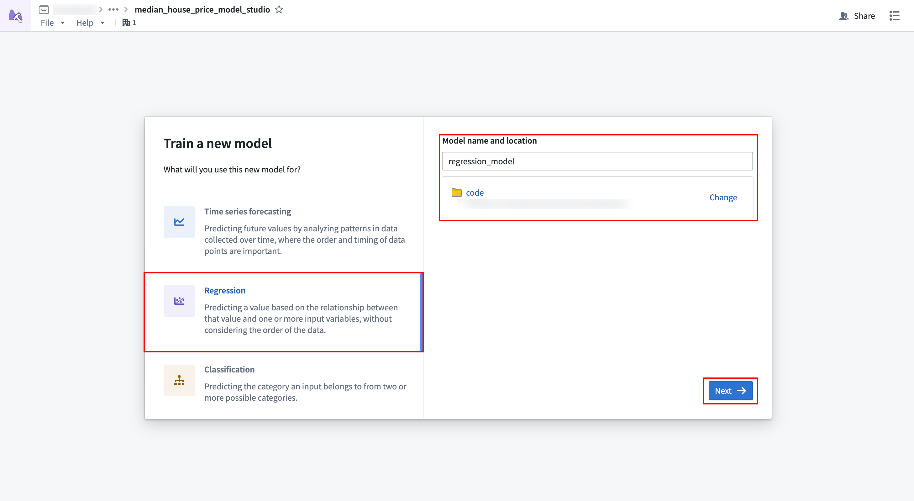
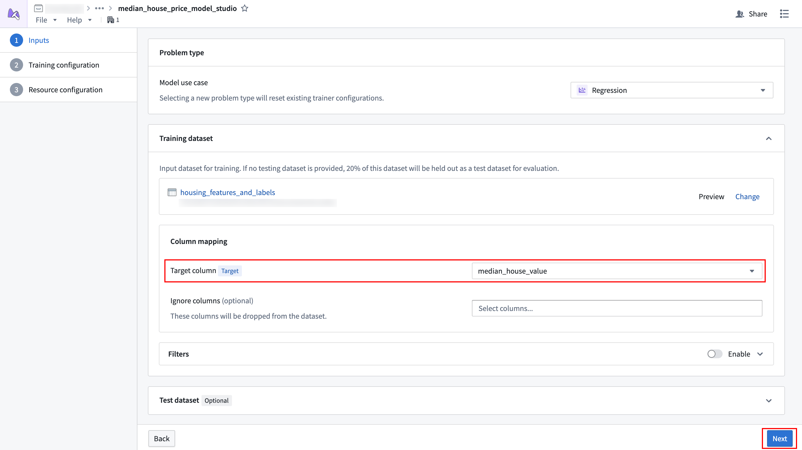
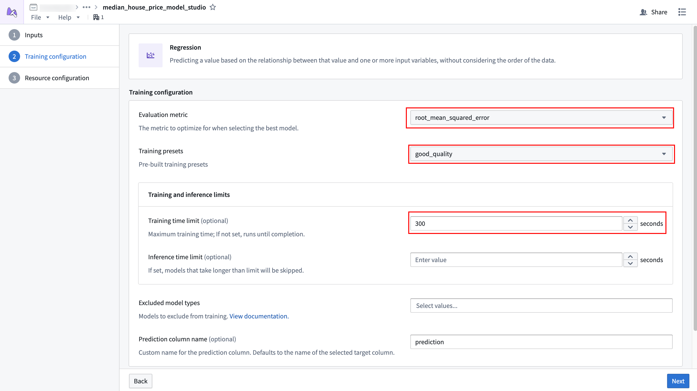
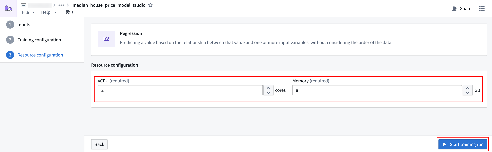
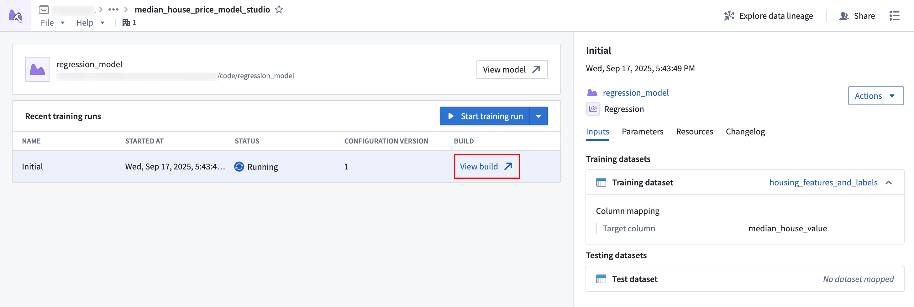
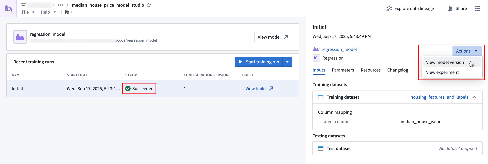

<!-- source: https://palantir.com/docs/foundry/model-integration/tutorial-train-model-studio/ · mirrored 2026-08-26 from Palantir Foundry docs -->

# 2a. Tutorial: Train a model in Model Studio

Before starting this part of the tutorial, you should have completed the [modeling project set up](/docs/foundry/model-integration/tutorial-set-up-project/).

In this part of the tutorial, we will train a model using [Model Studio](/docs/foundry/model-studio/overview/). We will cover the following steps:

1. [Create a model studio](#2a1-create-a-model-studio)
2. [Configure a model studio training job](#2a2-configure-a-model-studio-training-job)
3. [Monitor a training job](#2a3-monitor-a-training-job)
4. [View the model and submit it to a modeling objective](#2a4-view-the-model-and-submit-it-to-a-modeling-objective)

## 2a.1 Create a model studio

Navigate to the Model Studio application in Foundry. Model Studio is a no-code model development tool.

**Action:** In the `code` folder you created during the previous step of this tutorial, select **+ New > Model studio**. Your model studio should be named in relation to the model that you are training. In this case, name the studio `median_house_price_model_studio`. Select **Save** to create and open the studio.

## 2a.2 Configure a Model Studio training job

Once the model studio is created, you will be presented with options for the type of trainer you would like to use. In this tutorial we will predict the median house price, which is a regression problem.

**Action:** Select the [regression](/docs/foundry/model-studio/trainers-regression/) trainer. We need to provide a name and location for storing the output model from the studio, so name the model `regression_model` and set the output location to the `models` folder that was created earlier. Once all the options are set, select **Next** to continue.

### Dataset mapping

Model Studio requires users to map datasets to inputs that are predefined by the trainer. Since we only have a single training dataset, we will map that to the **Training dataset** input. Model Studio will automatically do a train-test split, splitting off 20% of the data for validation and testing.

**Action:** In the **Training dataset** card, select **Choose dataset** and select the `housing_features_and_labels` dataset in the dialog.

**Optional:** Once the dataset is selected, you can use the **Preview** button to open a preview panel at the bottom of the page to preview your dataset, or expand the **Filters** area to define filters to apply to the dataset.

Once the dataset is selected, we need to tell the trainer what certain columns mean. In this case, we want to tell the trainer that the `median_house_value` column is the target column.

**Action:** In the dropdown to the right of **Target column**, select the `median_house_value` column.

Once the dataset is properly configured, select **Next** to continue.

### Parameter configuration

Model Studio trainers offer a set of configuration parameters that users can optionally change to improve model performance. [Learn more about the regression trainer's parameters](/docs/foundry/model-studio/trainers-regression/#parameters).

**Action:** For this tutorial, we are finding the balance between speed and predictive accuracy. To do so, we will set the following parameters:

* **Evaluation metric:** Set this to `root_mean_squared_error`.
* **Training preset:** Set this to `good_quality`, which will provide advanced ensembling techniques while keeping training speed fast.
* **Training and inference limits > Training time limit:** Set this to 300 seconds.
* **Prediction column name:** Set this to `prediction`.

Leave all other parameters at their default values.

Once the parameters are properly configured, select **Next** to continue.

### Resource configuration

To provide the model studio with adequate resources, we need to increase its resources from the default values.

**Action:** Set the **vCPU** value to `2` and the **Memory** value to `8` to provide 2 vCPUs and 8GB of memory to the job.

Once resources are properly configured, select **Start training run**, which will open a dialog asking you to enter a configuration name and changelog. For the name, enter `Initial` and leave the changelog blank. Then, select **Start training run** to launch the build.

## 2a.3 Monitor a training job

After launching the job, you will be redirected to the [Model Studio home page](/docs/foundry/model-studio/navigation/#home-page). There will be one run in the list of **Recent training runs**.

**Action:** Select **View build** to navigate to the running job and monitor progress.

## 2a.4 View the model and submit it to a modeling objective

When the job is completed, there will be a green checkmark under the run's **Status** column. From here, you can view the produced model.

**Action:** Select the first row of the **Recent training runs** table, then select **Actions > View model version** in the sidebar to view the produced model. Once you are viewing the model, select **Submit to a Modeling Objective** to submit that model to the modeling objective you created in [step one of this tutorial](/docs/foundry/model-integration/tutorial-set-up-project/#11-how-to-structure-a-foundry-project-for-machine-learning). You will be asked to provide a submission name and submission owner. This metadata is used to track the model uniquely inside the modeling objective. Name the model `regression_model` and mark yourself as the submission owner.

## Next steps

Now that you have trained a model in Foundry, you can move onto model management, testing, and model evaluation. Here are some examples of additional steps you can take in Modeling Objectives:

* [Automatic model evaluation](/docs/foundry/evaluate-models/model-evaluation-automatic/)
* [Configure checks for model submissions](/docs/foundry/manage-models/set-up-checks/)
* [Live](/docs/foundry/manage-models/set-up-live/) and [batch inference](/docs/foundry/manage-models/set-up-batch/) configuration from a modeling objective
* [No-code batch inference in Pipeline Builder](/docs/foundry/pipeline-builder/transforms-trained-model/)
* [Deploy models with DevOps and Marketplace](/docs/foundry/model-integration/marketplace-models/)

[Learn more about Model Studio](/docs/foundry/model-studio/overview/).
