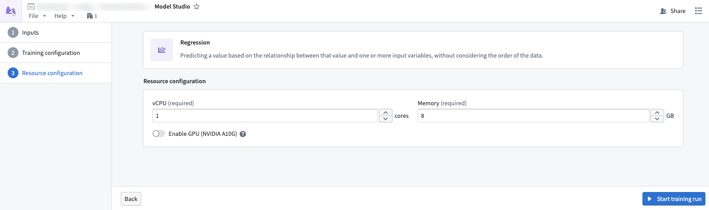

<!-- source: https://palantir.com/docs/foundry/model-studio/configuration-compute-resources/ · mirrored 2026-08-26 from Palantir Foundry docs -->

# Compute resources

Model Studio allows you to configure compute resources for your training jobs to optimize performance and costs. You can specify vCPU and memory allocation to match your training requirements.

By default, the maximum allowed values are 8 cores and 64 GBs of memory. To increase these limits, contact Palantir Support.

Compute usage is measured from these values and reported as Foundry compute-seconds. Review our [usage types documentation](/docs/foundry/resource-management/usage-types/) for more information.

## Performance considerations

### vCPUs

Model Studio trainers can scale in performance as more vCPUs are applied. Increasing vCPU allocation is particularly beneficial for Model Studio, as trainers can take advantage of more vCPU cores and increase the amount of parallel processing done within the worker.

### Memory

Due to how datasets are stored in Foundry, you may run into out of memory (OOM) errors if you did not properly scale your memory to fit the dataset. Datasets produced in Foundry tend to be highly compressed, meaning that a dataset may take more memory when uncompressed. Providing more memory may unlock general performance gains, as parallelized workers within the trainer can operate more efficiently.

### GPU

Only training jobs originating in projects with an assigned GPU [resource queue](/docs/foundry/resource-management/resource-queues/) can use GPUs. If a GPU is assigned to the project, it will be available for use in the compute configuration page.
