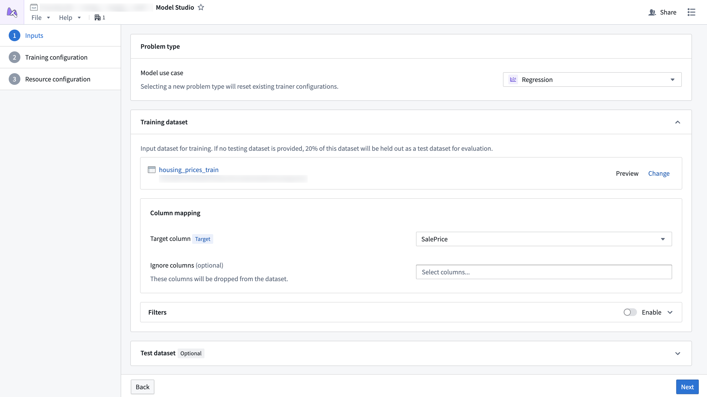
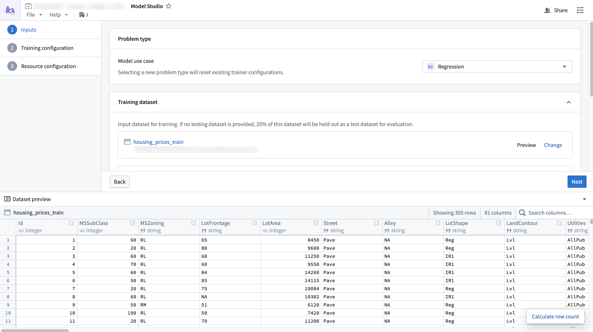
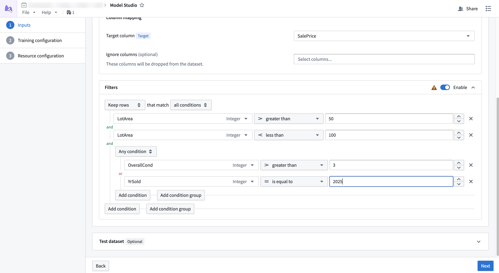

<!-- source: https://palantir.com/docs/foundry/model-studio/configuration-inputs/ · mirrored 2026-08-26 from Palantir Foundry docs -->

# Inputs

Model Studio accepts [Foundry datasets](/docs/foundry/data-integration/datasets/) as inputs for a training job. Each trainer defines what types of datasets it expects to receive.

## Dataset mapping

Each card in the dataset configuration page of the configuration wizard is a specific dataset that an input can be mapped to. Some datasets are required, while others are optional. For example, test datasets tend to be optional, since the training job will split 20% of the data to be used as a testing dataset.

Additionally, datasets must have columns mapped to specific column types so the trainer knows which columns are important. For example, the time series forecasting trainer might define that it needs one target column, one timestamp column, and an optional `item_id` column. Each column mapping defines a specific set of column type requirements that must be met for a column to be selectable.

Dataset columns can also be ignored. When a column is ignored, it will be dropped from the dataset during training.

### Preview

Selected datasets can also be previewed. The preview window allows you to inspect datasets while setting up inputs and view the statistics of different columns.

### Filtering

:::callout{theme="warning"}
Filters applied to non [Parquet ↗](https://parquet.apache.org/) datasets do not support pushdown filtering. You may need to provision more memory for your configuration to prevent out of memory errors.
:::

Dataset filtering allows you to remove rows from datasets if they meet a given condition. This is a good strategy if your dataset has a large number of null values, or if you want to ignore a subset of rows that match some condition.

Pushdown filtering is a filtering strategy available for [Parquet ↗](https://parquet.apache.org/) datasets that allows filters to be applied before the data is downloaded during a job. This allows you to reduce the total amount of memory applied to the job. Datasets produced within Foundry, such as an output from [Pipeline Builder](/docs/foundry/pipeline-builder/overview/), will generally support pushdown filtering, while those that are uploaded, such as CSVs, will not.
