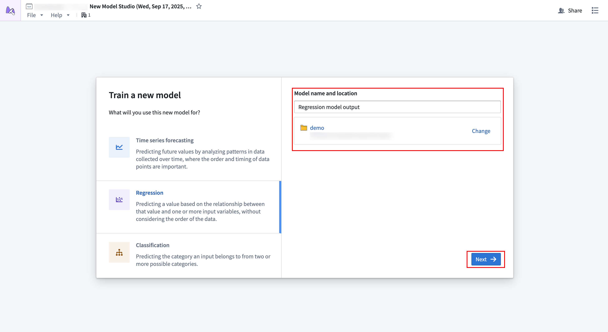
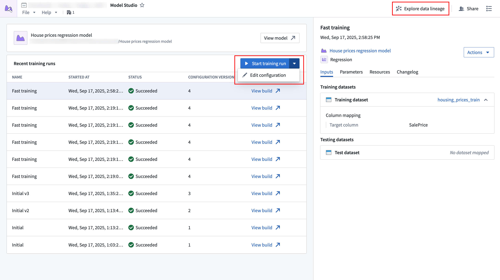
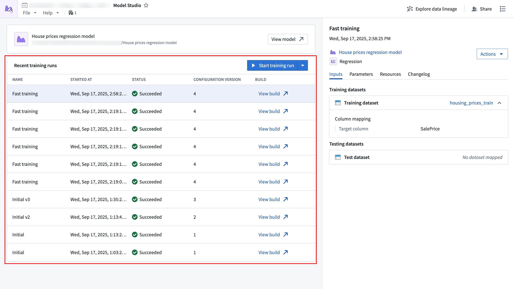
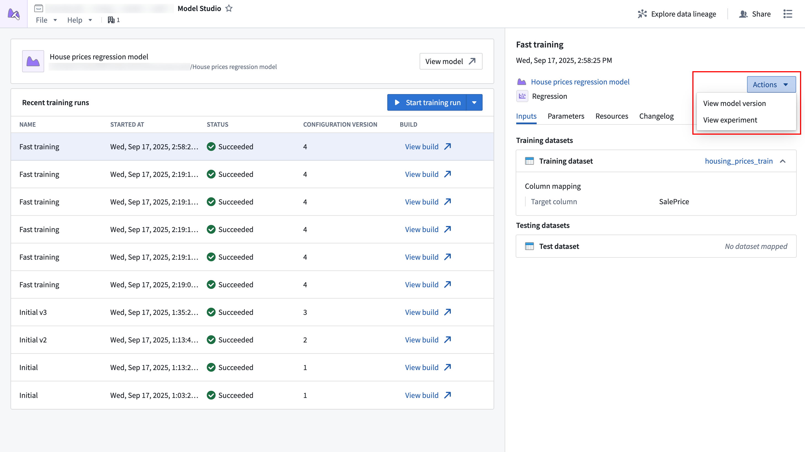
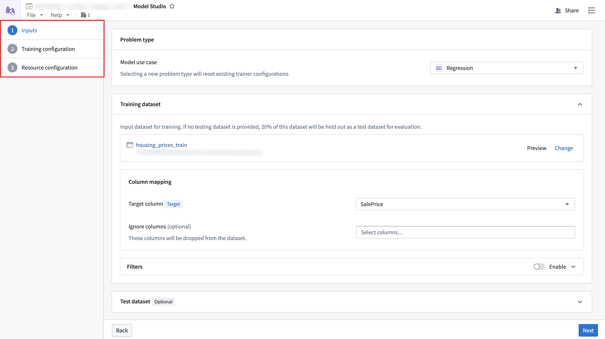
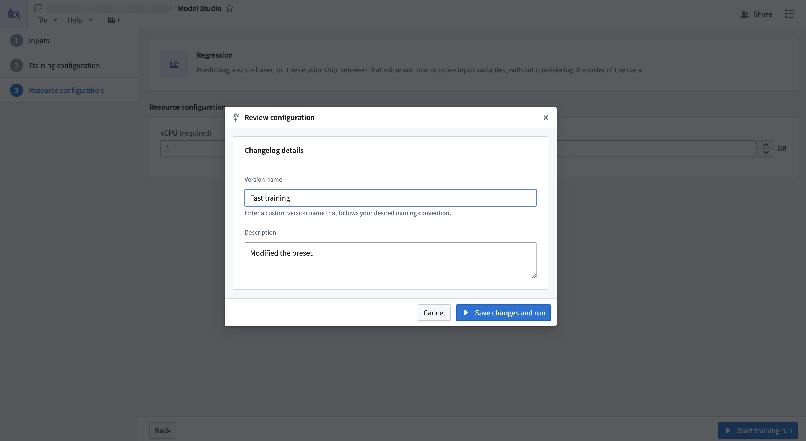

<!-- source: https://palantir.com/docs/foundry/model-studio/navigation/ · mirrored 2026-08-26 from Palantir Foundry docs -->

# Navigation

This page provides an overview of Model Studio's interface, navigation, and available controls.

## Set up a model studio

To create a model studio, choose a trainer and select a name and location for the output [model](/docs/foundry/integrate-models/integrate-overview/).

Selecting **Next** will bring you to the [configuration wizard](#configuration-wizard).

## Home page

After successfully creating a model studio and launching a training run, you will be directed to the Model Studio home page. This page contains information about your model studio and provides links to access output models and experiments.

The **Start training run** option at the top of the **Recent training runs** table will launch a build with the latest configuration when selected. The dropdown next to the **Start training run** option contains controls for editing the configuration, and the **Explore data lineage** button in the top navigation bar allows viewing the data lineage for your model studio. Open the data lineage to set up a [build schedule](/docs/foundry/data-integration/schedules/).

Below the top navigation bar is a card that has contains details about the output model, such as its name, path, and status. The icon to the right of the model name may appear yellow, indicating that source data has updated and the model is considered out of date.

### Training runs

The main section of the home page shows a list of training runs that were executed for the model studio.

The table columns are as follows:

* **Name:** The name of the configuration that was executed. The name can be set when editing the model studio configuration.
* **Started at:** The time the training job was started.
* **Status:** The status of the training job.
* **Configuration version:** An incrementing number indicating what configuration version the training job was executed with. This number increments every time a change is made to the configuration.
* **Build:** A link to the [build](/docs/foundry/data-integration/builds/) for that job.

Select a row in the table to reveal more details about that row in the [sidebar](#sidebar).

### Sidebar

The sidebar displays information about a selected run from the **Recent training runs** table. The top of the sidebar shows the date the training run was executed. Links to the experiment and the produced model version can be found in the **Actions** dropdown.

The following information about the training run's configuration is also available:

* **Inputs:** The [dataset inputs](/docs/foundry/model-studio/configuration-inputs/) and column mappings applied for the run's inputs.
* **Parameters:** The parameters that were configured for the job.
* **Resources:** The [compute resources](/docs/foundry/model-studio/configuration-compute-resources/) applied for the job.
* **Changelog:** An optional configuration changelog that is written after editing the configuration.

## Configuration wizard

The configuration wizard is used when creating or editing a model studio configuration, and will guide you through the model studio configuration steps. Each trainer has its own defined configuration options.

1. **Inputs:** Define the [dataset inputs](/docs/foundry/model-studio/configuration-inputs/) that are needed for the trainer.
2. **Parameters:** Define the parameters needed for the training job. Each trainer will present its own options and display in-platform documentation for them.
3. **Compute resources:** Define the [vCPU and memory](/docs/foundry/model-studio/configuration-compute-resources/) resources for the training job.

When all steps in the wizard have been completed, you will be asked to provide a name and an optional changelog for the configuration version. These will provide descriptive details about what the configuration does and what changed from the previous version.

