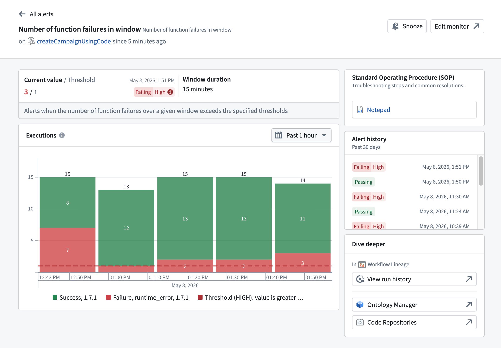
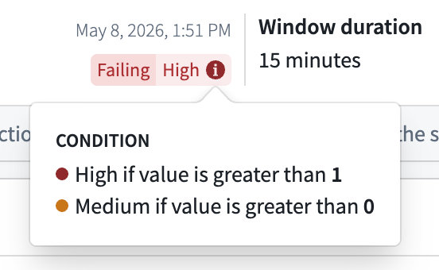

<!-- source: https://palantir.com/docs/foundry/monitoring-views/alert-debug-page/ · mirrored 2026-08-14 from Palantir Foundry docs -->

# Alert debug page

The alert debug page provides a detailed diagnostic view for a monitor rule firing on a specific resource. To access the alert debug page, navigate to the **Troubleshoot alerts** tab in the **Data Health** application and select **View details** on an alert.

:::callout{theme="neutral"}
The alert debug page currently supports function and action type resources. Support for additional resource types is planned.
:::

## Header

The page header identifies the monitor rule and provides quick actions:

* **Monitor name:** Shown alongside the template name the rule was created from.
* **Status line:** In the form `on <resource> since <time>`, indicating the resource that the rule fired on and how long the rule has been in its current state.
* **Snooze:** Temporarily silences notifications for this monitor rule. When a snooze is active, an indicator appears in the header.
* **Edit monitor:** Opens the monitor rule in the rule configuration view for editing.

Use the back arrow to return to the **Troubleshoot alerts** tab.

## Metrics

The metrics section displays the current state of the monitored metric:

* **Current value / Threshold:** The latest value of the monitored metric alongside the threshold that triggers a firing alert. The timestamp of the most recent evaluation appears next to the values.
* **Window duration:** For monitor rules with a windowed condition (for example, rules that count failures over a fixed time interval), the evaluation window over which the condition is computed.
* **Status badge:** A badge showing the current state of the rule. When the condition is no longer met, the badge displays `Passing`. When the rule is firing, the badge displays `Failing` paired with the configured severity level (`Low`, `Medium`, or `High`).

The monitor description appears below the metric values.

Hover over the condition tag to view a breakdown of all severity conditions configured on the rule.

## Standard operating procedure

When a monitor rule has a **Standard Operating Procedure (SOP)** attached, the SOP card displays a link to the associated Notepad resource. The card provides quick access to troubleshooting steps and common resolutions documented for the rule.

A monitor rule can surface up to two SOPs, each displayed as a link to its associated Notepad resource:

* **Monitor rule SOP:** The SOP attached directly to the monitor rule. You can add, replace, or remove it from the **Manage monitors** tab in the **Data Health** application.
* **Default template SOP:** The SOP defined by the monitor's template, if one is set. This is provided by the service and is read-only.

## Chart

The chart section displays the monitored metric values over time. The chart includes a description of the metric being tracked. The description varies by resource type (function or action type).

Use the date range picker above the chart to adjust the time window, or interact directly with the chart.

## Alert history

The alert history section displays a timeline of monitor status transitions for this rule over the past 30 days. Each entry shows the status badge and the timestamp of the transition. Scroll down to load additional history.

## Dive deeper

The **Dive deeper** section provides links for further investigation of the monitored resource:

* **Workflow Lineage:** Opens the resource run history in Workflow Lineage. Workflow Lineage applies pre-filters based on the firing condition's metric to surface the most relevant executions. For details on the filters applied for each metric type, see [Navigate to resource lineage from an alert](/docs/foundry/monitoring-views/overview/#navigate-to-resource-lineage-from-an-alert).
* **Ontology Manager:** Opens the target resource overview in Ontology Manager.
* **Code Repositories:** For function alerts, opens the source repository in Code Repositories. This link appears only when the function's source repository is known.

## Unsupported resource types

The alert debug page only provides detailed diagnostics for function and action type resources. If you open the page for a monitor rule on another resource type, it displays an empty state explaining that detailed diagnostics are not yet available. The **Troubleshoot alerts** tab continues to provide high-level alert information for these rules.
