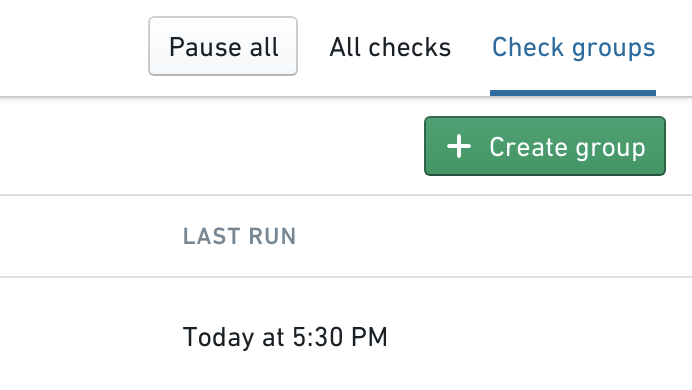
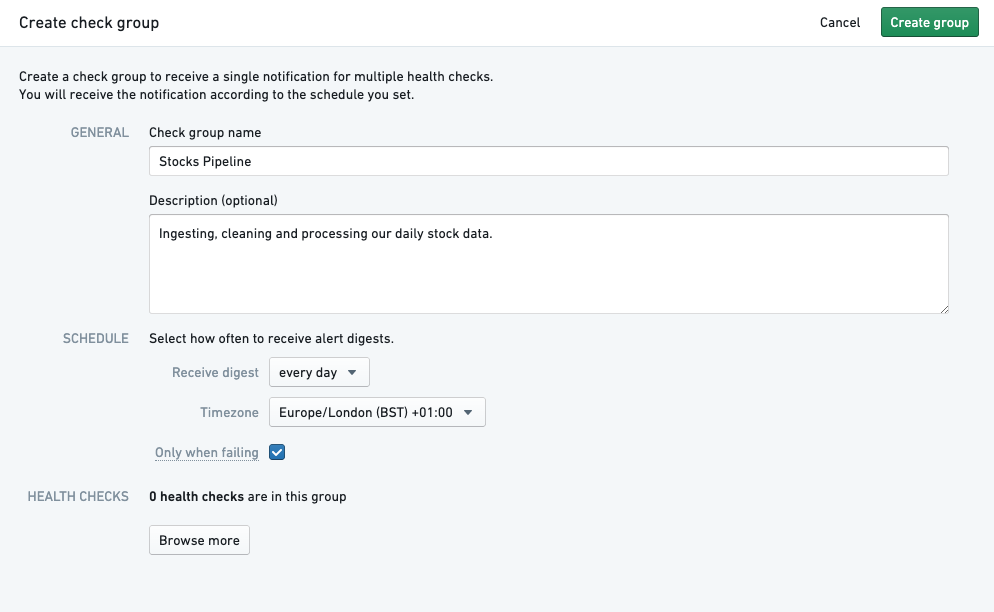
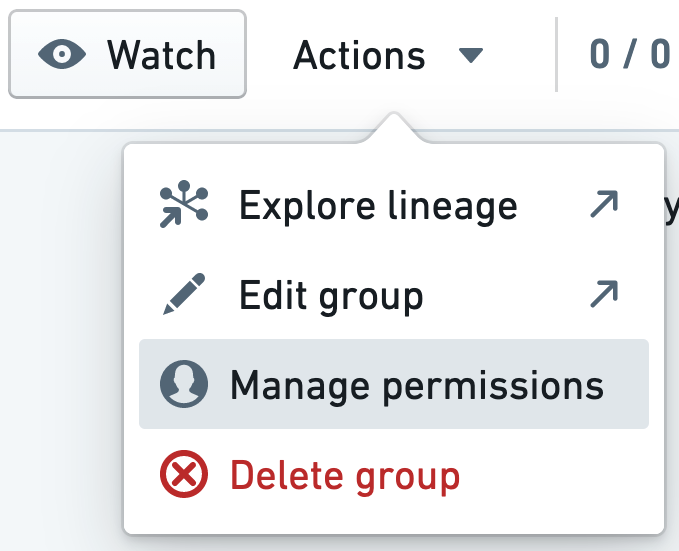
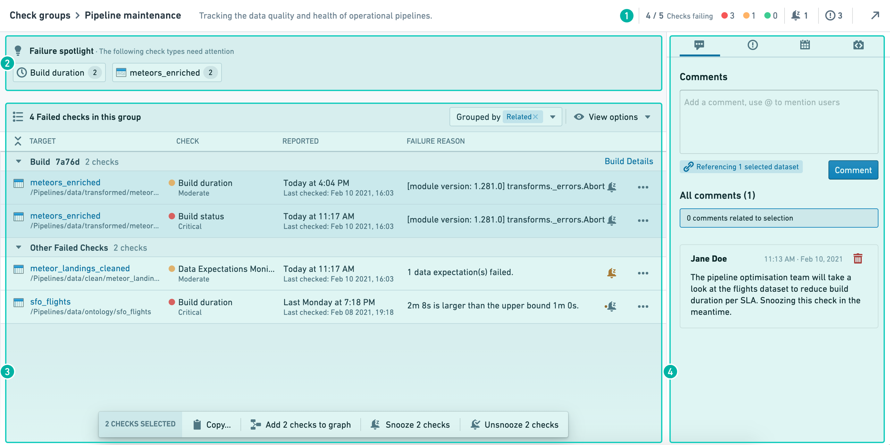
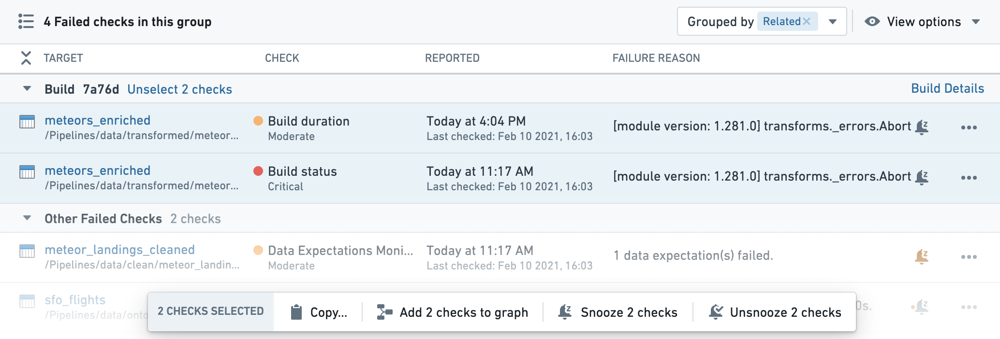
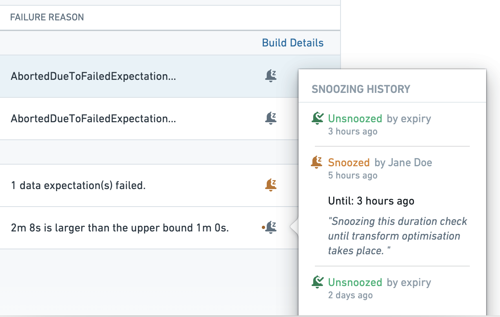
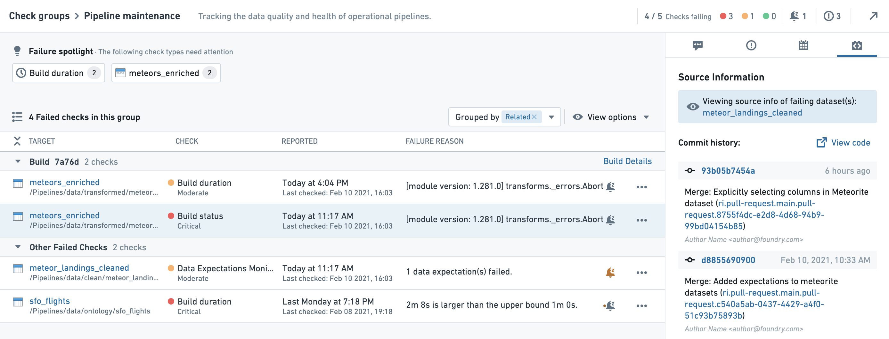

<!-- source: https://palantir.com/docs/foundry/monitoring-views/check-groups/ · mirrored 2026-08-14 from Palantir Foundry docs -->

# Check groups \[Sunset]

:::callout{theme="warning" title="Sunset"}
Check groups are in the [sunset](/docs/foundry/platform-overview/development-life-cycle/) phase of development and will be deprecated at a future date. Full support remains available. Previously saved check groups can still be edited, but no new check groups can be created. We recommend [migrating your check groups to monitoring views](/docs/foundry/monitoring-views/overview/#upgrade-an-existing-check-group-to-a-monitoring-view) to serve your use case purposes.

[Monitoring views](/docs/foundry/monitoring-views/overview/) allows you to group monitoring rules and health checks to manage alerts, providing the functionality of check groups as well as enhanced scope-based monitoring capability.

Contact Palantir Support if you require additional help migrating your workflows.
:::

Data Health also allows you to set up **Check groups** which contain multiple checks. You can represent a grouping of datasets which are related (such as a physical pipeline) and monitor the health of your pipeline.

## Checks vs. check groups

**Check groups** do not run your checks or have any effect on when your checks will run. Rather, check groups are a simple way for a user to subscribe to a specific set of checks and monitor the health of datasets in the check group.

You can add yourself as a subscriber to a check group. If you are subscribed, Data Health will see if any of the checks in the group are in a failing state and send you an email digest alerting you. You can adapt the frequency of the digest to your needs.

For example, you may want frequent notifications (for example, every 15 minutes) about the state of a pipeline with high-urgency checks, or you may only want notifications when there are failing checks and not if all checks succeed. This is possible with the **Only when failing** option. You can also set the digest frequency to weekly to receive less frequent updates.

The advantage of being subscribed to a check group rather than individual checks is that you will receive an aggregated notification digest, rather than multiple emails. Additionally, with check groups you do not need to subscribe to each individual check (which could be time-consuming for larger pipelines), but can subscribe to the overall group instead.

:::callout{theme="neutral"}
Subscribing to a check group will not subscribe you to all individual checks. It will, however, notify you of all checks in the group through the configurable digest.
:::

## Create and watch a check group

You can create a check group by clicking the **Create Group** button in the Data Health App:

This will open another window with the following options:

| Group Component   | Description                                                       | Required? |
| ----------------- | ----------------------------------------------------------------- | --------- |
| **Group Name**    | Name of check group to show up in Data Health app & notifications | Y         |
| **Description**   | Add a note to provide additional context                         | N         |
| **Schedule**      | Frequency of email notifications about checks **only**           | Y         |
| **Health Checks** | Individual Checks that are a part of this group                   | Y         |

Users subscribed to a check group will be subscribed to the digest. This will send the user aggregate digest-style notifications based on the configured schedule.

You can subscribe to a check group by clicking the **Watch** button in the upper right corner. You must have permission to view a check group to be able to subscribe to it. The owner of a check group can grant view access through **Manage permissions** in the **Actions** dropdown.

## View and understand a check group

Data Health incidents often span multiple interconnected resources. [Check groups](/docs/foundry/monitoring-views/overview/) allow you to monitor, troubleshoot, and track related checks. Use the check group functionality to:

1. Quickly evaluate the health of your data
2. Identify clusters of failures and determine their root cause
3. Gather context on failing resources and past events
4. Take action on multiple checks and communicate your remediation steps

To start, open the relevant check group from the Data Health check group tab. Then select the **Actions** menu and choose **Troubleshoot checks**.

The check group diagnosis page consists of four main sections:

1. [Check group details](#check-group-details)
2. [Failure spotlight](#failure-spotlight)
3. [List of checks](#list-of-checks)
4. [Context panel](#context-panel)

## Check group details

The check group details are located in the interface header and contain information such as the check group description and the status of the checks in the group.

The check status diagram will show the number of checks in the group by severity. Snoozed checks will be displayed in faded striped bars.

## Failure spotlight

The failure spotlight shows clusters of failing checks with common properties such as check type, resource, data source, etc. These clusters of failing checks can point to a single root cause and are often a good place to begin troubleshooting. By clicking on a cluster of failing checks, the relevant checks will be highlighted in the check list below.

## List of checks

The list of checks shows all currently failing checks within the check group.

### Grouping

The “Group by” dropdown allows you to group the list of checks by different categories:

* **Build:** This strategy will group checks that relate to the same dataset build.
* **Snoozed together:** This will group together all checks that were snoozed at the same time and for the same reason.
* **Related:** This grouping strategy will attempt to group together all the failing checks in the list, using all the available grouping strategies (starting with checks snoozed together, and then by build).

### View options

View options allow you to set common filters on your list of checks:

* **Hide snoozed:** This option will hide all datasets with currently-snoozed notifications.
* **Hide finished duration checks:** This option will hide all “Build duration” check reports for builds that were finished after the check report had been triggered.

### The actions toolbar

By holding the command/control key you can select multiple checks from the list of checks. This "multiple selection" will affect the context panel and open the actions toolbar at the bottom of the list of checks. Any action taken through the toolbar will impact all selected checks or target resources.

### Snoozing notifications in check groups

"Snoozing" notifications turns off notifications temporarily and can reduce noise from known temporary failures and remediated incidents . You can snooze or re-enable notifications individually or by selecting multiple checks.

#### Snoozing individual checks

Each individual check has a snooze button. The snooze button will appear gray when notifications are active, and will be colored when notifications are snoozed. Clicking on an active snooze button will allow you to “re-snooze” the check, setting a different snooze period.

An orange dot next to an inactive snooze button will signal that the check has recently been snoozed. This may indicate an ongoing incident or past remediation steps. By hovering over the snooze button, you can view the recent snooze history on the relevant check.

#### Snoozing multiple checks

You can snooze several checks at the same time by selecting multiple checks and using the Actions toolbar. This will apply the same snooze time frame and reason for all selected checks. Similarly, you can un-snooze (re-enable) multiple checks together through the Actions ribbon.

:::callout{theme="neutral"}
Snoozing notifications through the Actions toolbar snoozes each of the selected checks individually with similar timeframe and reason. To re-enable notifications on the checks, you need to select them all and un-snooze them through the Actions toolbar.
:::

When you group your list of checks by “snoozed together”, all checks that were snoozed together will appear in a single group, with the reason at the header of the group. Note that snoozed checks are hidden by default; remove the filter if you want to review them.

## Context panel

The context panel provides relevant information on the check group, the selected checks, and the target resources monitored by the check group. You can use the context panel to gain insights on past and ongoing incidents, as well as to launch useful Foundry applications to troubleshoot and resolve issues. The context panel includes the following functionality:

* [Comments](#comments)
* [Issues](#issues)
* [Schedules](#schedules)
* [Source information](#source-information)

### Comments

In the **Comments** tab, you can leave messages related to incidents, troubleshooting steps, and resolutions. The messages you post in the Comments section will be viewable by any user with permissions to view the check group.

Selecting checks in the list will impact both comments in two ways:

1. **Posting a comment** will reference the *target resources* of the selected checks.
2. **The list of comments** will highlight all existing comments that reference the target resources.

### Issues

Foundry Issues is a helpful tool for managing, tracking, and communicating ongoing incidents. The Issues panel will show you all *open* issues on resources monitored by the check group. By selecting checks, you can filter the list to show only issues reported on the target resources of the selected checks.

:::callout{theme="success" title="Tip"}
Check the issues tab before starting to troubleshoot a check. Related issues can help with finding the root cause, and you may find that the problem is already being handled by someone else.
:::

### Schedules

The schedules panel will show all the schedules affecting the target resources in the check list. You can use the view to gather basic information on relevant schedules, open the schedule metrics and configuration app, and run your schedule if it is part of your remediation steps. Note that there is sometimes more than a single schedule related to datasets.

### Source information

The source panel will show information on the originating source, which is the Foundry resource used to generate the failing resource (for example, a Fusion spreadsheet, code repository, data connection source, etc.)

When the dataset is created by code repository, this panel will show the commit history of the failing dataset (That is, the dataset which caused the failure, rather than the target dataset on which the check ran). The commit history can help you discover recent code changes that may have caused the failure.

