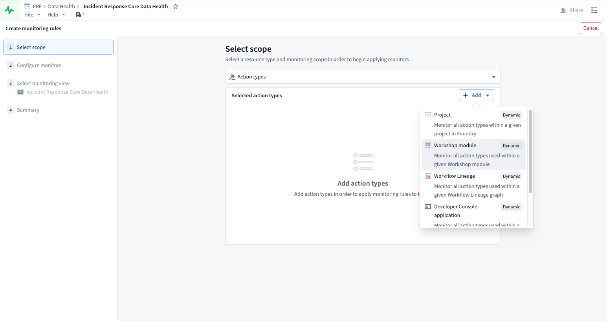
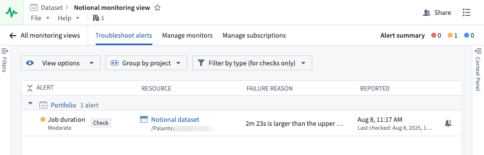
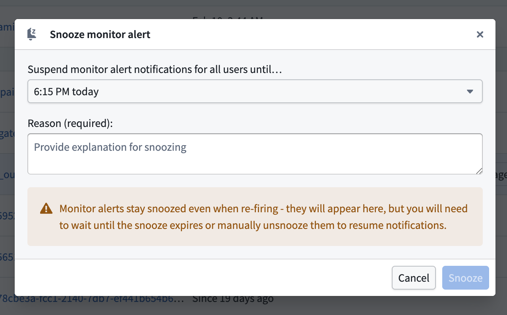
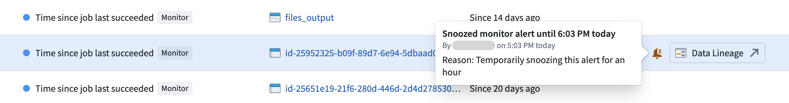
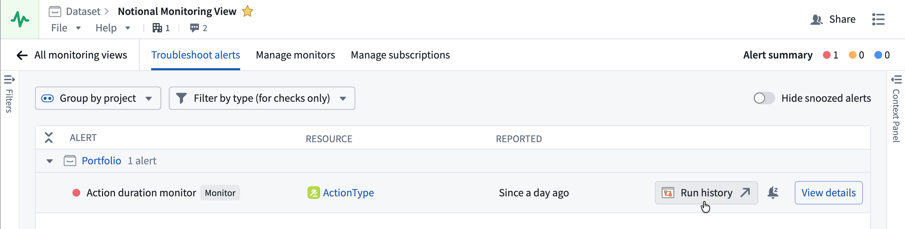

<!-- source: https://palantir.com/docs/foundry/monitoring-views/overview/ · mirrored 2026-08-14 from Palantir Foundry docs -->

# Monitoring views

Monitoring at scale reduces the time required to monitor Foundry resources by introducing enhanced capabilities. Monitoring views are a collection of monitoring rules and health checks.

Monitoring views offer expanded functionality beyond what is available in check groups and we recommend [upgrading all existing check groups](#upgrade-an-existing-check-group-to-a-monitoring-view) to monitoring views.

With monitoring views, you can monitor the following resource types:

| Resource type  | Supported scope |
| ------------------------------|:-------------------:|
| [Agent](/docs/foundry/monitoring-views/rules-reference/#agent-rules)                                   | Single, Project     |
| [Object type](/docs/foundry/monitoring-views/rules-reference/#object-and-link-rules)                   | Single, Project     |
| [Link type](/docs/foundry/monitoring-views/rules-reference/#object-and-link-rules)                     | Single, Project     |
| [Schedule](/docs/foundry/monitoring-views/rules-reference/#schedule-rules)                             | Single, Project     |
| [Streaming dataset](/docs/foundry/monitoring-views/rules-reference/#streaming-dataset-rules)          | Single, Folder, Project |
| [Live deployment](/docs/foundry/monitoring-views/rules-reference/#live-deployment-rules)              | Project             |
| [Time series sync](/docs/foundry/monitoring-views/rules-reference/#time-series-sync-rules)               | Single           |
| [Geotemporal observation](/docs/foundry/monitoring-views/rules-reference/#geotemporal-observation-rules) | Single           |
| [Automation](/docs/foundry/monitoring-views/rules-reference/#automation-rules)                           | Single, Project  |
| [Dataset](/docs/foundry/monitoring-views/rules-reference/#dataset-rules)                     | Single, Folder, Project |
| [Function](/docs/foundry/monitoring-views/rules-reference/#function-rules)                     | Single, Project, Workflow Lineage, Workshop, OSDK application  |
| [Action type](/docs/foundry/monitoring-views/rules-reference/#action-rules)                     | Single, Project, Workflow Lineage, Workshop, OSDK application  |

If you need detailed content and schema validation, consider using [health checks](/docs/foundry/health-checks/overview/).

:::callout{theme="neutral"}
To use project scope with ontology resources, you will need to first [migrate your ontology to project-based permissions](/docs/foundry/ontology-manager/migrate-to-project-based-permissions/).
:::

## Create a new monitoring view

To create a new monitoring view, navigate to the **Monitoring View** tab in the top right corner of the **Data Health** application and select **New monitoring view**.

### Add a monitoring rule

In your new monitoring view, you can **Add monitoring rules** on the **Manage monitors** tab. First, select the resource type you are looking to monitor and then select a scope.

With a **static** scope, you select a specific resource to monitor. With a **dynamic** scope, the monitor automatically updates as resources are added or removed, without requiring manual changes. Dynamic scopes include **Folder**, **Project**, **Workflow Lineage**, **Workshop**, and **OSDK application**, though availability varies by resource type. See the [supported scope table](#monitoring-views) for details.

:::callout{theme="neutral"}
You must have `Viewer` permission on the resources to monitor them. To [receive alerts](#subscribe-to-alerts) triggered by monitoring rules, you must have `Viewer` permission on the resources and the monitoring view.
:::

Additionally, you can [review the Monitoring rules resource reference](/docs/foundry/monitoring-views/rules-reference/).

### Configure monitors

Monitors are set on the metrics emitted by a resource. As you set up your monitors, we suggest certain configurations based on Foundry’s standards for health. However, you can change the values or choose to only monitor certain metrics. You can also determine the level of severity for the alert: low, medium, and high.

### Edit monitors

You can edit your monitors by selecting from the list of monitors and choosing **Edit** on the side panel that appears.

### Add a health check

You can add existing health checks to a monitoring view from the **Data Health** application:

1. Select **Add health check** in the top-right corner of the **Data Health** application.
2. In the resource selection dialog, select multiple datasets and choose the existing health checks you want to add to the monitoring view.
3. The selected health checks are grouped in the monitoring view.

:::callout{theme="neutral"}
This dialog adds existing health checks to a monitoring view. To bulk-create new health checks across multiple datasets, refer to [bulk adding health checks](/docs/foundry/health-checks/overview/#add-new-health-checks-to-multiple-datasets).
:::

## Set up and manage alert notifications

Once you have configured your monitoring rules, you will need to set up how and where alerts are delivered when issues are detected.

### Subscribe to alerts

To subscribe to alerts, navigate to the **Manage subscriptions** tab where all the subscribed users are listed. You can add users and user groups, and configure their alerts based on severity. When a monitor rule triggers an alert, the user subscribed to the monitoring view containing that alert will be notified via email and Foundry notifications. Note that you must have `Viewer` permission on the resources and the monitoring view to be able to receive alerts.

### Integrate with external systems

You can send alerts to external systems such as PagerDuty or Slack with built-in integrations or by using a webhook to hit arbitrary REST endpoints. Learn more about [sending alerts to external systems](/docs/foundry/monitoring-views/external-systems/).

## Troubleshoot alerts

On the **Troubleshoot alerts** tab, you can review your alerts by alert name, resource, failure reason, and the time of reported alert. Additionally, you can **view options**, **group by project**, or **filter by type** (for checks only).

For individual monitor rules, you can open the [alert debug page](/docs/foundry/monitoring-views/alert-debug-page/) to view detailed metrics, alert history, and diagnostic information.

### Snooze alerts after they fire

You can snooze an individual alert after it fires for both health checks and monitors to temporarily suppress notifications. To snooze an alert, select it from the **Troubleshoot alerts** panel and choose **Snooze** from the toolbar displayed in the bottom of your screen. Additionally, you can select the bell icon in the **About** tab of the **Context Panel** that renders after you select the alert. Configure a suspension duration and provide a reason for snoozing before selecting **Snooze**.

Snoozed alerts contain an inline bell icon tag that displays who snoozed the alert, when, and why upon hover. Use the **Hide snoozed alerts** toggle in the top right to hide snoozed alerts from view. Once hidden, a banner in the footer of the **Troubleshoot alerts** panel displays the number of currently snoozed alerts.

To resume an alert's notifications, select **Unsnooze** from the toolbar at the bottom of your screen or wait for the snooze duration to expire.

:::callout{theme="neutral"}
Unlike health check alerts, snoozed monitor alerts remain snoozed even if they re-fire. You must wait for the snooze to expire or manually un-snooze to resume notifications.
:::

### Snooze monitor rules

In addition to snoozing individual alerts, you can snooze an entire monitor rule to silence alerts across all targets within that rule's scope at once. This is particularly useful when you are aware of a known issue and want to suppress all alerts tied to a particular rule in a single action.

To snooze a monitor rule, navigate to the **Manage monitors** tab in your monitoring view, select the rule you want to snooze, and choose **Snooze** from the available actions.

:::callout{theme="warning"}
When you snooze a monitor rule, any existing target-level snoozes for that rule will be replaced by the new rule-level snooze.
:::

### Navigate to resource lineage from an alert

From an alert on the **Troubleshoot alerts** tab or the [alert debug page](/docs/foundry/monitoring-views/alert-debug-page/), you can navigate directly to the resource's lineage view.

* Datasets, schedules, and object types will open in Data Lineage.
* Functions, action types, and automations will open in Workflow Lineage with the **Run history** tab selected.

For function and action type monitoring rules, pre-filters are automatically applied to the run history based on the monitor rule type to surface the most relevant executions.

| Rule type | Run time range | Status | Timestamp range | Failure reason |
| --------- | -------------- | ------ | --------------- | -------------- |
| **Duration p95** | Set to the monitor's threshold value, showing only executions that exceeded the threshold. | — | — | — |
| **Number of failures in window** | — | Set to **Failed** | Start of the monitor's time window at the time the alert fired. | — |
| **Number of user-facing failures in window** | — | Set to **Failed** | Start of the monitor's time window at the time the alert fired. | Set to **User facing error** |

:::callout{theme="neutral"}
Pre-filtered run history navigation is currently available for function and action type resources only.
:::

## Upgrade an existing check group to a monitoring view

To upgrade an [existing check group](/docs/foundry/monitoring-views/check-groups/), open your check group in the **Data Health** application. In the top banner, select **Upgrade to monitoring view**.

You can create a new monitoring view or move all the checks to an existing monitoring view.

:::callout{theme="neutral"}
* Monitoring views are filesystem resources. If you are creating a new monitoring view, be sure to store it in a project accessible to potential subscribers.
* After upgrading your check group, checks will continue to be supported exactly as they are now. There are no changes to email digest, alerting, subscriptions, or any other workflow related to health checks.
* Each check group can be linked to a single monitoring view and vice versa; therefore, you can only upgrade one check group to a single existing monitoring view, or create a new monitoring view if a suitable one does not exist.
:::
