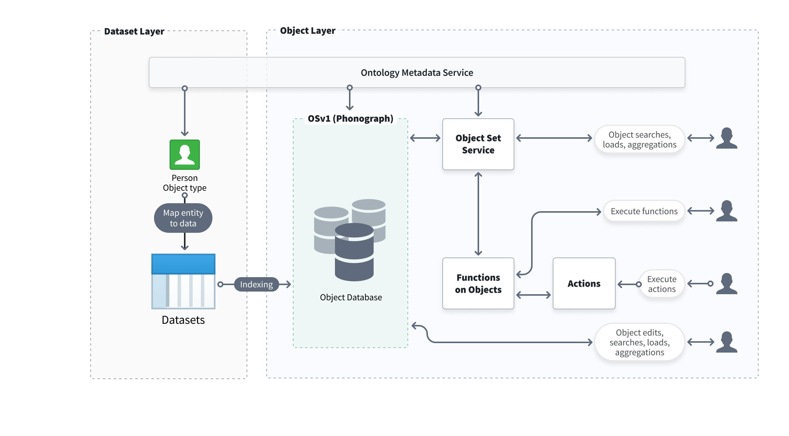

<!-- source: https://palantir.com/docs/foundry/object-backend/ · mirrored 2026-08-06 from Palantir Foundry docs -->

# Ontology architecture

The Foundry Ontology is an operational layer for the organization. The Ontology sits on top of the digital assets integrated into Foundry (datasets and models) and connects them to their real-world counterparts, ranging from physical assets like factories, equipment, and products to concepts like customer orders or financial transactions. The Ontology serves as a digital twin of an organization, containing both the semantic elements (objects, properties, links) and kinetic elements (actions, functions, dynamic security) needed to enable use cases of all types. You can learn more about the Foundry Ontology and how it enables better decision-making in the [Ontology documentation](/docs/foundry/ontology/overview/).

The Foundry Ontology is backed by multiple services that work together to index, store, query, and manipulate objects in the Ontology. This page provides a high-level overview of the Ontology’s backend architecture.

## Functional components and architecture

The Foundry platform uses a microservices architecture in which multiple services together comprise the Ontology backend. The Ontology backend is responsible for three main functions:

* **Datasource management** to feed the Ontology and manage schema definitions within the Ontology.
* **Querying, searching, and aggregating objects** from the Ontology with support for specific filtering and permissioning.
* **Orchestration of writing to the Ontology**, including indexing of datasources and edits to Ontology objects based on decisions made or actions taken in Foundry.

These functions are handled collectively by the services that make up the Ontology backend, which are summarized below:

* [Ontology Metadata Service (OMS)](#ontology-metadata-service-oms)
* [Object databases](#object-databases)
* [Object Set Service (OSS)](#object-set-service-oss)
* [Actions](#actions)
* [Object Data Funnel](#object-data-funnel)
* [Functions on Objects](#functions-on-objects)

### Ontology Metadata Service (OMS)

The Ontology Metadata Service (OMS) is an overarching service that defines the set of ontological entities that exist. This definition includes the metadata of object types, the link types that describe any relationships between object types, the action types that can modify object data in a structured and controlled way, and more.

Learn more about core concepts in the Foundry Ontology in the [Ontology metadata documentation](/docs/foundry/ontology/core-concepts/).

### Object databases

Object databases are the services responsible for storing the indexed object data in the Ontology and are designed to provide fast data querying and query computation for user applications. In addition to storing indexed data, object databases are also responsible for indexing, querying, and orchestrating user edits.

**Object Storage v1 (Phonograph)** is Foundry's legacy Ontology backend component. **Object Storage v2** is the next-generation canonical data store for backing the Ontology. More information on these services can be found [below](#evolution-of-the-ontology-backend).

### Object Set Service (OSS)

The Object Set Service (OSS) is the service responsible for serving reads from the Ontology; OSS allows other Foundry services and applications to query objects data from the Ontology, enabling searching, filtering, aggregating, and loading of objects.

#### Object sets

Object sets are lists of real-world entities that are saved for future reference and use across Foundry applications that support objects. Object sets are saved as resources for easy sharing with collaborators.

Object sets can be described by definition (static or dynamic) and current state in the object backend (temporary or permanent):

* **Static object sets:** Static object sets are saved as a list of primary keys, and will stay the same regardless of any changes to the input data.

* **Dynamic object sets:** Dynamic object sets are saved as a representation of the filters applied to create the object set. When new data matches the filters, the object set will be updated.

* **Temporary object sets:** Temporary object sets are mainly used in the platform to hand object sets from one application or service to another and can only be accessed by the user who created them. A sample temporary object set RID will appear like `ri.object-set.main.temporary-object-set.37d7e171-2d11-4fcd-b031-9a0863f6f744` and expires within 24 hours.

* **Permanent object sets:** Permanent object sets are stored in the object backend for future reference and use across the platform.

### Actions

The Actions service is responsible for applying user edits to object databases. Actions provide a structured way to modify property values of an object and enable complex permissions and conditions for user edits. Additionally, Actions can be used to create a historical action log for analysis of user decisions.

### Object Data Funnel

The Object Data Funnel ("Funnel") is a microservice in the Object Storage v2 architecture responsible for orchestrating data writes into the Ontology. Funnel reads data from Foundry datasources (such as datasets, restricted views, and streaming datasources) and user edits (from Actions) and indexes these data into object databases. Funnel also ensures that indexed data is kept up-to-date as the underlying datasources update.

### Functions on Objects

Functions enable code authors to write logic that can be executed quickly in operational contexts, such as dashboards and applications designed to power decision-making processes.

See the [Functions](/docs/foundry/functions/overview/) documentation for more details.

## Evolution of the Ontology backend

This section describes the legacy architecture of Object Storage v1 (Phonograph) and the updated architecture of Object Storage v2.

### Object Storage v1 (Phonograph) architecture \[Planned deprecation]

:::callout{theme="warning" title="Planned deprecation"}
Object Storage v1 (Phonograph) is in the [planned deprecation](/docs/foundry/platform-overview/development-life-cycle/) phase of development and will be unavailable after June 30, 2026. [Migrate your object types and link types](/docs/foundry/object-backend/osv1-osv2-migration/) to Object Storage v2. Reference the `Migrate object types and many-to-many link types from Object Storage v1 to v2` intervention in [Upgrade Assistant](/docs/foundry/upgrade-assistant/overview/) for more information.
Contact Palantir Support if you have questions about the OSv1 to OSv2 migration in your workflows.
:::

Object Storage v1 (Phonograph) is Foundry's original object database, designed to index and manage information from a wide range of potential data models while maintaining Foundry's security model across object data in the Ontology. Beyond indexing and storing data, Object Storage v1 (Phonograph) tracks the application of user-generated edits, serves complex user queries with searches and aggregations, and orchestrates data writeback.

Below is a diagram describing the architecture for Object Storage v1 (Phonograph).

### Object Storage v2 architecture

As Foundry gained more capabilities and evolved to meet the complex operational needs and growing scale of Palantir's customers, Object Storage v2 was built from first principles to enable the next generation of Ontology-driven use cases and workflows.

Specifically, the new architecture separates dimensions of concern that had been consolidated in Object Storage v1 (Phonograph) and decouples responsibilities within the system design; by separating the subsystems responsible for indexing and querying data, Object Storage v2 can scale horizontally more easily to meet future needs.

Object Storage v2 also incorporates additional services like [Actions](/docs/foundry/action-types/overview/) via the [Object Data Funnel](#object-data-funnel).

New features and capabilities enabled by Object Storage v2 include:

* Significantly improved performance for Ontology data indexing through incremental object indexing (enabled by default) for all object types.
* Increased indexing throughput on the order of tens of billions of objects for a single object type.
* More granular object permissions with multi-datasource object types, including column/property level permissions.
* Increased user edit throughput, enabling up to 10,000 objects to be edited in a single Action. If you need to enable a higher limit, contact Palantir Support to create a change request for your enrollment.
* Reduced user edit latency and faster observation of user edits.
* The ability to migrate existing user edits after a breaking schema change in an object type.
* Low-latency data indexing into the Ontology through support of streaming datasources.
* Supports a maximum of 2000 properties per object type.
* Higher-scale Search Arounds and more accurate aggregations through a Spark-based query execution layer.
  * By default, the Search Around limit is 100,000 objects. If your use cases require a higher scale Search Around of over 100,000 objects, contact Palantir Support for instructions on how to enable this.

Below is an architecture diagram describing how Object Storage v2 powers the Ontology.

