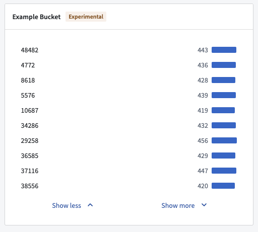
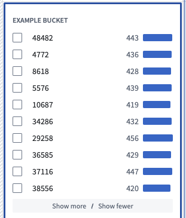
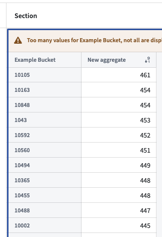
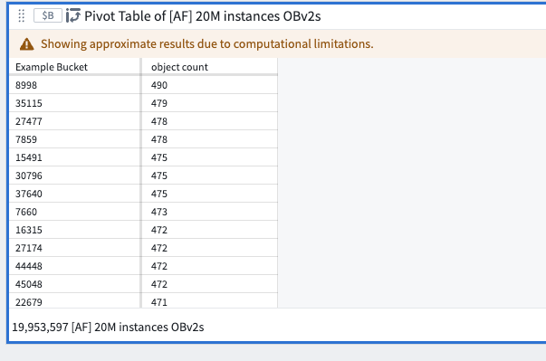
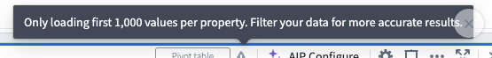
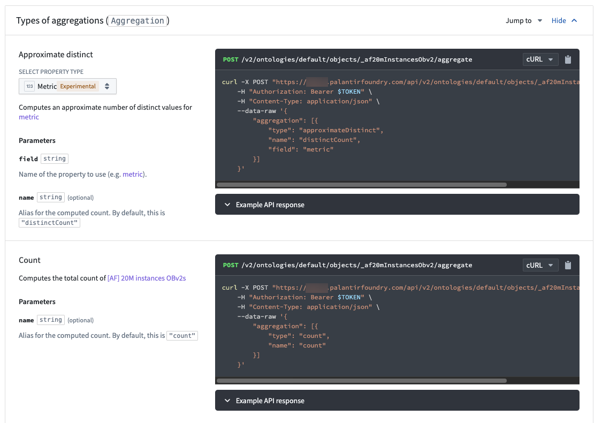

<!-- source: https://palantir.com/docs/foundry/object-backend/aggregation-considerations/ · mirrored 2026-08-06 from Palantir Foundry docs -->

# Aggregation considerations

In Foundry, depending on the complexity and volume of data you are working with, applications may not display results with full accuracy (also known as "inexact aggregations") due to the nature of aggregations with high cardinality.

The `object-set-service` API has the following fields related to aggregation accuracy that you may use to refine the accuracy wherever available:

* API callers can add `AggregationExecutionMode` in the request and set to `PREFER_ACCURACY`. Where set, the API response is slower but provides more accurate results without full accuracy guarantee.
* The aggregation response contains an `AggregateResultAccuracy` field to indicate whether the result is accurate.

Each product in Foundry has slightly different behaviors that indicate aggregations might be inexact. Review the following section for examples of how inexact aggregations may manifest in Foundry, and the considerations users should have on reaching accuracy.

For more guidance, contact Palantir Support.

## Object Explorer and Workshop

Consider the following two histogram screenshots, showing data from a dataset with 20 million objects. The first screenshot is of a dataset pulled into Object Explorer, and the second is Workshop Filter List widget from within Workshop.





The histogram were constructed using two aggregation requests. The first request tries to get the top 100 buckets by count, receiving an approximate response. The second request gets the counts for the same 100 buckets again, but additionally, filters down to just these 100 buckets to ensure accuracy in the count.

While the displayed counts are accurate, the second histogram is still inaccurate in the sense that the buckets that are displayed are not the actual top 100 buckets in terms of count, as the first aggregation response was not accurate.

Object Explorer and Workshop requests to OSS do not specify `AggregationExecutionMode`, and OSS defaults to `PREFER_SPEED`.

## Quiver pivot table and Workshop pivot table

When sorting descending columns by count in Quiver and Workshop pivot tables, top buckets are not shown in proper order. In this case, inexact aggregations might be characterized by one of the following error messages:

* "Too many values for `column`, not all are displayed"
* "Showing approximate results due to computational limitations"
* "Only loading first 1,000 values per property. Filter your data for more accurate results."

In the examples below, the `Example Bucket` column is not ranked by descending as desired.







These are not the real top buckets by count as Quiver and Workshop do not specify an ordering in the aggregation request that backs the pivot table. The sorting is completed on the frontend using buckets that are returned.

## Ontology SDK (OSDK)

OSDK is set to `PREFER_ACCURACY` and its limited aggregation complexity means that every query response will be `ACCURATE`.



## Functions

Functions always use `PREFER_ACCURACY`, so the value for a given bucket will be correct. There is currently no way to `groupBy` and `orderBy` at the same time during a function call. The following code snippet demonstrates a current example of `groupBy` in the backend and order in memory.

```
    @Function()
    public async aggregateOnMoreBucketsThanAuthorized(): Promise<TwoDimensionalAggregation<string, Double>> {
        // Aggregate and sum
        const aggregation = await Objects.search()._af20mInstancesObv2()
                 .groupBy(o => o.exampleBucket.topValues())
                 .count()

        aggregation.buckets.sort((b1, b2) => b2.value - b1.value);
        return aggregation;
    }
```

Example result:

```
{
  "buckets": [
    {
      "key": {
        "string": "10105",
        "type": "string"
      },
      "value": {
        "double": 461,
        "type": "double"
      }
    },
    {
      "key": {
        "string": "10163",
        "type": "string"
      },
      "value": {
        "double": 454,
        "type": "double"
      }
    },
    {
      "key": {
        "string": "10848",
        "type": "string"
      },
      "value": {
        "double": 454,
        "type": "double"
      }
    },
    ...

```
