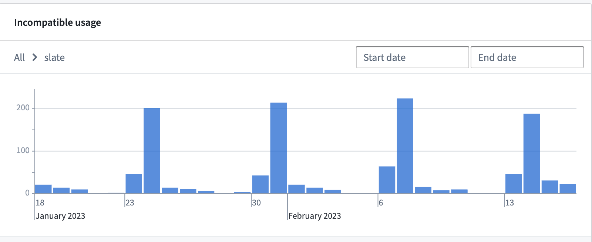
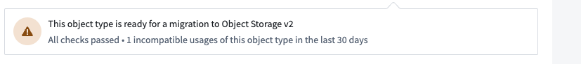
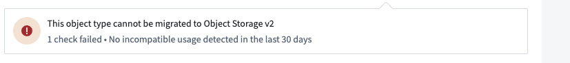
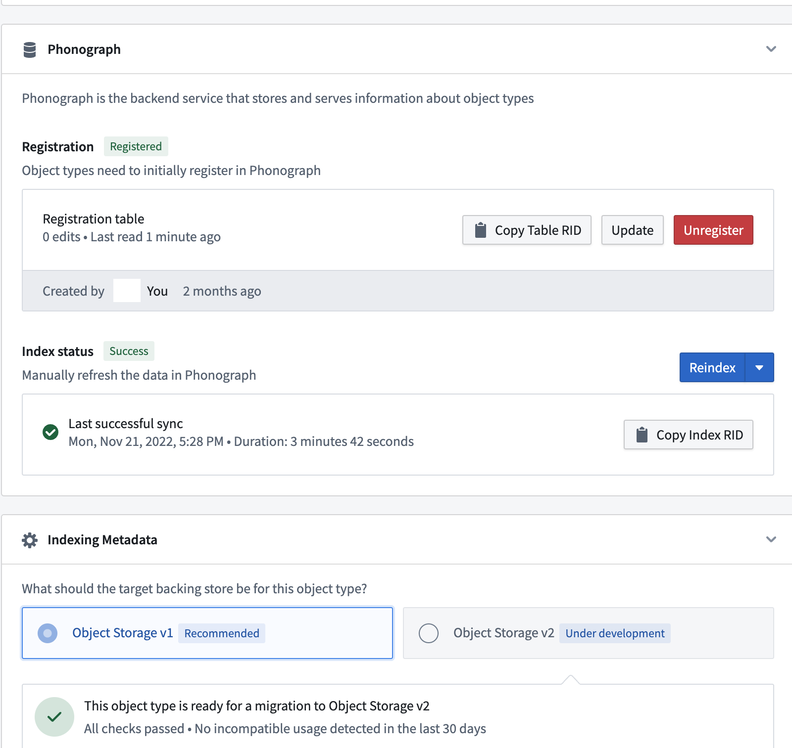
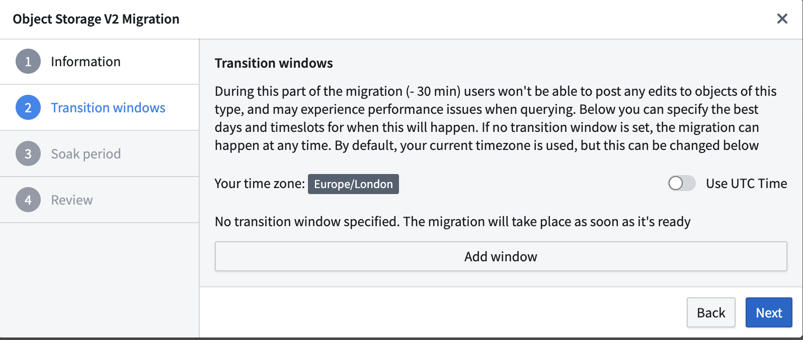
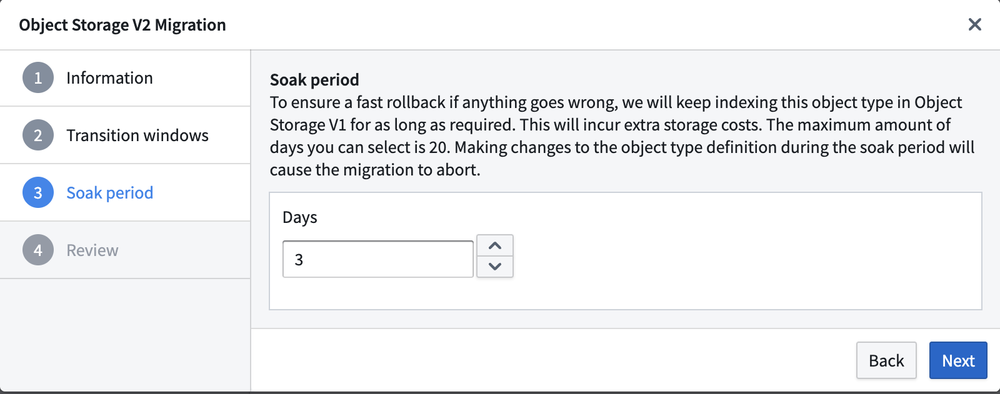
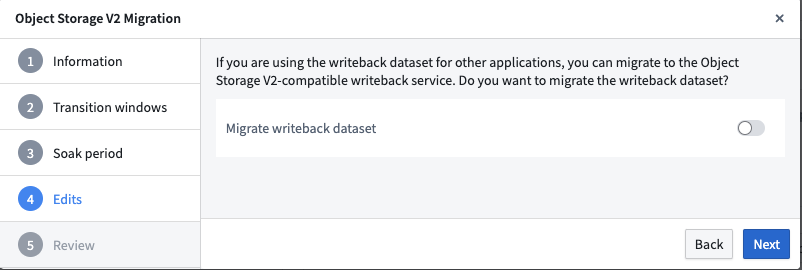
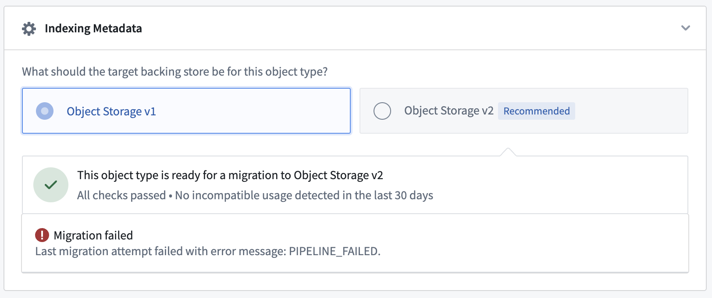
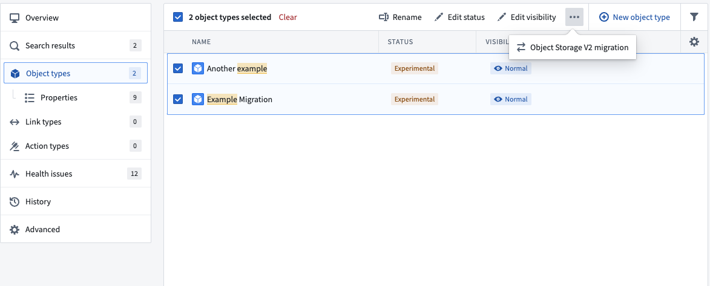

<!-- source: https://palantir.com/docs/foundry/object-backend/osv1-osv2-migration/ · mirrored 2026-08-06 from Palantir Foundry docs -->

# Migrate from Object Storage v1 (Phonograph) to Object Storage v2

The architecture changes necessary for the [improvements](/docs/foundry/object-backend/overview/) in Object Storage v2 (OSv2) require a migration of object types and many-to-many link types with join tables in Object Storage v1 (Phonograph) to Object Storage v2 (OSv2).

:::callout{theme="warning"}
Migration from Object Storage v1 to v2 is **mandatory** for all object types. [Ontology Manager](/docs/foundry/ontology-manager/overview/) provides an integrated framework for the migration of object types and many-to-many link types.
:::

The Foundry Ontology does not require migrating all object types and many-to-many link types at once. It will continue its normal operation with some of the object types being in Object Storage v1 (Phonograph) and some in Object Storage v2 (OSv2). Foundry's [Ontology Manager](/docs/foundry/ontology-manager/overview/) also supports [migrating ontology types in bulk](#bulk-migrations).

## Considerations before running a migration

### Migration behavior

* Any changes to Ontology definitions on object types that would result in a [Funnel replacement pipeline](/docs/foundry/object-indexing/funnel-batch-pipelines/) will abort any ongoing migrations. To avoid this, ensure that the object type schema remains stable for the entire migration (including soaking period), and perform any schema changes *before* initiating the migration.
* Object Storage v1 (Phonograph) registrations are updated synchronously for any changes saved in Ontology Manager. However, Funnel records ontology definition changes asynchronously, resulting in a delay between saving an ontology change in Ontology Manager and that change being detected by Funnel. Because of this, migration events like `start` or `abort` may appear in Ontology Manager with a delay of several seconds after the ontology is saved.
* Object Storage v1 (Phonograph) supports editing object and link types directly through Object Storage v1 (Phonograph) edit APIs. This interaction is deprecated and not compatible with OSv2. Before initiating the migration for an object type with user edits, ensure that your [usage is compatible](#incompatible-usage). Then, locate the object type in Ontology Manager and navigate to the **Datasources** tab.  Toggle on `Only allow edits via actions` to unblock the migration of that object type.
* User edits will be automatically disabled during the entire migration period, including soak period, starting from the moment of migration definition. New user edits cannot be posted during the migration process, but object reads will remain accessible without disruption.
* The migration provides the option to preserve the edit history and attribution of object types.
  * Enabling this option will include edit history with the migration process. Note that this will incur additional compute costs for processing and storage.
  * If the option to preserve edit history is not enabled, the edit history and attribution of object types will not be preserved during the migration and the latest state of each object instance from Object Storage v1 (Phonograph) will be migrated to Object Storage v2. Once the migration is complete, it will not be possible to recover the full edit history from Object Storage v1 (Phonograph). Users are required to acknowledge that when migrating to Object Storage v2, the history of user edits (Actions) will not be preserved, except for Action Logs.
* When migrating object types with decimal properties, additional action may be required to set the decimal precision or scale. The following errors may occur if the object contains a decimal property, or the precision or scale of the decimal needs to be set on that property:
  * Error: `The current version of the object type has an invalid definition which Object Storage v2 is unable to index. ObjectsDataFunnel:DecimalPropertyTypeMissingPrecisionOrScale` when configuring the migration to Object Storage v2
  * Error: `Precision does not match backing column.`
  * Error: `Scale does not match backing column.`
* To resolve these errors related to object types with decimal properties, follow these steps:
  1. Navigate to the **Properties** tab in Ontology Manager.
  2. Select the property with the error.
  3. Set the desired Precision and Scale values for that property. Using the **Fix** button will automatically set the Precision and Scale values based on your backing data.

### Incompatible usage

:::callout{theme="neutral"}
If the **Incompatible usage** view is not accessible, contact your Palantir representative about enabling this feature.
:::

Certain interactions in Object Storage v2 are considered [breaking changes](/docs/foundry/object-backend/object-storage-v2-breaking-changes/) and they are not compatible with Object Storage v2. This incompatible usage is tracked and reported in [Ontology Manager](/docs/foundry/ontology-manager/overview/). Selecting the **Incompatible usage** alert will provide a visualization of any incompatible usage in the last 30 days to assist in remediation.

#### Non-blocking incompatible usage

Some incompatible usage, like direct API calls to Object Storage v1 (Phonograph) endpoints, will not block initiating a migration to OSv2 but will fail after the object type is migrated to OSv2.

You should investigate incompatible usage and determine whether action is needed, such as migrating direct Object Storage v1 (Phonograph) calls to [Object Set Service](/docs/foundry/object-backend/overview/#object-set-service-oss) for object queries/reads, [Actions](/docs/foundry/object-backend/overview/#actions) for object edits, and [Ontology Metadata Service](/docs/foundry/object-backend/overview/#ontology-metadata-service-oms) for object type metadata information. If these incompatible usage are no longer relevant or can break without consequence, you can initiate the migration without remediation.

#### Blocking incompatible usage

Other changes between OSv1 and OSv2, such as not enabling editing by actions only, will actively block the migration in Ontology Manager.

In this situation, you must remove any occurrences of the incompatible usage before starting the migration.

#### No incompatible usage

Object types without any incompatible usage or breaking changes will display a green tick icon in the banner to indicate that the object type is ready to migrate.

## Migrating an entity

### Starting a migration

To start the migration, navigate to the **Datasources** tab of your object type or many-to-many link type with a join table, and go to the **Indexing Metadata** section. If the object type is eligible for migration, you will be able to select the Object Storage v2 radio button that will open a wizard for selecting migration parameters. If this section is not present, you are most likely working in an ontology where Object Storage v2 is enforced for all object types and join table link types.

:::callout{theme="neutral"}
The Ontology Metadata Service tracks incompatible usage of object types backed by Object Storage v1 (Phonograph) and will trigger an alert when attempting to migrate an object type with incompatible usage. Also, you must still ensure that the object type schema does not contain any breaking changes.
:::

### Transition windows

The **Transition windows** options allow you to set preferred time windows for a safe migration; for instance, you may want to set a day of the week and time when an object type's use case has minimal activity. Keep in mind that after the migration process begins, it may take up to 30 minutes to initiate the first Funnel pipeline. If the migration cannot be completed within the first transition window, then Object Set Service will wait until the next window to begin reading data from OSv2.

If no transition window is set, the migration will start as soon the first Funnel pipeline succeeds.

:::callout{theme="neutral"}
A transition window will be computed after the first sync to OSv2 finishes successfully. This means that if a first sync completes in the middle of a configured transition window the migration is not going to consider this as an acceptable transition window and will try to take the next one.
:::

### Disabled action types

During the migration, users will not be able to apply edits as they will be automatically disabled during the entire migration period, including the soaking period, starting from the moment of migration definition. Note that object reads will remain accessible without disruption.

### Soak period

If you need to revert to Object Storage v1 (Phonograph) during the migration process, this is possible without re-indexing data during the **soak period**. The migration framework will keep the Object Storage v1 (Phonograph) index up-to-date along with Object Storage v2 (OSv2) until the end of the soak period. The soak period can be set in increments of days, up to a maximum of 14 days (with the option to specify hours), and will only begin after the migration passes a transition window. Setting the soak period to 0 days will delete the OSv1 index for that object type as soon as the OSv2 index is ready and the transition window is activated.

During the soak period, the Foundry Ontology backend will automatically route all queries to OSv2 and any request to OSv1 will be rejected. This time period can be used to validate that the workflows that read object types are working as expected after the migration. If you experience any issues during the soak period, you can [abort the migration](#aborting-the-migration) to immediately switch back to using OSv1 indices.

After the soak period ends, it is not possible to rollback to OSv1. You may contact Palantir Support with any questions.

:::callout{theme="warning"}
Note that object types will be dual-indexed in OSv1 and OSv2 during the soak period; this will incur additional compute and storage usage. If you would like to avoid the additional resource usage, you can set the soak period to 0 days when configuring the migration.
:::

### Migrating a writeback dataset

In Object Storage v1 (Phonograph), [writeback datasets](/docs/foundry/slate/references-writeback/) are required to enable user edits on an object type or a many-to-many link type with a join table. Object Storage v2 replaces writeback datasets with [materialized datasets](/docs/foundry/object-edits/materializations/#comparison-of-writeback-datasets-and-materialized-datasets). Object Storage v2 does not require materialized datasets to enable user edits. With optional materialized datasets in OSv2, you only need to create materializations if they are required for downstream usage.

Writeback datasets of object and link types can be migrated as materialization datasets in OSv2. The materialization dataset will keep the same columns, retaining compatibility with existing downstream pipelines. This toggle is only relevant if you are using the current writeback dataset in other applications. User edits will still be migrated to OSv2.

:::callout{theme="neutral"}
If you choose not to migrate the writeback dataset, the dataset itself will not get deleted. Instead, the dataset will be static and contain data from the last build time.
:::

:::callout{theme="warning"}
If the writeback dataset contains columns that are not mapped to any object type property, those columns will be dropped as part of the migration.
:::

### Aborting the migration

If performance regression is observed or bugs are encountered after switching to Object Storage v2, you can safely abort an ongoing migration during the soak period and revert back to OSv1. Throughout the migration process, the migration framework ensures that the OSv1 index is kept up to date with any new data syncs.

If the object type being migrated has existing user edits, any new user edits will be disabled until the migration is completed.

### Sync failures

Your object type may fail to sync during the migration process. If this is the case, you will see a `PIPELINE_FAILED` error in the **Indexing Metadata** section of your object types **Datasources** tab. If that happens, follow the instructions for [debugging funnel batch pipelines](/docs/foundry/object-indexing/funnel-batch-pipelines/#debug-a-pipeline) to investigate and remediate the issue.

### Bulk migrations

You can run migrations in bulk using the same transition window and soak time configurations by navigating to the **Object types** section in the left-hand navigation bar and selecting multiple object types at the same time. The process and setup wizard are the same as when migrating a single object type. We recommend gradual migrations that bulk-migrate less than 100 entities at a time to prevent unexpected complexity or errors.

This wizard will not appear in the interface for ontologies that only have OSv2 enabled.

