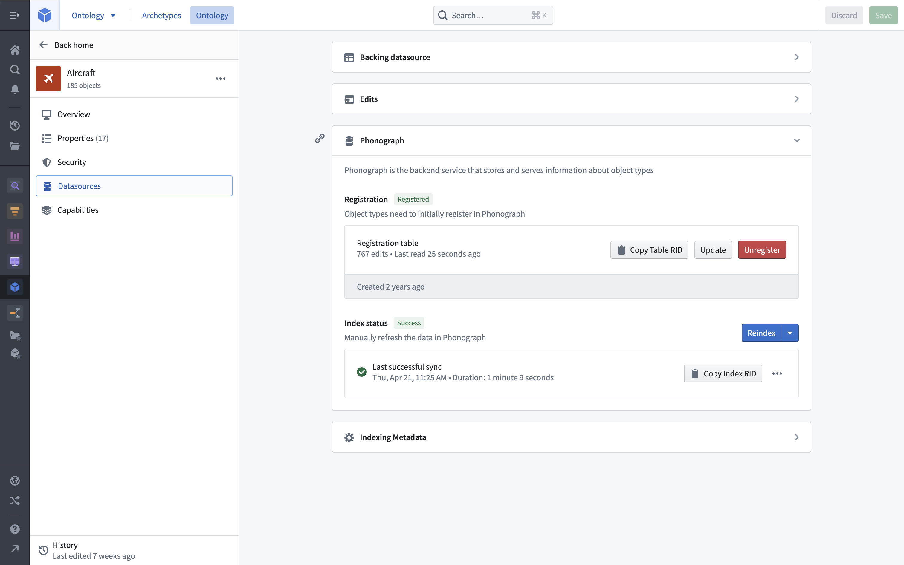
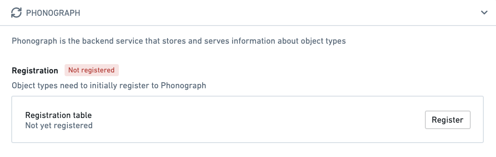
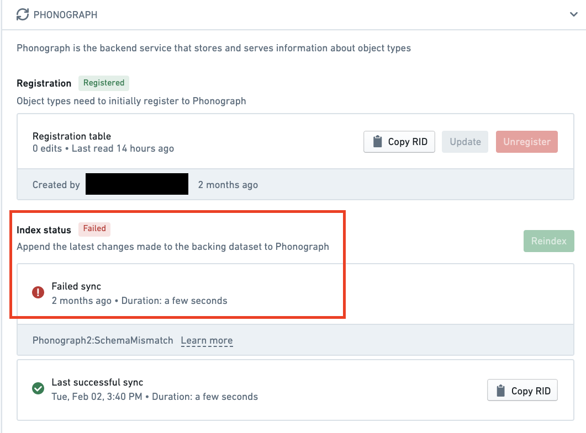

<!-- source: https://palantir.com/docs/foundry/object-databases/ · mirrored 2026-08-14 from Palantir Foundry docs -->

# Object Storage v1 (Phonograph) \[Planned deprecation]

:::callout{theme="warning" title="Planned deprecation"}
Object Storage v1 (Phonograph) is in the [planned deprecation](/docs/foundry/platform-overview/development-life-cycle/) phase of development and will be unavailable after June 30, 2026. [Migrate your Object Types and Link Types](/docs/foundry/object-backend/osv1-osv2-migration/) to Object Storage v2. Reference the `Migrate object types and many-to-many link types from Object Storage v1 to v2` intervention in [Upgrade Assistant](/docs/foundry/upgrade-assistant/overview/) for more information.
Contact Palantir Support if you have questions about the OSv1 to OSv2 migration in your workflows.
:::

This page provides an overview of the Ontology’s legacy backing store, Object Storage v1 (Phonograph). On newer ontologies and those that have completely migrated, Object Storage v2 is the only option.

## Purpose

When a datasource is added as an Ontology backing datasource or as a writeback dataset in the Ontology Manager, the datasource is registered and then indexed into Phonograph for storage. When user applications want to display object backing data, Phonograph is queried and the applications display the results.

## Registration

When a backing datasource is initially added to an object type or link type, the datasource must be registered in Phonograph. Data must be registered in Phonograph before it can be queried by or displayed in user applications.

The Phonograph section of the **Datasources** tab of an object type or link type displays whether or not the backing datasources are successfully registered in Phonograph. If an object type or link type’s backing datasources have not been successfully registered in Phonograph, a “not registered” red label will appear next to the object type or link type’s display name on the home page and in search results.

Unregistering an object type or link type’s backing datasource prevents its data from appearing in user applications and also removes the history of user data edits (stored in Phonograph). To read more about the potentially destructive changes that may be caused by unregistering a backing datasource from Phonograph, as well as actions in the Ontology Manager that require unregistering, see the [documentation on potential breaking changes](/docs/foundry/object-link-types/edit-object-type/#potential-breaking-changes). The Ontology Manager will always warn you if your changes have potentially destructive impact on edit histories or user applications.

## Index status

When updates are made to data in the backing datasource or when schema changes are made to the definition of an object type or link type, a sync will begin that reindexes the updated data into Phonograph. Once this sync, often referred to as a reindex, is complete, the updated data and schema will appear in user applications.

The Phonograph section of the **Datasources** tab of an object type or link type displays the status of the last reindex to be started. The status can be `success`, `in progress`, or `failed`. If the last reindex of the backing datasources of an object type or link type has failed, a “failed” red label will appear next to the object type or link type’s display name on the home page and in search results.

You can hover over or select the last sync for more details, including why a sync may have failed.

## Incremental and batch reindexing

In incremental indexing, only new data updates are indexed. Object Storage v1 (Phonograph) indexes new datasource transactions incrementally only if the datasource [transaction type](/docs/foundry/data-integration/datasets/#transaction-types) is APPEND or UPDATE. For SNAPSHOT transactions, OSv1 always triggers batch indexing (in which all objects are reindexed).
