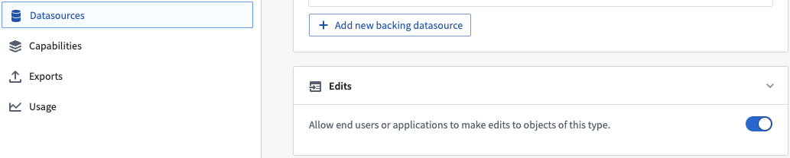
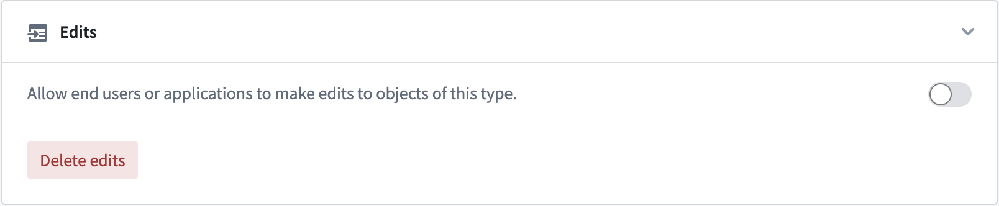
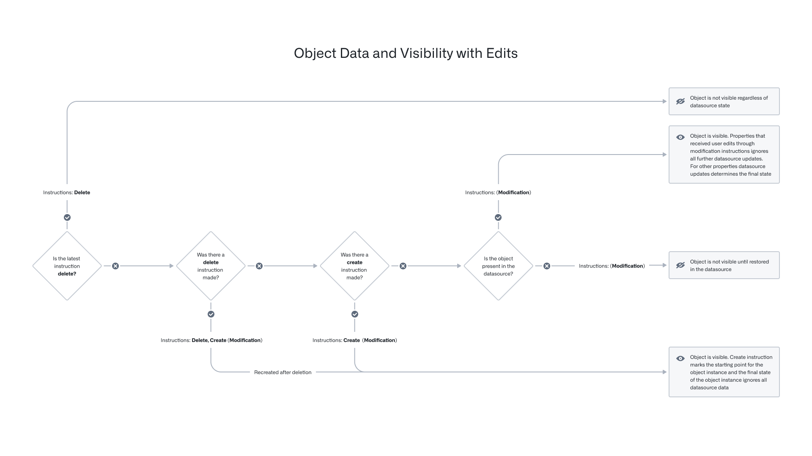
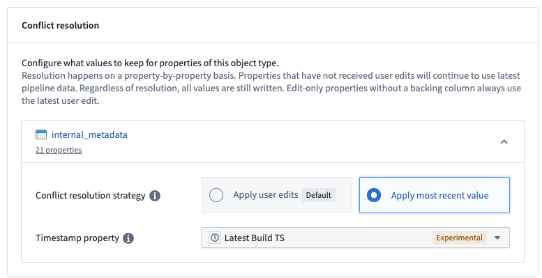
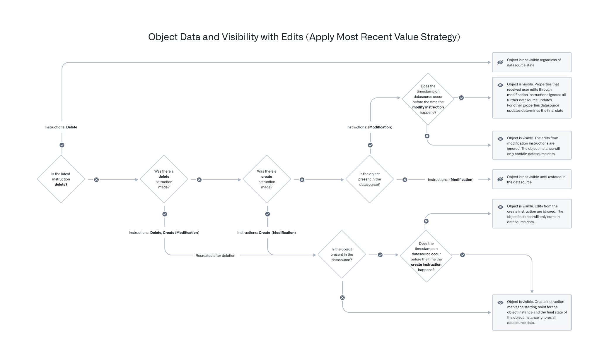

<!-- source: https://palantir.com/docs/foundry/object-edits/how-edits-applied/ · mirrored 2026-07-23 from Palantir Foundry docs -->

# How user edits are applied

User edits can be enabled and disabled using the **Edits** toggle in the **Datasources** tab of the Ontology Manager, as shown in the screenshot below.

## Edit objects via Actions

This section describes how the Ontology manages object edits with Actions.

When an Action is applied to an object, link, or object set, the data-modification logic is immediately applied to the index in the object databases and periodically flushed into a persistent store in the form of Foundry datasets owned and managed by Funnel. More information can be found in the documentation on [persistent storage of user edits](#persistent-storage-of-user-edits).

### User edits on live data

When an Action is triggered, the Actions service sends a modification instruction to the Funnel service. This instruction is stored in a Funnel-managed queue that has offset tracking to support simultaneous user edits. Object Storage v2 tracks these offsets for any object type and any many-to-many link type with join tables. The offsets are applied to the live indexed data in the object database; if an object read occurring as part of an ontology query happens after a user modification is sent, the object read is guaranteed to contain the user edits.

### How to discard/wipe/delete existing user edits

Data already containing user edits can only be updated via additional user edits. There is no mechanism to directly undo a single user edit or deletion other than to make additional user edits (for example, object actions) to update the object or to recreate the object.

In some circumstances, it may be desirable to discard all existing user edits in order to reset the state of all objects to be the same as in the input datasource. For example, you may want to delete all user edits applied during testing of an object type before releasing the object type in production.

Object Storage v2 offers a [schema migration framework](/docs/foundry/object-edits/schema-migrations/) for migrating user edits. The ["drop all edits"](/docs/foundry/object-edits/schema-migrations/#list-of-supported-schema-migrations-in-osv2) instruction can be used to discard all existing user edits on an object type. This migration instruction can be applied by clicking the **Delete edits** button in the **Edits** section of the **Datasources** tab in the Ontology Manager.

Object Storage v1 (Phonograph) does not have schema migration support, but removing the writeback dataset configuration from the object type will delete all the existing user edits and can be used as a workaround.

## Ontology entity version control

During the process of applying an Action, object type definitions and object instances are loaded for various purposes, such as Action validations, [Functions](/docs/foundry/action-types/function-actions-overview/), and Action [side effects](/docs/foundry/action-types/side-effects-overview/). Object instances may change over the course of applying an Action, so it is important to guarantee transactionality to avoid potential data correctness issues (such as applying the Action to the wrong version of an object).

The Ontology includes mechanisms for checking version consistency of both object types and object instances, with differing behaviors between Object Storage v1 (Phonograph) and Object Storage v2.

### Entity version control between front-end consumers and the Actions server

Consider the following scenario where a user loads the object property value at versions `{V1, V2, V3, ...}` in an [Action form](/docs/foundry/action-types/getting-started/#edit-parameters). The front-end consumer application calls the `/apply` endpoint of the Actions server with those object property values, but that request does not include the versions. Upon receiving this request, the Actions server loads the objects within the `/apply` endpoint at versions `{V1', V2', V3', ...}`. Note that there is no guarantee that the versions `{V1, V2, V3, ...}` loaded on the front end and the versions `{V1', V2', V3', ...}` loaded by the Actions server will always be the same.

### Entity version control within the Actions server

#### Object Storage v1 (Phonograph) \[Planned deprecation]

:::callout{theme="warning" title="Planned deprecation"}
Object Storage v1 (Phonograph) is in the [planned deprecation](/docs/foundry/platform-overview/development-life-cycle/) phase of development and will be unavailable after June 30, 2026. [Migrate your Object Types and Link Types](/docs/foundry/object-backend/osv1-osv2-migration/) to Object Storage v2. Reference the `Migrate object types and many-to-many link types from Object Storage v1 to v2` intervention in [Upgrade Assistant](/docs/foundry/upgrade-assistant/overview/) for more information.
Contact Palantir Support if you have questions about the OSv1 to OSv2 migration in your workflows.
:::

With Object Storage v1 (Phonograph), the Actions server tracks the version of a loaded object and loads the same version from the cache throughout the Action execution. When a user edit is applied in Object Storage v1 (Phonograph), the object version is included in the request. Object Storage v1 (Phonograph) then checks if any of the object versions have changed and will throw a `StaleObject` error if a change is detected.

These checks ensure general consistency within the Actions server. For example, Object Storage v1 guarantees that an Action will generate a synchronous [webhook](/docs/foundry/action-types/webhooks/), execute, validate, and apply edits on the same version of an object. Note that object changes at a property level are not checked, so user edits on irrelevant properties of an object can trigger `StaleObject` conflicts.

#### Object Storage v2

With Object Storage v2, the Actions server performs its own object version checks before posting user edits to the Funnel service, but on a limited subset of the versions collected by the server as compared to Object Storage v1 (Phonograph).

The Actions server only checks the versions of objects that are directly used to generate edits, such as the version of some object `A` that had one of its properties copied onto object `B`, and these versions are only checked against edited object versions.

This behavior reduces the frequency of `StaleObject` conflicts, with a consequence of weaker guarantees with OSv2. In Object Storage v2, the Actions service always loads objects at the same versions throughout an Action `/apply`, but does not guarantee that objects read outside of edit generation have not changed during the course of an Action.

#### Cross-backend Actions

An Action type is considered "cross-backend" if it modifies objects in OSv1 and OSv2 at the same time. In such cases, the Actions service performs checks on:

* All read and/or edited objects in OSv1, and
* All edited objects in OSv2.

## Persistent storage of user edits

All indexed data in object databases are considered ephemeral, requiring persistent storing of all Ontology data in other ways. Similarly, user edits applied through Actions also must be stored persistently. The Foundry datasources that back object types are already persistently stored in the form of Foundry datasets, restricted views, and so on.

As discussed in the [Funnel pipelines documentation](/docs/foundry/object-indexing/funnel-batch-pipelines/), the Funnel service owns and manages several Foundry datasets, including a merged dataset that combines data coming from datasources and user edits. The merged dataset is automatically built; this ensures that user edits stored in the queue are persistently stored in Foundry and that the queue is emptied in order to prevent the queue from growing too large. By default, this build job is triggered:

* Whenever there is a new data transaction in object type datasources, or
* In the absence of new data in the datasources, every 6 hours, if edits had been detected on any objects.

## Resolve conflicting user edits and datasource updates

Objects in the Foundry Ontology can be created and modified by both input datasources and user edits. When a single object (that is, a row or object with a specific primary key value) receives data from both the input datasource and user edits, these received values must be transparently resolved with a *conflict resolution strategy*.

:::callout{theme="warning"}
Deletions are not considered an edit. Once a deletion is applied, the object is no longer visible regardless of datasource state. If the object is later recreated, it will not inherit the previous edits.
:::

There are two strategies for resolving conflicts:

* [Strategy 1: Apply user edits (default)](#strategy-1-apply-user-edits-default)
* [Strategy 2: Apply most recent value](#strategy-2-apply-most-recent-value)

### Strategy 1: Apply user edits (default)

With this strategy, the final state of an object is always determined by the user edits applied to it, regardless of any future datasource updates for edited properties in the same object.

Refer to the flow chart below to determine the latest state of your objects based on user edits and datasource updates.

The table below shows how the state of a specific object would be updated after receiving user edits and input datasource updates, following the "user edits always win" conflict resolution strategy.

| Time | Current datasource row state | User edit | Final object state |  Explanation |
| --- | --- | --- | --- | --- |
| T0 | `columns = {pk_column = pk1, col1 = val1, col2 = val2}` |  | `properties = {pk_column = pk1, col1 = val1, col2 = val2}, deleted = false` |  |
| T1 | `columns = {}` |  | `properties = {}, deleted = true` | Row disappears from the datasource, and the object is no longer in the Foundry Ontology |
| T2 | `columns = {pk_column = pk1, col1 = val1, col2 = val2}` |  | `properties = {pk_column = pk1, col1 = val1, col2 = val2}, deleted = false` | Same row reappears in the datasource |
| T3 | `columns = {pk_column = pk1, col1 = val1, col2 = val2}` | Modify object: `properties = {pk_column = pk1, col2 = newVal2}` | `properties = {pk_column = pk1, col1 = val1, col2 = newVal2}, deleted = false` | User runs a `Modify object` Action |
| T4 | `columns = {}` |  | `properties = {}, deleted = true` | Row disappears from the datasource again, and the object is no longer in the Foundry Ontology |
| T5 | `columns = {pk_column = pk1, col1 = val1, col2 = val2}` |  | `properties = {pk_column = pk1, col1 = val1, col2 = newVal2}, deleted = false` | Same row reappears in the datasource, and the previous user edit is still applied to the object when the row reappears |
| T6 | `columns = {pk_column = pk1, col1 = newVal1, col2 = val2}` |  | `properties = {pk_column = pk1, col1 = newVal1, col2 = newVal2}, deleted = false` | An unedited property (`col1`) receives data update from the input datasource, and it is applied to the object |
| T7 | `columns = {pk_column = pk1, col1 = newVal1, col2 = val2}` | Delete object | `properties = {}, deleted = true` | User runs a `Delete object` Action, and the object is no longer in the Foundry Ontology |
| T8 | `columns = {pk_column = pk1, col1 = newVal1, col2 = val2, col3 = null}` |  | `properties = {}, deleted = true` |  |
| T9 | `columns = {pk_column = pk1, col1 = newVal1, col2 = val2, col3 = null}` | Create object: `properties = {pk_column = pk1, col3 = val3}` | `properties = {pk_column = pk1, col1 = null, col2 = null, col3 = val3}, deleted = false` | User runs a `Create object` Action |
| T10 | `columns = {pk_column = pk1, col1 = newVal1, col2 = newVal2, col3 = newVal3}` |  | `properties = {pk_column = pk1, col1 = null, col2 = null, col3 = val3}, deleted = false` | `col3` is updated in the input datasource but is no longer considered for the final state of the object due to the prior `Create object` Action |
| T11 | `columns = {pk_column = pk1, col1 = newVal1, col2 = newVal2, col3 = newVal3}` | Modify object: `properties = {pk_column = pk1, col2 = newVal22}` | `properties = {pk_column = pk1, col1 = null, col2 = newVal22, col3 = val3}, deleted = false` | User runs a `Modify object` Action |
| T12 | `columns = {}` |  | `properties = {pk_column = pk1, col1 = null, col2 = newVal22, col3 = val3}, deleted = false` | Row disappears from the datasource, but the object is still in the Foundry Ontology as it was last created by a user edit |
| T13 | `columns = {pk_column = pk1, col1 = newVal1, col2 = newVal2, col3 = newVal3}` | Delete object | `properties = {}, deleted = true` | Row reappears, but user runs a `Delete object` Action and the object is deleted |
| T14 | `columns = {pk_column = pk1, col1 = newVal1, col2 = newVal2, col3 = newVal3}` | Modify object: `properties = {pk_column = pk1, col2 = newVal2, col3 = val3}` | `properties = {}, deleted = true` | User runs a `Modify object` Action on a deleted object; any `Modify object` Action call will fail |

### Strategy 2: Apply most recent value

With this strategy, user edits are conditionally applied; that is, user edits are only applied if the timestamp of the user edit is more recent than the timestamp value coming from the datasource for the given object. Note that because the timestamp of each edit is compared against the unedited timestamp value coming from the datasource, it is possible for some newer user edits to apply and older user edits to not apply on the same object.

#### Configuration

Conflict resolution strategies are configured at the object type level and are only supported for OSv2 object types.

Users can configure this option in the Ontology Manager, under the **Datasources** section. Each datasource of the object type can have different resolution strategies. For example, for an object type backed by two datasources, one datasource can use `Apply user edits (default)` while the other datasource can use `Apply most recent value`. The `Apply most recent value` option requires that the datasource contains a property with the timestamp type; the date property type will not work for this option. The timestamp property is used to compare and decide whether a user edit should be applied. The timestamp property must be in Coordinated Universal Time (UTC).

#### Behavior

As soon as the `Apply most recent value` conflict resolution strategy is saved for a datasource, all user edits to properties backed by that datasource will be conditionally applied.

For each conditional edit, the resolution works by comparing the timestamp value in the backing datasource with the timestamp associated with the edit. For user edits to those properties applied *after* the conflict resolution strategy was changed, they will be conditionally applied based on the timestamp of the action submission that resulted in that edit, and any *existing* edits to those properties will be conditionally applied based on the timestamp of the conflict resolution strategy change.

The user edit is applied if the value of the timestamp property in the backing datasource is older than the timestamp associated with the user edit, otherwise the edit is ignored.

If an edit updates properties across multiple datasources, then whether those edits will be conditionally applied or always applied will be determined by the resolution strategy of the datasource that backs the property.

Refer to the updated flow chart below to determine the latest state of your objects based on user edits and datasource updates.

The following example illustrates this behavior. Assume there are two objects for a `Ticket` object type with the following data in the backing datasource, where the `Apply most recent value` option is enabled.

| Ticket ID | Title      | Timestamp                    | Priority | Type            |
|-----------|------------|------------------------------|----------|-----------------|
| 101       | Ticket One | January 1, 2010, 9:00 AM UTC |P1        | Product Bug     |
| 102       | Ticket Two |                              |P2        | Feature Request |

Suppose three actions have been run on these tickets, namely:

* Both tickets had their title set to "Ticket" at 8:30 AM on January 1, 2010.
* Both tickets had their priority set to "P0" at 9:30 AM on January 1, 2010.
* Both tickets had their Type set to "Unknown" at 10:30 AM on January 1, 2010.

Then the observed state of the two objects in the ontology would be:

| Ticket ID | Title      | Timestamp                    | Priority | Type    |
|-----------|------------|------------------------------|----------|---------|
| 101       | Ticket One | January 1, 2010, 9:00 AM UTC | P0       | Unknown |
| 102       | Ticket     |                              | P0       | Unknown |

For the ticket with Ticket ID of 101, the edit to the Title property was not applied, because that edit was created before the 9:00 AM timestamp in the backing datasource. However, the edits to the other two properties occurred after 9:00 AM, and so are reflected in the resolved objects.

For the ticket with Ticket ID of 102, there is no value for the timestamp property in the backing datasource, so all three conditional edits are applied, regardless of their associated timestamps.

#### Edit-only properties

For [edit-only properties](/docs/foundry/object-link-types/edit-only-properties/), user edits will always apply regardless of the timestamp on the input datasource.

Returning to the ticket example [above](#behavior), consider the following table:

|Ticket ID| Title      | Timestamp                    | Priority | Team (edit-only property) |
|---------|------------|------------------------------|----------|---------------------------|
|102      | Ticket Two | January 1, 2050, 9:00 AM UTC | P2       | Sales                     |

Suppose an action type, `Change team` is used to modify the `Team` property to `Recruiting`. If the `Change team` action is applied to `Ticket Two`, the team will be set to `Recruiting`. Regardless of which strategy is used for resolving conflicts, since `Team` is an edit-only property, edits will apply.

The behavior remains the same when an Action modifies both edit-only and normal properties. Normal property edits are applied based on conditions, while edit-only property edits always apply.

#### Only input datasource values considered

Note that the Ontology only compares edit timestamps against the timestamp value from the input datasource. Even if users change the timestamp property via user edits, the conditional comparison will only happen between the timestamp from the input datasource and the user edit application time.

As a result of this behavior, the timestamp property must be backed by a timestamp column from the input datasource. If the source system does not provide a timestamp value to indicate the update time of the data feed, the timestamp column of the input datasource can be modified in the data pipeline.

Returning to the ticket example [above](#behavior), consider the following table:

| Ticket ID | Title       | Timestamp                    | Priority |
|-----------|-------------|------------------------------|----------|
| 101       | Ticket One  | January 1, 2010, 9:00 AM UTC | P1       |

Suppose an action type `Change Timestamp` is used to modify the timestamp of the above ticket to `January 1, 2050, 9:00 AM UTC`.

| Ticket ID | Title       | Timestamp                                                     | Priority |
|-----------|-------------|---------------------------------------------------------------|----------|
| 101       | Ticket One  | ~~January 1, 2010, 9:00 AM UTC~~ January 1, 2050, 9:00 AM UTC | P1       |

If the `Change Priority` action is now applied to Ticket One, the priority will still be set to `P0`.
Despite the timestamp of the object shown, the comparison will only happen between the timestamp from the input datasource and the user edit application time.
