<!-- source: https://palantir.com/docs/foundry/object-edits/materializations/ · mirrored 2026-07-23 from Palantir Foundry docs -->

# Materializations

Up-to-date data is critical to many Foundry workflows. Ontology users can create **materializations** of indexed data from the Ontology that contains the latest state of each object by combining data from both input datasources and user edits.

## Use cases for materializations

The two main use cases for materializations are:

* Building downstream Foundry pipelines that require the latest state of each object including user edits.
* Enabling downloads of Ontology data containing the latest state of all objects for an object type.

:::callout{theme="neutral"}
We recommend orchestrating bulk downloads in Foundry by creating materialized datasets and initiating the downloads through existing download workflows for other Foundry datasets, such as [data exports](/docs/foundry/analytics/exporting-outputs/#data-export) and exports through [Foundry transforms](/docs/foundry/code-repositories/prepare-datasets-download/#prepare-datasets-for-download).
:::

## Create a materialized dataset

Navigate to the **Materializations** tab by toggling the [**Edits** configuration](/docs/foundry/object-edits/how-edits-applied/) in the **Datasources** tab in Ontology Manager. On the **Materializations** tab, you can create materialized object datasets or object restricted views with various configurations depending on [input datasource types](/docs/foundry/object-permissioning/managing-object-security/#object-input-data-sources). Note that Materializations will update automatically and cannot be built manually from Dataset Preview.

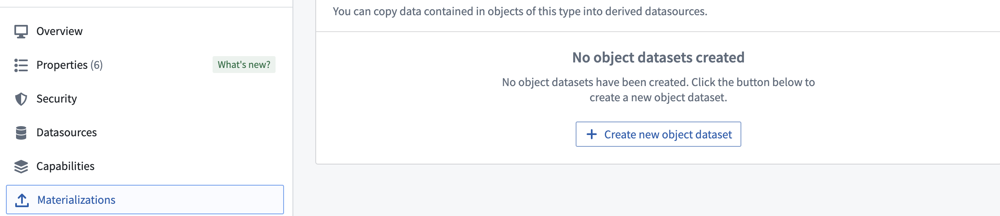

## Comparison of writeback datasets and materialized datasets

In Object Storage v1 (OSv1), also known as phonograph, [writeback datasets](/docs/foundry/slate/references-writeback/) are the equivalent of materialized datasets. Writeback datasets are required in OSv1 to enable user edits on an object type or a many-to-many link type with a join table.

Object Storage v2 (OSv2) does not require materialized datasets to enable user edits. Instead, users can enable user edits for an object type by toggling the **Edits** configuration in the **Datasources** tab in Ontology Manager. This makes materializations optional in OSv2 such that users would only need to create materializations if needed for the two main use cases mentioned above. OSv2 also allows multiple materialized datasets to be created, in case users want to materialize only a subset of the properties from an object type.

Other behavior differences between OSv1 writeback datasets and OSv2 materialized datasets are described below.

### Build schedules in writeback and materialized datasets

OSv1 (Phonograph) writeback datasets and OSv2 materialized datasets handle build schedules differently.

* In OSv1, there is no mechanism to trigger builds for writeback datasets when there are new user edits. Instead, users can create [schedules](/docs/foundry/building-pipelines/create-schedule/) for building their writeback datasets as often as they want. When there is no new data, these builds are automatically aborted to avoid using any additional compute. If no schedule is set up and the writeback dataset is not being built, the data in the writeback dataset may not be an accurate representation of the Ontology.
* OSv2 is designed to address two separate use cases differently.
  * To have user edits reflected in the materialized datasets as soon as [edits are applied](/docs/foundry/object-edits/how-edits-applied/), users can enable **automatic** propagation of user edits. This mode propagates user edits to the configured materialized datasets automatically (with a latency of a few minutes). This may incur additional cost as more frequent builds may occur depending on the frequency of new user edits.
  * If the latency of user edit propagation to materialized datasets is not critical, users can reduce costs by configuring **periodic** builds. In this mode, materialized datasets are rebuilt whenever the input datasources have new data or every 6 hours.

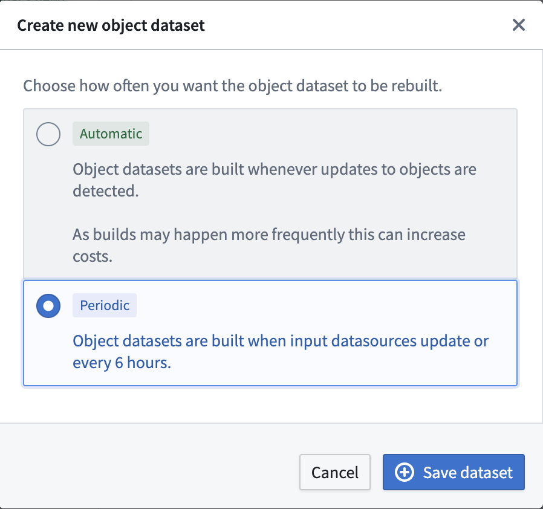

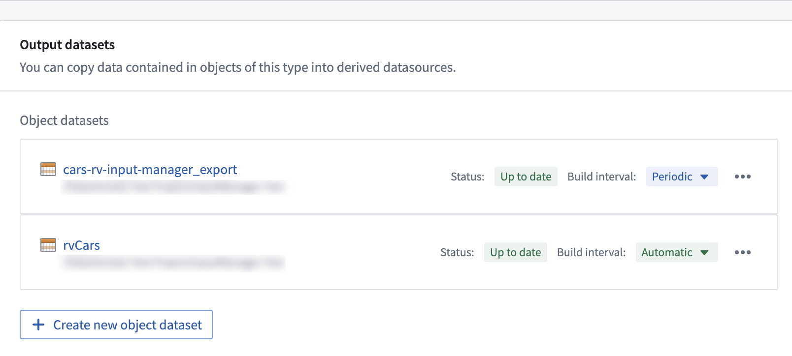

### Retention of writeback and materialized datasets

The retention of writeback and materialized datasets do not work the same.

* In OSv1, the writeback dataset acts like a regular dataset in the sense that it can be put on specific [retention policies](/docs/foundry/retention/overview/) that can be specified within the platform. This enables users to look back at the historical snapshots of the object type state if the writeback dataset is built regularly.

* In OSv2, materialized datasets are subject to a retention that is not customizable. Historical transactions are constantly deleted and only the latest snapshot is guaranteed to be available. In this case, users will have to set up a transform downstream if it is important to keep historical snapshots of object type states. This retention policy also applies in the case of object type deletion, where a downstream transform is also required to keep a materialized dataset of a deleted object type.

### Dataset schema in writeback and materialized datasets

OSv1 (Phonograph) writeback datasets and OSv2 materialized datasets relate to input datasource schemas differently.

* In OSv1, the schema of the input datasource is copied and used as the schema of the writeback dataset.
* OSv2 changes this behavior to increase the legibility of the Foundry Ontology. Since users are materializing data from the Ontology, the schema used for materialized datasets is copied from the Ontology definitions instead of relying on the backing datasource configuration. Specifically, the [API Name](/docs/foundry/object-link-types/property-metadata/#metadata-reference) metadata of each property is used as the schema of the materialized dataset. Contact your Palantir representative if you want to continue using the schema of the input datasource while [migrating from OSv1 to OSv2](/docs/foundry/object-backend/osv1-osv2-migration/) (for example, to guarantee backward compatibility for existing writeback datasets).

:::callout{theme="warning"}
`__` prefixed columns (e.g. `__is_deleted`, `__patch_offset`) in the materialized dataset are metadata columns used by Foundry for deduplication purposes and do not represent any information on the state of the object type. These columns could be renamed or removed from future releases without prior warning and should not be used in production workflows.
:::

### Restricted view materialization options

OSv1 (Phonograph) does not allow materializing [restricted views](/docs/foundry/security/restricted-views/) for object types that are granularly permissioned using restricted views as an input datasource. Users can only materialize writeback datasets that contain all the rows from the backing dataset of the restricted view input datasource. Users are then responsible for properly securing access to the writeback dataset based on their access restrictions.

In OSv2, users can configure both regular datasets or restricted views as materialized resources for object types that are [granularly permissioned](/docs/foundry/object-permissioning/configuring-rv-access-controls/#use-restricted-views-to-back-object-types) using restricted views as an input datasource, as shown below.

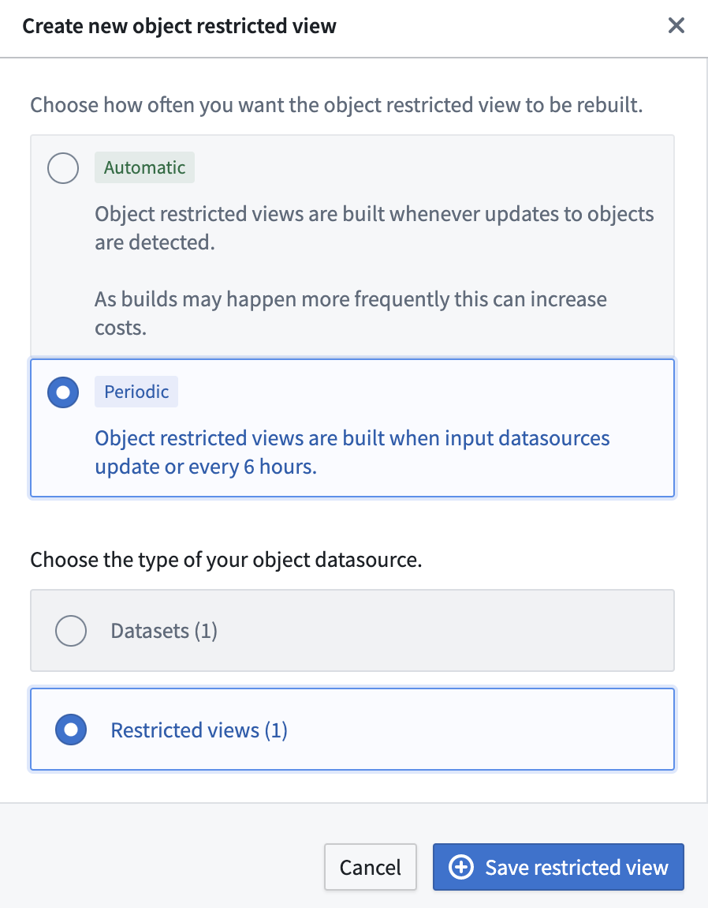

In the case of an object type having [multiple input datasources](/docs/foundry/object-permissioning/multi-datasource-objects/), users can configure their materialized datasets by selecting which input datasources they would like to materialize data from. If an input datasource is not selected, object type properties mapped from that input datasource will not be reflected in the materialized dataset. If some of the input datasources are restricted views, users have two options:

* Users can select one of the restricted view resources to materialize as a [restricted view](/docs/foundry/security/restricted-views/#restricted-views). An example configuration is shown below.

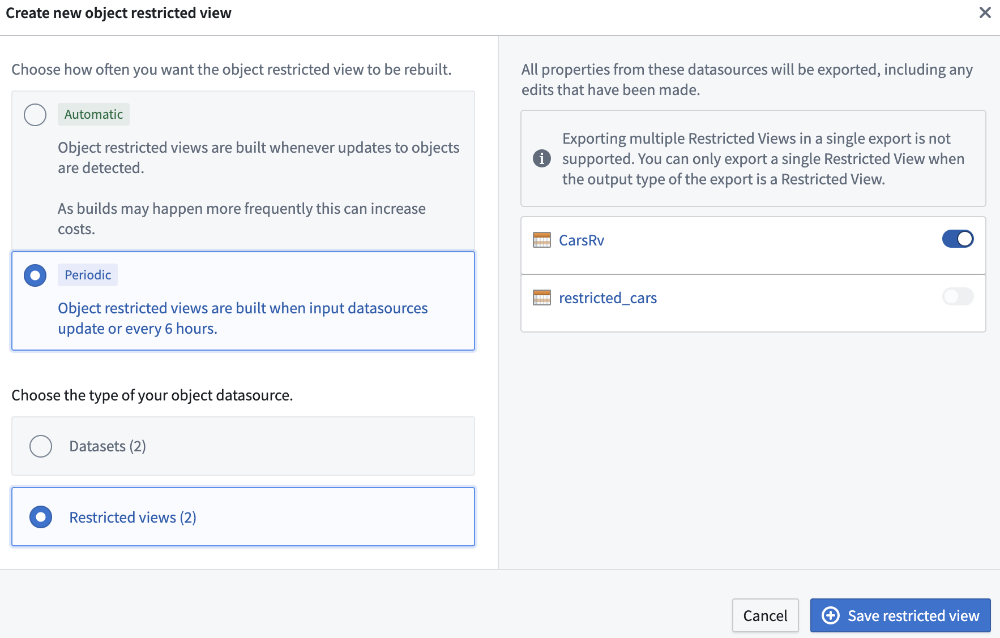

* Users can select multiple input datasources, but in that case they can only materialize ontology data as a [Foundry dataset](/docs/foundry/data-integration/datasets/). This limitation exists because different restricted view input datasources can have [different policy configurations](/docs/foundry/security/restricted-views/#restricted-view-policies), and restricted views do not currently support setting column-level policies. An example configuration is shown below.

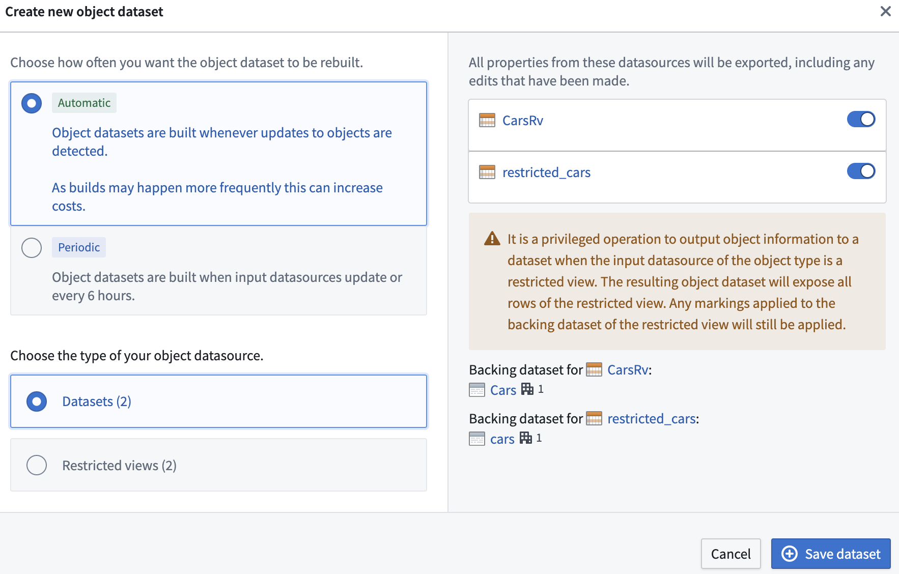

### Materializing datasets from restricted views

As stated above, both OSv1 and OSv2 allow object types with restricted views as input datasources to be materialized as regular datasets. Note that this is the only place in the platform where users can convert a restricted view to a dataset, since [restricted views cannot be used as transform inputs](/docs/foundry/security/restricted-views/). Materialized datasets do not carry restricted view policies, so creating and visualizing materialized datasets requires an elevated set of permissions.

We will use the following terms for explanatory purposes:

* **Object type:** The object type at hand.
* **Restricted view:** The restricted view backing the object type.
* **Backing dataset:** The backing dataset of the restricted view.

The diagram below demonstrates the relationship between the backing dataset, restricted view, and object type.

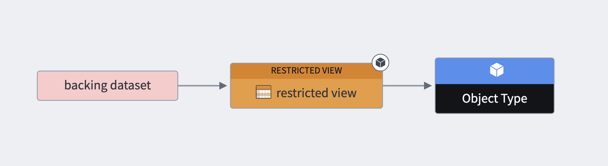

With these definitions in mind, we will now cover what a user requires to create a new materialized dataset and view its transaction. Note that these are two separate steps.

In order to create a new materialized dataset, the user requires permission to perform an identity transformation from the backing dataset to a new dataset. Security-wise, this means that a user needs to satisfy discretionary and mandatory controls on both the backing dataset and the restricted view.

If these conditions are met, the user will have the option to create a new materialized dataset, as shown in the example below.

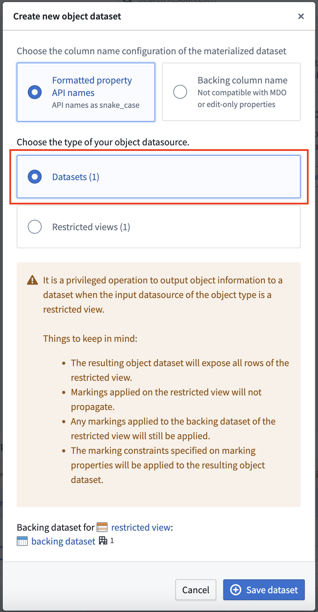

If these conditions are not met, the user will not have this option. In the following example, the user does not have the necessary discretionary controls and therefore cannot create a materialized dataset.

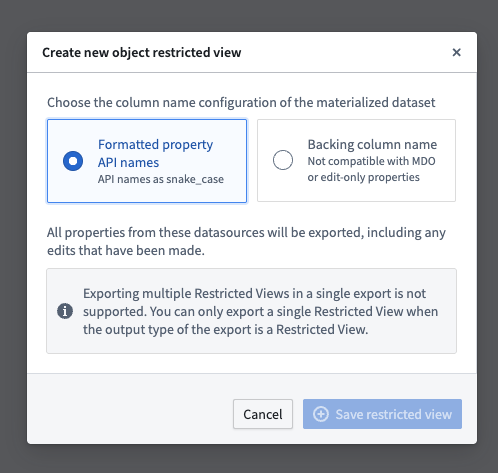

To view the materialized dataset's transaction, the user must be able to view the transaction of the backing dataset. In other words, the user must satisfy the mandatory controls of the backing dataset's transaction as well.

This is demonstrated in the following diagram, where we can see the backing dataset, restricted view, the object type, and the materialized dataset. The markings from the backing dataset, which are severed in the restricted view, get propagated to the materialized dataset. This means that the user needs to satisfy this marking to view the transaction.

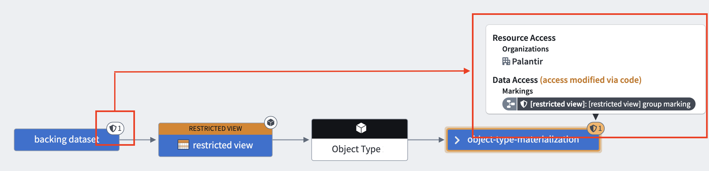

For OSv2 object types, if the object type contains properties of type [mandatory control](/docs/foundry/object-link-types/mandatory-control-properties/), the materialized dataset also requires the user to satisfy all mandatory controls on `Allowed markings`, `Allowed organizations` and `Max classification`. Provenance is carried over from the backing dataset as described above, and the mandatory controls defined at the object type are also enforced for object types containing properties of type mandatory control.

Below is a diagram of a backing dataset with one marking, a materialized dataset with two markings coming from the backing dataset, and a marking that is configured in the object type.

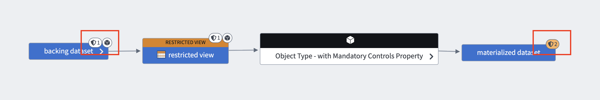

The backing dataset contains the following marking:

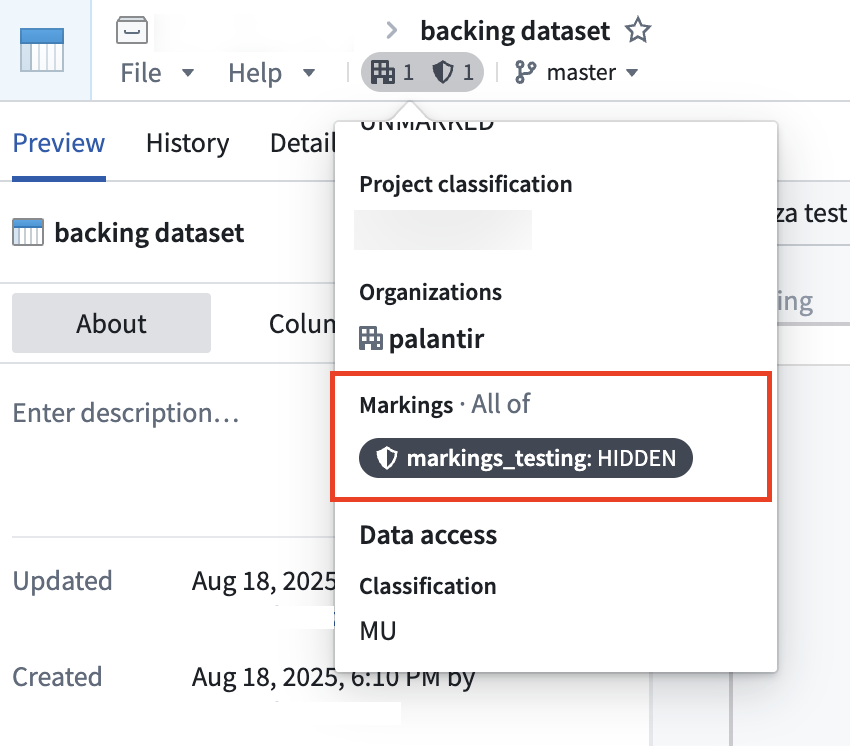

In the object type configuration, we can configure a property of type mandatory control with another marking, as shown below.

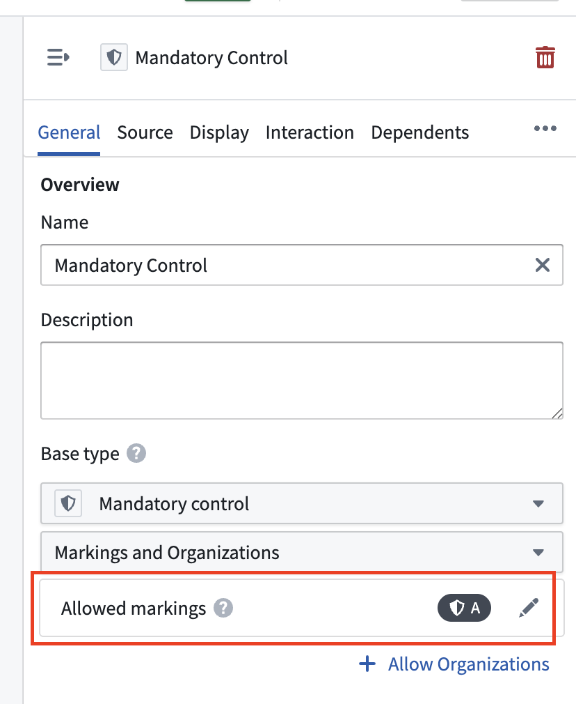

As a result of this configuration, the materialized dataset will carry provenance from both the backing dataset and the object type, which contains a property of type mandatory control.

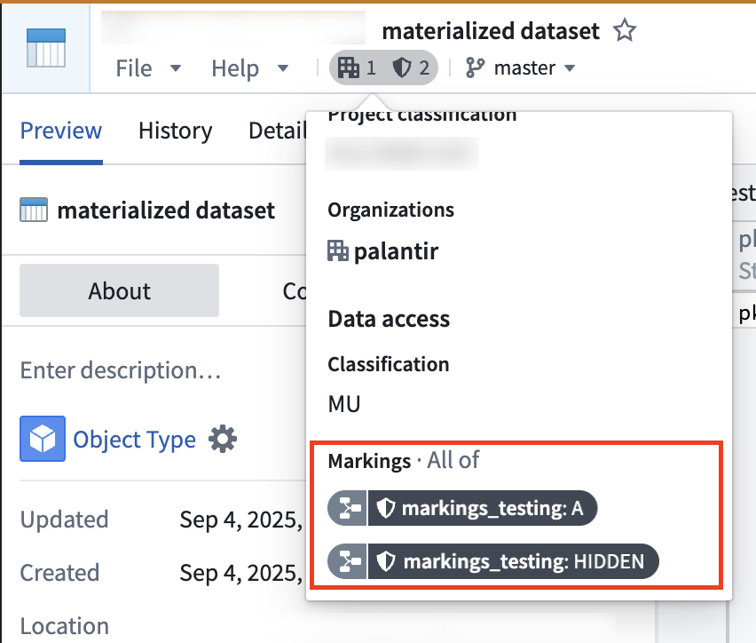

### Materializing datasets from restricted view restrictions

You cannot configure a materialization dataset if a restricted view in OSv2 contains any of the following policies:

1. If the restricted view contains a condition that references a user's mandatory controls and is applied to a string property. Instead, you must convert the string property in your ontology to a [mandatory control property](/docs/foundry/object-link-types/mandatory-control-properties/), ensuring that you can configure a maximum [Classification-based Access Control](/docs/foundry/security/classification-based-access-controls/) or [mandatory marking](/docs/foundry/security/markings/) set.
2. If the restricted view has authorized group ID conditions.
3. If the restricted view datasource has conditions that directly reference [organizations](/docs/foundry/security/orgs-and-spaces/#organizations) or markings as static values. Instead, you must ensure that the organization and marking granular conditions reference mandatory control properties and not string properties or static values.

### Branching

Materializations can be used with Global Branches with the following limitations:

* Materializations cannot be created on a branch.
* Materializations cannot be edited on a branch.

Changes made to an object type that has an associated materialization will be indexed in a branch. Any updates from that branch will be written to the materialized dataset or restricted view. Deleting an object type or removing it from a branch will also delete the branch in the materialized dataset. Due to limitations with restricted views, materialized restricted view branches will not be deleted. A solution to this limitation is currently under development.
