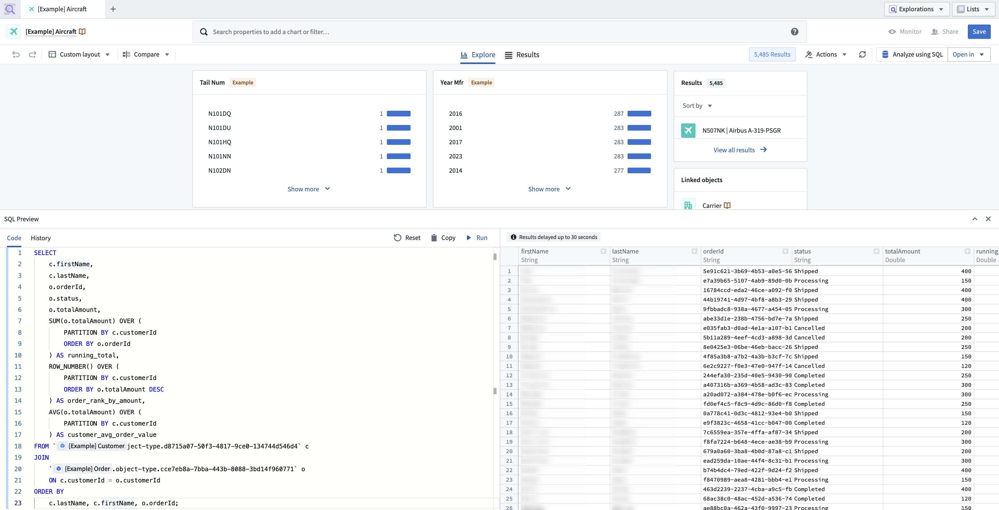
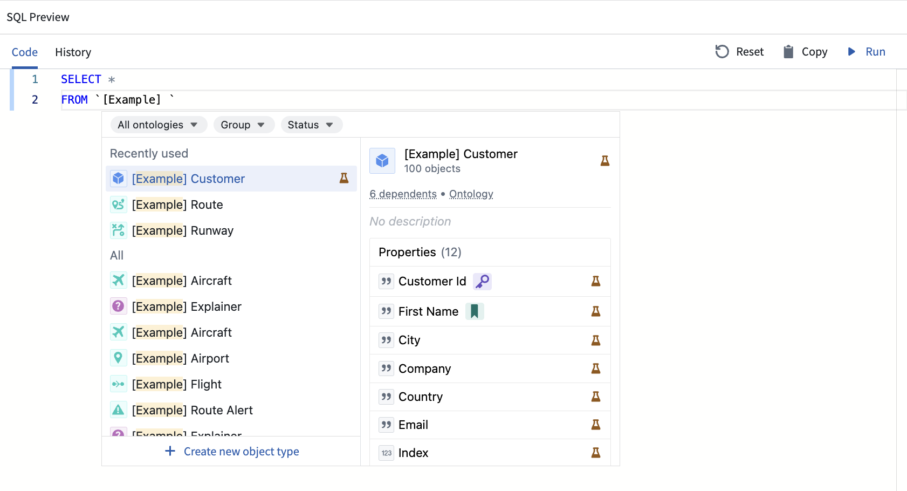
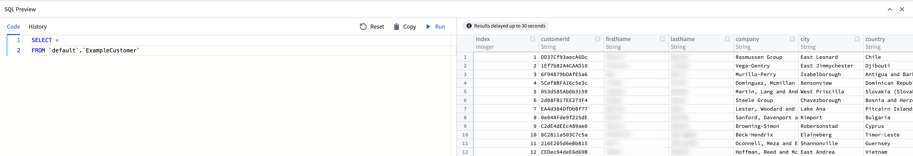
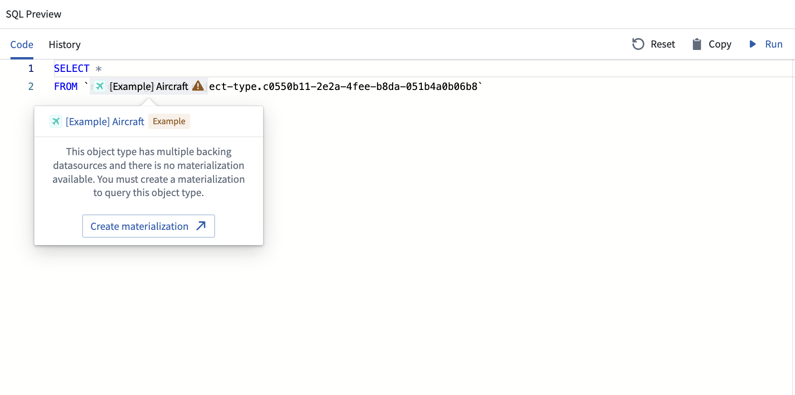

<!-- source: https://palantir.com/docs/foundry/object-explorer/analyze-sql/ · mirrored 2026-08-22 from Palantir Foundry docs -->

# Analyze objects using SQL \[Beta]

:::callout{theme="neutral" title="Beta"}
Ontology SQL support is in the [beta](/docs/foundry/platform-overview/development-life-cycle/) phase of development and may not be available on your enrollment. Functionality may change during active development. Contact Palantir Support to request enabling Ontology SQL.
:::

Use the **Analyze using SQL** feature to view a quick analysis of object types. This feature consists of a SQL "scratchpad", where you can run read-only SQL queries. Similarly to [Dataset Preview](/docs/foundry/sql-warehousing/sql-console/), it supports the following features:

* Autofill for object type RIDs
* Search for other object types within backticks ( \` ) to perform efficient `JOIN` queries
* Use editor-friendly features such as keyboard shortcuts to run highlighted queries
* Output a preview table for results of the executed SQL query
* Resize columns and the bottom panel to fit your preferences

Follow the steps below to use analyze using SQL:

1. Open an exploration.
2. Select **Analyze using SQL** in the top right menu to open the adjustable preview panel.
3. In the **Code** tab, write a read-only query on the dataset.



You can search for any object type in your query by typing its name. An autocomplete window will appear, allowing you to quickly select and autofill the full RID of the object type.



Alternatively, you can use the object type's API name with the following syntax:

```sql
`ontologyApiName`.`objectTypeApiName`
```



To query a many-to-many link type, you can use the link type's RID enclosed by backticks (`` `RID` ``).

## Requirements

Analyze using SQL works by querying the backing datasource or the materialization of an Ontology entity. Note the following requirements:

* Ontology entities with edits disabled must have a singular datasource.
* Entities with edits enabled, edit-only properties, or multiple datasources require a materialization.

The code editor will display a warning if you attempt to query Ontology inputs that do not meet these requirements.



:::callout{theme="neutral"}
Queries cannot mix tabular sources (such as datasets, tables, or restricted views) and Ontology inputs within the same query.
:::

## Data freshness

For objects with edits enabled, analyze using SQL will query the entity’s materialization. This means that recent changes such as edits or actions performed on objects may take up to 30 seconds to appear in the query results. The code editor displays a reminder about this data freshness window above the output table.

## Compatibility

The SQL engine supports the **Spark SQL** dialect. In Spark SQL, identifiers such as table names should be quoted using backticks ( \` ) rather than single or double quotes.

The example below demonstrates this syntax:

```sql
SELECT column_name FROM \`ri.ontology.main.object-type...\`;
```

For more information on the Spark SQL dialect and its syntax, refer to the [official Spark SQL documentation ↗](https://spark.apache.org/docs/latest/sql-ref.html).

## Query execution details and limitations

1. Each query runs on the entire dataset and uses the same compute backend as [Contour](/docs/foundry/contour/overview/).
2. Each query will return a maximum sample of 1,000 rows.
3. Usage for SQL console will be attributed at the dataset level in [resource management](/docs/foundry/resource-management/overview/), under the source labeled **Contour**.
