<!-- source: https://palantir.com/docs/foundry/object-explorer/configure/ · mirrored 2026-08-22 from Palantir Foundry docs -->

# Configure Object Explorer

### Customizable object type Groupings on Home Page

To create and add an object type to a group, visit the object type's [metadata widget](/docs/foundry/object-link-types/create-object-type/#add-metadata-for-a-new-object-type) in the Ontology Manager. Note that you must have editor permission on the Ontology to create and add an object type to a group.

If there are custom groups configured, any non-hidden object types that do not belong to a group will be placed in a group at the bottom of the page called “Other”.

### Linking to object view from Actions success toast

Once an Action has been successfully applied, the success toast (pop-up confirmation message) can be configured to display a hyperlink to the object view for the object instance that has been created or modified. This provides quick access to the object view for newly-created or modified objects.

To configure the success toast in this way, you will need to add a new type class (see code below) to the Primary Key parameter of the relevant *create object* Action or to the Object Reference List parameter of the relevant *modify object* Action. The type class can be added using the Ontology Editor app, which requires you to have ontology editing permissions.

```yaml
kind: "actions"
name: "view_object_with_type:<OBJECT_TYPE_ID>"
```

The following example shows how to add a success toast that links to the object view for a newly-created object instance.

1. The Ontology Action “Create New Aircraft” allows us to create a new Aircraft object instance.

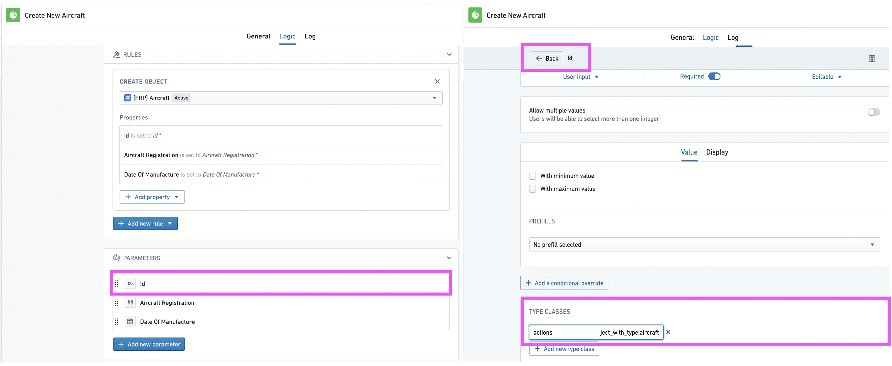

2. In the pop-up menu, input the relevant information and then select “Submit”. In this case, an Aircraft object instance with Id of `187` and Aircraft Registration of `Q-AHE` will be created.

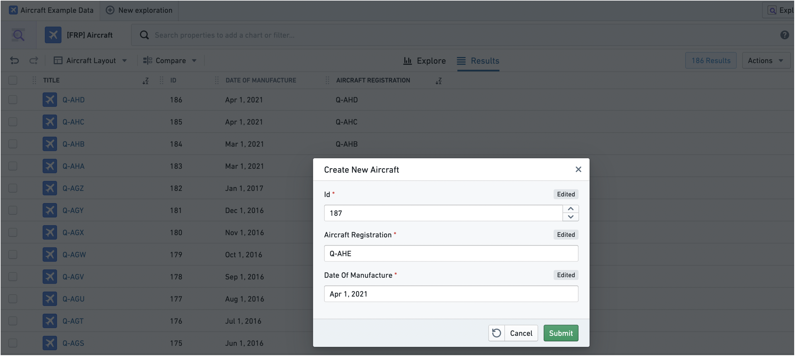

3. Now that we have added the type class described above on the Primary Key parameter, the success toast will display a hyperlink to the newly-created object instance `Q-AHE`. Clicking on the hyperlink will bring us to the object view of this object instance.

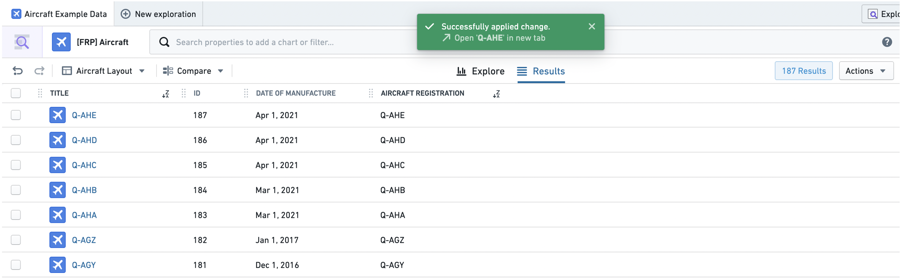

### Hiding Actions in Object Explorer

Actions will automatically be shown in three places across Object Explorer as described in the [action type documentation](/docs/foundry/action-types/use-actions/). To hide an Action of an object type, add the `hubble-oe:hide-action` type class to the Object Reference List parameter in Ontology Editor app. You will need to have access to edit the ontology to do this.

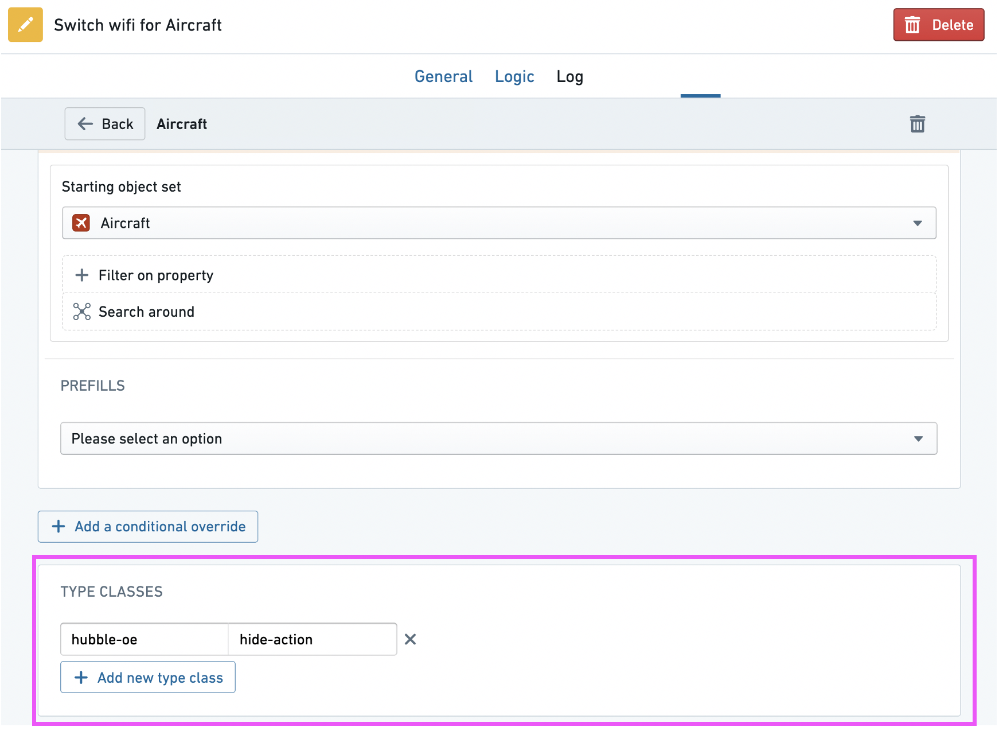

## Actions on a Dynamic Object Set

:::callout{theme="warning"}
This feature is still in development and is subject to deprecation *without* an automatic migration. Thus, using it means taking a risk that you will need to manually migrate your actions in the future. If you plan to use this particular feature, contact your Palantir representative before doing so.
:::

In some cases, you may want to use the results of an exploration as a dynamic object set, rather than a static object set. Dynamic object sets are saved as the representation of the filters applied. As such, when new data matches (or does not match) those filters, the object set will be updated.

The most typical use case of this feature is to add a reference to a dynamic object set as a property value on an object instance.

The following example shows how to create an action that allows you to assign a dynamic set of `Aircraft` objects to an `Airline` object, based on the Aircraft Manufacturer's Serial Numbers (MSNs).

1. Ensure that the `Airline` object type has a `String` property (in this case `Aircraft Set`) where you can add a reference to a set of "Aircraft" objects as a value. Enable value formatting for this property, and select **Resource RID** from the dropdown. This way, the object set RIDs assigned to this property will appear as a link to the object set in Object Explorer.

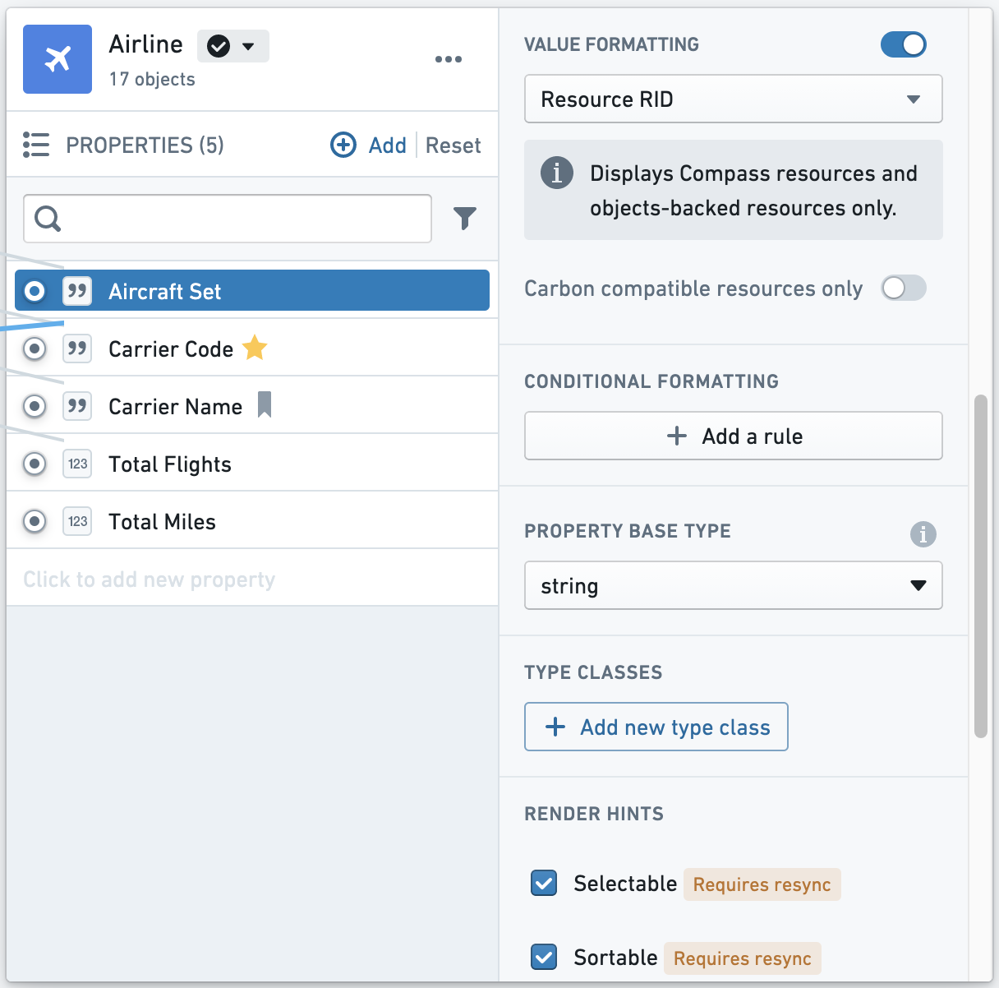

2. Now you are ready to create the action. On the action, add a **Modify Object** rule on the `Airline` object type's `Aircraft Set` property.

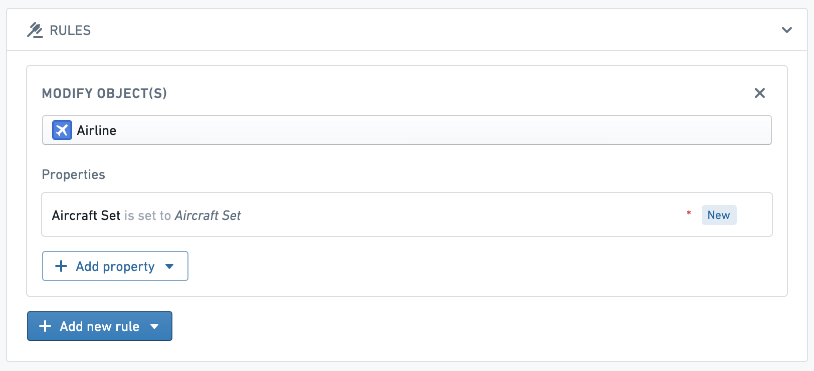

3. On the `Aircraft Set` parameter, add the following type class, where `<OBJECT_TYPE_ID>` is the object type ID of the object type you want this action to appear as an option for in the exploration view (in this case, the `Aircraft` object type).

```yaml
kind: "hubble-oe-object-set-rid"
name: <OBJECT_TYPE_ID>
```

4. Also on the `Aircraft Set` parameter, add the following type class, where `<RESOURCE_RID>` is the RID of a folder that contains the correct permissions you want to grant to the dynamic object sets. Note that the object sets are not exposed in a Project and are not searchable - this RID is only used to specify what permissions the saved object sets should receive.

```yaml
kind: "hubble-oe-security-rid"
name: <RESOURCE_RID>
```

5. Once the action has been created, navigate to an exploration on `Aircraft` objects. As an example, we might want to assign all `Aircraft` with an MSN between 5,025 and 5,050 to Frontier Airlines. To do so, filter down to those objects and select the newly created action from the Actions dropdown.

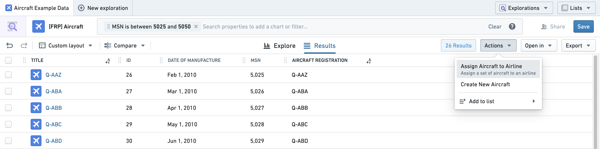

This will automatically create a dynamic object set for your current exploration and assign it to the `Aircraft Set` property on the `Airline` object you select from the dropdown.

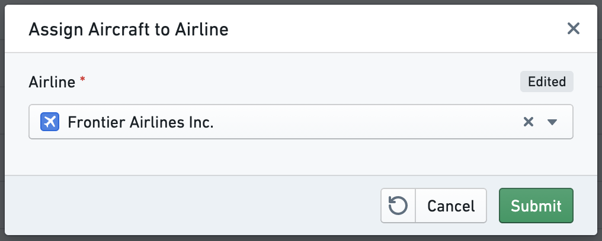

6. Now, a link to the set of `Aircraft` with an MSN between 5,025 and 5,050 will appear in the `Aircraft Set` property on the "Frontier Airlines Inc." object. If any new `Aircraft` with an MSN in this range are added to the ontology or any of the `Aircraft` currently in the set are removed from the ontology, the set will automatically be updated.

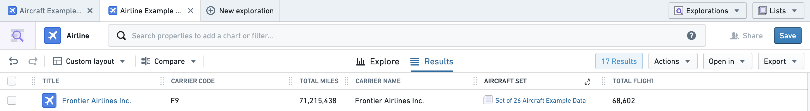

7. Using a Linked Objects Exploration widget, you can see the contents of this dynamic object set by visiting the Object View for "Frontier Airlines Inc.":

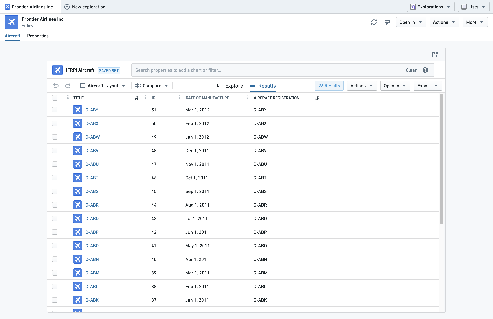

When configuring this widget, set the `Initial Exploration` to **From Object Set RID Property** and the `Object Set RID Property` to **Aircraft Set**.

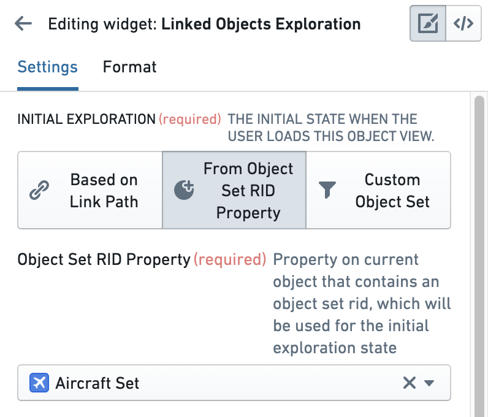

### Default Layout Administrative Users

A user who belongs to the `hubble-exploration-admins` multipass group, or who has the `Object Exploration Admin` application permission in Control Panel, can rename, delete, or save default layouts for object types. The layout includes any changes that have been made to the results table configuration. If you are an admin user and wish to set a layout as default for all users, under **Set as default layout** tick the **For all users** checkbox when saving the layout, as seen in the image below.

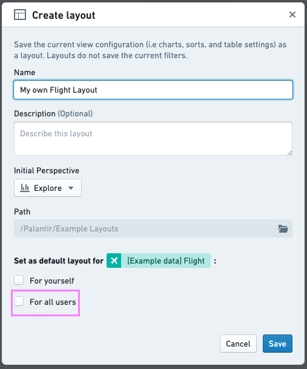
