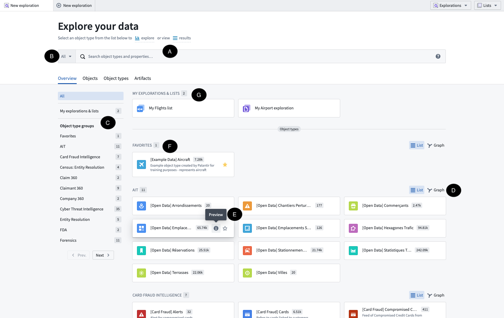
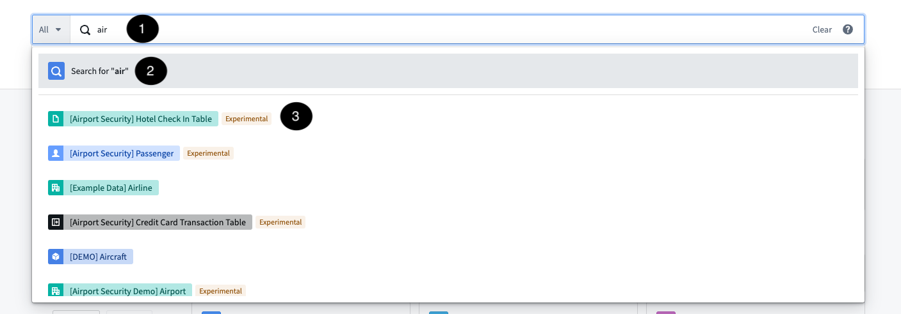
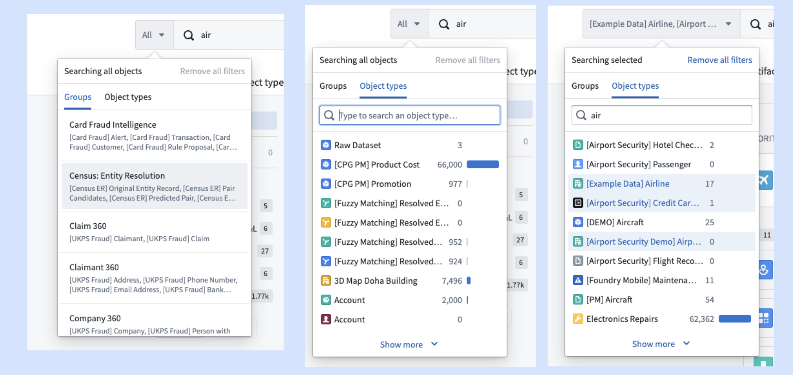
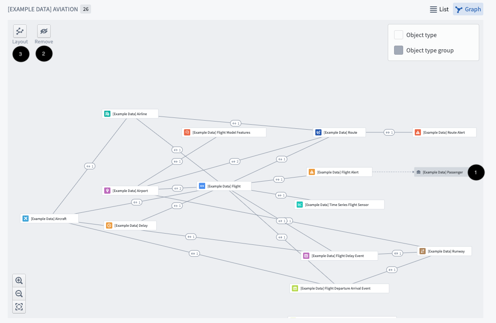
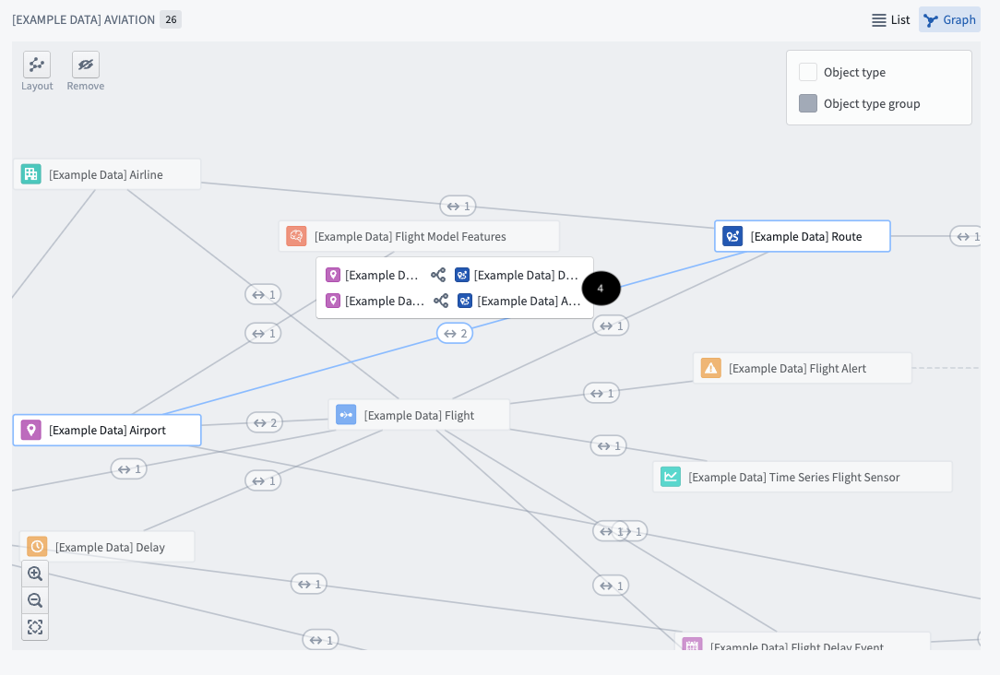
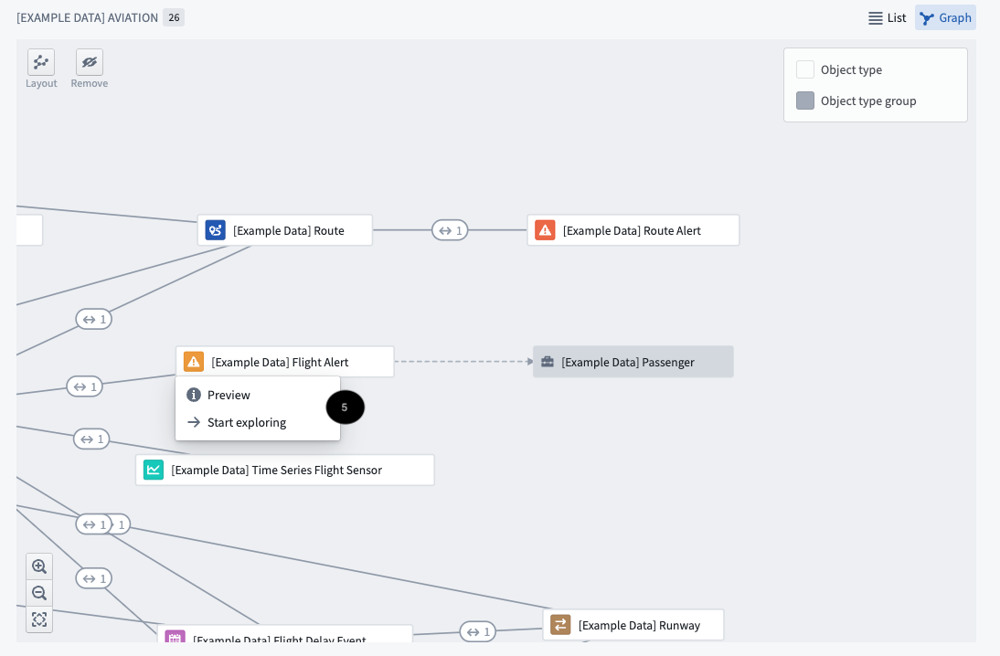
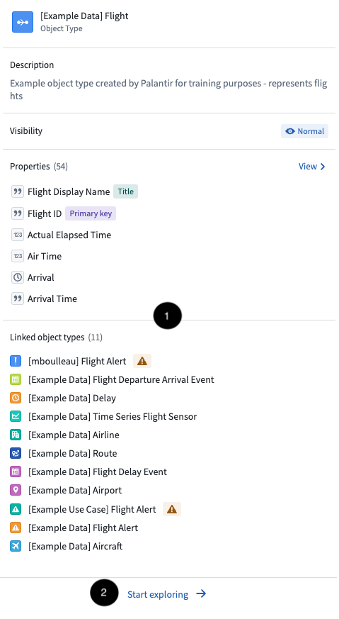

<!-- source: https://palantir.com/docs/foundry/object-explorer/getting-started/ · mirrored 2026-08-22 from Palantir Foundry docs -->

# Getting started

The home page below is shown when opening Object Explorer. It is an orientation hub where one can start exploring objects, either with a specific question in mind or to discover possible object types to explore.

From this view, user can perform the following primary actions:

* Searching across everything in the objects realm of the platform from the search bar **(A)**.
* Exploring a group of object types **(B, C, D)**.
* Previewing a specific object type **(E)**.
* Selecting a specific object type for exploration **(F)**.

## Global search bar (A)

The global search bar performs searches across all of the Ontology. It can be used to search for individual objects, object types, saved explorations, or modules (objects-backed applications).

:::callout{theme="warning"}
If the Ontology contains more than 250 object types that a user may discover, the keyword search will be limited to the first 250 object types. To search a specific object type or a group of object types you must leverage the functionality described [below](#group-exploration-b-c-d).
:::

These searches bring back results where the search terms **(1)** match the following:

* The titles and/or metadata (e.g. name, description, etc.) of object types, property types, saved explorations.
* Any title or property of individual objects.

Some matches, namely object type and property type results, will be shown immediately as type-ahead results **(3)**. To see all matches, click the first option **Search for...** **(2)** to be redirected to the [search results page](/docs/foundry/object-explorer/search-objects/).

You can learn more about search syntax for the search bar in the [search syntax guide](/docs/foundry/object-explorer/search-syntax/).

## Group exploration (B, C, D)

All object types accessible to a user are displayed under the search bar in [configurable object groups](/docs/foundry/object-explorer/configure/). Use the side navigation **(C)** to select and navigate to a group.

### Search with object type groupings (B)

Object type groupings are also reflected in the global search bar. Preconfigured groups are available in the left side tab, and custom groups can be quickly configured under **Object types**. Selecting an object type group here allows you to perform searches on a more refined set of object types before selecting one for exploration.

### Explore object type groups on a graph (D)

The graph is designed to help users explore the Ontology and understand the connections between the object types within a specific group.

Click on the **Graph** icon to view the group graph, which displays the links within the object types in the group and links to other object type groups **(1)**. In this view, you can also remove the object type groups **(2)** and change the layout of the graph **(3)**.

Click on a link symbol (<->) to show the type of links between the object types **(4)**.

Select a single object to view a menu **(5)** that allows you to explore the [object type preview](#preview-object-types-e) or start an exploration.

## Preview object types (E)

Click on an object preview to access a quick view of an object type (without moving into the more comprehensive exploration page). In the preview, find information about the object type **(1)**, including the description, properties, and linked object types. Click **Start Exploration** **(2)** to start a new Exploration of the object type.

### Add object type as favorite (F)

Object types can be added as a favorite by clicking the star icon on their card **(1)**. Favorites show up in a dedicated group at the top of the side navigation.

:::callout
Favorites will also be shown in the full list of “All object types” at the bottom of the interface.
:::

### Explorations & lists (G)

Saved explorations and lists will appear at the top of the Home page for easy accessing. They can also be found in the **Artifacts** tab.
