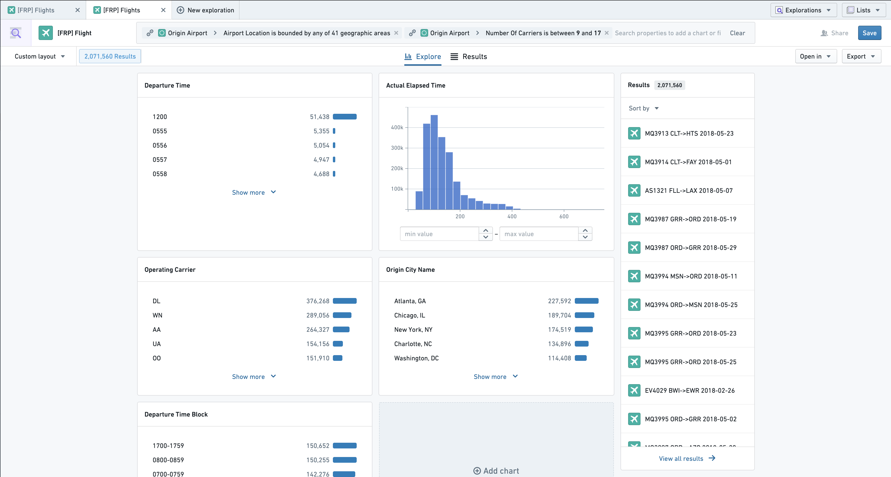

<!-- source: https://palantir.com/docs/foundry/object-explorer/pivot-linked/ · mirrored 2026-08-12 from Palantir Foundry docs -->

# Pivot to explore linked objects

While performing an exploration, it is possible to shift the main object type of your exploration to any linked object type. Let’s look at this through a specific example below.

How do I find all flights departing in the next 30 days from large airports in the Eastern United States?

Notably, it is possible to achieve this by starting with an exploration of **Flights**, and filtering on the attributes of their linked airports [Filtering on Linked Properties](/docs/foundry/object-explorer/explore-charts/#charts-on-linked-objects). That said, another way to answer this question is by starting with an exploration of **Airports**, and filtering these airports to only those in the Eastern US with a high number of unique carriers:

From here, we now want to **pivot** to the associated **Departing Flights**. We can do so by clicking on this option in the “Linked Objects” section in the bottom-right. Doing so will change the main object type of our exploration to be **Flights**, and filter us to only those flights departing from the large, eastern airports that we had filtered down to previously:

The **results** of my exploration above are now no longer the Airports, but are instead the Flights (as you can see from the preview panel to the right). It is possible to pivot through multiple links, thus allowing you to flexibly explore across the ontology.
