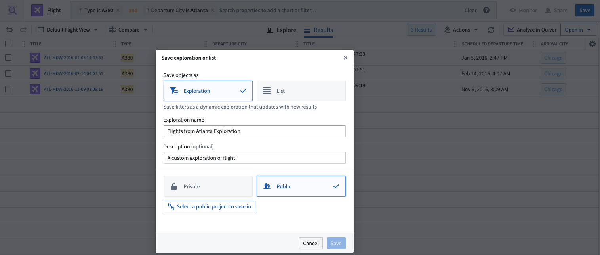
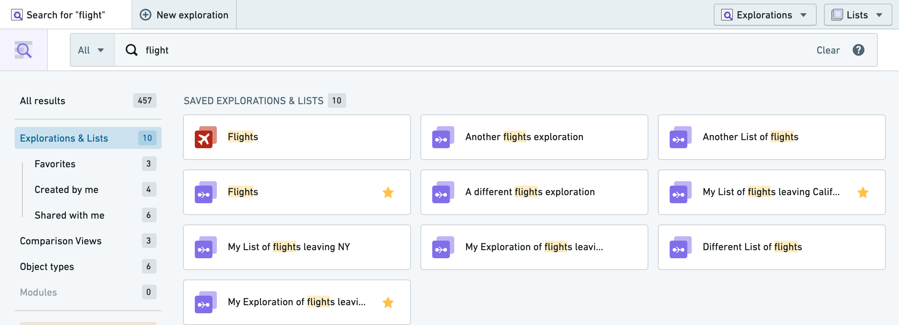
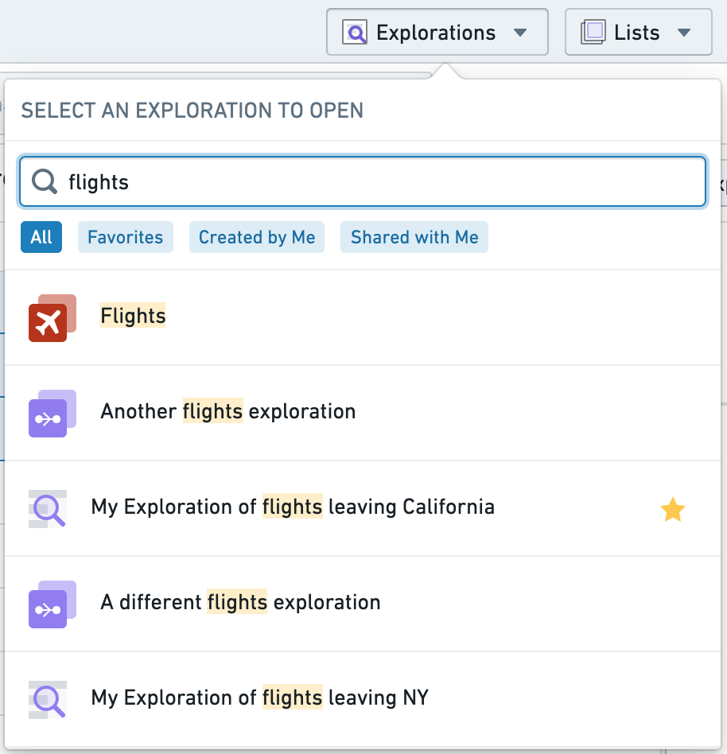
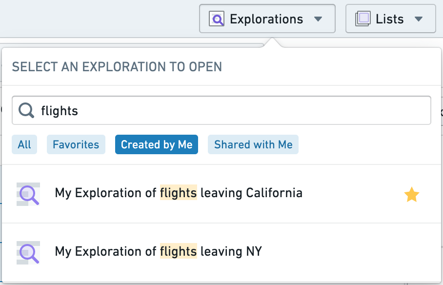

<!-- source: https://palantir.com/docs/foundry/object-explorer/save-explorations/ · mirrored 2026-08-12 from Palantir Foundry docs -->

# Save explorations

You can save and share your work in Object Explorer as an **Exploration**. A saved exploration allows you to revisit the same set of search parameters while retaining the applied filters and the configured layout.

### Saving an exploration

To save an exploration, select the blue **Save** button in the top-right of the screen. You will also be prompted for some metadata information to save such as a title for your exploration.

Explorations can either be saved as **Private** or **Public**.

* If you choose **Private**, the exploration is saved into the Explorations folder in your home folder, and by default, is only accessible to you.
* If you choose **Public**, you will be prompted for a location to save the exploration. The exploration will then be accessible to anyone who has access to the location in which you save the exploration.

:::callout{theme="neutral"}
The configuration of your enrollment might prevent saving files in home folders. In this case, the option to save private explorations will also be disabled.
:::

Sharing your exploration will not share access to the underlying objects, so any given viewer will need to have the appropriate role for the data in addition to access to the saved exploration itself.

### Accessing a saved exploration

Saved explorations will show up in your [Search Results](/docs/foundry/object-explorer/search-objects/) if you use the global search bar on the [Object Explorer Home Page](/docs/foundry/object-explorer/getting-started/).

You can also access saved explorations via the **Explorations** dropdown on the top navigation bar. The dropdown menu also has a built-in text search and common filter options to further narrow down the explorations displayed.

        
