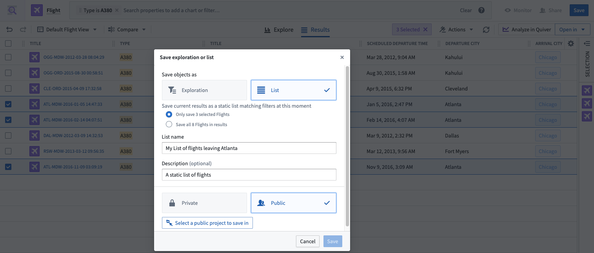
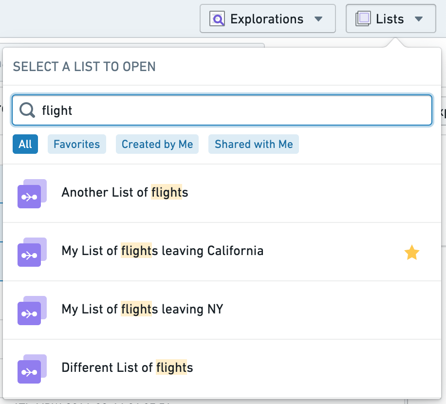
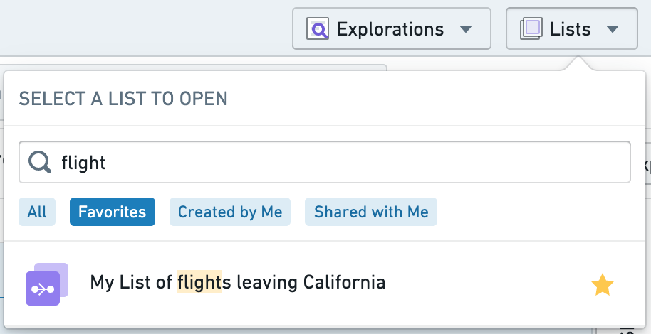

<!-- source: https://palantir.com/docs/foundry/object-explorer/save-lists/ · mirrored 2026-08-12 from Palantir Foundry docs -->

# Save lists

You can save and share the results of your explorations in Object Explorer as a **List**. A saved list allows you to revisit a static list of objects; the saved list will not change unless manually updated.

### Saving a list

To save a list, select the blue **Save** button in the top-right of the screen and then select **List** in the dropdown menu. You will also be prompted for some metadata information to save such as a title for your list. You can either save the complete list of objects in bulk or save a specific selection of objects by manually ticking each row in the results view.

Lists can either be saved as **Private** or **Public**.

* If you choose **Private**, the list is saved into the Explorations folder in your home folder, and by default, is only accessible to you.
* If you choose **Public**, you will be prompted for a location to save the list. The list will then be accessible to anyone who has access to the location in which you save the list.

:::callout{theme="neutral"}
The configuration of your enrollment might prevent saving files in home folders. In this case, the option to save private lists will also be disabled.
:::

Sharing your list will not share access to the underlying objects, so any given viewer will need to have the appropriate role for the data in addition to access to the saved list itself.

### Accessing a saved list

Saved lists will show up in your [Search Results](/docs/foundry/object-explorer/search-objects/) if you use the global search bar on the [Object Explorer Home Page](/docs/foundry/object-explorer/getting-started/).

You can also access saved lists via the **Lists** dropdown on the top navigation bar. The dropdown menu also has a built-in text search and common filter options to further narrow down the lists displayed.

        
