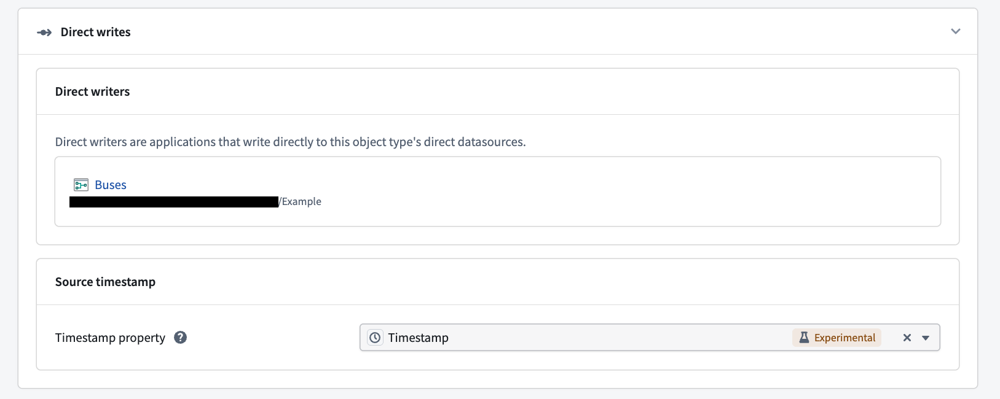
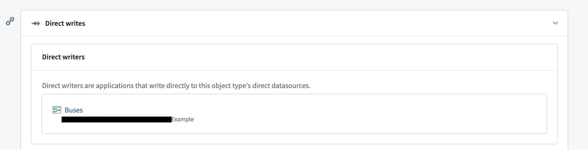
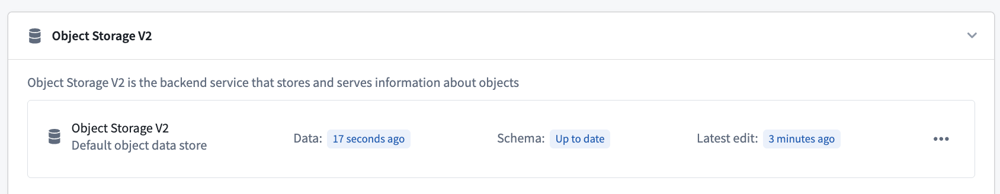
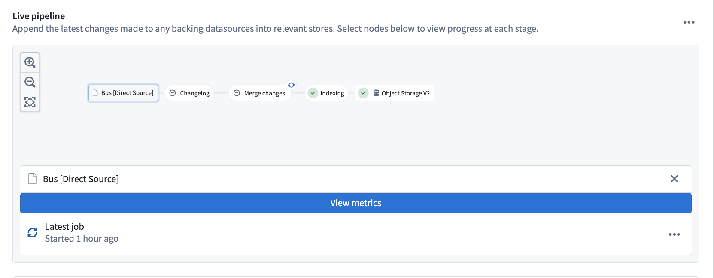
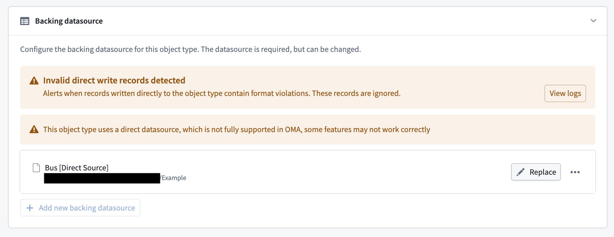

<!-- source: https://palantir.com/docs/foundry/object-indexing/direct-datasources/ · mirrored 2026-08-06 from Palantir Foundry docs -->

# Direct datasources \[Beta]

:::callout{theme="neutral" title="Beta"}
Direct datasources are in the [beta](/docs/foundry/platform-overview/development-life-cycle/) phase of development and may not be available on your enrollment. Functionality may change during active development.
:::

Direct datasources provide low-latency writes into the Ontology, including [edits](/docs/foundry/object-edits/overview/) on object types backed by stream-based data. They allow data applications to write directly to the Ontology. Currently, only Pipeline Builder is a supported writer application.

Direct datasources trade throughput for more robust Ontology writing capabilities, including user edits on streams and time-based ordering. They work best for workflows that require low-latency for both data and edits, such as edits on streaming object types, or batch object types with small, frequent incremental builds where the end-to-end indexing latency from a source transaction to an object appearing in the Ontology is unacceptable.

## Configure a direct datasource

Direct datasources are currently configured only in Pipeline Builder. Review the guidance in the [Pipeline Builder documentation](/docs/foundry/pipeline-builder/outputs-add-ontology-output/#enable-direct-datasources-beta) for more information.

Once deployed, the object type appears in [Ontology Manager](/docs/foundry/ontology-manager/overview/), and its objects are viewable in [Insight](/docs/foundry/insight/overview/) and [Object Explorer](/docs/foundry/object-explorer/overview/).

## Source timestamp property

You can optionally configure a **source timestamp property** to enable time-based ordering. The source timestamp property is a user-supplied timestamp property that should represent the time an object was created or updated. Its value is used to drop out-of-order direct writes. If a write for an object arrives with a source timestamp value earlier than the object's existing value, the write is dropped.

Time-based ordering only applies to writes submitted after the source timestamp property is configured. To resolve out-of-order writes that were ingested before the source timestamp property was configured, replay the upstream pipeline.

:::callout{theme="warning"}
Replaying a pipeline resets the object view, which removes all existing objects. Account for this before replaying.
:::

A source timestamp property can only be configured if the object type already has a timestamp property defined.

To configure a source timestamp property:

1. In [Ontology Manager](/docs/foundry/ontology-manager/overview/), navigate to the **Datasources** tab of the object type.
2. In the **Direct writes** section, find **Source timestamp**.
3. For **Timestamp property**, select an existing timestamp property from the dropdown menu. To remove the configuration, select the **x** icon next to the selected property.

## Debugging

### Navigate between a direct datasource writer and its object type

You can view the Pipeline Builder pipeline that wrote the edits to the Ontology for the direct datasource in the  **Datasources** tab in Ontology Manager. Select the pipeline to navigate to it in Pipeline Builder.

Currently, only Pipeline Builder is a supported writer application.

### Liveness

Data liveness is shown in the **Datasources** tab under **Object Storage v2**. Liveness helps you determine the freshness of the current object view:

* **Data:** The last direct write that was written to the Ontology.
* **Schema** Whether the current schema is up-to-date.
* **Latest edit:** The last edit that was written to the Ontology. If no edit has been written for the object type, this field is not displayed.

### Stream metrics

You can view stream metrics for the writing job orchestrated by Pipeline Builder, or for the currently running job, in [Ontology Manager](/docs/foundry/ontology-manager/overview/). Navigate to **Object Storage v2** of the **Datasources** tab of an object type, then select the direct datasource node in the live pipeline.

* Select the **View metrics** banner to view logging, job history, and other metrics for the Flink streaming job.
* To view information about the currently running job, select the ellipses on **Latest job**, then **View job details**.

### Logging

Viewing logs for direct writes can be particularly useful when debugging missing objects or invalid writes. If invalid direct writes are detected, a banner will appear in the **Datasources** tab. These invalid writes are dropped and will not appear in the Ontology.

To debug invalid writes:

1. Navigate to the **Datasources** tab and locate the warning banner.
2. Select **View logs** on the banner to see which primary keys were dropped, and why.

Writes are usually rejected because of failed data validations. Correct the data shape upstream in the pipeline, then replay the pipeline. Once the view is reset and writes are valid again, the banner clears. If you cannot determine the cause of rejected writes, contact Palantir Support.

:::callout{theme="warning"}
Replaying a pipeline resets the object view, which removes all existing objects. Account for this before replaying.
:::

## FAQ

### After I deploy the pipeline, the streaming job consistently fails before it can start. Is this expected?

Yes. The job can fail before submission on first deployment, or when replaying the pipeline with reset outputs, because the Funnel setup process can cause a timeout. If the job exceeds its retry limit, rebuild the failed job. When replaying, you do not need to deploy with replay again; triggering another replay starts another round of setup by Funnel, which can cause another timeout.

### I replayed my streaming pipeline and now all of my objects are missing. Why is this happening?

This is a current limitation of direct datasources. The existing object view is wiped completely to serve the new view immediately. Because the swap is instant, the new view is not yet fully populated, so the object view can be incomplete or empty. Background replays to address this limitation are in development.

### I am missing objects that I expect to exist in the Ontology. How can I debug this?

First, check [data liveness](#liveness). If the **Data** liveness is stale (30 minutes old, for example), the source stream likely stopped. Check the [stream metrics](#stream-metrics) or the current job.

If **Data** is up to date, invalid writes were most likely rejected by Funnel. A banner also appears in Ontology Manager under the **Datasources** tab to indicate rejected writes. See [Logging](#logging) for remediation steps.

In some cases, **Data** can be stale **and** be missing because of invalid writes, this means all writes after a certain point in time were rejected.
