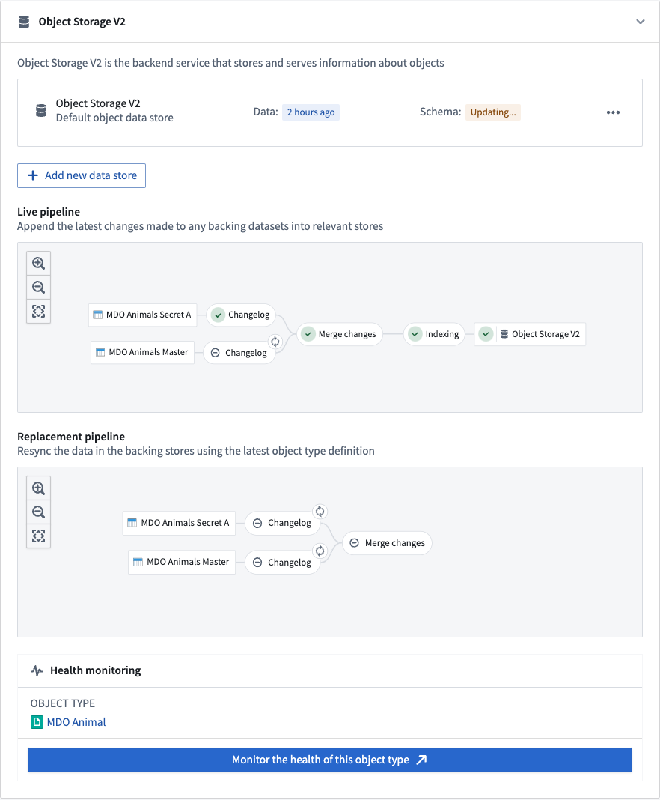

<!-- source: https://palantir.com/docs/foundry/object-indexing/faq/ · mirrored 2026-08-06 from Palantir Foundry docs -->

# FAQ

## How do I know when an object type has been indexed into OSv2?

The Ontology Manager application has a dedicated pipeline graph that shows the status of various jobs in a Funnel pipeline. A green tick in the Object Storage v2 node in the graph indicates that the indexing is complete and the object type is ready to be queried from OSv2.

## Why might an indexing job fail even though it was successfully registered with Object Storage v1 (Phonograph) before?

Data validations in OSv1 and OSv2 differ slightly.

OSv1 behavior is generally dictated by the behavior of the underlying data store, given its tight coupling with the underlying distributed document store and search engine. OSv2 has stricter validations to ensure the quality of data going into the Ontology, and to provide more deterministic behavior and increased legibility across the system compared to OSv1.

Therefore, some indexing pipelines may encounter validation errors when using OSv2 that were previously accepted by OSv1. For a detailed list of such breaking changes, see the documentation on [Ontology breaking changes between OSv1 and OSv2](/docs/foundry/object-backend/object-storage-v2-breaking-changes/).

## One of the jobs failed but might succeed if I retry. How do I trigger a rebuild?

OSv2 manages all aspects of jobs, including job retries. If a job fails due to a transient error that might be resolved by rebuilding the job, OSv2 will automatically retry the job after approximately five minutes. If OSv2 detects that the job failed terminally (due to an invalid data format, for example), it will automatically retry only when new data is available. In cases where object types are backed by restricted view datasources, jobs are triggered when either the data or the policy changes.

## Is there a limit to the size of data that can be indexed?

The index size is mainly limited by the storage space in the object databases into which a given object type is indexed. For example, in the OSv2 data store this would be the disk space of the search nodes.

If there is not enough disk space, indexing jobs will not succeed and will report the underlying problem in the pipeline graph in the Ontology Manager application. If you encounter disk space errors, contact your Palantir representative.

## Can I backfill large scale historical data for [object types with streaming datasources](/docs/foundry/object-indexing/funnel-streaming-pipelines/)?

There are two phases when syncing object types backed by streaming datasources; internal stream creation, and indexing. Streaming indexing jobs have comparable indexing latency to [Funnel batch pipelines](/docs/foundry/object-indexing/funnel-batch-pipelines/), using Spark to heavily parallelize the initial processing of historical streaming data. This indexing latency is comparable to [user edits on live Ontology data](/docs/foundry/object-edits/how-edits-applied/#user-edits-on-live-data). Internal stream creation is typically the limiting factor; it utilizes our streaming infrastructure to process the datasource on a per-record basis.

## What is the expected latency for streaming into the Ontology?

The most time-consuming part of [Funnel streaming pipelines](/docs/foundry/object-indexing/funnel-streaming-pipelines/) is Flink checkpointing to allow for "exactly once" streaming consistency. The default checkpoint frequency is once every second, so that is the dominating latency between the data arriving in the input stream and being indexed into the Ontology. We perform continuous experiments to evaluate cost/performance/latency tradeoffs by reducing the frequency and even removing it all together.

Contact Palantir Support to configure the behavior where necessary.

## What is the expected throughput for streaming into Ontology?

Indexing throughput is limited to 2 MB/s per object type into the [Object Storage v2 object database](/docs/foundry/object-backend/overview/#object-storage-v2-architecture). Contact Palantir Support if you need a higher indexing throughput.

## Can I specify a timestamp that my objects will be deduplicated by when using stream datasources in the Ontology?

No, [Funnel streaming pipelines](/docs/foundry/object-indexing/funnel-streaming-pipelines/) preserve the ordering of the input stream when indexing. Data should be written to the stream in order. This can be done in the upstream streaming pipeline by windowing the data by the event timestamp and specifying the primary keys such that the data is hash partitioned.

## Does Ontology streaming support change data capture (CDC) workflows?

[Funnel streaming pipelines](/docs/foundry/object-indexing/funnel-streaming-pipelines/) supports create, update, and deletion workflows. You can find more documentation on how to set up deletion metadata in the [change data capture](/docs/foundry/data-integration/change-data-capture/) documentation.

## Can I write partial rows to the Ontology when using stream datasources? Can I update a few properties at a time instead of providing the entire object?

Currently, no. Resolving the entire object should be done in an upstream pipeline. If [stateful streaming](/docs/foundry/building-pipelines/stream-vs-batch/#state-management) does not solve this problem for you due to scale issues, contact Palantir Support.

## Can I use Ontology streaming for [many-to-many link types](/docs/foundry/object-link-types/create-link-type/)?

Yes, it is supported. Learn more about how to configure ontology types with streaming datasources [in our documentation](/docs/foundry/object-indexing/funnel-streaming-pipelines/#configuring-streaming-object-types).

## Is streaming supported for [object databases](../object-databases/) other than [Object Storage v2](/docs/foundry/object-backend/overview/#object-storage-v2-architecture) ([materializations](/docs/foundry/object-edits/materializations/) or [Automate](/docs/foundry/automate/overview/), for example)?

Ontology streaming is currently only supported by the Object Storage v2 object database. Contact Palantir Support if you need this functionality in other object databases.

## Are [materializations](/docs/foundry/object-edits/materializations/) supported for object types with stream datasources?

No; given user edits are not supported for object types with stream datasources, a materialized dataset would be no different than the archive dataset in the stream. With the current architecture, the deduplicated view in a dataset cannot be provided.

## My [Funnel streaming pipeline](funnel-streaming-pipelines.md) is always running. How can I cancel it?

Funnel streaming pipelines cannot be cancelled by users. Funnel keeps streams alive always because production object types require high availability. This setup may potentially incur unwanted cost when prototyping. Contact Palantir Support if this becomes a significant deterrent for your use case. Alternatively, you can try switching the object type to a batch one during the prototyping phase.

## How can I cut over my stream datasource from one stream to another without downtime?

[Funnel streaming pipelines](/docs/foundry/object-indexing/funnel-streaming-pipelines/) have a heuristic to determine if its pipeline is “up to date” with a replacement stream before switching over to the new one. You can change the datasource to point to a different stream or branch of your stream with the following steps:

1. Run your new logic on a separate stream (or another branch).
2. Wait for the new stream to finish the replay, such as after all historical records are processed.
3. Change your object type input datasource to the new stream.
4. Funnel streaming pipelines will keep the live pipeline on the original stream up until the replacement pipeline on the new stream is fully indexed.
5. Once the Funnel has finished the cutover, you can turn off the original stream.

## What are some common mistakes that may lead to unintended consequences?

1. If your data is inconsistent with what you expect, ensure that your input stream is ordered the way you expect.
2. [Funnel streaming pipelines](/docs/foundry/object-indexing/funnel-streaming-pipelines/) perform the same validations as [Funnel batch pipelines](/docs/foundry/object-indexing/funnel-batch-pipelines/#). However, for streaming pipelines, there is no mechanism to throw an error in the user transform because the stream processing cannot be paused, so the invalid records are dropped.

## What is the cost of Ontology streaming?

[Funnel streaming pipeline](/docs/foundry/object-indexing/funnel-streaming-pipelines/) compute is calculated the same way as normal streaming resources. Review our [streaming compute usage](/docs/foundry/building-pipelines/streaming-compute-usage/#calculating-usage) documentation for more information on streaming resource costs.

## How do retention windows work?

Retention windows were initially developed as a data size limiting mechanism during a beta release. Therefore, it is only implemented as a best effort. This means objects within the retention window will be queryable, but objects outside of it will be eventually deleted. For example, if the retention window is set to two weeks, and an object of the stream datasource was last updated by the input stream three weeks ago, that object may be deleted from that object type. However, that object may also stay in the Ontology for many more days and is never guaranteed to be removed within any specific timeframe.

The current mechanism for "cleaning up" old data from the Ontology is through [pipeline replacement](/docs/foundry/object-indexing/funnel-batch-pipelines/#replacement-pipelines) which, by default, runs every two weeks. On replacement, the Funnel streaming pipeline replays the stream from the beginning of the retention window, thereby removing older objects from the Ontology. Contact Palantir Support if you have a need to delete old objects more regularly.

If no retention window is set, then all data from the input stream source will be ingested into the Ontology.

## Why is my stream source being indexed in batch or failing with duplicate errors?

In [Ontology Manager](/docs/foundry/ontology-manager/overview/), you must always explicitly specify your input data source as a stream; this applies for both object types with streaming datasources and [restricted views](/docs/foundry/object-permissioning/configuring-rv-access-controls/) backed by streams. Otherwise, your data source will fall back to indexing as a standard [Funnel batch pipeline](/docs/foundry/object-indexing/funnel-batch-pipelines/). Review our documentation on [configuring streaming object types](/docs/foundry/object-indexing/funnel-streaming-pipelines/#configuring-streaming-object-types) for more details.

## Can I query object types with streaming datasources through [Ontology functions](/docs/foundry/functions/functions-on-objects/)?

Yes, [querying the Ontology](/docs/foundry/object-backend/overview/#object-set-service-oss) work the same way for streaming object types and batch object types.
