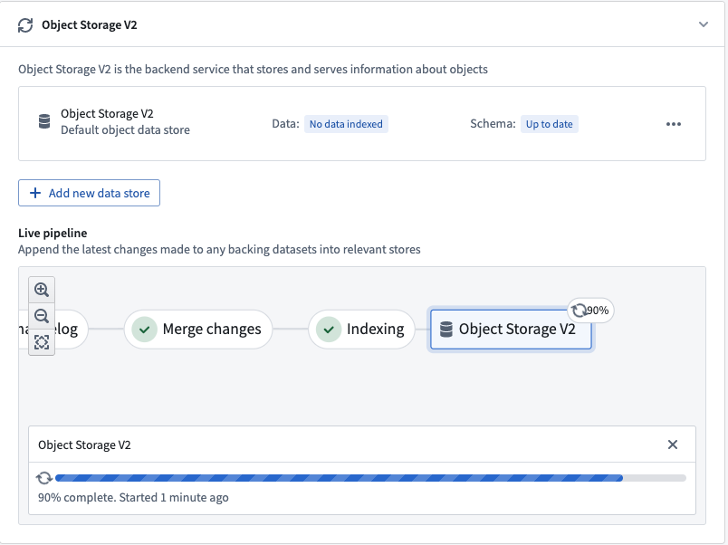
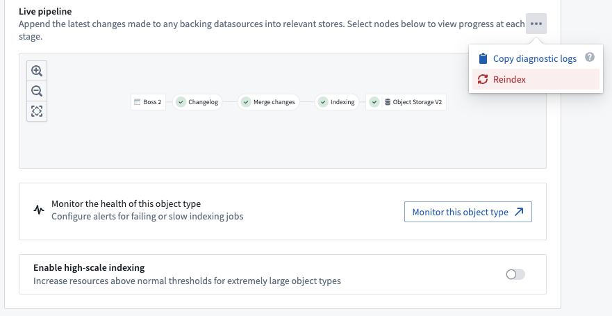
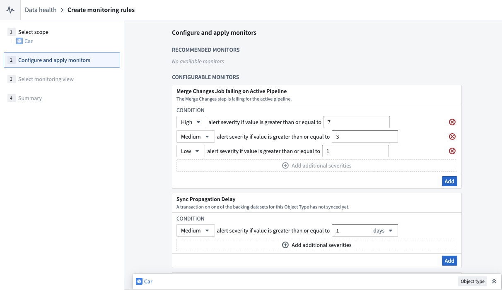
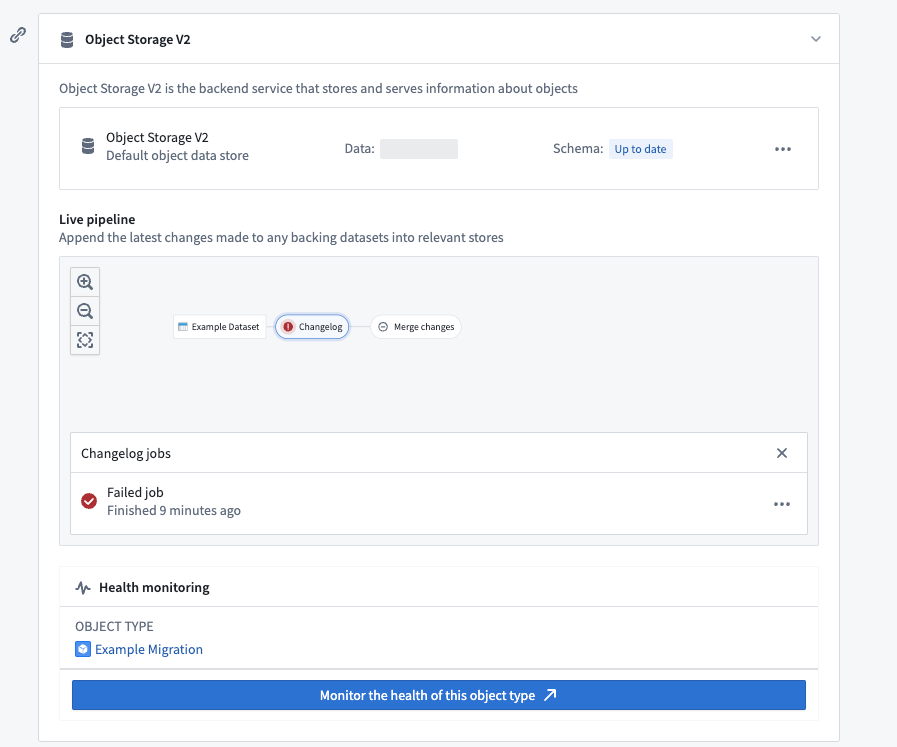
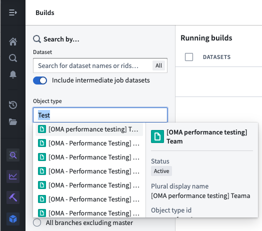

<!-- source: https://palantir.com/docs/foundry/object-indexing/funnel-batch-pipelines/ · mirrored 2026-08-06 from Palantir Foundry docs -->

# Funnel batch pipelines

Funnel batch pipelines are internal job pipelines that orchestrate the efficient indexing of data (both from Foundry datasources and from user edits) into OSv2 in a batch fashion, ensuring up-to-date data and metadata in the Ontology.

## Components of a Funnel batch pipeline

A Funnel batch pipeline is comprised of a series of [Foundry build jobs](/docs/foundry/data-integration/datasets/):

* [Changelog](#changelog)
* [Merge changes](#merge-changes)
* [Indexing](#indexing)
* [Hydration](#hydration)

The screenshot below shows an example Funnel batch pipeline.


### Changelog

In the changelog job, Funnel automatically computes the data difference for all datasources when the datasources receive new data or transactions, then creates intermediate changelog datasets in a Funnel pipeline. Changelog datasets receive [APPEND transactions](/docs/foundry/data-integration/datasets/#transaction-types) that contain the data difference in each transaction to provide [incremental computation semantics](/docs/foundry/data-integration/datasets/#transaction-types). These changelog datasets are owned and controlled by Funnel, and thus are not accessible to users.

### Merge changes

In the merge changes job, all changelog datasets from the changelog step and any recent user edits coming from Actions are joined by the object type’s primary key to merge all changes and store them in a separate dataset. These merged datasets are owned and controlled by Funnel, and thus are not accessible to users.

### Indexing

After changes are merged, Funnel starts an indexing job per object database to convert all rows in the final dataset with all merged changes into a format compatible with the object databases configured for the object type. For example, for the canonical OSv2 database, all of the rows in the merged changes dataset from the previous step are converted to index files; these files are stored in a separate index dataset. These index datasets are owned and controlled by Funnel, and thus are not accessible to users.

### Hydration

Once the indexing job is complete, object databases must prepare the indexed data for querying. Using OSv2 as an example, this preparation step involves downloading the index files from the dataset into the disks of the OSv2 database search nodes. This process, known as *hydration*, is the final step of our example Funnel batch pipeline for updating the data of an object type.

The progress of the hydration job is reported in the Ontology Manager application, as seen in the screenshot below.



Once these steps are completed, the object type is ready for use and can be queried by other services, externally or in Foundry.

## Live and replacement Funnel pipelines

Two separate Funnel pipelines are involved when there is a data update or a schema update to an object type. The screenshot below displays these two Funnel pipelines:


### Live pipelines

Funnel *live pipelines* update object types in production with new data from Foundry datasources. Live pipelines run whenever their respective datasources are updated. Additionally, if user edits on objects are detected, live pipelines will run every six hours regardless of any explicit backing dataset update; this ensures that user edits are persisted during the merge changes step of indexing into the Funnel-owned dataset.

Note that user edits are applied to indexes in [object databases](/docs/foundry/object-backend/overview/#functional-components-and-architecture) immediately; a regular six-hour job interval allows a built-in control mechanism to persistently store this data in Foundry.

### Replacement pipelines

When the schema of an object type changes and the previous pipeline’s schema is no longer up-to-date, a new *replacement pipeline* must be provisioned for orchestrating object type updates. Schema changes can include adding a new property type to an object type, changing an existing property type, or replacing the input datasource of an object type with another datasource.

While the live pipeline continues to run on its usual cadence, Funnel will orchestrate a replacement pipeline in the background without impacting the live data being served to users. After the replacement pipeline successfully runs for the first time, the live pipeline will be discarded and replaced by the replacement pipeline; the object type’s schema and data will be updated accordingly.

:::callout{theme="neutral"}
Although schema changes are the most common reason for Funnel to provision a replacement pipeline, Funnel will sometimes automatically provision a replacement pipeline for performance reasons based on various heuristics.
:::

## Incremental and full reindexing

:::callout{theme="neutral"}
The following documentation is specific to the canonical Object Storage v2 data store. For information on the indexing behavior of Object Storage v1 (Phonograph), see the [OSv1 documentation](/docs/foundry/object-databases/object-storage-v1/#incremental-and-batch-reindexing).
:::

### Incremental indexing (default)

The canonical Object Storage v2 data store automatically computes the data difference for every new transaction in a datasource and incrementally indexes only new data updates. Funnel pipelines use incremental indexing by default for all object types. Incremental indexing allows the Funnel pipeline to run more quickly than if all data had to be indexed again.

For example, imagine you have an object type with 100 objects, backed by a 100-row datasource. If 10 of those rows change in a new data update, rather than reindexing all 100 objects regardless of the [transaction type](/docs/foundry/data-integration/datasets/#transaction-types) in the input datasource, the [Funnel batch pipeline](/docs/foundry/object-indexing/funnel-batch-pipelines/) will create a new `APPEND` transaction in the changelog dataset that contains only the 10 modified rows.

#### Incremental indexing of incremental datasets

[Object Storage v2](/docs/foundry/object-backend/overview/#object-storage-v2-architecture) uses a "most recent transaction wins" strategy when syncing object types backed by incremental datasets. If the dataset contains more than one row for the same primary key, the data of the row in the most recent transaction will be present in the Ontology. You may not have duplicate primary keys within a single transaction. Note that this behavior is not related to how [user edits and datasource update conflicts](/docs/foundry/object-edits/how-edits-applied/#resolve-conflicting-user-edits-and-datasource-updates) are handled.

Consider an incremental dataset that receives updates to rows through `APPEND` transactions, usually called a changelog dataset. A new version of the same data is represented by a new row with an updated value but the same primary key, appended to the dataset in one transaction. A column named `is_deleted` is not treated as a deletion column by default. To use a deletion column, the datasource schema must include legacy Object Storage v1 changelog metadata that identifies the column.

Object Storage v2 syncs a changelog dataset as follows:

* If a primary key appears in multiple transactions, the row from the most recent transaction will be kept.
* Each transaction must contain at most one row per primary key.
* A deletion column is respected only when it is declared in legacy Object Storage v1 changelog metadata.

You will likely need to perform an incremental window transform on your changelog dataset to ensure each transaction contains, at most, one row per primary key.

```python
from pyspark.sql.window import Window
from pyspark.sql import functions as F

ordering_window = Window().partitionBy('primary_key').orderBy(F.col('ordering').desc())
df = df.withColumn('rank', F.row_number().over(ordering_window))
df = df.filter((F.col('rank') == 1) & ~F.col('is_deleted'))
```

#### Views incremental indexing

[Dataset views](/docs/foundry/data-integration/views/) have limitations with incremental indexing. Because a view abstracts the underlying data structure, Funnel attempts to use incremental builds to save costs. However, the following limitations apply:

* **Views with deletion columns** are always fully reindexed because Funnel cannot determine which rows have been deleted.
* **Incremental builds may produce inconsistent results** when deduplication column values conflict with transaction ordering. Funnel uses a "last edit wins" strategy: rows with larger deduplication column values are ignored if they fall outside the incremental window. To avoid this, either add a deletion column to trigger full reindexes or ensure that deduplication column values always increase with each transaction.
* [**Retention policies that delete from the latest view**](/docs/foundry/retention/manage-retention-policies/#latest-view-transaction-deletion) on the underlying dataset may cause unexpected results if old data is removed. In such cases, a full reindex will produce correct results.

### Full reindexing (special cases)

Funnel pipelines will use batch indexing (in which all objects are reindexed) in these cases:

* When more than a certain percentage of the rows in the input datasource are modified in the same transaction, reindexing can be computationally less expensive and faster compared to computing a changelog and indexing incrementally. The default threshold is set to 80% of rows changed in the same transaction.
* When certain changes in object type schemas require a [Funnel replacement pipeline](/docs/foundry/object-indexing/funnel-batch-pipelines/#replacement-pipelines), which will create an entirely new Funnel pipeline in the background (including OSv2 indexes).
* When user triggers a full reindex through Ontology Manager.



## Monitor Funnel pipelines

Funnel pipelines are comprised of multiple build jobs; [monitoring views](/docs/foundry/monitoring-views/overview/) enable users to track the health of specific jobs in Funnel pipelines by creating a set of [monitoring rules](/docs/foundry/monitoring-views/overview/#add-a-monitoring-rule).

Users can create a monitoring view by selecting **Monitor the health of this object type** in the Ontology Manager. This takes users to the [monitoring views](/docs/foundry/monitoring-views/overview/) tab of the Data Health application, as seen in the screenshot below.



From the monitoring views tab, users can create rules for monitoring jobs in both live pipelines and replacement pipelines. Users can also add **Sync Propagation Delay** rules to be notified when the freshness of the indexed data in object databases passes the threshold defined in the rule.

In contrast, Object Storage v1 (Phonograph) uses [health checks](/docs/foundry/maintaining-pipelines/recommended-health-checks/#optional-checks) to monitor syncs for Ontology entities; there is only a single sync job in OSv1 for object types, and users can define these health checks directly on the sync jobs.

## Debug a pipeline

Foundry build jobs may fail for a number of reasons. Users with `View` permissions on the backing datasource of an object type can check the pipeline errors through the **Live pipeline** dashboard in the object type’s **Datasources** tab. Choose the failed job in the pipeline graph, then select **Failed job** as seen in the screenshot below.



Alternatively, users can list all build jobs for a given object type by navigating to the [Builds application](/docs/foundry/data-integration/application-reference/#builds) application and filtering by object type in the search filters on the left panel.


