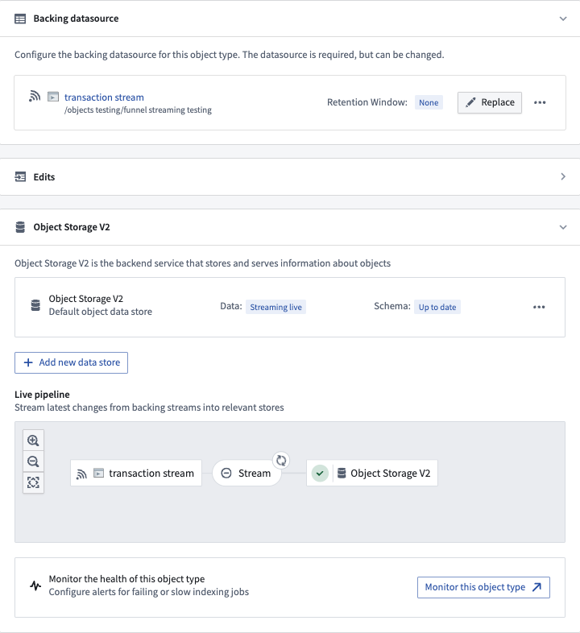
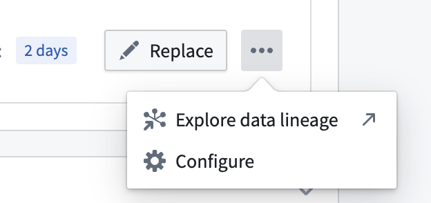
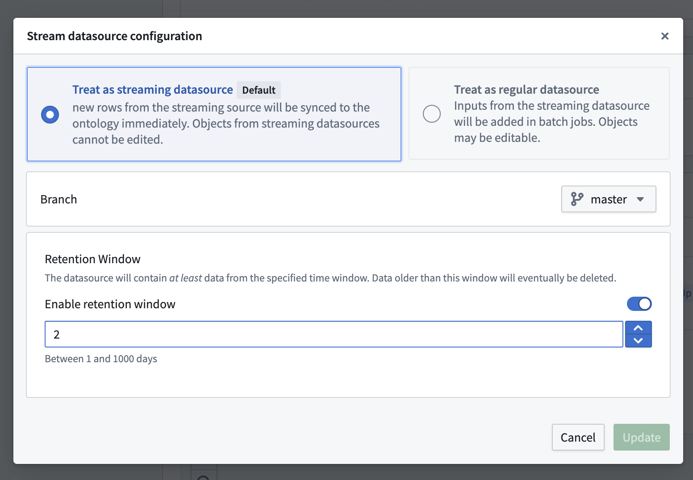
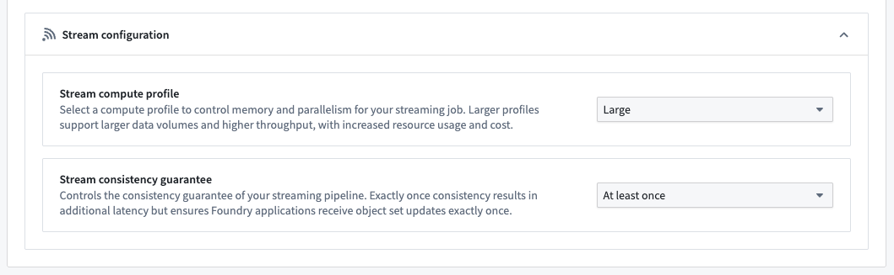
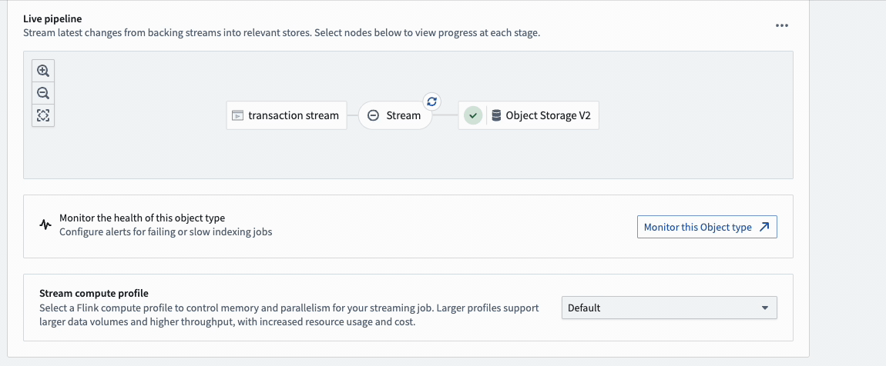

<!-- source: https://palantir.com/docs/foundry/object-indexing/funnel-streaming-pipelines/ · mirrored 2026-08-06 from Palantir Foundry docs -->

# Funnel streaming pipelines

In addition to [batch Ontology data indexing](/docs/foundry/object-indexing/funnel-batch-pipelines/), Object Storage v2 supports low-latency streaming data indexing into the Ontology by using [Foundry streams](/docs/foundry/data-integration/streams/) as [input datasources](/docs/foundry/object-permissioning/managing-object-security/#object-input-data-sources). By departing from the batch infrastructure used for non-streaming Foundry datasets, streams enable indexing of data into Foundry Ontology on the order of seconds or minutes to support latency sensitive operational workflows.

:::callout{theme="neutral"}
If you have more questions about Ontology streaming behavior, review our [frequently asked questions](/docs/foundry/object-indexing/faq/#can-i-backfill-large-scale-historical-data-for-object-types-with-streaming-datasources) documentation.

For guidance on the performance and the latency of streaming pipelines, review our [streaming performance considerations](/docs/foundry/building-pipelines/streaming-performance-considerations/) documentation.
:::

## Current product limitations of streaming object types

Streaming in Object Storage v2 uses a “most recent update wins” strategy, where every stream is treated like a changelog stream. If your events are coming from your source out of order, you will end up with incorrect data in your Ontology. If you can guarantee order in your input stream, Object Storage v2 streaming will handle your updates with the same order.

Ontology streaming behavior and its feature set is still actively developed; below are some of the current product limitations to consider before using Ontology streaming:

* User edits are not supported on streaming object types. As a workaround, you can either push user edits as a data change into the input stream or configure an additional object type with a non-streaming input datasource to let users make their edits on that auxiliary object type. Alternatively, you can enable edits on stream-backed object types by switching the object be backed by [direct datasources](/docs/foundry/object-indexing/direct-datasources/).
* [Multi-datasource object types (MDOs)](/docs/foundry/object-permissioning/multi-datasource-objects/) are not supported on streaming object types.
* Outside of [Workshop](/docs/foundry/workshop/overview/), no other Foundry frontend application supports live data refresh because, historically, they do not expect streaming updates. Although the underlying Ontology data is changing constantly for streaming object types, you will need to refresh whenever you want new data outside Workshop.
* In the **Datasources** tab of an object type in Ontology Manager, users are able to configure [monitors](/docs/foundry/object-indexing/funnel-batch-pipelines/#monitor-funnel-pipelines) for Funnel batch pipeline failures and invalid records. Currently, there is no support for monitors or metrics for object types with stream datasources (for example, pipeline latency).
* Record size cannot exceed 1MB, and the object type cannot contain more than 250 properties. You should consider a different ontology model with smaller object types if you need to stream larger records into your ontology.

## Configuring streaming object types

Object types with stream input datasources are configured directly in [Pipeline Builder](/docs/foundry/pipeline-builder/outputs-add-ontology-output/) or the [Ontology Manager](/docs/foundry/ontology-manager/overview/), similar to any other Foundry Ontology object type.

:::callout{theme="neutral"}
If you do not yet have an input stream configured, you can create one through [integrating with an existing stream in the Data Connection application](/docs/foundry/data-connection/set-up-streaming-sync/) or by [building a stream pipeline in Pipeline Builder](/docs/foundry/building-pipelines/create-stream-pipeline-pb/).
:::

After creating a new object type (or using an existing object type), navigate to the **Datasources** tab in Ontology Manager, select a stream input datasource in the **Backing datasource** section as shown below, and save your changes into the Foundry Ontology.

For additional configurations over the input datasource stream, select the ellipses button for more options as shown below.

:::callout{theme="neutral"}
Stream datasources can also be configured for [many-to-many link types](/docs/foundry/object-link-types/create-link-type/).
:::

The **Stream configuration** section provides options to optimize your object type's streaming job.

* **Stream compute profile:** By default, an object type's streaming job uses a compute profile suitable for most input streams. However, object types backed by very high-throughput streams may require more resources to prevent the pipeline from lagging. Alternatively, object types backed by low-throughput streams can use a smaller profile to save on compute resource cost. If none of the available options are suitable, contact your Palantir representative.
* **Stream consistency guarantee:** By default, an object type's streaming job uses the exactly-once consistency guarantee, which results in additional latency compared to at-least-once but ensures Foundry applications receive object set updates exactly once. Enabling the at-least-once consistency guarantee reduces latency; however, in rare cases, Foundry applications may receive duplicate updates when an object set changes. For example, an object set-based automation could trigger multiple times. Consider enabling at-least-once for latency-sensitive object types.

:::callout{theme="neutral"}
Modifying an object type's stream configuration will restart its associated streaming job, causing a temporary delay for new streaming records to be processed.
:::

## Debugging streaming pipelines

The interface between streams and the Ontology can be considered conceptually similar to [changelog datasets](/docs/foundry/object-indexing/funnel-batch-pipelines/#changelog). Each record in the input stream will contain the data for each property being written into the Ontology. Each record will update all of the properties for a given object, specified by primary key. Deletions can be specified on the input record by setting metadata on the input stream.

Funnel will index records in the order that they are written to the datasource stream, so those streams should be partitioned by primary key and ordered by event timestamp which can be done in the upstream [Pipeline Builder](/docs/foundry/pipeline-builder/core-concepts/#pipeline-outputs) pipeline.

If you are having issues with your stream pipelines, review the [debug a failing stream](/docs/foundry/optimizing-pipelines/debug-stream/) documentation.

To view details and metrics for an object type's streaming job, select the **Stream** bubble in the pipeline diagram.

