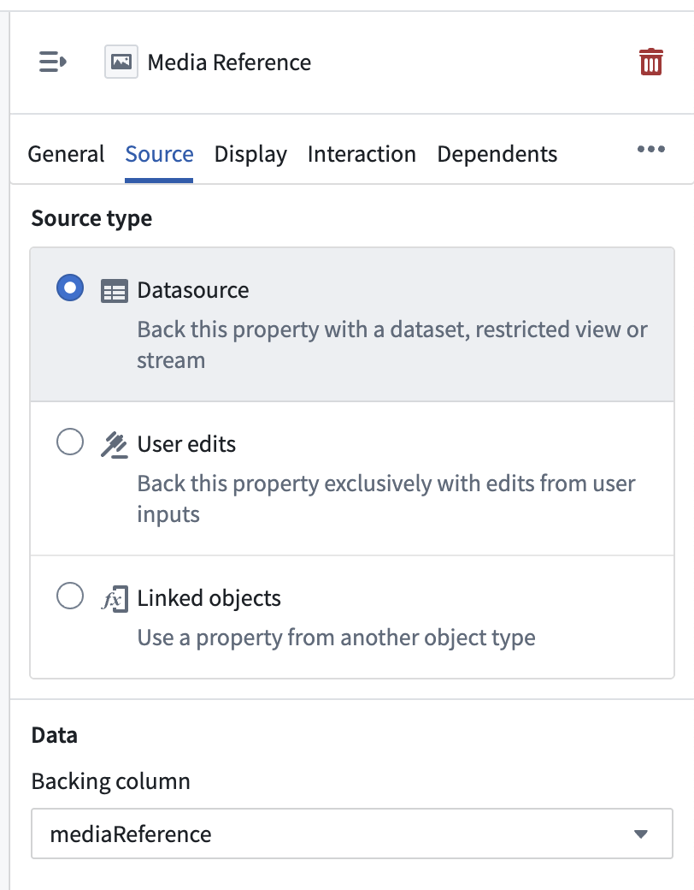
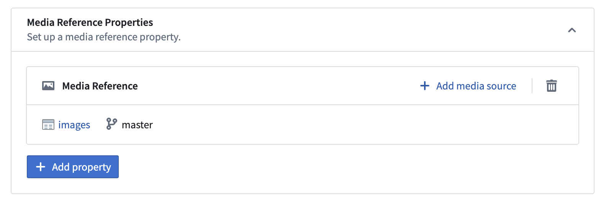

<!-- source: https://palantir.com/docs/foundry/object-link-types/base-types/ · mirrored 2026-08-22 from Palantir Foundry docs -->

# Base types

Property base types define the kind of data that can be stored in a property. For a complete reference of all supported property base types, see the [properties overview](./properties-overview.md/#supported-property-types).

**Base types** are used to define properties on objects. The base type of a property determines the set of operations available for that property in user applications. All field types are valid base types except for `Map` and `Binary` types.

Base types also include the following advanced types:

* **Vector:** A type for storing [vectors](/docs/foundry/announcements/2023-11/#configure-a-vector-property-type) on objects for use in a semantic search.
* **`Geopoint`:** A type for defining properties that represent geographic [points](/docs/foundry/geospatial/ontology/#points).
* **`Geoshape`:** A type for defining properties that represent geographic [shapes](/docs/foundry/geospatial/ontology/#polygons-and-lines).
* **Attachment:** A type for storing files on objects for use with [functions on objects](/docs/foundry/functions/attachments/).
* **Time series:** A type for defining a property as a [time series](/docs/foundry/time-series/time-series-overview/).
* **Geotemporal series:** A type for defining a property as a reference to a [geotemporal series](/docs/foundry/geospatial/geotemporal-series-overview/).
* **Media reference:** A type for defining a [reference to a media file](/docs/foundry/media-sets-advanced-formats/media-overview/#media-references).
* **Cipher text:** A type for storing a string value encoded with [Cipher](/docs/foundry/cipher/overview/).
* **Struct:** A type for defining schema-based properties with [multiple fields](/docs/foundry/object-link-types/structs-overview/).

All base types may be used in arrays to represent multiple values for a property, excluding the `Vector` and `Time series` types.

## Complex property base types

Some property base types require additional configuration or have specific use cases. Refer to the sections below for information on the following property base types:

* **[Media references](#media-references):** Reference media items stored in media sets.
* **[Struct types](#structs):** Complex structured data with multiple fields.

### Media references

A **media reference** property type allows you to have media on your objects, such as images, videos, audio files, and documents. A [media reference](/docs/foundry/media-sets-advanced-formats/media-overview/#media-references) points to a specific media item within a [media set](/docs/foundry/data-integration/media-sets/). The media reference contains information about the media file, which means Foundry can display the media wherever the media reference is used.

#### Media reference format

Below is an example media reference:

```json
{
  "mimeType": "image/png",
  "reference": {
    "type": "mediaSetViewItem",
    "mediaSetViewItem": {
      "mediaSetRid": "ri.mio.main.media-set.00000000-0000-0000-0000-00000000000",
      "mediaSetViewRid": "ri.mio.main.view.00000000-0000-0000-0000-00000000000",
      "mediaItemRid": "ri.mio.main.media-item.00000000-0000-0000-0000-00000000000"
    }
  }
}
```

The media reference includes the following:

* **`mimeType`:** The file's media type.
* **`reference`:** A reference containing the media set RID, view RID, and specific media item RID.

#### Configure media reference properties

Object types with media reference properties are backed by a dataset. The backing dataset must include a media reference column, which will map to the media reference property. This column type is specifically designed to store media reference values and ensures proper integration between your ontology objects and media sets.



Additionally, a media reference property must have a **media source**, which can be configured in the **Capabilities** tab of the object type. This media source should be the media set that the media references point to.



### Structs

A **struct** is an ontology property base type that allows users to create schema-based properties with multiple fields. Struct properties are created from struct type dataset columns. To learn more about structs, refer to the complete [struct](/docs/foundry/object-link-types/structs-overview/) documentation.
