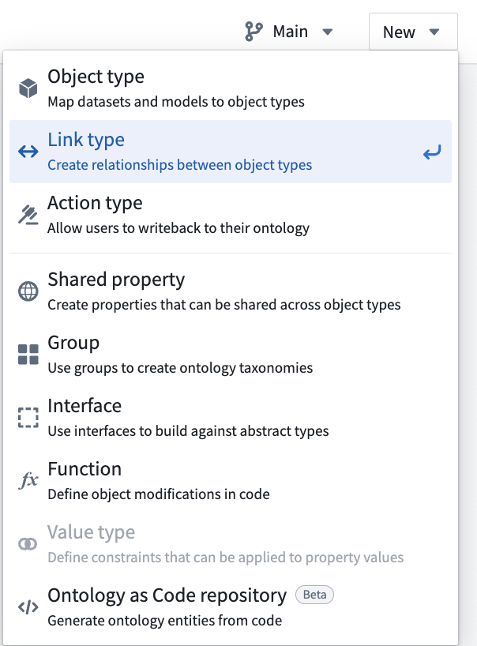
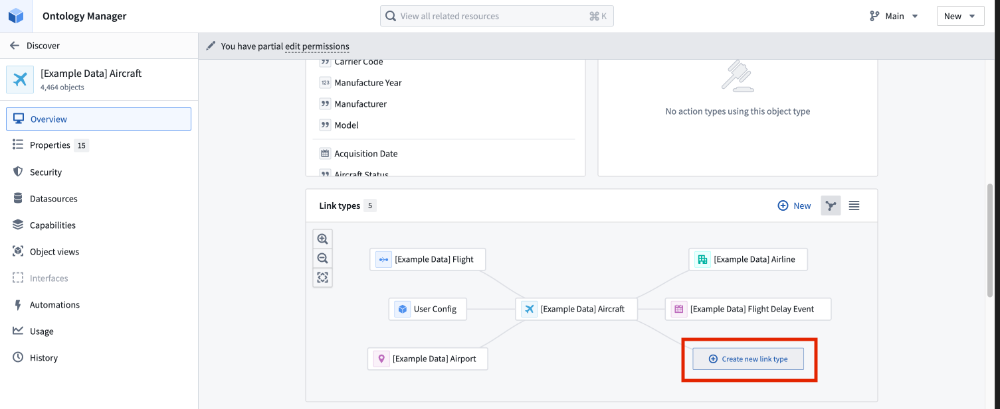
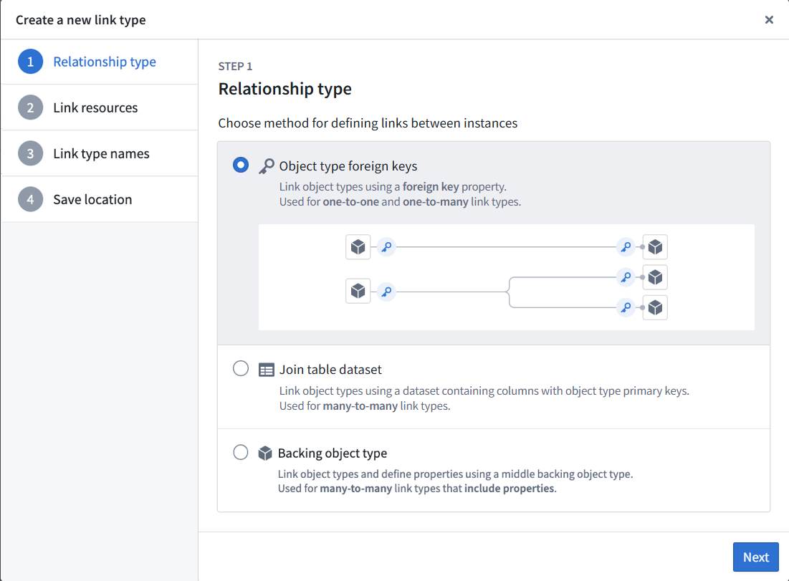
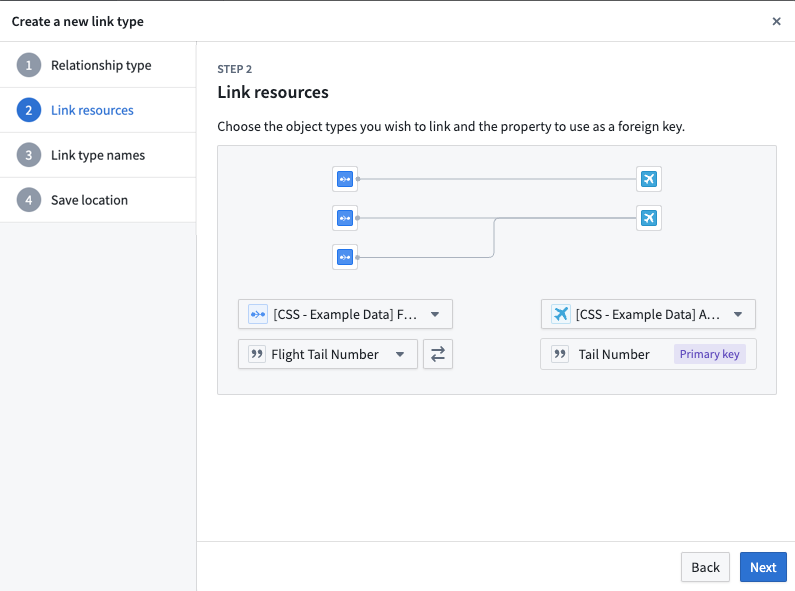
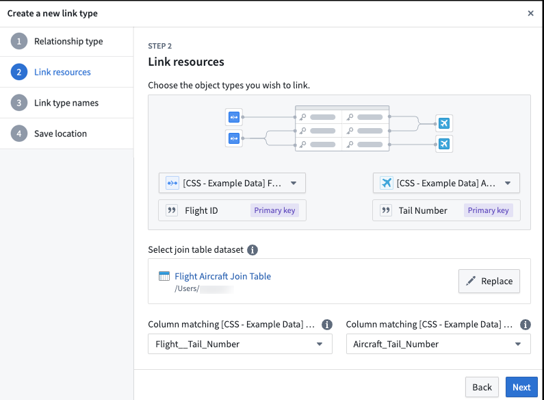
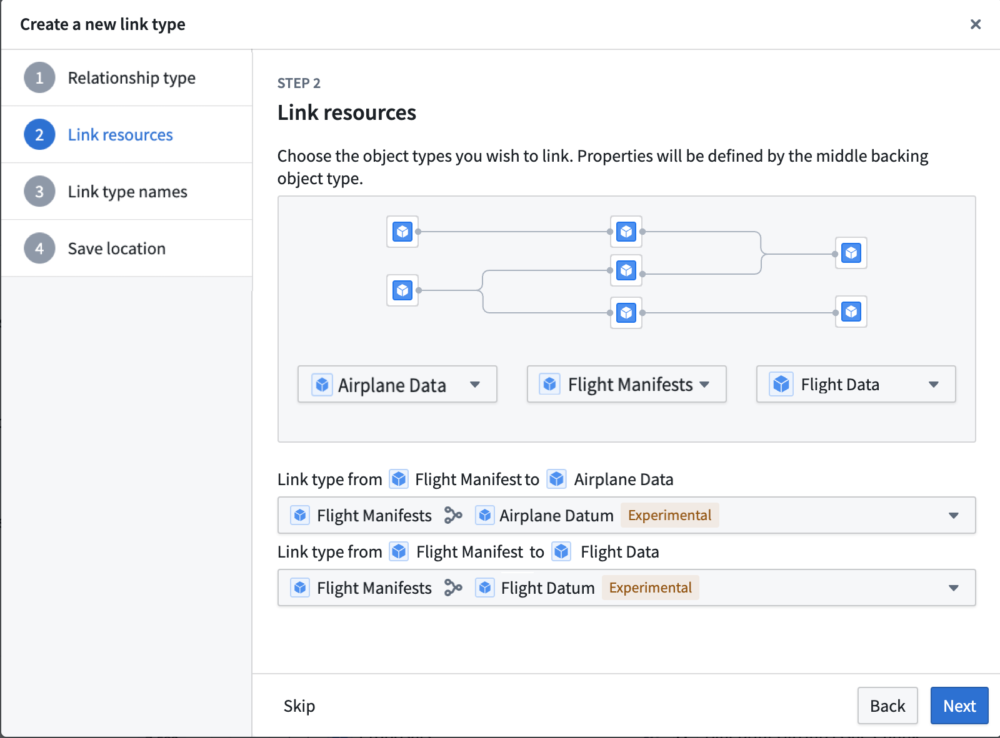
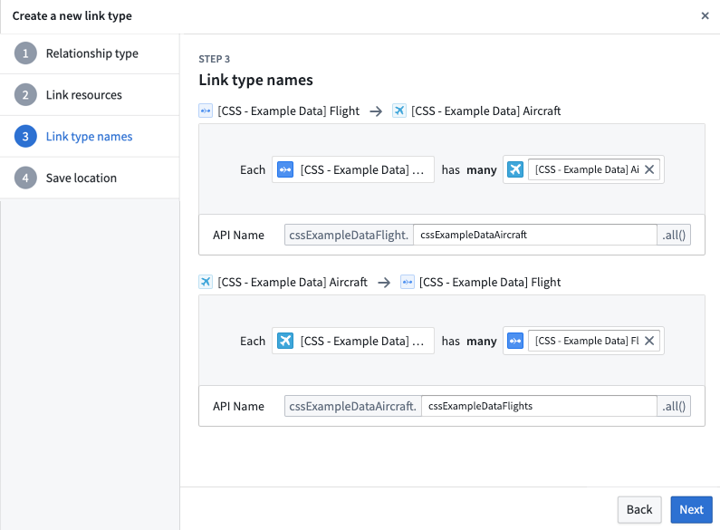
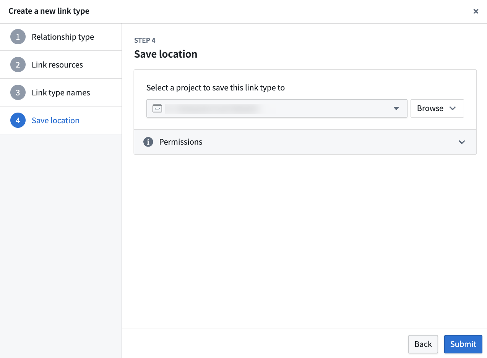
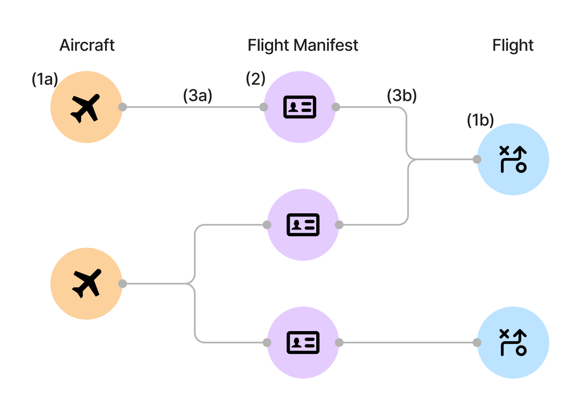

<!-- source: https://palantir.com/docs/foundry/object-link-types/create-link-type/ · mirrored 2026-08-22 from Palantir Foundry docs -->

# Create a link type

We recommend creating and configuring a new link type with the guided helper outlined below. However, if you exit the helper before completing the object creation process, you can manually complete the process by specifying the link type, keys, and API names for the new link type.

## Access the link type creation helper

Navigate to Ontology Manager. To access the link type creation helper, choose one of the following methods:

* Select **New** from the top right corner, then select **Link type**.       

* In the left sidebar, select **Link types** under **Resources**. Then, select **New link type** in the top right corner of the **Link types** page.

* Navigate to an object type you want to link, then select **Create new link type** from within the link type graph on the object type’s **Overview** page.   
     

## Configure a new link type

The new link type helper will guide you through the following steps:

* [Choose the relationship type](#choose-the-relationship-type)
* [Define link resources](#define-link-resources)
  * [Foreign key relationship type](#foreign-key-relationship-type)
  * [Join table dataset relationship type](#join-table-dataset-relationship-type)
  * [Backing object relationship type](#backing-object-relationship-type)
* [Define link type names](#define-link-type-names)
* [Save location](#save-location)
* [Save change to ontology](#save-change-to-ontology)

### Choose the relationship type

1. In the first step of the **Create a new link type** dialog, select the relationship type for the link.
2. Choose the relationship type for defining links between your two objects:

   * **Object type foreign keys:** Supports "one-to-one" and "many-to-one" cardinality link types. This option allows you to select properties that represent the foreign key and corresponding primary key for the desired objects. See [below for details](#foreign-key-relationship-type) in defining link resources with a foreign key.
   * **Join table dataset:** For "many-to-many" cardinality link types. This option allows you to use a join table dataset to back the link. See [below for details](#join-table-dataset-relationship-type) in defining link resources with a dataset.
   * **Backing object type:** Object-backed link types expand on many-to-one cardinality link types, providing first class support for object types as a link type storage solution. See [below for details](#backing-object-relationship-type) on defining link resources backed by an object. For additional information, refer to the [object-backed links](#object-backed-links) section.

In the examples below, assume that there are two object types that are related to each other through a cardinality: an `Aircraft` object type and a `Flight` object type. Cardinality types include:

* *One-to-one cardinality:* This indicates that one `Aircraft` should be linked to a single `Flight`. The one-to-one cardinality serves as an indicator of the intended relationship, but the one-to-one cardinality is not enforced.
* *One-to-many cardinality:* This indicates that one `Aircraft` can be linked to many `Flights`.
* *Many-to-one cardinality:* This indicates that many `Aircraft` can be linked to one `Flight`.
* *Many-to-many cardinality:* This indicates that one `Aircraft` can be linked to many `Flights`, and one `Flight` can be linked to many `Aircraft`.

3. Select **Next** to proceed to the next step.   
      

### Define link resources

#### Foreign key relationship type

A **foreign key** is a property on one object type that stores the value of another object type's primary key, representing a real-world relationship between the two object types. This concept is analogous to a foreign key in a relational database, where a column in one table references the primary key column of another table. In a one-to-one or many-to-one cardinality link type, you will define the foreign key property and primary key properties for the link. The **foreign key** property of one object type must refer to the **primary key** property of the other object type.

For example, the `Tail Number` property is the primary key on the `Aircraft` object type, uniquely identifying each aircraft. The `Flight Tail Number` property on the `Flight` object type is the foreign key, representing the aircraft that was assigned to that flight. Links will be created between `Aircraft` and `Flight` object types when the `Tail Number` of the `Aircraft` matches a `Flight Tail Number` of a `Flight`.

1. In the **Link resources** step, choose the object types for your link.

2. Select the primary key object type from the dropdown menu on the right (`Aircraft` in our example).

3. Select the foreign key object type from the dropdown menu on the left (`Flight` in our example). The creation dialog will detect and automatically select a foreign key if the following conditions are met:
   * The foreign key matches the primary key of the linked object type.
   * The property types of both objects match.

4. Choose the properties that will form the link:
   * For the foreign key object type, select the property that will be used as the foreign key for the source object type (`Flight Tail Number` for the `Flight` object types).
   * The primary key of the object type is auto-selected since there is only one primary key for each object type (`Tail Number` for the `Aircraft` object type).

5. Select **Next** to continue.   
      

#### Join table dataset relationship type

In a many-to-many cardinality, select a datasource that includes all combinations of links between the primary key of the first object type (`Aircraft` in our example) and the second object type (`Flight` in our example).

A many-to-many cardinality, which requires a backing datasource, is required to enable users to [edit or write back](/docs/foundry/object-link-types/allow-editing/) to the link type.

1. In the **Link resources** step, choose the object types for your link.
2. Select the first object type from the dropdown menu on the left (`Flight`).
3. Select the second object type from the dropdown menu on the right (`Aircraft`).
4. Choose the join table dataset. Select a dataset that contains columns matching the primary keys for both selected object types. A column can only be mapped to one primary key.
   * It is now possible to automatically generate a join table for new link types. The **Generate join table** option will create a dataset with the correct schema based on the primary keys of the two object types you have selected. This means that you can get started faster if you have user edit-backed data, or if you want to provide production data later on.
5. Select which columns in the link type’s backing datasource map to the primary keys of each of the linked object types.
6. Select **Next** to continue.   
      

#### Backing object relationship type

Before creating the object-backed link, ensure that the [prerequisite](#prerequisites-for-creating-an-object-backed-link-type) object and links have been created.

1. Select the object types created in the prerequisites to represent your desired link type. The objects on the left and right represent the two entities that will be linked together. The object in the middle serves as the intermediary and provides additional metadata about the connection between the two entities, and backs the link.
2. If there are multiple links between the objects on the left and right and the intermediary object in the middle, use the dropdown menus to select the desired links between the left and right objects and the intermediary object.   
      

### Define link type names

1. In the **Link type names** step, provide the display and API names for your new link type.
2. Enter a display name for each side of the link type. A link type has exactly two sides, one for each of the two object types it relates, and each side represents the link *to* that object type. In our example, the display name for the `Aircraft` object type describes the link from `Flight` *to* `Aircraft`. You could choose the display name `Assigned Aircraft` since one `Flight` has one `Assigned Aircraft`. Because both sides are configured together for the same link type, the link type can be traversed in either direction; there is no separate link type to define for the reverse direction. See [directionality](/docs/foundry/object-link-types/link-types-overview/#directionality) for more details.
3. The API name will be automatically generated based on the display name, but you can modify it if needed.
   * The API name field is used when referring to a link type programmatically in code. The API name on a side of a link type can be used to return objects of that type. For example, if the API name on the `Aircraft` side of the link type is `assignedAircraft`, then calling `Flight.assignedAircraft.get()` will return the `Aircraft` objects linked to those `Flight` objects.
   * Link type API names *must* adhere to the following:
     * Begin with a lowercase character and consist of only alphanumeric characters.
     * Be unique across all link types associated with the same object type.
     * Be between 1 and 100 characters long.
     * Be NFKC normalized.
     * Not be a reserved keyword.
   * [Learn more about API names.](/docs/foundry/functions/api-objects-links/)
4. Select **Next** to proceed.   
      

### Save location

In the final step, choose a project to save this link type to. Then, **Submit**. After completing these steps, your new link type will be created, but not yet saved.

### Save change to ontology

Back in Ontology Manager, select **Save** in the upper right corner to [make the change to your ontology](/docs/foundry/ontology-manager/save-changes/).

## Object-backed links

Object-backed link types expand on many-to-one cardinality link types, providing first class support for object types as a link type storage solution. Object-backed link types allow for the inclusion of additional metadata on the link and support restricted views.

For object-backed links, in addition to the `Aircraft` and `Flight` objects, assume an additional object type for the `Flight Manifest`. With an object-backed link, you can have the `Flight Manifest` object type that links the `Aircraft` and `Flight` objects. Unlike a foreign key or data-set backed link, this `Flight Manifest` object can contain additional properties such as `Pilot` and `First Mate` to provide additional metadata on the link.

### Prerequisites for creating an object-backed link type

Before you can create an object-backed link type, you must first do the following:

1. Create the object types on either side of the link type. See [create an object type](/docs/foundry/object-link-types/create-object-type/) for additional details.
2. Create the backing object type that links the two object types together.
3. Create the many-to-one link types between each side of the link type to the backing object type. See [configure a new link type](#configure-a-new-link-type) for additional details.

For the `Aircraft`, `Flight`, and `Flight Manifest` example from above, you need to create the following resources:

1. Create the object types on either side of the link type.
   1. `Aircraft` object type
   2. `Flight` object type
2. Create the backing object type that links the two object types together.
   1. `Flight Manifest` object type
3. Create the many-to-one link type between each side of the link type to the backing object type.
   1. Link between the `Aircraft` object type and the `Flight Manifest` object type
   2. Link between the `Flight` object type and the `Flight Manifest` object type

Once these have been created, you can create the object-backed link type.

### Convert existing links to object-backed link types

Existing links can be converted to object-backed link types. Before modifying existing links, the [prerequisites](#prerequisites-for-creating-an-object-backed-link-type) for object-backed link types must be fulfilled.

To modify the link type of an existing link:

1. Open the link in Ontology Manager.
2. In the **Configuration** section, update the join method and select **Object type**.
3. Select the backing object type in the **Update link type to object-backed link type** dialog.
4. Select the link type from the link edges to the backing object in the **Update link type to object-backed link type** dialog.
5. Select the **Update to object-backed**.

### Use object-backed link types

Currently, object-backed link types can be viewed in Object Explorer, Vertex, and Workshop. Select a link to view the link's backing object properties. Note that in Vertex, the link title will display the link's backing object title instead.

## Troubleshooting

### Error: `Phonograph2:DatasetAndBranchAlreadyRegistered`

If you receive the error `Phonograph2:DatasetAndBranchAlreadyRegistered`, the datasource backing the link type you are trying to save is already backing a different link type in the Ontology and cannot be used again.
