<!-- source: https://palantir.com/docs/foundry/object-link-types/create-object-type/ · mirrored 2026-08-06 from Palantir Foundry docs -->

# Create an object type

The primary way to create and configure a new object type is with a [**guided step-by-step helper**](#create-a-new-object-type-with-the-helper). The guided helper is the recommended method, but if you exit the helper before completing the object creation process, you can also [**manually**](#create-a-new-object-type-manually) complete the process by specifying the metadata, backing datasource, property mappings, and keys (primary and title) for the new object type.

After creating a new object type, you can [change the API name](#configure-api-names) from the assigned default.

This page also contains [troubleshooting](#troubleshooting) information on the new object type creation process.

:::callout{theme="neutral"}
If you want a programmatic way of creating an object type, use a [SuperRepo](/docs/foundry/superrepo/overview/). SuperRepos define object types in code with [Ontology-as-code](/docs/foundry/superrepo/core-concepts/#ontology-as-code), and object types created in the Ontology Manager can be [imported](/docs/foundry/superrepo/core-concepts/#importing) into a SuperRepo.
:::

## Create a new object type with the helper

* [Create a new object type](#create-a-new-object-type)
* [Choose a backing datasource](#choosing-a-backing-datasource)
* [Object type metadata](#object-type-metadata)
* [Create properties for the object type](#create-properties-for-the-object-type)
* [Configure the primary key and title key](#configure-the-primary-key-and-title-key)
* [Generate actions](#generate-actions)
* [Save location](#save-location)
* [Save change to ontology](#save-change-to-ontology)

### Create a new object type

To create a new object type, select the **Create your first object type** option from the Ontology Manager homepage or choose **New > Create object type** located on top right on the same page.

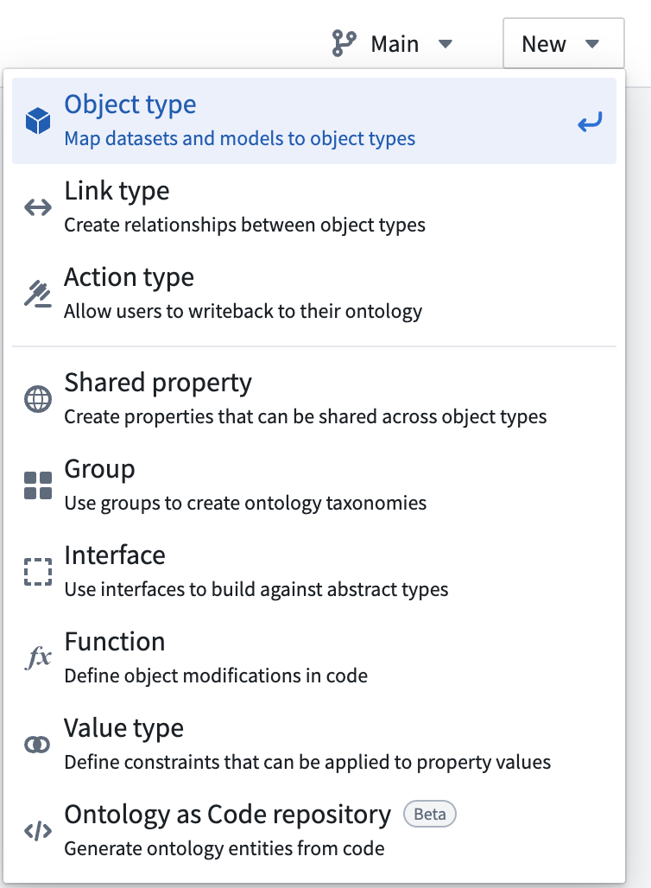

The **Create new object type** helper will appear.

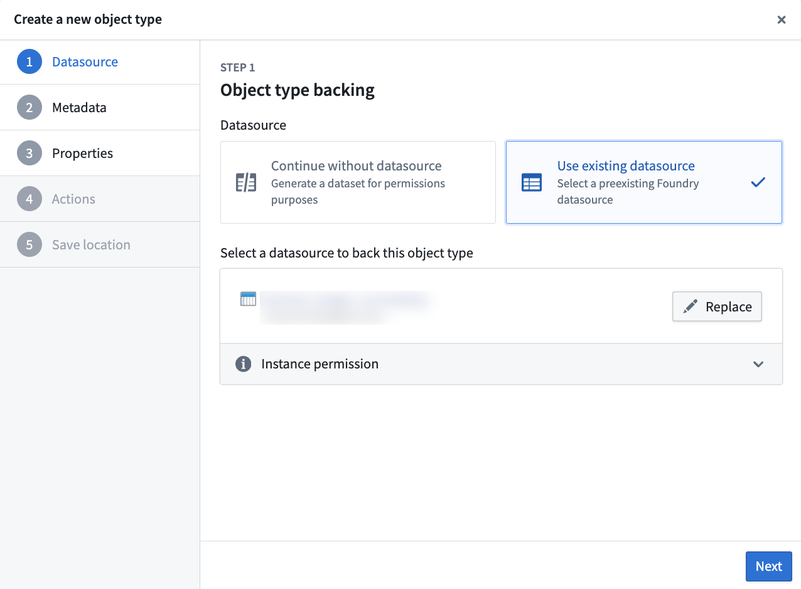

### Choosing a backing datasource

If you have an existing datasource in Foundry containing data to back the object type then you can select it. This will automatically populate the object type's metadata. It will also map every column of the backing datasource to a property, but you can discard added properties in the **Properties** step.

:::callout{theme="warning" title="Warning"}
A backing datasource for an object type may not contain `MapType` or `StructType` columns.
:::

If you do not have an existing datasource containing data for the object type, you can choose to continue without an existing datasource and select a location to generate a dataset for permissions. This option is not available if you are using Object Storage v1. As permissions of the objects of a type are determined by the location of their backing datasources, you will be prompted to choose a location to which you want to save an empty dataset.

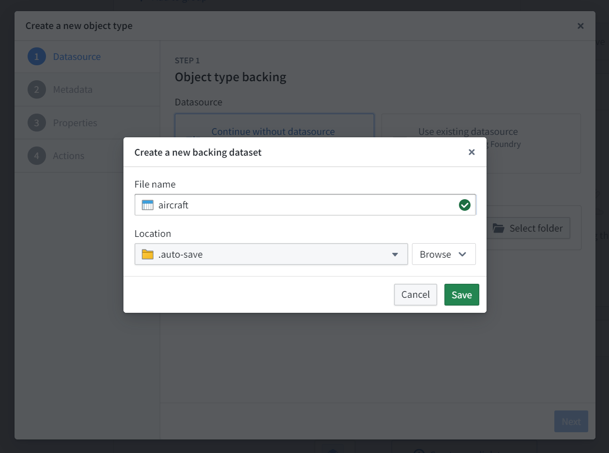

### Object type metadata

In this step, provide the following information regarding your new object type:

* **Icon:** Select the default icon to customize the icon and color of the object type; this icon and color will be displayed in user applications when a user views an object of this type.
* **Name:** The name shown to anyone accessing an object of this type in user applications.
* **Plural name:** The name shown to anyone accessing multiple objects of this type in user applications.
* **Description:** Explanatory text for anyone accessing the objects of this type in user applications. For example, users searching in Object Explorer will view the description of the object type in their search results.
* **Groups:** Choose whether this object type will be part of any groups. This is a mechanism for organizing your ontology, making it easier to filter for the object types you want to work with later.

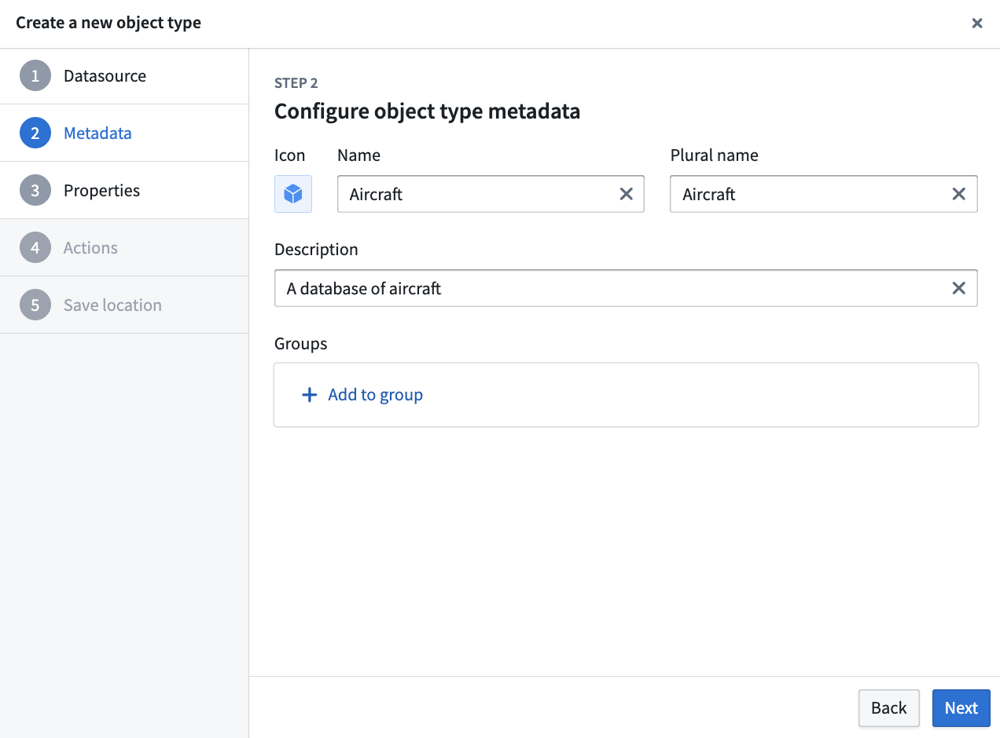

### Create properties for the object type

In the third step of the dialog you can customize which properties the object type will have. If you have chosen an existing Foundry datasource, any columns will be mapped automatically, but can be discarded during this step.

Every object type requires at least one property. This is because object types need a primary key to uniquely identify them. The wizard allows you to add any other desired properties.

Note that property types that require advanced configuration, such as media, cannot be generated as part of the bootstrapping wizard and must be added after you have exited it.

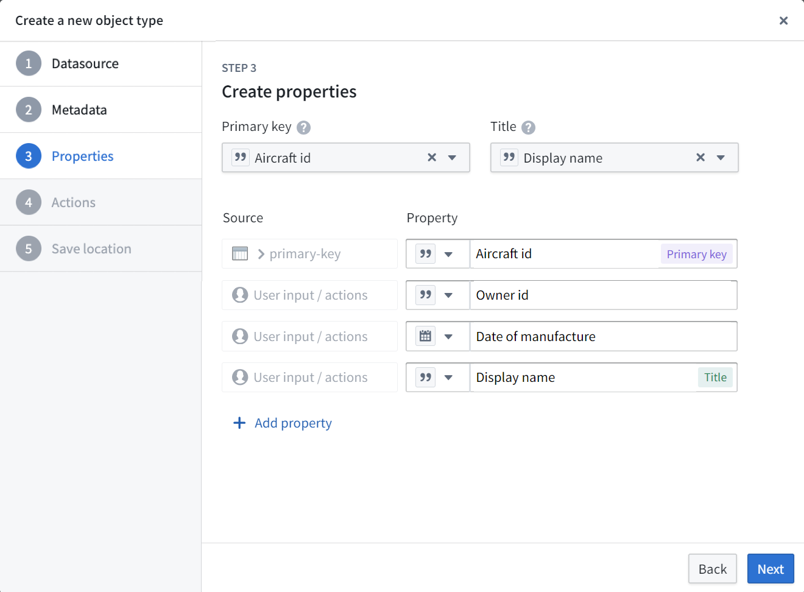

### Configure the primary key and title key

As part of the **Properties** step you need to choose a primary key and title key:

* **Title key:** The property that acts as a display name for objects of this type.
  * For example, selecting the `full name` property as the title key of the `Employee` object type would use the values of that property, such as “Melissa Chang”, “Akriti Patel”, or “Diego Rodriguez” as the display names for each respective notional `Employee` object.
* **Primary key:** The property that acts as a unique identifier for each instance of an object type. Each row in the backing datasource must have a different value for this property.
  * For example, the value of the `employee ID` property will be used to identify “Melissa Chang” as a unique employee within the organization.

A list of supported property types can be found in the [object type properties documentation](/docs/foundry/object-link-types/properties-overview/#supported-property-types).

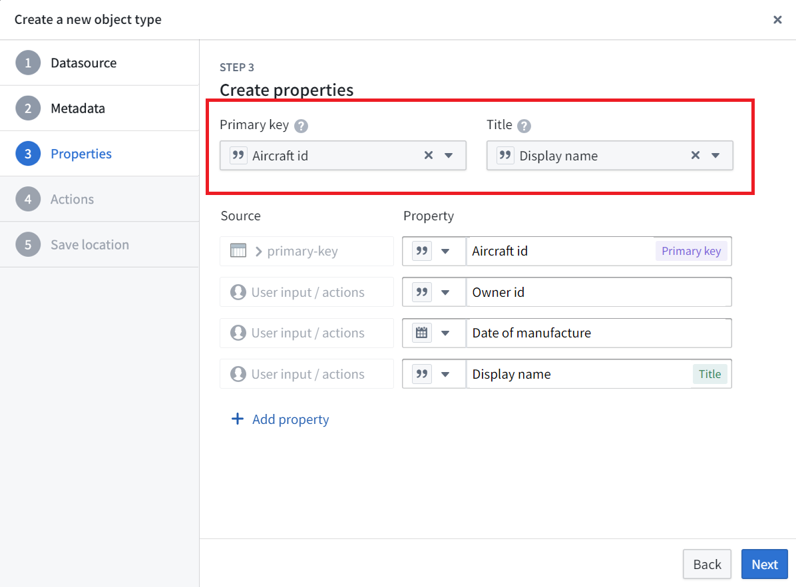

:::callout{theme="warning"}
Be sure to check your backing datasources for duplicates before assigning a primary key. The primary key you select must be unique for every record in the datasource. If your ontology is using [Object Storage v2](/docs/foundry/object-backend/overview/), a duplicate primary key will cause [Funnel batch pipeline](/docs/foundry/object-indexing/funnel-batch-pipelines/) errors leading to a build failure. If you are using Object Storage v1 (Phonograph), an update will appear as successful; however, the duplicate primary keys can cause unexpected changes to your ontology.
:::

:::callout{theme="warning"}
Primary keys should be deterministic. If the primary key is non-deterministic and changes on build, edits can be lost and links may disappear. Edits can be lost because ontology edits are associated with the primary key of the object. Links between objects can disappear if builds are not coordinated to update link IDs. To ensure deterministic primary keys, you should define pipeline logic such that the primary key is the function of either a single column or multiple columns. Avoid using numbered row or random key generation, since these can cause primary keys to change between build runs.
:::

### Generate actions

You can optionally generate a standard set of actions to edit objects of this type and assign a specific user or group that can run them.

Note that you can still make edits to these actions or create new additional actions even if you have finalized the object type and exited the helper.

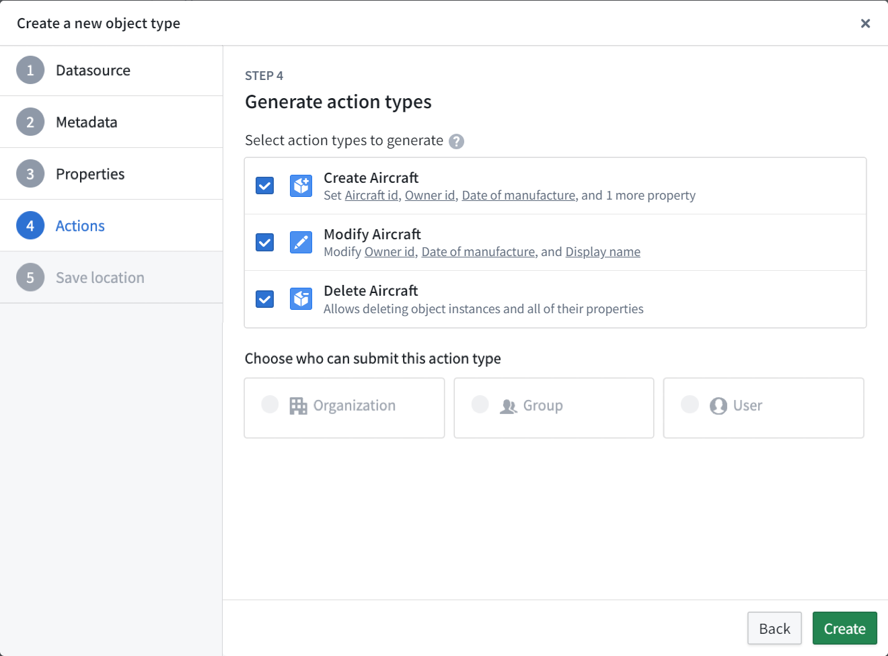

This step is not available if you are using Object Storage v1.

### Save location

In the final step, choose a project to save this object type to. Then, select **Create**. Selecting **Create** will only stage your changes and **will not save** them.

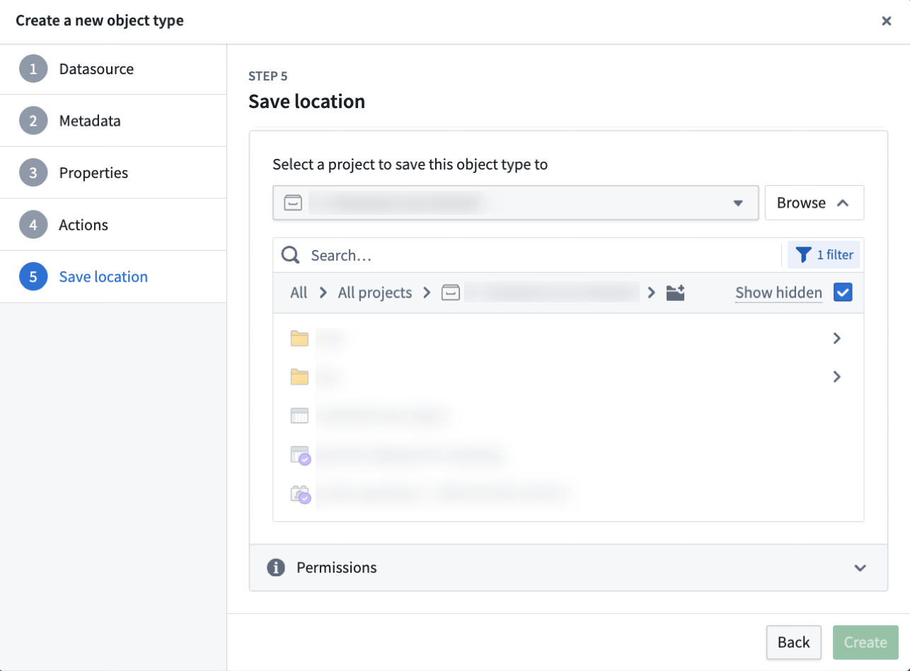

### Save change to ontology

Back in Ontology Manager, select **Save** in the upper right corner to [make the change to your ontology](/docs/foundry/ontology-manager/save-changes/).

## Create a new object type manually

When creating a new object type with the helper, it is possible to select **Create** before completing all the steps in the [**Create a new object type** helper instructions](#create-a-new-object-type-with-the-helper) above. Selecting **Create** before the process is complete will exit the helper and bring you to the **Overview** page.

At this point, the object type is unsaved and cannot be saved until all the steps below have been completed. The steps for completing the creation process manually (outside the **Create a new object type** helper) are described below:

* [Add metadata for a new object type](#add-metadata-for-a-new-object-type)
* [Add a backing datasource to a new object type](#add-a-backing-datasource-to-a-new-object-type)
* [Add a new property](#add-a-new-property)
* [Map a single property to data](#map-a-single-property-to-data)
* [Map all unmapped columns as new properties](#map-all-unmapped-columns-as-new-properties)
* [Configure the primary key and title key](#configure-the-primary-key-and-title-key)

### Add metadata for a new object type

On the **Overview** page’s metadata section, you can edit the object type’s display name, plural display name, description, and ID:

1. **Display name:** The name shown to anyone accessing an object of this type in user applications.
2. **Plural display name:** The name shown to anyone accessing multiple objects of this type in user applications.
3. **Aliases:** Additional terms that will find this object type when users search for them.
4. **Description:** Explanatory text for anyone accessing the objects of this type in user applications. For example, users searching in Object Explorer will view the description of the object type in their search results.
5. **Groups:** One or more labels that help categorize the object type.
6. **ID:** A unique identifier of the object type, primarily used to reference objects of this type when configuring a user application.
   * An ID can contain lowercase letters, numbers, and dashes.
   * The first character of an ID **must** be a lowercase letter.
   * Once a property’s ID is saved and the property is referenced in user applications, **any** change to the property ID will break the application.
7. **Icon:** Select the default icon from the object type view’s sidebar to customize the icon and color of the object type; this icon and color will be displayed in user applications when a user views an object of this type.
8. **Backing datasource:** The source of the data used as property values for objects of this type.

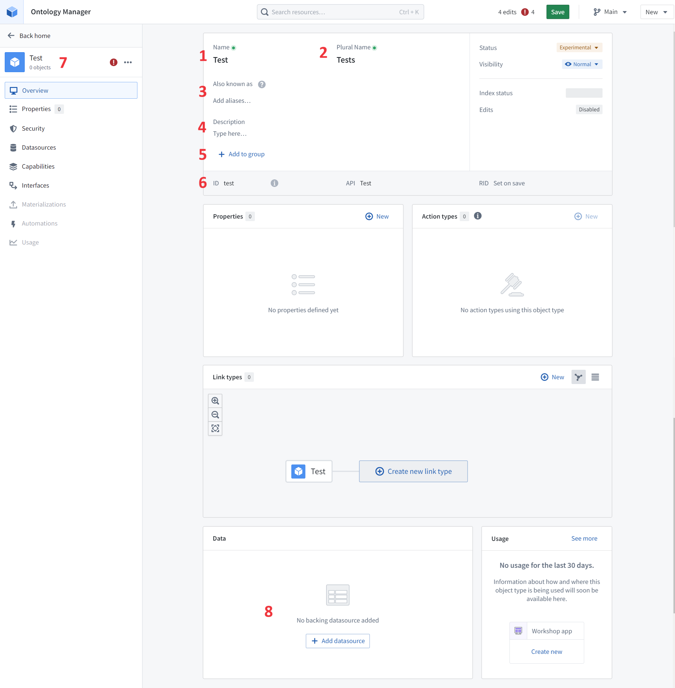

***

### Add a group to an object type

[Groups](/docs/foundry/object-link-types/type-groups/) are labels that help categorize object types. From the object type metadata widget, you can:

* Add a group from a list of existing groups.
* Create a new group by typing the name of that group.
* Remove a group from your object type.

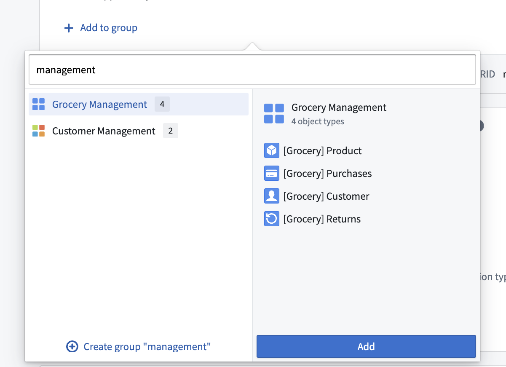

Groups are searchable in the [Ontology Manager's **Search** bar and **Search** bar dialog](/docs/foundry/ontology-manager/navigation/#header-search-bar). The table of object types in the Ontology Manager supports displaying and filtering by group. Groups are also displayed on the [Object Explorer home page](/docs/foundry/object-explorer/getting-started/#group-exploration-b-c-d).

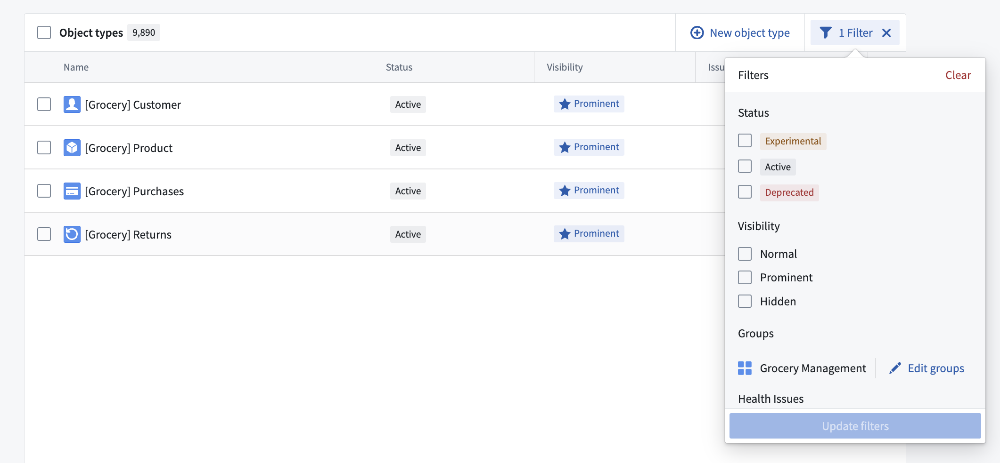

:::callout{theme="warning" title="Warning"}
Groups as labels in object type metadata replace the previous method of adding `oe_home_page_object_type_group` type class to the primary key property; this previous method is no longer available.
:::

***

### Add a backing datasource to a new object type

In order to populate property values for objects of this type with data, you must add a backing datasource. You can do this by:

* Navigating into the Property editor by selecting **Create new** from the **Properties** section of the **Overview** page, or by selecting the **Edit property mapping** button from the **Properties** page of the object type view’s sidebar.
* Then, select the **Add a backing datasource** button as shown in the image below. This will allow you to select any of the available datasources in Foundry as a backing datasource.
  * Note that a single datasource can only be used to back one object type.

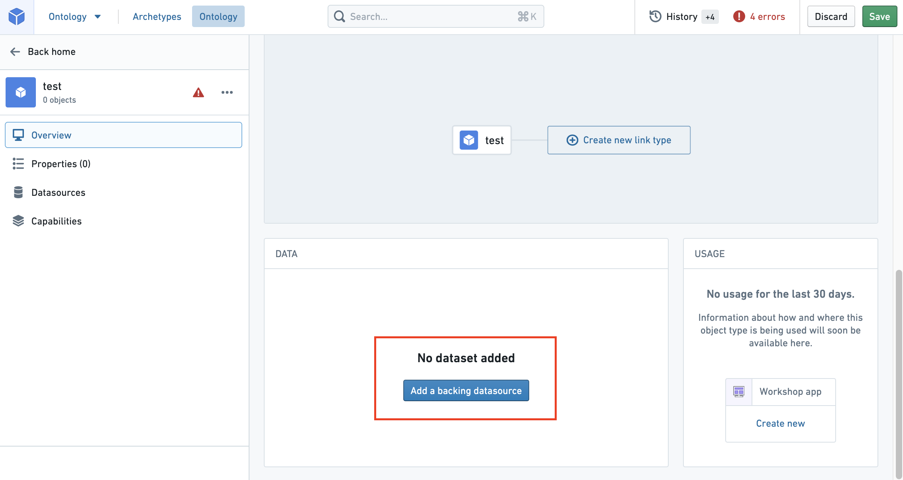

### Add a new property

From within the property editor, select **Add** in the **Properties** pane on the right side of the screen. This will add a new property to the object type.

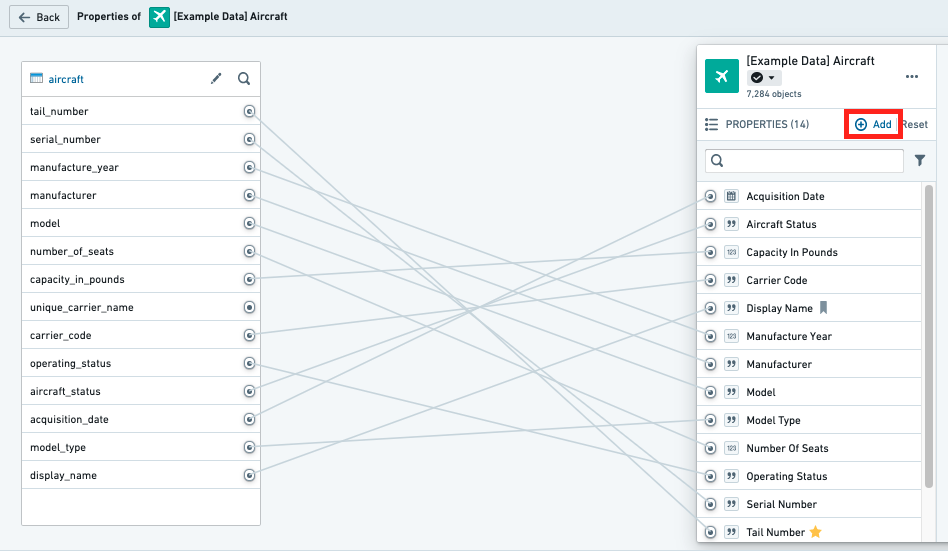

### Map a single property to data

It is possible to map properties to columns in a backing datasource in any of the following ways:

* [Map a column to a new property](#map-a-column-to-a-new-property)
* [Map a column to an existing property](#map-a-column-to-an-existing-property)
* [Map a property to a column](#map-a-property-to-a-column)

#### Map a column to a new property

In the datasource pane on the left side of the screen (see image below), you can see all of the columns of the datasource. Hover over the column you want to map and select the **Add as a new property** button to create a new property mapped to this column. The property ID, display name, and base type will be inferred from the name of the column.

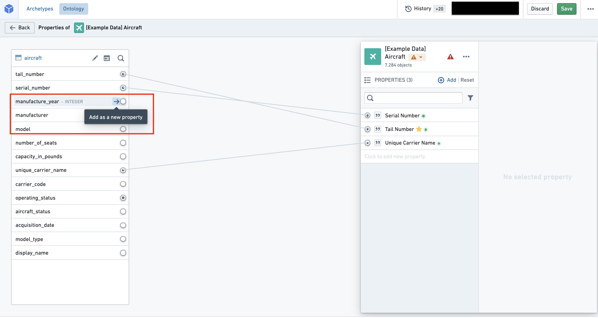

#### Map a column to an existing property

In the datasource pane on the left side of the screen, you can see all of the columns of the datasource. Hover over an unmapped column and select the **Add as a new property** button. If a property already exists with a property ID that matches the column name, the column will be mapped to the existing property.

#### Map a property to a column

In the properties pane on the right side of the screen, hover over the property you want to map to a column and select **Map to a column**. This will open a dropdown from which you can select the column you want to map to your property.

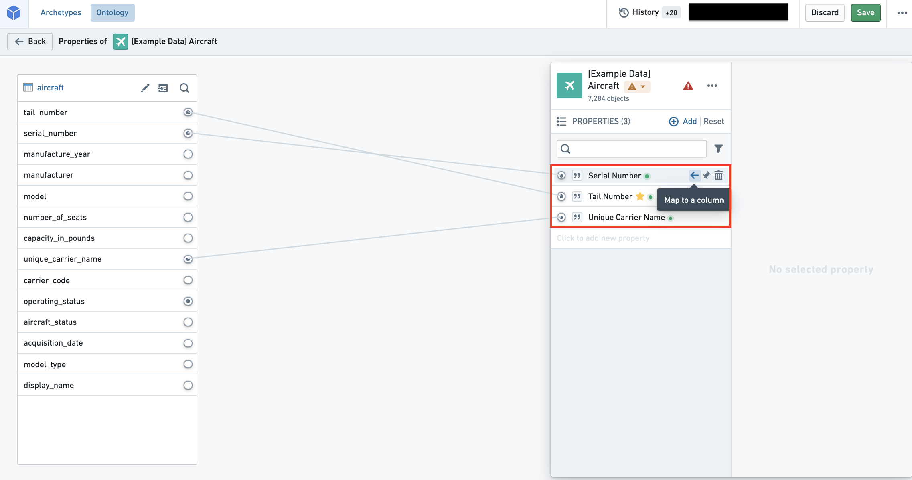

### Map all unmapped columns as new properties

Next to the datasource name in the datasource pane, you will find an **Add all unmapped columns as new properties** button. Selecting the button will create properties for all the unmapped columns in the datasource. The IDs, display names, and base types of the properties will be inferred from the corresponding columns in the datasource.

* Once a property’s ID is saved and the property is referenced in user applications, **any** change to the property ID will break the application.

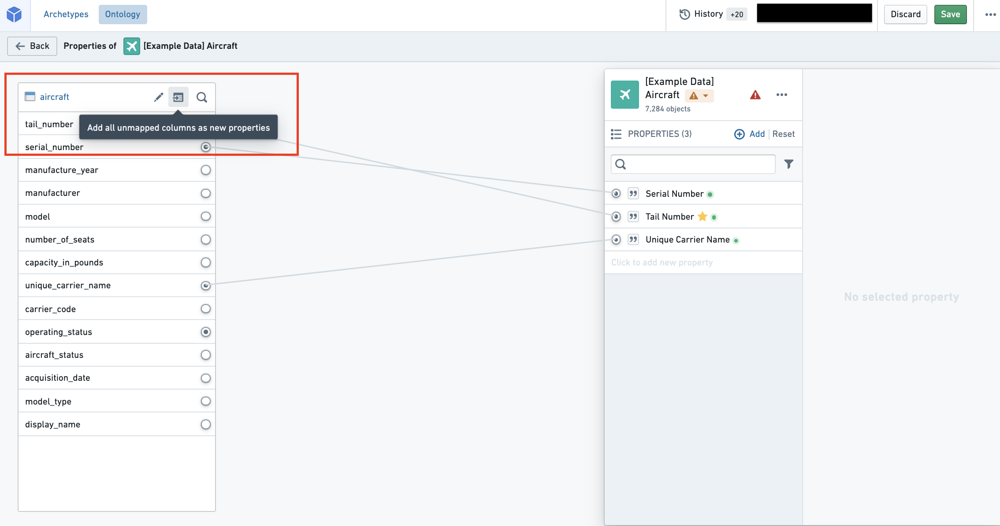

### Configure the primary key and title key

Now that you've created your new object type, added a backing datasource, and mapped it to new properties, you still need to configure the primary key and title key before being able to save your object type. You can navigate to the property metadata pane in the property editor (see image below) to set a property as the primary key and title key:

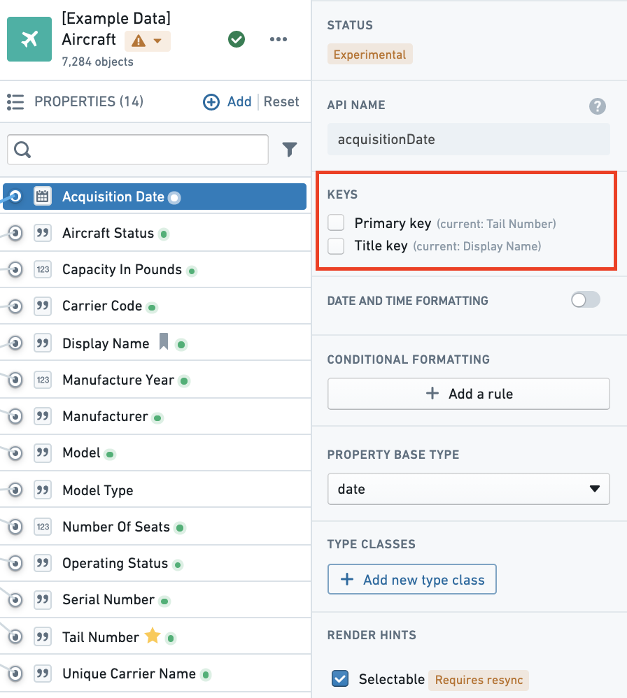

* **Primary key:** The property that acts as a unique identifier for each instance of an object type. Each row in the backing datasource must have a different value for this property.
  * For example, the value of the `employee ID` property will be used to identify “Melissa Chang“ as a unique (notional) employee within the organization.
  * To configure the primary key, select the property you want to assign to the primary key in the properties pane of the property editor and check the **Primary key** option.
  * Edits are permanently attached to the primary key value you made them for. Any time you change the primary key of an object type, you will be prompted to delete all existing edits.
* **Title key:** The property that acts as a display name for objects of this type.
  * For example, selecting the `full name` property as the title key of the `Employee` object type will use the values of that property, such as “Melissa Chang”, “Akriti Patel”, or “Diego Rodriguez” as the display names for each respective notional `Employee` object.
  * To configure the title key, select the property you want to assign to the title key in the properties pane of the property editor and check the **Title key** option.
    Note that until this point, your changes have been staged but **have not yet been saved**. To save your new object type to the Ontology, follow the instructions on [how to save changes to the Ontology](/docs/foundry/ontology-manager/save-changes/).

:::callout{theme="warning"}
Be sure to check your backing datasources for duplicates before assigning a primary key. The primary key you select must be unique for every record in the datasource. If your Ontology is using [Object Storage v2](/docs/foundry/object-backend/overview/), a duplicate primary key will cause [Funnel batch pipeline](/docs/foundry/object-indexing/funnel-batch-pipelines/) errors leading to a build failure. If you are using Object Storage v1 (also known as Phonograph), an update will appear as successful; however, the duplicate primary keys can cause unexpected changes to your Ontology.
:::

## Configure API names

An API name is the name used when referring to an object type or a property programmatically in code. All new object types and properties are automatically assigned API names that are inferred from their display names. [Learn more about API names.](/docs/foundry/functions/api-objects-links/)

You can change the automatically assigned API names as follows:

* An object type’s API name can be edited in the object type’s **Overview** page.
* A property’s API name can be edited in the properties pane of the property editor.

### Naming guidelines

Object type API names follow functional coding standards. An object type’s API name must:

* Begin with an uppercase character and consist of only alphanumeric characters.
* Be written in PascalCase (also known as UpperCamelCase, in which the first letter of each word in a compound word is capitalized; for instance, “ThisExampleName”).
* Be unique across all object types.
* Be between 1 and 100 characters long.

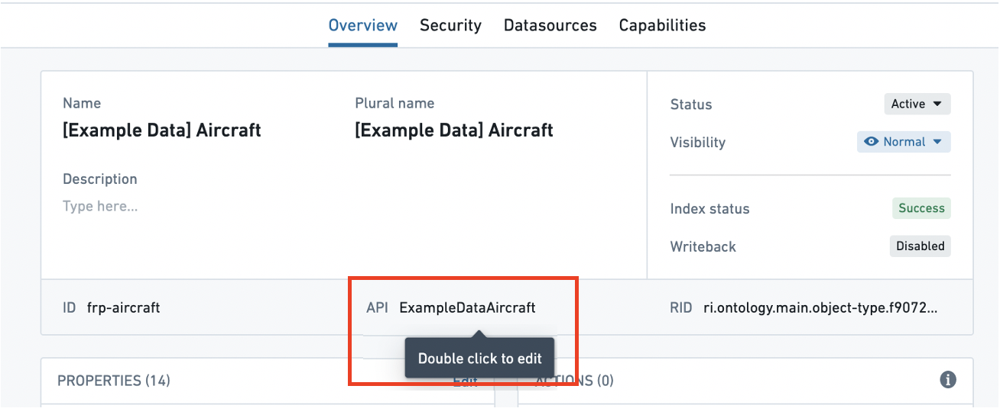

A property’s API name must:

* Begin with a lowercase character and consist of only alphanumeric characters.
* Be written in camelCase (in which the first letter of each word after the first word in a compound word is capitalized; for instance, “thisExampleName”).
* Be unique across all properties belonging to the same object type.
* Be between 1 and 100 characters long.

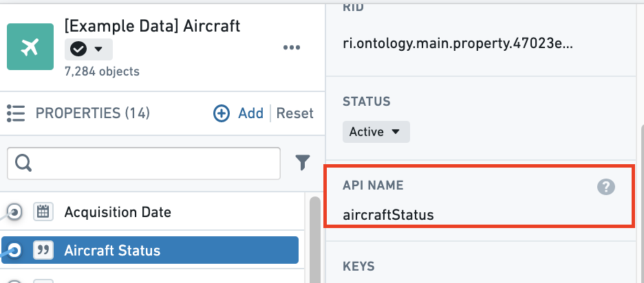

## Troubleshooting

### Mandatory object type fields

To save a new object type, the following object type fields must not be empty:

* ID
* Display name
* Plural display name
* Backing datasource
* API name

Additionally, the following property fields must not be empty:

* Property ID
* Property display name
* Backing column
* Property API name
* Title key
* Primary key

### Valid ID checklist

#### Object type ID

Object type IDs:

* Can be made up of lowercase letters, numbers, and dashes.
* Should start with a letter.
* Must be unique across all object types.

#### Property type ID

Property type IDs:

* Can be made up of lowercase or uppercase letters, numbers, dashes, and underscores.
* Should start with a letter.
* Must be unique across all properties that belong to the same object type.

#### API name

In line with functional coding standards, an object type’s API name must:

* Consist of only alphanumeric characters and underscores.
* Be unique across all object types.
* Be between 1 and 100 characters long.

A property’s API name must:

* Be valid Unicode.
* Be unique across all properties belonging to the same object type.
* Be between 1 and 100 characters long.

Note that there are a number of reserved keywords that cannot be used for API names. They are: `ontology`, `object`, `property`, `link`, `relation`, `rid`, `primaryKey`, `typeId`, and `ontologyObject`.

### Errors

#### Error: `Phonograph2:DatasetAndBranchAlreadyRegistered`

If you receive the error `Phonograph2:DatasetAndBranchAlreadyRegistered`, the datasource backing the object type you are trying to save is already backing a different object type in the Ontology and cannot be used again.
