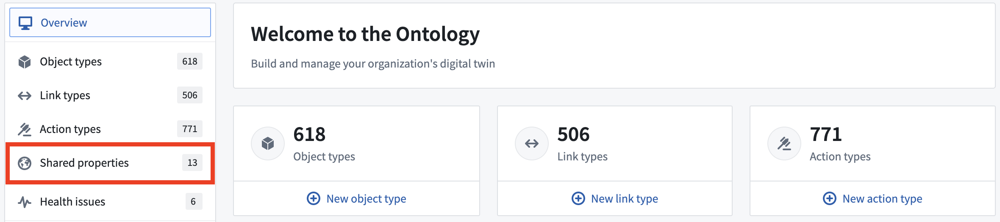
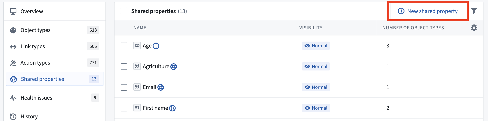
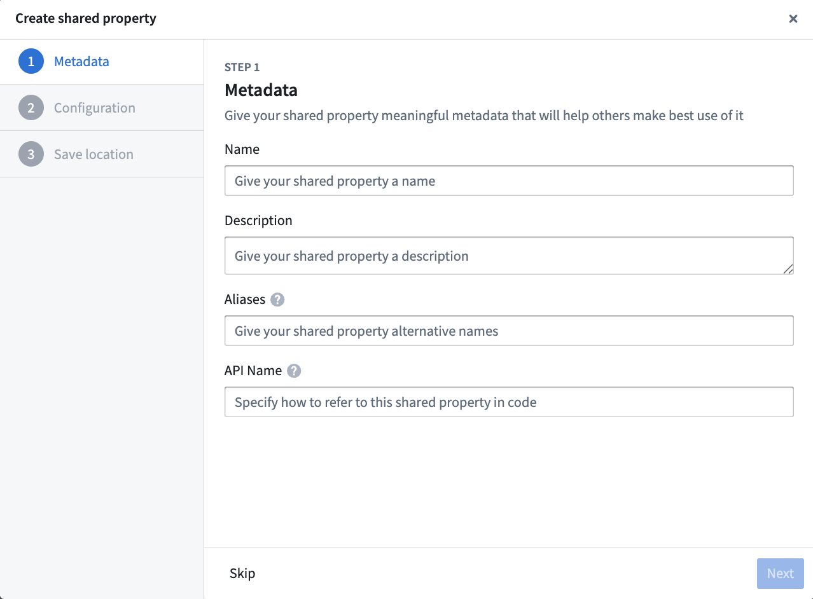

<!-- source: https://palantir.com/docs/foundry/object-link-types/create-shared-property/ · mirrored 2026-08-22 from Palantir Foundry docs -->

# Create a shared property

Create and configure a new shared property from the shared property page in the Ontology Manager application.

To access the page, follow the steps below:

1. Select the **Shared properties** menu option in Ontology Manager.

2. Once on the shared property page, select **New shared property** at the top right.

3. This will open the shared property creation modal, where you can configure the name, description, type, and other metadata to create the shared property.

A shared property can be configured with a subset of regular property metadata:

* **Name:** The name for the shared property.
* **Description:** Explanatory text about the shared property. For example, the description of the `start date` shared property may be `The day the employee or contractor began working`.
* **Base type:** Indicates the type of values for this property and determines the set of operations available in user applications. For example, the `start date` property will have base type `date`. User applications will allow you to configure a timeline widget with this property. Base types are related to the underlying column type and must match the column type in order to be applied on an object type
* **Value formatting:** Depending on the base type of the property, numeric formatting, date and time formatting, user ID, and resource ID formatting are available to apply to the property, transforming its raw values into more readable versions in user applications. Learn more about [value formatting](/docs/foundry/object-link-types/value-formatting/).
* **Type classes:** Additional metadata that are interpreted by user applications. Learn more about [type classes](/docs/foundry/object-link-types/metadata-typeclasses/).
* **Render hints:** Indications to user applications about how to render the property that may be different than most properties of the same base type. Many render hints can be used to impact the performance of reindexes of the object type on which the property is defined. For example, if you do not expect any users to search or sort on the `start date` property in user applications, you can deselect the `searchable` and `sortable` render hints and improve the reindex performance of the `Employee` object type. Learn more about [render hints](/docs/foundry/object-link-types/metadata-render-hints/).
* **Visibility:** An indication to user applications for how prominently to display the property. A `prominent` property will lead applications to show this property first to users. A `hidden` property will not appear in user applications. By default, the `start date` property will have `normal` visibility.

4. To persist the shared property to the Ontology, select **Save** in the upper right of the Ontology Manager.
