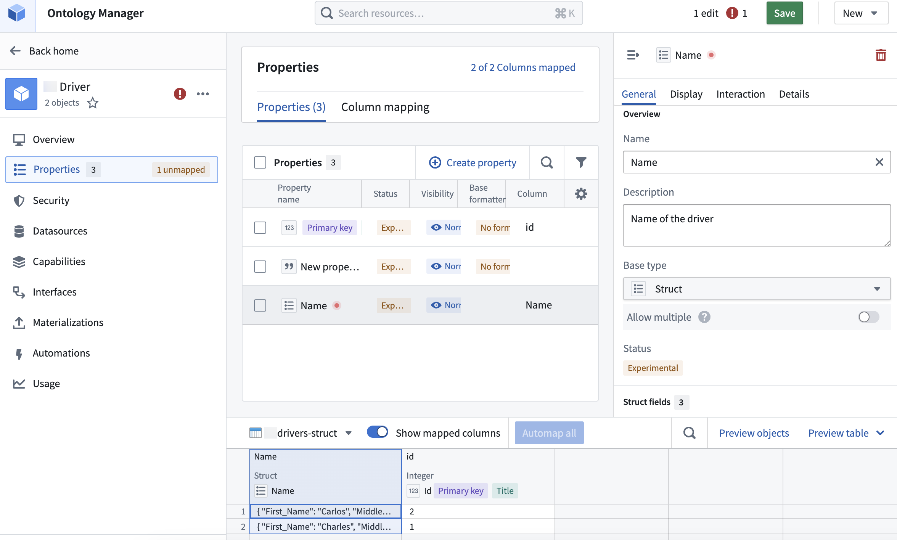
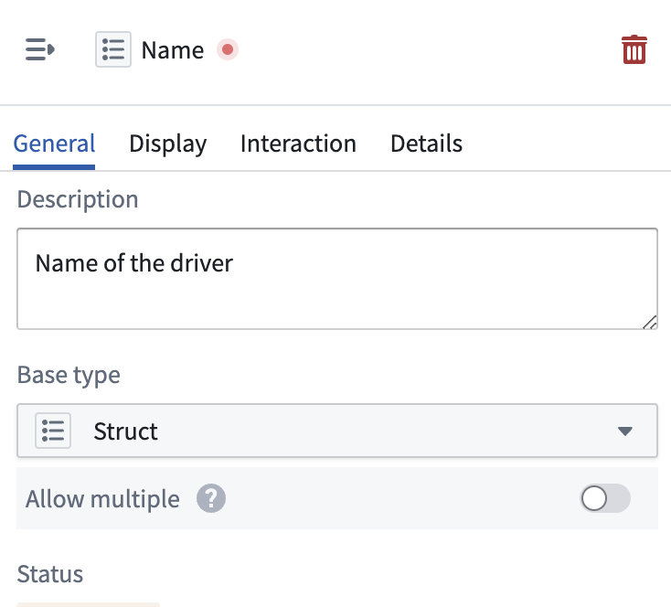
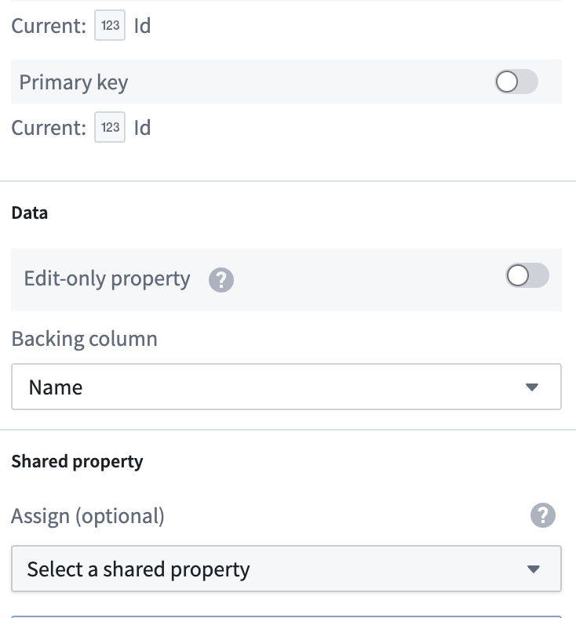
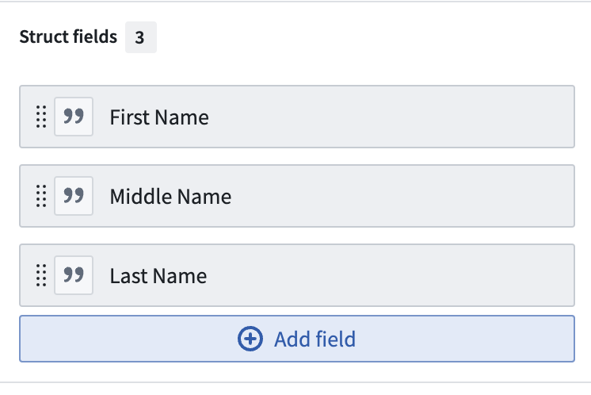

<!-- source: https://palantir.com/docs/foundry/object-link-types/create-struct-type/ · mirrored 2026-08-22 from Palantir Foundry docs -->

# Create a struct property type

Create and configure a new struct property from the **Object types** page in Ontology Manager. For more information about struct properties, see the [overview](/docs/foundry/object-link-types/structs-overview/).

1. In Ontology Manager, open the **Object types** tab in the left sidebar and select an existing object type.
2. In the object type details page, open the **Properties** tab in the left sidebar, and select the **Create property** button on the top right of the **Properties** table.

3. In the **Property editor** panel, add a name and description, and select **Struct** from the **Base type** dropdown menu.

4. Scroll down to the **Data** section and select a **Backing column** from the dropdown.

5. In the **Struct fields** section, select **Add field**, then **New field**.

6. Name the new struct field and optionally add a description.
7. Lastly, map a column from a datasource to the new struct field.
