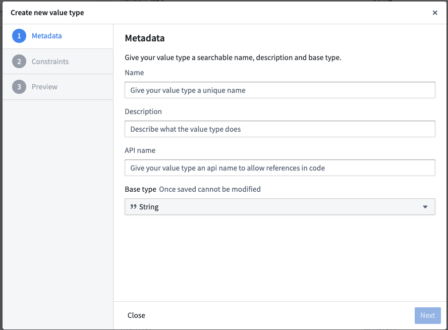
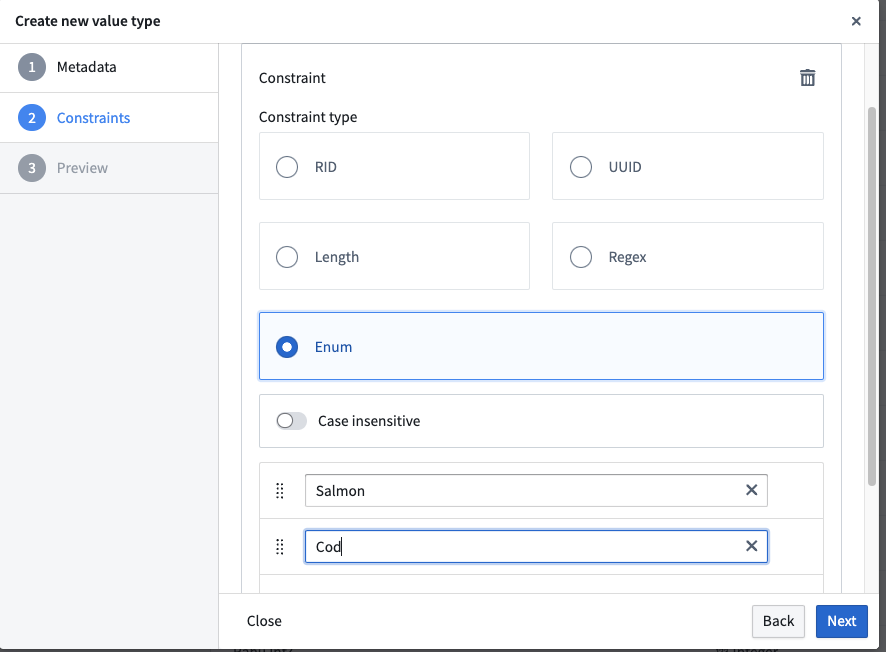
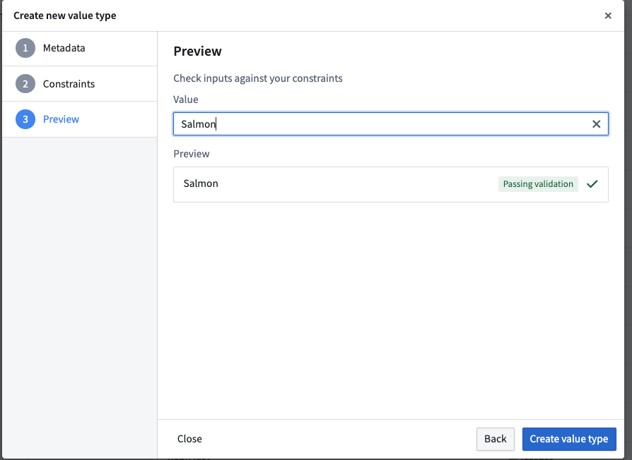

<!-- source: https://palantir.com/docs/foundry/object-link-types/create-value-type/ · mirrored 2026-09-04 from Palantir Foundry docs -->

# Create a value type

Follow the steps below to create a value type to use across your platform [space](/docs/foundry/security/orgs-and-spaces/#spaces).

1. Navigate to the **Value Types Manager** application from the platform sidebar.
2. From the top left corner, use the dropdown menu to select the space in which you would like to create a value type.
3. Select **Create New Value Type** from the upper right corner.
4. Provide a clear name, description, and unique API name for your value type.

5. Choose a [base type](/docs/foundry/object-link-types/base-types/) for your value type.
6. (Optional) Define a constraint for your value type. Validation methods include regular expressions for `String` types, enumerated values, ranges, and other methods depending on the base type.
   For a full list of constraints supported by base type, review our [value type constraints](/docs/foundry/object-link-types/value-type-constraints/) documentation.
   When you define a constraint, configure the **Failure validation message** that appears when a value does not satisfy the constraint.

7. (Optional but recommended) Provide an example preview value for your value type.

8. Save your value type.
