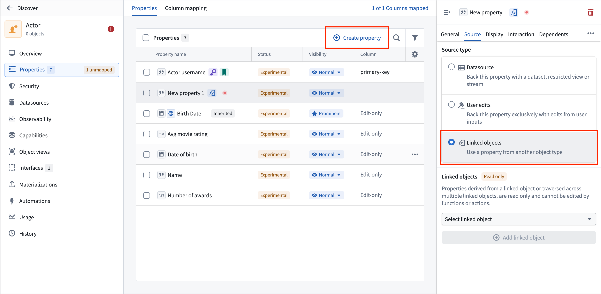
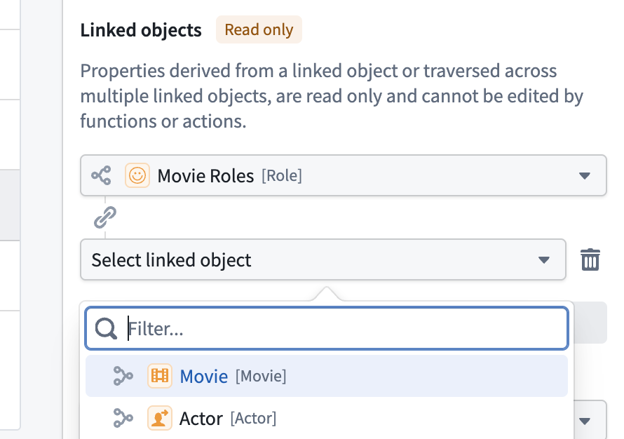
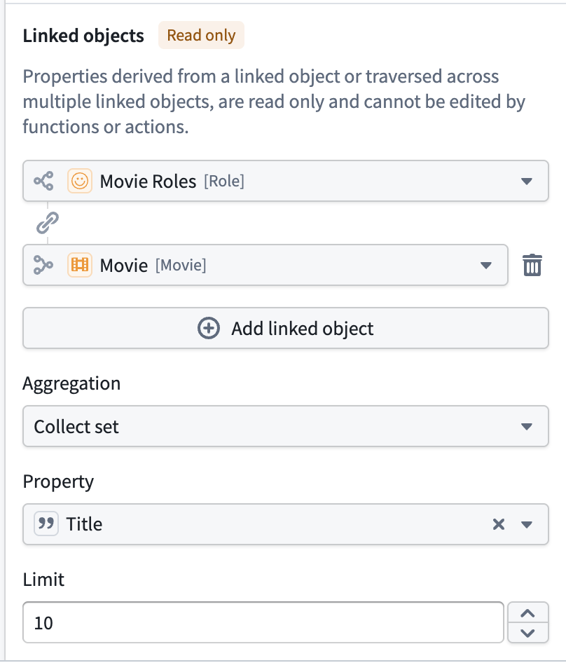
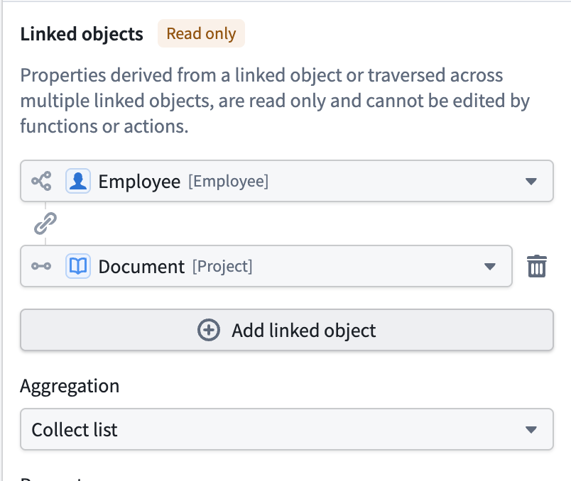

<!-- source: https://palantir.com/docs/foundry/object-link-types/derived-properties/ · mirrored 2026-09-04 from Palantir Foundry docs -->

# Configure derived properties

:::callout{theme="neutral" title="Beta"}
Derived properties are in the [beta](/docs/foundry/platform-overview/development-life-cycle/) phase of development and may not be available on your enrollment. Functionality may change during active development.
:::

## Overview

Derived properties are properties that are calculated at runtime based on values from linked objects. Instead of storing data directly, a derived property pulls information from objects connected through link types, optionally applying aggregations like averaging, counting, or collecting values into lists.

For example:

* A `Department` object type could have a derived property for "Average employee salary" that aggregates salary values from all linked `Employee` objects.
* A `Project` object type could have a derived property for "Lead engineer name" that retrieves the name from a single linked `Engineer` object.
* An `Order` object type could have a derived property for "Product names" that collects all product names from linked `Product` objects into a list.

Derived properties are **read-only** and cannot be edited by functions or actions. These properties use the security context of all objects involved in the calculation, ensuring users only see information for which they have access authorization.

## Configure a derived property

To configure a derived property on an object type, follow the steps below.

### 1. Open the property configuration panel

From the **Properties** tab of your object type, select **New property** or click on an existing property to edit it. This opens the property configuration side panel.

### 2. Navigate to the Source tab

In the property configuration side panel, select the **Source** tab to configure where the property gets its values.

### 3. Select the Linked objects source type

In the **Source type** section, choose the **Linked objects** option. This enables derived property configuration.

### 4. Select a link type

In the **Linked objects** section, select a link type from the dropdown. This determines which objects the property will derive values from.

* The dropdown menu shows all available link types from your current object type.
* After selecting a link type, you can optionally add additional link types to traverse multiple levels of connections (up to 3 levels).
* Use **Add linked object** to traverse through another level of linked objects.

### 5. Configure aggregation (if needed)

If any link in your chain has a "many" cardinality (one object linking to multiple objects), you must select an **Aggregation** to combine the values:

Available aggregations:

* **Count:** Count the number of linked objects.
* **Average:** Calculate the average of numeric values.
* **Sum:** Calculate the sum of numeric values.
* **Minimum:** Select the minimum value.
* **Maximum:** Select the maximum value.
* **Approximate cardinality:** Estimate the number of unique values.
* **Exact cardinality:** Count the exact number of unique values.
* **Collect list:** Collect all values into an ordered list (preserves duplicates).
* **Collect set:** Collect all unique values into an unordered set.

### 6. Select the property to derive

After selecting a link type (and aggregation if needed), choose which property from the linked object type you want to derive:

* The dropdown menu shows all available properties from the final object type in your link chain.
* For **Count** aggregation, you do not need to select a property as objects are automatically counted.

### 7. Configure collection limit (for collect aggregations)

If you selected **Collect list** or **Collect set** as your aggregation, you can optionally set a limit on the number of items collected. The default limit is 10 items.

## Multi-hop derived properties

Derived properties support traversing up to **3 levels** of linked objects. This allows you to derive properties from objects that are indirectly connected to your starting object type.

For example:

* A `Department` object type could derive "Project names" by traversing through `Employee` objects to their linked `Project` objects.
* The link chain would be: Department → Employee → Project

To configure multi-hop:

1. Select your first link type.
2. Select **Add linked object** to add another level.
3. Select the next link type from the newly-connected object type.
4. Repeat up to 3 levels total.

### Known limitations

* **OSv1 support:** Queries with derived properties may not contain any object types indexed using [OSv1](/docs/foundry/object-backend/osv1-osv2-migration/).
* **Text search:** Derived properties cannot be used in text search or keyword filters.
* **Structs in OSDK:** In current versions of the TypeScript OSDK, queries with derived properties may not contain any [struct](/docs/foundry/object-link-types/structs-overview/) property types. You can use a `$select` operation to exclude struct properties.
* **Inline actions:** Properties with inline actions configured cannot be converted to derived properties.
* **Value types:** Properties with value types cannot be converted to derived properties.
* **Required properties:** Derived properties cannot be marked as required (non-nullable).
* **Property type constraints:** Derived properties cannot have property type constraints.
* **Display formatting:** Derived properties cannot have rule set bindings or base formatters.
* **Primary keys:** Primary key properties cannot be derived properties.
* **Ontology condition:** Derived properties are not supported for the Default ontology.
