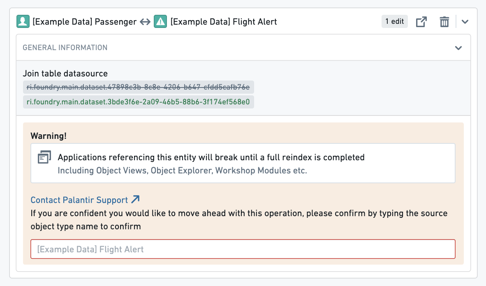
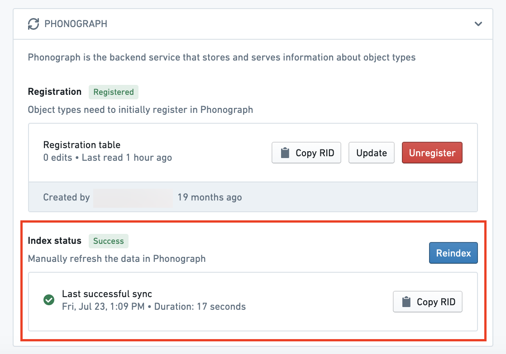
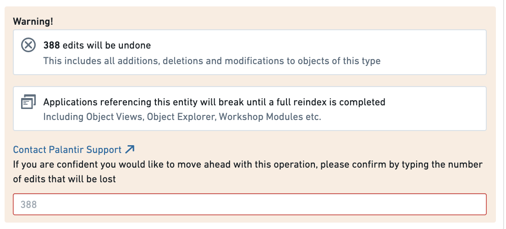
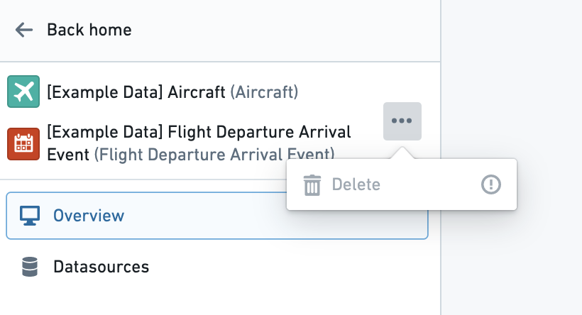
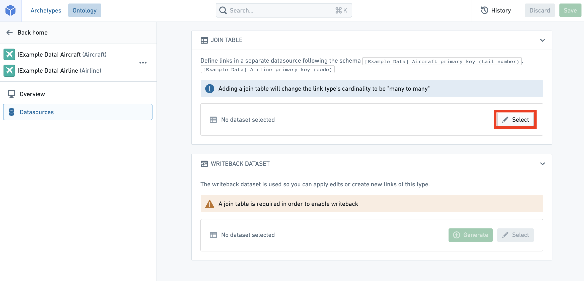
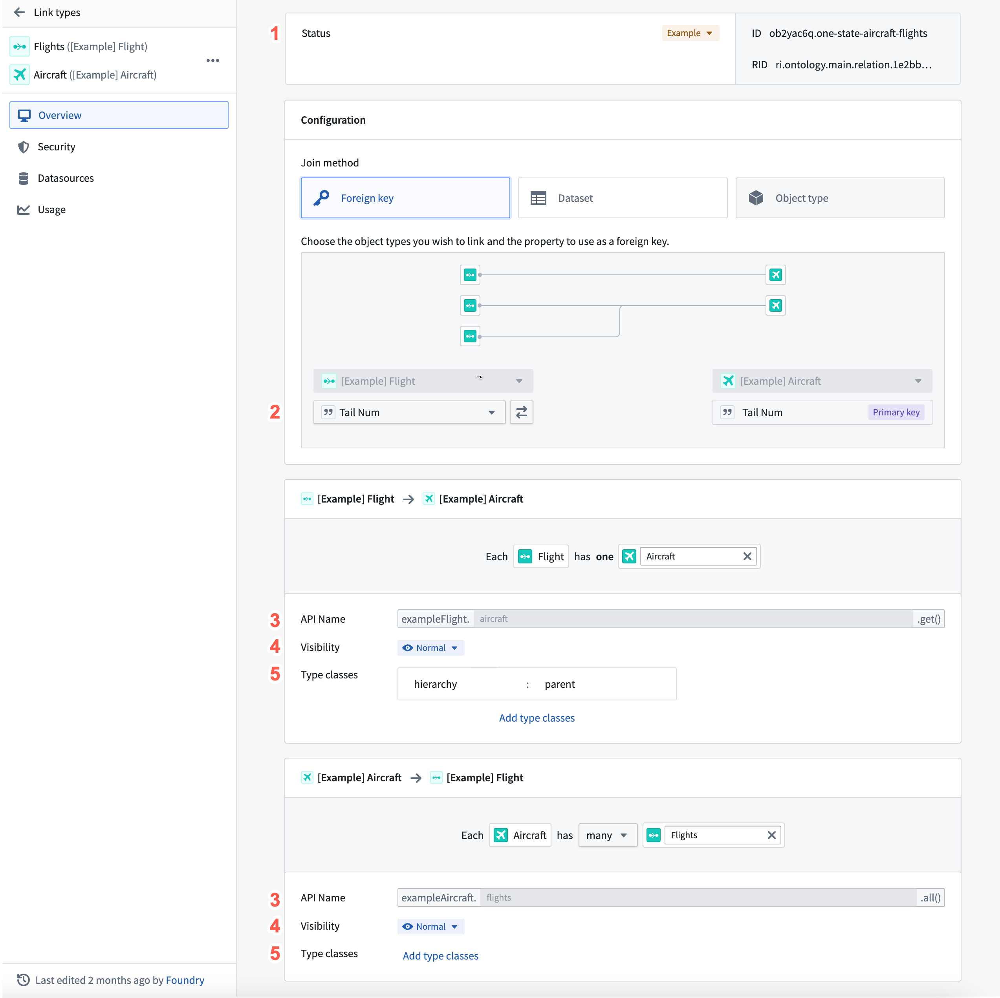

<!-- source: https://palantir.com/docs/foundry/object-link-types/edit-link-types/ · mirrored 2026-08-22 from Palantir Foundry docs -->

# Edit link types

:::callout{theme="warning" title="Warning"}
Editing a link type can have **application-breaking consequences** that can disrupt user workflows. Read the section below on [potential breaking changes](#potential-breaking-changes) **before** proceeding with any link type edits.
:::

## Potential breaking changes

### Link type without writeback

Changes that require Object Storage v1 (Phonograph) to unregister and reregister the backing datasource of a link type will make the links of that type **unavailable** in user applications during that reindex time; these changes are described below.

The following changes will unregister and reregister (or delete) the backing datasource of a link type when saved:

* Changing a many-to-many link type’s backing datasource.
* Changing the cardinality of a link type.
* Changing the foreign key of a link type.
* Deleting a link type.

When you try to save any of these changes, you will be warned about the potential impact on user applications.

For example, if a link type is used in a search around in a Workshop application, that Workshop application will be broken until the reindex completes. You can track the progress of the reindex for a link type in the **Phonograph** pane of its **Datasources** page.

[Learn more about Object Storage v1 (Phonograph).](/docs/foundry/object-databases/object-storage-v1/)

### Link type with writeback

If a link type has writeback enabled, extra precaution should be taken when making edits to that link type. The history of edits made to a link type are stored in Object Storage v1 (Phonograph). Every time a writeback dataset is built, the history of edits is reapplied to get the final state of edited links in the writeback dataset. When the backing datasource of a link type is unregistered from Object Storage v1 (Phonograph), the history of edits in Object Storage v1 (Phonograph) is deleted and future builds of the writeback dataset will fail.

In addition to the changes that require unregistering that were listed in the [previous section](#link-type-without-writeback), unregistering is required for link types with writeback when schema changes are made to **any** column of a backing datasource to a link type that has **ever** received edits, even if does not currently receive edits. Schema changes include changes to the name and base type of the column.

:::callout{theme="warning" title="Warning"}
Object Storage v1 (Phonograph) will **not** automatically unregister the backing datasource of a link type in response to one of these schema changes. Instead, the reindex will fail and will only succeed if the saved schema changes are undone, or if you manually unregister and reregister the backing datasource of a link type in the Phonograph pane of the link type’s Datasources page.
:::

When you try to save any changes that risk erasing the edits history, you will be warned about the potential impact on edits.

Now that you understand the considerations in editing existing link types, you can safely make your changes.

## Edit an existing link type

* [Navigate to an existing link type](#navigate-to-an-existing-link-type)
* [Delete a link type](#delete-a-link-type)
* [Change a backing datasource](#change-a-backing-datasource)
* [Edit a link type’s metadata](#edit-a-link-types-metadata)

### Navigate to an existing link type

You can always change the link type you are working on by selecting the link type page from the home page sidebar and selecting a different link type from the list. You can also always search for a new link type in the search bar in the application header. Read more about [navigation](/docs/foundry/ontology-manager/navigation/).

### Delete a link type

You can delete an object type by selecting the  (three dots) icon at the top right of the link type view sidebar (see image below) and then selecting the **Delete** option from the dropdown. A dialog will pop up to confirm you want to stage the link type for deletion.

* Note that the deletion of the link type only takes effect after you save your changes, and will break any views or applications referencing the object type.
* Note that link types with an `active` status cannot be deleted. Read more about [statuses](/docs/foundry/object-link-types/metadata-statuses/).

### Change a backing datasource

You can change a backing datasource:

1. Navigate to the **Datasources** page of the link type view.
2. Select the  **Select** icon next to the existing datasource. This will allow you to browse and select available datasources in Foundry.

:::callout{theme="warning" title="Warning"}
Changing the backing datasource of a link type will remove any connection between columns in the old datasource and the keys that define your link type. Keys will be automatically remapped for you **only if** you change to a new datasource with the **same schema** as the old datasource. Otherwise, you will need to remap the keys to the new datasource.
:::

### Edit a link type’s metadata

1. **Status:** Select the existing status at the top of the link type pane to open a dropdown of available statuses. Select from the `deprecated`, `experimental`, and `active` statuses.
   * Read more about [statuses](/docs/foundry/object-link-types/metadata-statuses/).
2. **Key:** Select from the dropdowns to change foreign keys, or column mappings in a many-to-many link type.
   * Note that in a link type with many-to many cardinality, the columns in the backing datasource must map to the primary keys of the object types. If the type of the primary key property of the object type is not the same as the type of the column it is being mapped to in the link type’s backing datasource, an error will prevent you from saving.
   * In a link type with any other cardinality, the application requires that the key of one of the object types must map to the Primary key of that object type, ensuring that the “one” side of the Cardinality is unique.
3. **API name:** Select into the existing API name to change its value.
   * Note that you cannot change the API name for link types with an `active` status.
     * Read more about [statuses](/docs/foundry/object-link-types/metadata-statuses/).
     * Read more about [valid API names](/docs/foundry/object-link-types/create-object-type/#configure-api-names).
4. **Visibility:** Check the visibility from the link visibility list. A `prominent` link type will prompt applications to show this link type first to users. A `hidden` link type will not appear in user applications.
5. **Type classes:** Apply type classes as additional metadata that can be interpreted by applications.
   * Consult the [list of available type classes](/docs/foundry/object-link-types/metadata-typeclasses/) for more information.
