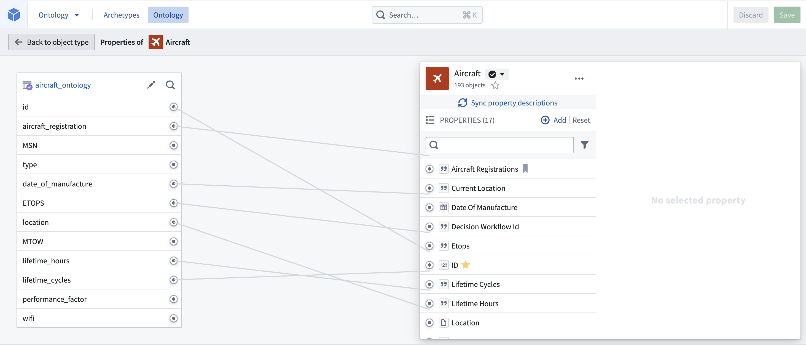
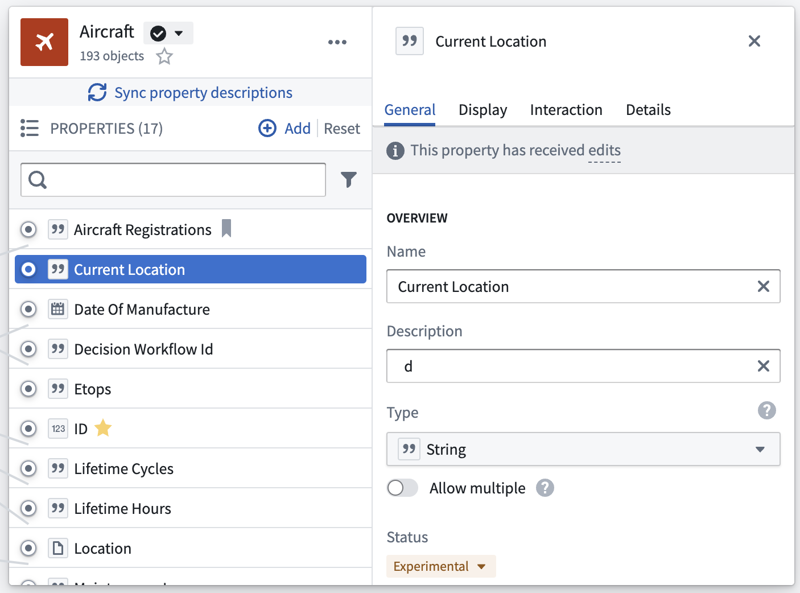
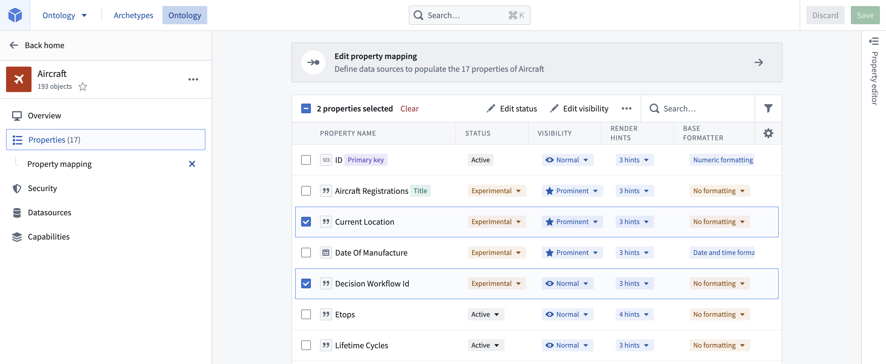

<!-- source: https://palantir.com/docs/foundry/object-link-types/edit-properties/ · mirrored 2026-08-22 from Palantir Foundry docs -->

# Edit object type properties

### Delete a property

From within the property editor, in the properties pane, hover over the property you want to delete and select **Delete property**.

* Note that the deletion of the property only takes effect after you save your changes, and will break any views or applications referencing the property.
* Properties with an `active` status **cannot** be deleted.
  * Read more about [statuses](/docs/foundry/object-link-types/metadata-statuses/).

### Change the column backing a property

From within the property editor, in the properties pane, hover over the property you want to unmap and select **Unlink property**. To link the property to a new column, hover over the property and select **Map to a column**.

### Edit a property type’s metadata

You can edit metadata for a property type by selecting the property type, as shown in the image below.

The available options for editing property metadata are clustered into four different tabs which give access to the following configurations:

1. **Display name and description:** Select into the existing display name or description to edit the text.
2. **Status:** Select the existing status to open a dropdown of available statuses. Choose from the `deprecated`, `experimental`, and `active` statuses.
   * Read more about [statuses](/docs/foundry/object-link-types/metadata-statuses/).
3. **API name:** Select into the existing API name to change its value.
   * Note that you **cannot** change the API name for properties with an `active` status.
     * Read more about [statuses](/docs/foundry/object-link-types/metadata-statuses/).
     * Read more about [valid API names](/docs/foundry/object-link-types/create-object-type/#api-name).
4. **Keys:** Indicate whether a property is the object type’s title key or primary key.
   * Note that you **cannot** change the primary key of an object type with an `active` status.
     * Read more about [keys](/docs/foundry/object-link-types/create-object-type/#configure-the-primary-key-and-title-key) and about [statuses](/docs/foundry/object-link-types/metadata-statuses/).
5. **Value formatting:** Apply a special formatter to the values of a property to make them more readable in applications.
   * Read more about [value formatters](/docs/foundry/object-link-types/value-formatting/).
6. **Conditional formatting:** Apply rules to a property that dictate how it will be rendered in applications.
   * Read more about [conditional formatting](/docs/foundry/object-link-types/conditional-formatting/).
7. **Property base type:** Select the property’s base type from the dropdown. The type of the property constrains the possible set of operations that can be done on the property’s values.
   * For example, a property with base type `timestamp` can be shown in a timeline widget in Object Explorer.
   * You will receive an error if the type of a property is not compatible with the type of its backing column.

:::callout{theme="warning"}
If you make a change to object property types, you must also update the type expected by Actions that interact with property on that object. To do this, open the Action in Ontology Manager and edit the expected type.
:::

8. **Type classes:** Apply type classes as additional metadata that can be interpreted by applications.
   * See the [type classes documentation](/docs/foundry/object-link-types/metadata-typeclasses/) for a list of available type classes.
9. **Render hints:** Select render hints from the supplied checklist that you want applied to a property in order to improve how a property value is rendered and indexed into Object Storage v1 (Phonograph).
   * See the [render hints documentation](/docs/foundry/object-link-types/metadata-render-hints/) for descriptions of the available render hints.
10. **Visibility:** Select the existing visibility to open a dropdown of available visibilities. A `prominent` property will lead applications to show this property first to users. A `hidden` property will not appear in user applications.

After making a change to property metadata, initiate a re-index of the affected object to update the Ontology.

### Bulk edit multiple properties

You can select multiple properties in the property editor by holding the **Cmd/Ctrl** key while selecting properties. Once multiple properties are selected, the following bulk editing actions become available:

* Changing base type.
* Adding/removing of type classes.
* Changing render hints.
* Changing visibility.
* Adding/removing value formatting.

You can also bulk edit some of the above fields from outside of the property editor, by selecting the **Properties** page from the sidebar of an object type view. Simply select the checkboxes next to the properties you want to edit and a new row will appear at the top of the table with options for bulk editing.
