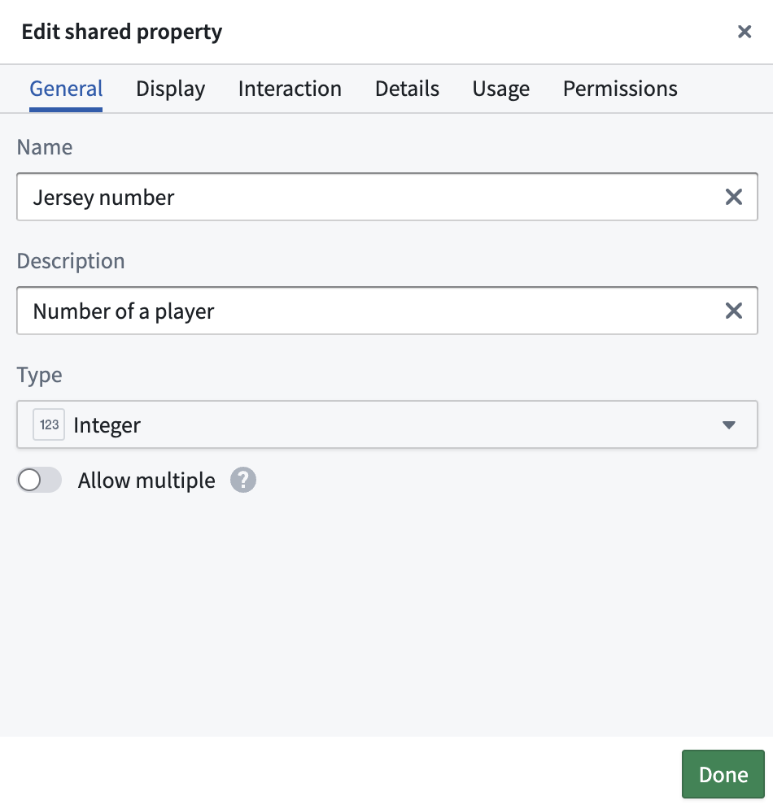
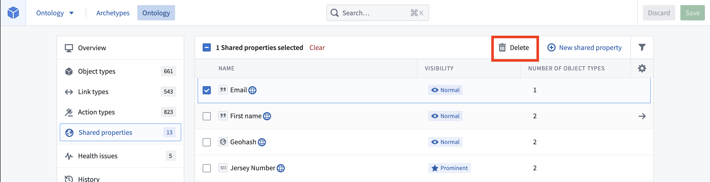
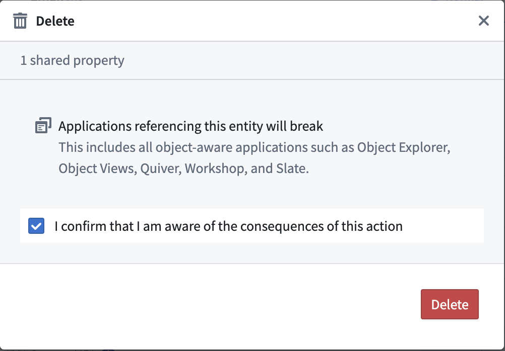

<!-- source: https://palantir.com/docs/foundry/object-link-types/edit-shared-property/ · mirrored 2026-08-22 from Palantir Foundry docs -->

# Edit shared properties

### Edit shared property metadata

You can edit metadata for a shared property by first selecting the shared property to edit from the **Shared property** page of the Ontology Manager.

The available options for editing shared property metadata are clustered into four different tabs: **General**, **Display**, **Interaction**, and **Details**. These tabs contain the following configurations:

* **Name:** The name for the shared property.
* **Description:** Explanatory text about the shared property. For example, the description of the `start date` shared property may be `The day the employee or contractor began working`.
* **Base type:** Indicates the type of values for this property and determines the set of operations available in user applications. For example, the `start date` property will have base type `date`. User applications will allow you to configure a timeline widget with this property.
* **Value formatting:** Depending on the base type of the property, numeric formatting, date and time formatting, user ID, and resource ID formatting are available to apply to the property, transforming its raw values into more readable versions in user applications. Learn more about [value formatting](/docs/foundry/object-link-types/value-formatting/).
* **Type classes:** Additional metadata that are interpreted by user applications. Learn more about [type classes](/docs/foundry/object-link-types/metadata-typeclasses/).
* **Render hints:** Indications to user applications about how to render the property that may be different than most properties of the same base type. Many render hints can be used to impact the performance of reindexes of the object type on which the property is defined. For example, if you do not expect any users to search or sort on the `start date` property in user applications, you can deselect the `searchable` and `sortable` render hints and improve the reindex performance of the `Employee` object type. Learn more about [render hints](/docs/foundry/object-link-types/metadata-render-hints/).
* **Visibility:** An indication to user applications for how prominently to display the property. A `prominent` property will lead applications to show this property first to users. A `hidden` property will not appear in user applications. By default, the `start date` property will have `normal` visibility.

Additionally, you can view the object types that use this shared property on the **Usage** tab and update the permissions on the shared property on the **Permissions** tab.

### Delete a shared property

To delete a shared property, complete the following steps:

1. Navigate to the **Shared property** page of the Ontology Manager.
2. Select one or more shared properties for deletion, then select **Delete property**.

3. Confirm the delete action in the modal.

4. Select **Save** in the upper right.

:::callout{theme="warning"}
When a shared property is deleted, all object types using this shared property will revert to regular properties.
:::
