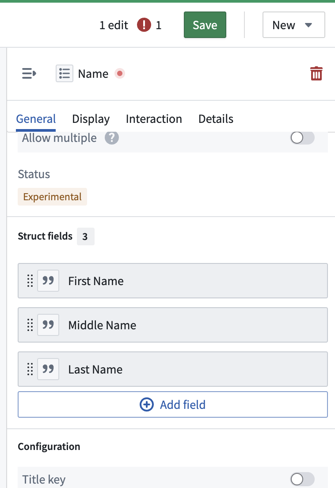
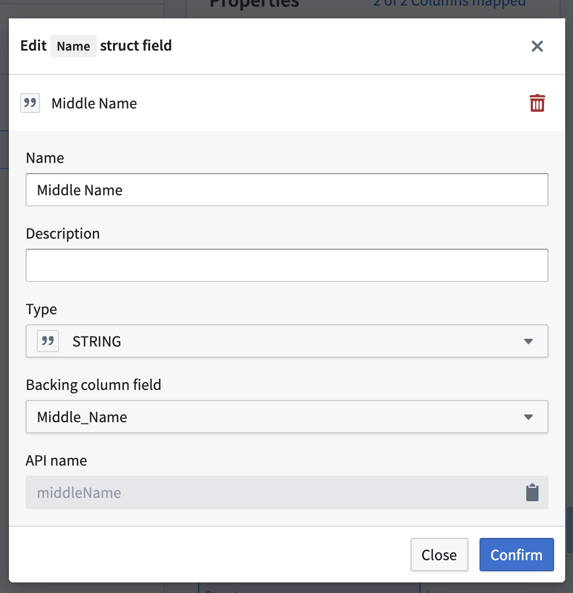

<!-- source: https://palantir.com/docs/foundry/object-link-types/edit-struct-type/ · mirrored 2026-08-06 from Palantir Foundry docs -->

# Edit a struct property type

1. In Ontology Manager, open the **Object types** tab in the left sidebar and select an existing object type.
2. In the object type details page, open the **Properties** tab in the left sidebar, and select the relevant struct property type from the **Properties** table.
3. In the **Property editor** panel, scroll to the **Struct fields** section and select the struct field you would like to edit. The number of edits made will appear on the top right of the Ontology Manager interface.

4. Make the necessary edits in the **Edit struct field** dialog, and select **Confirm**.

:::callout{theme="neutral"}
Note that changing a struct field's API name will result in a new struct field RID being generated. This will override the existing index, similar to the behavior of changing the property ID of a property type. Any applications that reference the updated struct field will need to be updated as well.
:::
