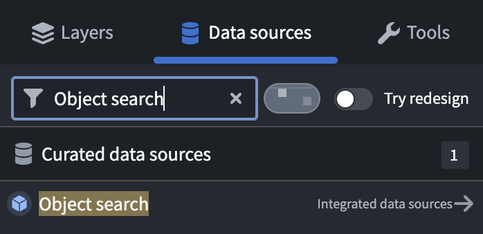
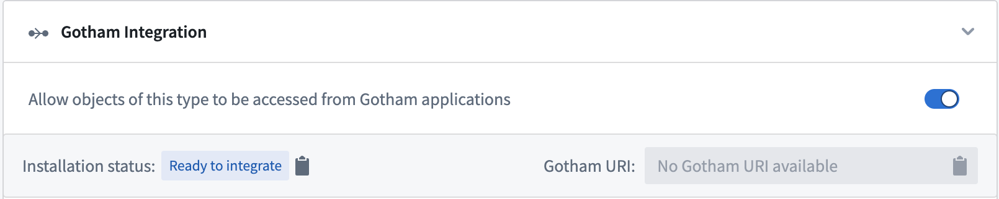
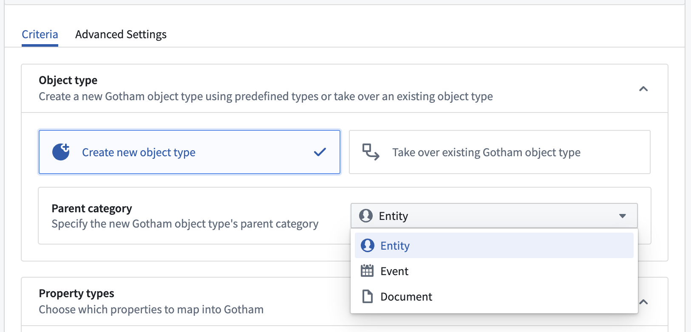

<!-- source: https://palantir.com/docs/foundry/object-link-types/enable-gotham-integration/ · mirrored 2026-08-22 from Palantir Foundry docs -->

# Enable Gotham integration through type mapping

:::callout{theme="neutral" title="Note"}
If your enrollment contains Map Rendering Service (MRS), then you do *not* need to complete the type mapping process to enable Gotham integration. You can [create new ontology objects from](/docs/foundry/object-link-types/create-ontology-objects-from-gaia/) or [add existing objects to](/docs/foundry/geospatial/add-ontology-data-to-gaia/) Gotham without additional configuration. Follow the instructions below to check if your enrollment contains MRS.    Contact Palantir Support with questions about MRS availability, installation, or its additional documentation present in Gotham.
:::

## How to check if your enrollment contains MRS

1. Launch [Quicksearch](/docs/foundry/compass/quicksearch/) to search for and select **Gaia Home**.
2. Open an existing or create a new Gaia map.
3. Select **Data sources** from the left panel.
4. Search for `Object search` in the **Find...** search bar.

If you are able to locate and select **Object search**, then your enrollment contains MRS.

***

## Use type mapping to create a unified representation of your ontology

Type mapping enables a unified representation of your ontology across Foundry and Gotham that you manage within Foundry's [Ontology Manager](/docs/foundry/ontology-manager/overview/) application. You can create new Gotham types based on existing Foundry object types, property types, and shared property types which remain synchronized as your ontology evolves over time. After completing the type mapping process, Gotham will be able to query Foundry object types and their metadata through the [Object Set Service](/docs/foundry/object-backend/overview/#object-set-service-oss) - a Foundry backend service which supports object data searching, filtering, aggregating, and loading.

:::callout{theme="neutral" title="Note"}
Type mapping is only available for enrollments using both Foundry and Gotham and must be enabled by a platform administrator before use. Once enabled for a Foundry Ontology, type mapping cannot be disabled. Only one Foundry Ontology per Gotham install can have type mapping enabled. Contact Palantir Support for assistance with type mapping enablement.
:::

### When to type map object types in your ontology

[Follow the instructions below](#toggle-on-type-mapping-in-foundrys-ontology-manager) and type map object types in Ontology Manager if your enrollment does not [contain MRS](#how-to-check-if-your-enrollment-contains-mrs) and any of the conditions below are true:

* You plan to use custom symbology that is not present as a [tactical graphic](/docs/foundry/object-link-types/create-ontology-objects-from-gaia/#configure-a-tactical-graphic-on-your-gaia-map-and-tag-it-to-an-object-type) or [MIL-STD 2525 symbol](/docs/defense-osdk/api/common/interfaceTypes/com-palantir-ontology-defense-types-mil2525CSymbol/). [Blueprint ↗](https://blueprintjs.com/) symbols are supported with or without type mapping.
* You plan to configure [search templates](/docs/foundry/geospatial/add-ontology-data-to-gaia/#create-a-search-template), a [function-backed Enterprise Map Layer (EML)](/docs/foundry/geospatial/add-ontology-data-to-gaia/#use-a-function-backed-enterprise-map-layer), or a [versioned object set-backed EML](/docs/foundry/geospatial/add-ontology-data-to-gaia/#use-a-versioned-object-set-backed-enterprise-map-layer) to add data from your ontology to Gaia.

## Toggle on type mapping in Foundry's Ontology Manager

To integrate data in your Foundry Ontology with Gotham, you will first need to toggle on type mapping for your object type of interest within Foundry's Ontology Manager by following the steps below:

1. Launch Ontology Manager from your home screen.
2. Locate and select your object type to type map.
3. Select **Capabilities** within the object type's left-hand panel.
4. Scroll down to the **Gotham Integration** panel and toggle on `Allow objects of this type to be accessed from Gotham applications`.

:::callout{theme="neutral" title="Note"}
Type mapped objects must contain a `geopoint` property to display on a Gaia map. The property can be native to the object type's backing dataset(s) or derived from a latitude/longitude pair or `geopoint` using Pipeline Builder's [create Ontology geopoint](/docs/foundry/pb-functions-expression/createOntologyGeopointV1/) transform feature.
:::

## Configure an object type's parent category and Gotham property types

Once you toggle on **Gotham Integration**, you can follow the steps below to create a new Gotham object type derived from an existing Foundry object type, specify the object type's **Parent category**, and configure its **Property types**:

1. Select **Create a new object type** within the **Object type** section of **Gotham Integration** to create a new object type in Gotham from an existing Foundry object type.
2. Identify the **Parent category** of the new object type in Gotham by selecting between `Entity` (such as a person, organization, or vehicle), `Event` (such as a flight, meeting, or concert), or `Document` (such as a PDF file, text document, or report) based on your use case.
3. Use the **Property types** section to map Foundry object type properties to Gotham - a property can be shared or cloned into the Gotham ontology. You will see a blue `Mapped` tag next to the property's name once you complete that configuration on a given property.
   * `Do not map property to Gotham` is the default option - Foundry properties you do not map will not propagate in the Gotham ontology.
   * `Assign to shared property` enables you to select an *existing* shared property to map against.
   * `Promote to shared property` creates a *new* shared property for use by other objects.
   * `Create a local clone of the property in Gotham` creates a duplicate of the selected property in Gotham that is compatible with its applications.

:::callout{theme="neutral"}
Foundry automatically type maps all shared properties to make them available in Gotham.
:::

4. Select the green **Save** button on the right side of the top ribbon of your screen and review.
5. Review the changes made to your object type and select **Save to ontology**.

After you save your changes to the Ontology, scroll back up to the **Gotham Integration** section of the **Capabilities** page of your object type. You will now see a `Gotham URI` assigned to the object type and be able to view the `Installation status` reported by Gotham.

Foundry's Ontology Manager will display one of the following installation statuses:

* `Ready to integrate`: An object type is ready for type mapping to enable Gotham integration.
* `Installation in progress`: The object type's installation process is underway.
* `Installation complete`: The installation process is complete, so the object type is available for use in Gotham.
* `Installation failed: {failureMessage}`: The object type's installation failed at least once and will be retried on the next installation run. The `{failureMessage}` outlines the reason for failure. Common installation failures include:
  * *Live reindex*: If there is a live reindex running on Gotham, the ontology cannot be updated. Instead of staging changes during this time, the installation will fail and rerun automatically once the live reindex finishes.
  * *Required types are not installed*: For an object type's successful installation, all related property installations - or mappings - must be completed, including shared property types.
  * *Other ontology updates*: If there are ontology updates running concurrently, then the type mapper will not be able to update the ontology and will rerun automatically.

Once your object type's installation status reads `Installation complete`, you will be able to search for and use your object type in Gotham's applications.

To deprecate a type mapped object type in Gotham, you can delete the object type in Foundry's Ontology Manager. Once deleted in Foundry, the corresponding object type and its property types will not be accessible in Gotham or available to its applications.

:::callout{theme="neutral"}
Gotham models Foundry dataset security and markings, meaning that Foundry data made available in Gotham through type mapping carries over the same access controls and classification.
:::
