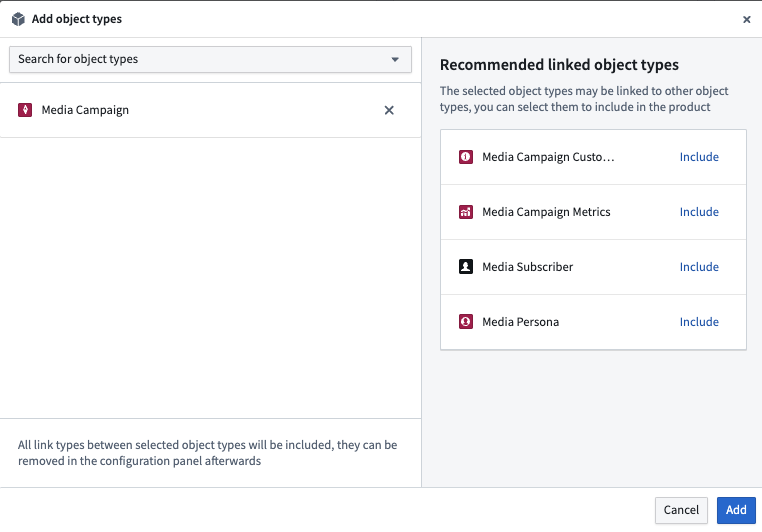
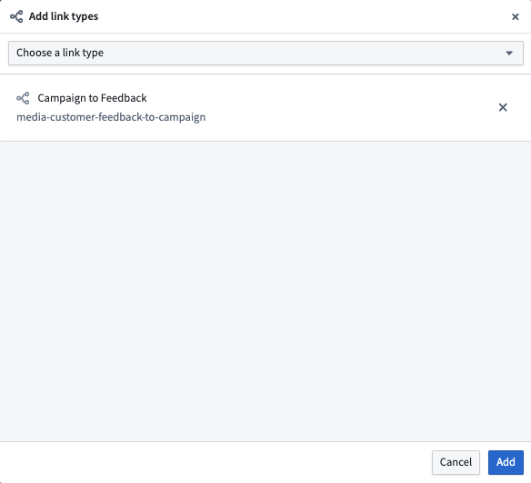
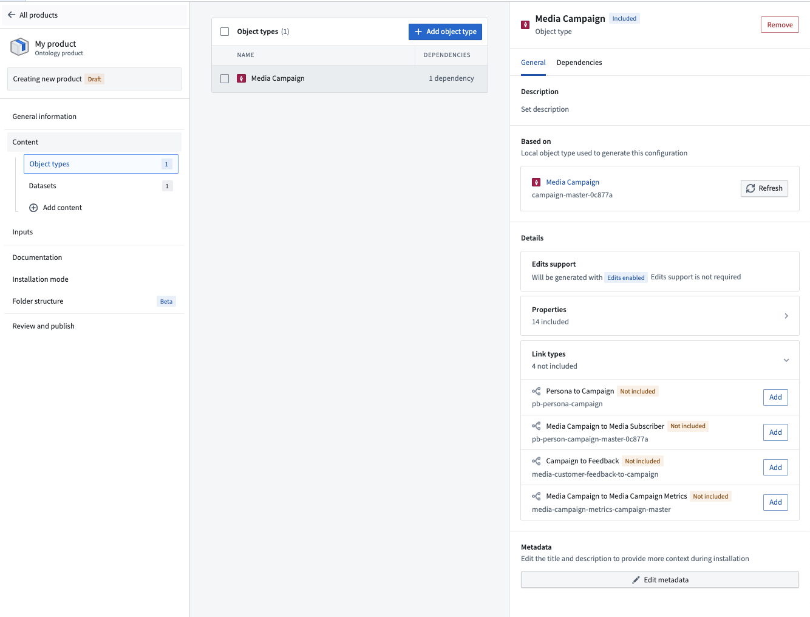
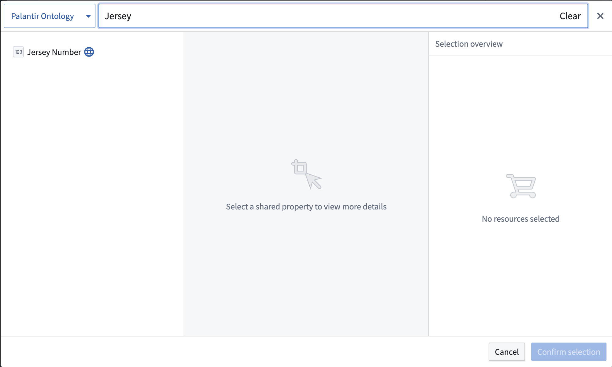
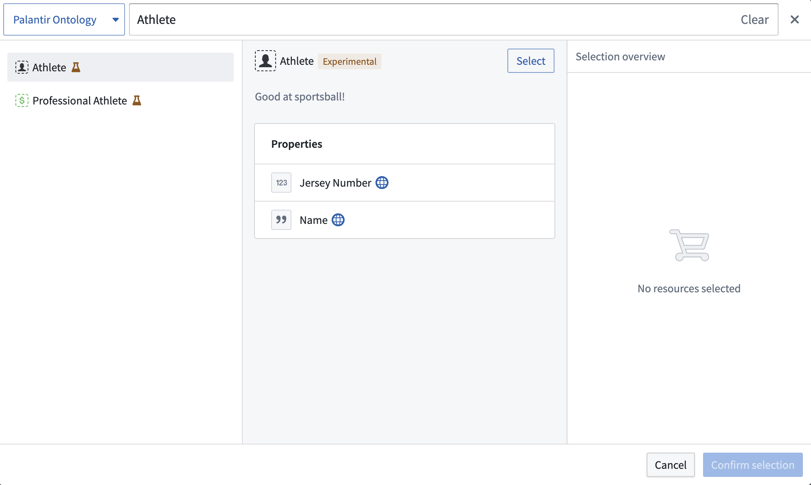

<!-- source: https://palantir.com/docs/foundry/object-link-types/marketplace-ontology-types/ · mirrored 2026-08-22 from Palantir Foundry docs -->

# Add object and link types to a Marketplace product

Use [Foundry DevOps](/docs/foundry/devops/overview/) to include your object and link types in [Marketplace products](/docs/foundry/devops/core-concepts/#product) for other users to install and reuse. [Learn how to create your first product.](/docs/foundry/foundry-devops/create-products/)

## Unsupported features

Most [object property types](/docs/foundry/object-link-types/properties-overview/) are supported in Marketplace products, but the following are not yet available:

* [Cipher](/docs/foundry/cipher/overview/)
* Geo time
* Vector

Marketplace products do not yet support the following:

* Object types with streaming datasources
* Object types with no datasource

Note that objects themselves cannot be packaged with Marketplace. This means that, for example, object edits made by Actions cannot be packaged into a Marketplace product. However, datasets and object types can be packaged in order to create new objects after installation of a Marketplace product.

If you require support for any of the above, contact your Palantir representative.

## Add object types to products

To add an object type to a product, first [create a product](/docs/foundry/foundry-devops/create-products/). [Add outputs](/docs/foundry/foundry-devops/create-products/#add-outputs) and then select the **Add ontology entities** option.

You will then be prompted to choose an object type. After selecting an object type, you will see recommendations for linked object types that you may want to add to your product.

## Add link types to products

To add a link type to a product, first [create a product](/docs/foundry/foundry-devops/create-products/) and then select the **Link type** content type.

You will then be prompted to choose a link type as below.

While you can select link types directly, we recommend first adding your object types and then selecting relevant links via the [information panel](/docs/foundry/foundry-devops/create-products/#add-outputs) as below.

## Add shared properties to products

To add a shared property type to a product, first [create a product](/docs/foundry/foundry-devops/create-products/). Then, select the **Shared property** content type as shown below.

You will then be prompted to choose a shared property.

## Add interface types to products

To add an interface type to a product, first [create a product](/docs/foundry/foundry-devops/create-products/). Then, select the **Interface** content type as shown below.

You will then be prompted to choose an interface.

