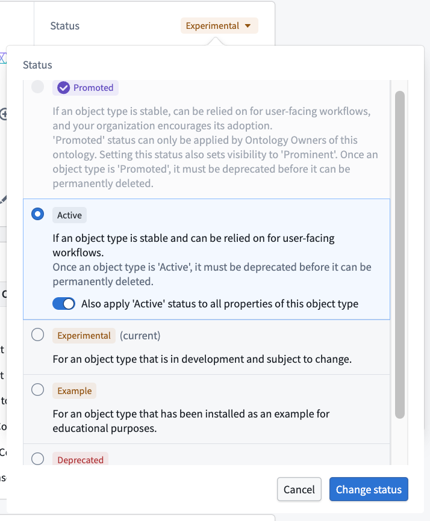
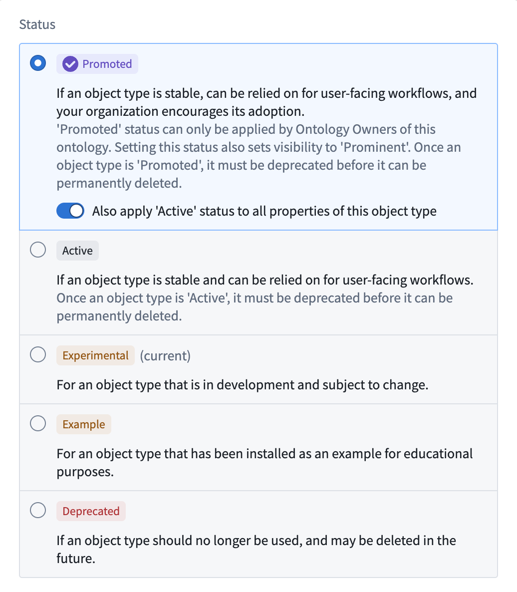
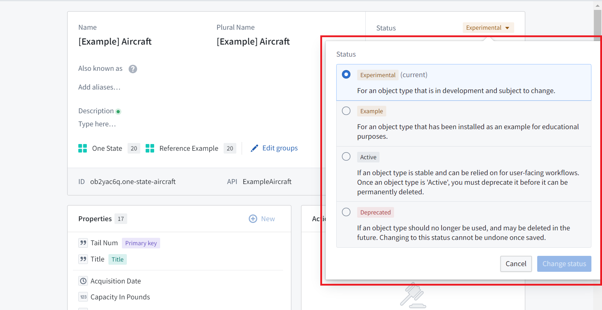
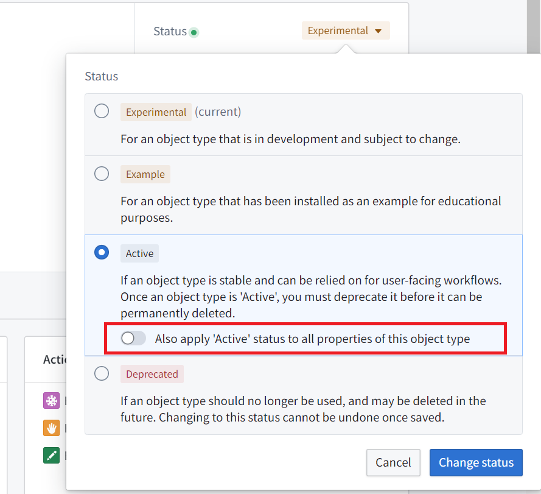
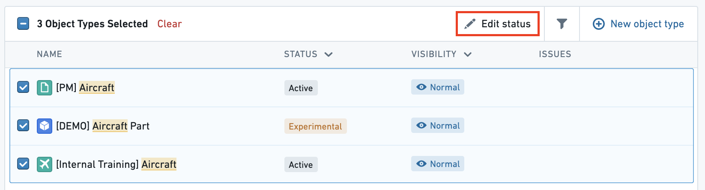

<!-- source: https://palantir.com/docs/foundry/object-link-types/metadata-statuses/ · mirrored 2026-08-06 from Palantir Foundry docs -->

# Statuses

Every object type, property, link type, action, or interface in the Ontology has a **status** that indicates developmental state. An ontological resource's status can be either active, experimental, deprecated, or example; object types can also be classified as [promoted](#promoted-status-object-types-only). Status metadata helps Ontology-editing users to know what resources are being actively relied on by user applications. These statuses are viewable in [**Object Explorer**](/docs/foundry/object-explorer/overview/), [**Object Views**](/docs/foundry/object-views/overview/), and [**Workshop**](/docs/foundry/workshop/overview/) to provide more information about which object types are intended for use in user applications.

The status can take on one of five values:

## Available Status Values

* **Promoted (object types only):** Indicates that the object type is a core, trusted resource that has been vetted by an ontology owner. `Promoted` object types inherit similar protections as `active` object types for API names.
* **Active:** Indicates that the resource is actively in use in user-facing applications and major breaking changes will not be made in the Ontology Manager.
* **Experimental:** Indicates that the resource is still under development. Changes may be made that make the experimental item unavailable in user facing applications.
* **Deprecated:** Indicates that the resource will soon be deleted. The deprecated item should not be relied on in user facing applications.
  * A deprecated resource also has metadata that includes:
    * A description for why it is being deprecated;
    * A deadline for when it is expected to be deleted from the system; and
    * The resource that is meant to replace the one that is deprecated.
* **Example:** Indicates that the resource has been installed as an example. Example resources are notional and are only suitable for trainings or early-stage, exploratory use. Examples are *not* intended for use in production workflows.

### `Promoted` status (object types only)

Object types support a special `promoted` status to signify a higher level of trust and official standing within the ontology. This status, represented by a new purple checkmark icon, helps users differentiate core, reusable object types from more use-case-specific or experimental ones.

The `promoted` status provides prominence beyond the standard `active` status. An object type with this status is meant to be considered a "core" resource, held to high standards and managed by a central team. `Promoted` object types inherit similar operational protections of the `active` status, such as restrictions on deletion.

Key characteristics of the `promoted` status include:

* **Scope:** The `promoted` status applies only to object types. It is not available for properties, link types, action types or interfaces.
* **Visibility:** Setting an object type's status to `promoted` will automatically set its visibility to `prominent`, increasing its discoverability across the platform. Users can optionally move all properties of the object type to `active` status.
* **Permissions:**
  * Only users with the `Ontology Owner` role on the ontology level can directly apply the `promoted` status.
  * Other users must submit a proposal for review and approval by an `Ontology Owner` on the ontology level to apply the status.

## Operations that are not allowed

Given that applications rely on ontological resources, there are several potentially destructive operations that are not allowed when a resource has the status `active`:

* It cannot be deleted. A resource’s status must be `experimental` or `deprecated` before it can be deleted.
* The API name of an active resource cannot be changed. Changing an API name is only possible for those marked as `experimental`.

## Edit a status

By default, any new ontological resource will be given the `experimental` status. To change the status:

1. Select the dropdown next to the current status.
2. Select the new status.

When changing a resource to the `deprecated` status, you will be prompted to:

* Fill out a description for why it is being deprecated,
* Input a deadline for when you expect it to be deleted from the system, and
* Optionally, select a resource that is meant to replace the one you are deprecating.

These statuses are viewable in Object Explorer, Object Views, and Workshop to provide more information about which object types are intended for use in user applications.

The Ontology Manager ensures status consistency between an object type and its related properties or link types. For example, if an object type is changed from `active` to `experimental`, all of its properties will be marked `experimental` as well.

The table below indicates available statuses for a link type between object types of different statuses. In general:

* If at least one object type in a link type is changed to `experimental`, the link type will automatically be changed to `experimental`.
* If at least one object type in a link type is changed to `example`, the link type will automatically be changed to `example`.
* If at least one object type in a link type is changed to `deprecated`, the link type will automatically be changed to `deprecated`.

|*If object type A is…* |and object type B is…  |
|---    |---    |
| |EXPERIMENTAL |ACTIVE |DEPRECATED |
|*EXPERIMENTAL* |experimental only  |experimental only  |deprecated only    |
|*ACTIVE*   |experimental only  |can be experimental, active, or deprecated |deprecated only    |
|*DEPRECATED*   |deprecated only    |deprecated only    |deprecated only    |

The same requirements are true of foreign keys of a link type. The application will change the status of a link type when changing a property:

* If a foreign key property is changed to `experimental`, its link type will be changed to `experimental`.
* If a foreign key property is changed to `example`, its link type will be changed to `example`.
* If a foreign key property is changed to `deprecated`, its link type will be changed to `deprecated`.

The application changes statuses in order to prevent invalid states. If a foreign key property is `experimental` and still being developed, its link type shouldn't be marked `active` and be relied on in production. In contrast, when marking a property `active`, the application won't change a link type referencing the property as its foreign key to `active`, as it is valid for a foreign key property to be in production, while the link type and its backing datasource are still in development.

## Bulk edit statuses

### Properties

When changing an object type from `experimental` to `active`, there is the option to also apply the `active` status to all properties on the object type:

When you change an object type to `example`, all of its properties will automatically become `example` also.

Statuses across properties of an object type can also be edited in bulk from the **Properties** page of the object type. [Read more about bulk editing properties.](/docs/foundry/object-link-types/edit-properties/#bulk-edit-multiple-properties)

### Object types

Statuses across object types can also be edited in bulk from the home page object view page by selecting the checkboxes of the object types to edit and selecting the **Edit status** button at the top right of the table.

## Troubleshooting

### Conflicts between property status and link type status

If you receive the error `OntologyMetadata:ConflictBetweenLinkTypeStatusAndPropertyTypeStatus`, there is a conflict between the status on a link type and the status on a property. For example, if a foreign key is `deprecated`, link types that reference that foreign key should also be `deprecated`.

### Conflicts between object type status and link type status

If you receive the error `OntologyMetadata:ConflictBetweenLinkTypeStatusAndObjectTypeStatus`, there is a conflict between the status on a link type and the status of one of its associated object types. This can happen when there is an invalid object type-link type case according to the table above. For example, an `experimental` object type cannot have an `active` link type.
