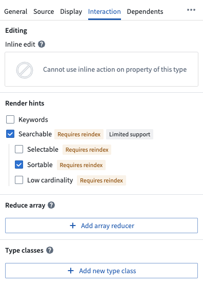
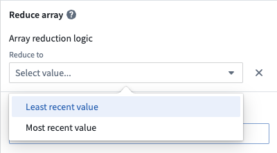
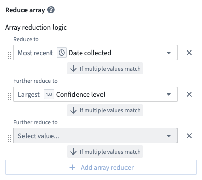
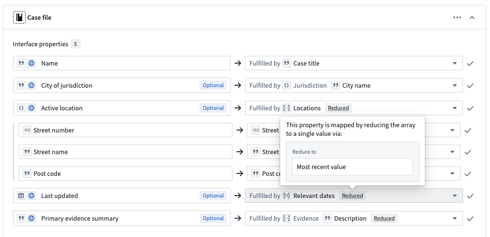
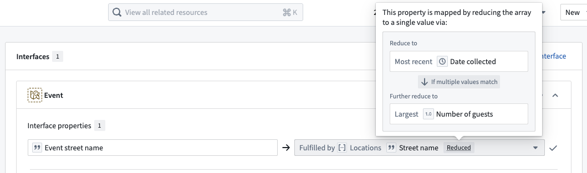

<!-- source: https://palantir.com/docs/foundry/object-link-types/property-reducers/ · mirrored 2026-08-06 from Palantir Foundry docs -->

# Property reducers \[Beta]

:::callout{theme="neutral" title="Beta"}
Property reducers are in the [beta](/docs/foundry/platform-overview/development-life-cycle/) phase of development and may not be available on your enrollment. Functionality may change during active development.
:::

A **property reducer** enables you to transform an [array property](/docs/foundry/object-link-types/properties-overview/#supported-property-types) into a single value in the array for display and interface implementation purposes. Reduction does *not* change the underlying property type or property data stored; instead, it provides access to the reduced value in the array when reading the property value.

For example, applying a reducer to an array with multiple inspection dates allows you to display only the most recent date when viewing the property in a table or application but ensures the full array remains accessible for queries and other operations. Applications that support reducers, such as [Workshop](/docs/foundry/workshop/overview/), also enable you to view the complete array on hover or in expanded views.

Reducers work with array properties containing numeric, temporal, string, and boolean base types. You can reduce [struct](/docs/foundry/object-link-types/structs-overview/) arrays based on any struct field that uses a supported base type. Review the [tables below](#supported-and-unsupported-base-types) to learn more about a property reducer's supported base types.

## When to use property reducers

Use property reducers when:

* Your historical or temporal data is stored in arrays, such as inspection dates, status updates, or measurement readings.
* You want to display the latest/earliest, highest/lowest, or first/last array value in a table or application while preserving the property's full history.
* Array properties require non-array types to satisfactorily implement [interface properties](/docs/foundry/interfaces/implement-interface/).

## Supported and unsupported base types

Reducers work with array properties based on the underlying base type. The following tables categorize which array subtypes support reducers and which do not.

### Supported base types

Property reducers are available for arrays containing the following subtypes:

| Category | Base types | Reducer options |
|----------|-----------|----------------|
| **Numeric** | `Byte`, `Short`, `Integer`, `Long`, `Float`, `Double`, `Decimal` | Highest, lowest |
| **Temporal** | `Date`, `Timestamp`| Most recent (latest), Least recent (earliest) |
| **String** | `String` | First, last (lexicographically) |
| **Boolean** | `Boolean` | True first, false first |
| **Struct** | By any supported struct field [outlined below](#support-for-struct-arrays) | Depends on the base type of the struct field |

### Unsupported base types

Property reducers are *not* available for arrays containing the following subtypes:

* `Attachment`
* `Cipher Text`
* `Geohash`
* `Geoshape`
* `Geotemporal Series Reference`
* `Marking`
* `Media Reference`
* `Time Dependent`
* `Vector`

### Support for struct arrays

Reducers function on struct arrays based on a specific **field** within the struct, not the struct itself. You can only reduce by struct fields that use one of the [supported base types](#supported-base-types) listed above. You can also configure multiple reducers using different struct fields to handle tie-breaking scenarios.

## Configure a property reducer

1. Navigate to **Ontology Manager**.
2. Search for and select your object type by choosing **Object types** under **Resources** in the left panel.
3. Select the array property to configure from your object type's **Properties** tab.
4. Choose the **Interaction** tab in the property editor panel that opens on the right.
5. Scroll to the **Reduce array** section.

6. Select **Add array reducer**.
7. Select your desired [reducer option](#supported-base-types) based on the property's base type.

8. **Save** your changes.

## Configure a property reducer for struct arrays

Struct arrays offer the most flexibility for reducers. You can reduce based on any field in the struct that uses a [supported base type](#supported-base-types) and configure multiple reducers for tie-breaking scenarios.

### Example: Customer review history

Consider a `Product` object type with a `customerReviews` struct array property that contains the following fields:

* `rating` (`Integer`): A one to five star rating.
* `reviewDate` (`Date`): The date the customer posted the review.
* `reviewerName` (`String`): The reviewer's name.
* `verifiedPurchase` (`Boolean`): Indicates whether or not the purchase was verified.

Sample data for a `Product` object's `customerReviews` property resembles:

| `rating` | `reviewDate` | `reviewerName` | `verifiedPurchase` |
|--------|-----------|--------------|-----------------|
| 5 | 2024-11-20 | Alice Chen | true |
| 3 | 2024-11-15 | Bob Smith | false |
| 4 | 2024-11-22 | Carol Lee | true |

### Configure a single reducer

:::callout{theme="success" title="Tip"}
Review the [property reducer configuration instructions](#configure-a-property-reducer) and the [supported base types](#supported-base-types) table before proceeding.
:::

You can configure a single reducer on a struct field, which Foundry uses to reduce the array of structs to a single struct, sorting the values to display by the field with the configured reducer.

* **Single reducer:** Render the latest `reviewDate`.
* **Result:** Displays the struct containing Carol Lee's four star review from `2024-11-22`.

Users can still query for and access the full review history.

### Configure multiple reducers

You can configure multiple reducers to handle tie-breaking scenarios:

* **Primary reducer:** Sort the structs and display the struct with the latest `reviewDate`.
* **Fallback reducer:** Render the highest `rating`.
* **Use case:** If two reviews are posted on the same day, render the higher-rated review.

The fallback reducer *only* applies when the primary reducer results in multiple items. The primary reducer is always evaluated first, and only items that tie on the primary criteria are further reduced by the fallback reducer. This reduction behavior is repeated for any additional configured reducers.

## How reducers appear in applications

Applications that support reducers display the reduced value in compact views like tables or lists, while providing access to the full array through an expanded view or on-hover mechanism. This approach allows users to quickly scan data without seeing verbose array representations, while still being able to inspect the complete array when needed.

For example, an application might display only `2024-11-22` (the most recent date) in a table cell, but reveal the full array of dates when the user hovers over or expands that cell.

## Use property reducers with interfaces

Use property reducers to ensure an array property can implement non-array interface properties. This allows object types with array data to be mapped to [interface properties](/docs/foundry/interfaces/implement-interface/) that expect single values.

### Example: Render the most recent equipment maintenance date through an interface implementation

**Interface:** `Asset`

* Property: `lastMaintenanceDate` (`Date`)

**Object type:** `Equipment`

* Property: `maintenanceHistory` (`Date` array)
  * Values: `[2024-01-15, 2024-03-22, 2024-11-01]`
* **Reducer:** Latest `maintenanceHistory` date.
* **Implementation:** `Date` array property implements a single `Date` through the configured reducer. A user will see `2024-11-01` when viewing the property via the interface.

The `Equipment` object type can implement the `Asset` interface because the reducer allows its `maintenanceHistory` array property to be represented as a single `Date` value. When users view an `Equipment` object through the `Asset` interface, they see only the most recent maintenance date.

:::callout{theme="warning"}
When using a reduced array value on an object type to satisfy an interface property that is a parameter of an [interface action](/docs/foundry/action-types/actions-on-interfaces/), the action will return an error when called on objects of that type. However, you can still use the interface action for objects that do not implement the interface through a reduced array value.
:::

## Combine property reducers with struct main fields

When you combine property reducers with [struct main fields](/docs/foundry/object-link-types/struct-main-fields/), you enable property display and expand the number and shape of interfaces they can implement.

Consider the `Event` object type below, which contains a `Locations` property that is an array of structs:

**Object type:** `Event`

* Property: `locations` (`Struct` array)
  * Struct fields: `streetName` (`String`), `dateCollected` (`Date`), `numberOfGuests` (`Integer`).
* **Main field configured:** `streetName`
* **Reducer configured:** Most recent by `dateCollected`.

With the `streetName` field configured as the main field and most recent `dateCollected` as the property reducer, this enables multiple interface implementation options:

| Configuration | Can implement |
|---------------|---------------|
| Neither feature configured | `Struct Array` only |
| Main field only | `Struct Array`, `String Array` |
| Reducer only | `Struct Array`, `Struct` |
| **Both configured** | `Struct Array`, `String Array`, `Struct`, `String` |

As an example, with both a struct main field and property reducer configured, you can use the `locations` property to fulfill a *single* string property from an interface, such as `Event street name` from the notional `Event` interface in the image below.

When you configure both a struct main field and a property reducer, the transformation:

* Applies the configured property reducer, fetching the most recent location based on its date.
* Extracts the configured main field and returns its value as a string.

This means a single property can implement interfaces requiring any of these types: `Struct Array`, `String Array`, `Struct`, or `String`.

## Limitations and considerations

* **No direct querying of reduced value:** You cannot filter or query based on the reduced value. Queries operate on the full array, not the reduced representation.
* **Interface actions are not supported for reduced or struct main field implementations:** [Interface actions](/docs/foundry/action-types/actions-on-interfaces/) that edit a property implemented through a property reducer or [struct main field](/docs/foundry/object-link-types/struct-main-fields/) will return an error when called on objects of that type. This is because reduced and struct main field values cannot be translated back to the underlying object property. For example, a reducer that selects one element from an array has no inverse operation to reconstruct the full array; struct main fields that extract a subset of fields have no way to populate the remaining ones. Interface actions that do not target these properties, or that target objects implementing the interface without reducers or struct main fields, work as expected.

## FAQs

### Can I change or remove a reducer after configuration?

Yes, you can modify or remove reducers at any time in Ontology Manager. Changes do not require a reindex and take effect immediately.

### What happens if multiple items tie for the reducer criteria?

For struct arrays, you can configure fallback reducers to handle ties. The fallback reducer is only evaluated for items that tie on the primary reducer. For primitive arrays or structs without fallback reducers, one of the tied values is returned in a deterministic but unordered manner.

### Can I use reducers with edit-only properties?

Yes, you can configure reducers for [edit-only properties](/docs/foundry/object-link-types/edit-only-properties/). The reducer configuration is independent of whether the property has a backing column.

### Do reducers function across all applications?

Applications are progressively rolling out support for reduced properties. If you configure a reducer on a property and use an application that doesn't yet support reducers, it should not break any existing functionality, the property will simply continue to be displayed as an array. Only applications that support reducers will have the ability to display the reduced value.
