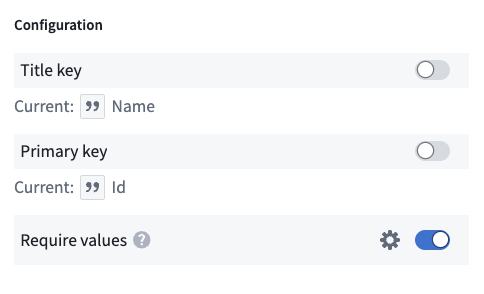
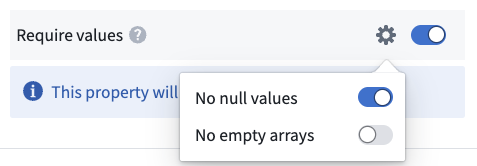

<!-- source: https://palantir.com/docs/foundry/object-link-types/required-properties/ · mirrored 2026-09-04 from Palantir Foundry docs -->

# Required properties

Required properties are object type properties that must have a value. You can use this object type property to validate that there are no objects that have a null value for this property, or an empty array if it is an array property. This validation applies to data from the backing datasource and edits via actions.

## Summary of required properties

When working with required properties, keep the following in mind:

* **Validation happens when data is being indexed into the object:** The check for null values happens as backing datasources are indexed into Object Storage. This means that the ontology modification itself will succeed if the column backing a required property contains null values.
* **Array properties cannot be empty:** Setting an array property to required ensures the presence of at least one item.
* **Changes via actions are validated at apply time:** If you attempt to write a null or empty value to a property via an action, the action will fail to execute.
* **Available only in Object Storage v2:** Required properties are only supported by object types leveraging Object Storage v2.

### Create a required property

1. Navigate to **Ontology Manager**.
2. Choose the object type, and then the property you want to set as required.
3. Select **Create Property** and fill in the required details, including the property name, type, and description.
4. Under the **Configuration** section, toggle on the **Required** toggle.
5. **Save** your changes to the Ontology and wait for the reindex to be completed.

Note that if there is any null value currently set on the backing column for the property, the reindex will fail. To fix this, you must either update the backing datasource to no longer have nulls in the column, or unset the property as required.

### Required properties that allow empty arrays

You can configure your required property to allow empty arrays. This means that the property will still reject null values, but will accept empty arrays. This is useful for mandatory control properties which can never be null, but can be configured to allow empty arrays. Learn more about [mandatory control properties](/docs/foundry/object-link-types/mandatory-control-properties/).

It is important to note that Actions will write an empty array to any property that is mapped to a parameter, but the parameter is not set. This means that if you have a required property that allows empty arrays, and you leave the parameter blank in an Action, the Action will succeed and write an empty array to the property. If you do not want this behavior and want to enforce that users always set a value for this property via Actions, you should not allow empty arrays on your required property.

### Required properties for object types with multiple backing datasources

You may occasionally encounter situations where null values appear in required properties of object types backed by multiple datasources. This phenomenon occurs when a record for the object is present in some datasources, but absent in the datasource that supplies the required property.

The following example illustrates this behavior. Assume there is a `Movie` object type with two backing datasources and a `Genre` property that is required.

**Datasource 1**

| Movie Id | Title                | Box office | Regions                    |
| -------- | -------------------- | ---------- | -------------------------- |
| 101      | The Adventure Begins | 200m       | \["USA", "Canada", "UK"]    |
| 102      | Love in the City     | 75m        | \[]                         |
| 103      | Galactic Battles     | 500m       | \["USA", "UK", "Australia"] |

**Datasource 2**

| Movie Id | Budget | Genre (Required) | Director           |
| -------- | ------ | ---------------- | ------------------ |
| 101      | 50m    | Adventure        | Michael John Smith |
| 102      | 20m    | Romance          | Jane Doe           |
| 103      | 150m   | Sci-Fi           |                    |

If a new `Movie` is added to both backing datasources without providing a value for `Genre`, it will fail to index to the Ontology.

However, suppose only Datasource 1 had a row for the new `Movie` object.

**Datasource 1**

| Movie Id | Title                | Box office | Regions                    |
| -------- | -------------------- | ---------- | -------------------------- |
| 101      | The Adventure Begins | 200m       | \["USA", "Canada", "UK"]    |
| 102      | Love in the City     | 75m        | \[]                         |
| 103      | Galactic Battles     | 500m       | \["USA", "UK", "Australia"] |
| 104      | Happy Ending         | 150m       | \["UK", "FRANCE"]           |

**Datasource 2**

| Movie Id | Budget | Genre (Required) | Director           |
| -------- | ------ | ---------------- | ------------------ |
| 101      | 50m    | Adventure        | Michael John Smith |
| 102      | 20m    | Romance          | Jane Doe           |
| 103      | 150m   | Sci-Fi           |                    |

The example above will successfully get indexed into the Ontology, despite the fact that the resulting object would have no value for the required property.

| Property         | Value            |
| ---------------- | ---------------- |
| Movie Id         | 104              |
| Title            | Happy Ending     |
| Box Office       | 150m             |
| Regions          | \["UK", "FRANCE"] |
| Budget           |                  |
| Genre (Required) |                  |
| Director         |                  |

The same applies to objects created via Action edits. `Movie` objects can be created or modified successfully, if they only contain properties tied to columns in `Datasource 1`. However if the Action adds a property to the object that is sourced from `Datasource 2`, such as `Budget`, then the Action will be invalid and will fail to execute. This is because the object will now be present on `Datasource 2` and thus `Genre` must be set.
