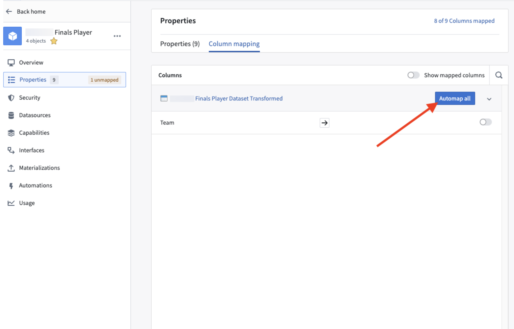
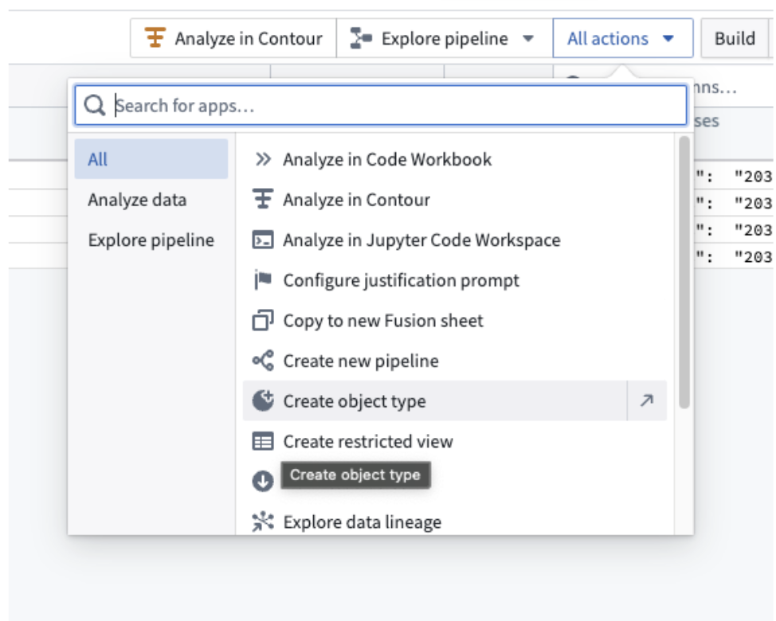
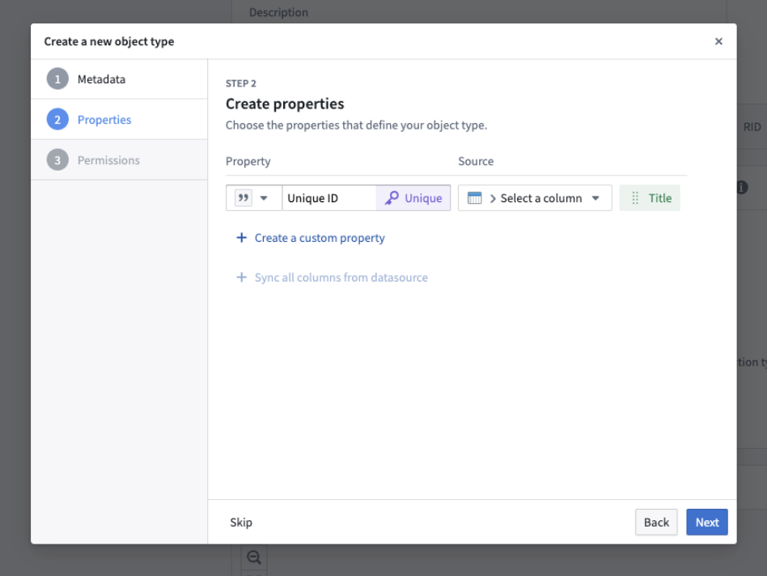

<!-- source: https://palantir.com/docs/foundry/object-link-types/struct-automapping/ · mirrored 2026-08-22 from Palantir Foundry docs -->

# Automapping struct properties

Automapping allows users to map all columns automatically rather than manually.

## Automap struct types in Ontology Manager

If the object has already been created, users can automap all columns by using the **Automap all** feature.

1. In Ontology Manager, enter the **Properties** tab and select the desired property.
2. Under the **Column mapping** tab, select the desired column.

3. Select **Automap all**.

## Automap struct types in Pipeline Builder

If the object has not yet been created, automapping can be done on initial object creation with the object type creation wizard.

1. In your Pipeline Builder pipeline, open the relevant dataset and select the **All Actions** dropdown in the top right.

2. Select **Create object type** to create a new object.

3. Under **Properties**, add the desired properties to be mapped.
4. Select **Next** and complete the remaining steps to create an automapped object type.
