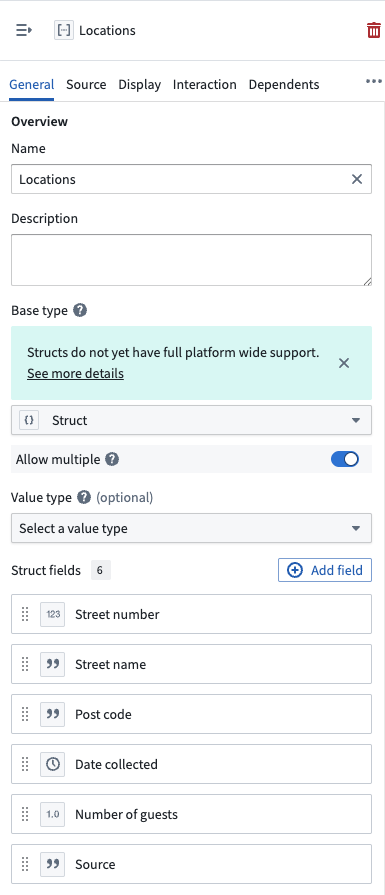
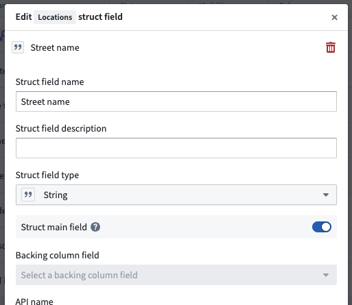
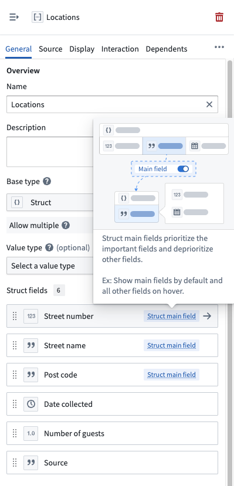
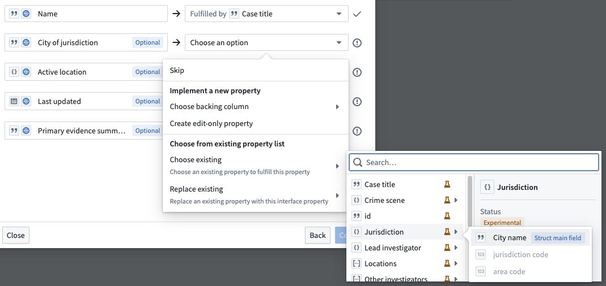
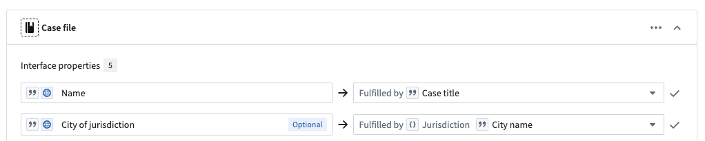

<!-- source: https://palantir.com/docs/foundry/object-link-types/struct-main-fields/ · mirrored 2026-09-04 from Palantir Foundry docs -->

# Struct main fields \[Beta]

:::callout{theme="neutral" title="Beta"}
Struct main fields are in the [beta](/docs/foundry/platform-overview/development-life-cycle/) phase of development and may not be available on your enrollment. Functionality may change during active development.
:::

**Struct main fields** enable you to designate a [struct's](/docs/foundry/object-link-types/structs-overview/) core value and supplementary metadata. For example, an `Address` struct may contain fields capturing `streetName` and `postalCode` as its main values, while other fields like `collectionDate` and `collectorName` represent metadata that describe how the `Address` was obtained.

Many struct properties follow this pattern: one or more fields contain the primary data you care most about displaying in applications, while other fields provide context, tracking information, or audit details.

You can designate any of the [supported struct field types](/docs/foundry/object-link-types/structs-overview/#struct-configuration) as main fields.

## When to use struct main fields

Use struct main fields when:

* Your struct contains core value fields in addition to fields that represent supplementary metadata.
* You want cleaner table displays without losing access to metadata.
* You need to [implement interfaces](/docs/foundry/interfaces/implement-interface/) using only a single field or subset of fields from a struct.

## Configure struct main fields

1. Navigate to **Ontology Manager**.
2. Search for and select your object type by choosing **Object types** under **Resources** in the left panel.
3. Select the struct property to configure from your object type's **Properties** tab.
4. Choose the field to designate from the **Struct fields** section of the **General** tab that appears in the property editor panel on the right.

5. Toggle on **Struct main field** in the **Edit {propertyName} struct field** popup window before you select **Confirm**. You can designate multiple main fields and reorder them for clarity by clicking and dragging a field's panel.

6. **Save** your changes. Configured main fields display a **Struct main field** tag in the **Struct fields** list.

## How struct main fields appear in applications

Applications that support struct main fields display only the main fields in compact views, like the [Object Table](/docs/foundry/workshop/widgets-object-table/) and [Object List](/docs/foundry/workshop/widgets-object-list/) widgets in [Workshop](/docs/foundry/workshop/overview/), while providing access to the full struct through an expanded view or upon hover. This enables you to quickly scan the most important data without seeing every struct field, while still being able to inspect the complete struct when needed.

Applications support struct main fields in several ways:

* **Main fields only:** Display only main fields in compact views like tables or summary cards.
* **Main fields with hover:** Show main fields by default and reveal metadata fields on hover.
* **Full struct:** Display all fields in detailed views or forms where complete information is needed.

## Use struct fields with interfaces

You can map any struct field to an interface property. When implementing an interface, you can select a specific field from a struct property to satisfy the interface contract and fulfill the property requirement.

For example, if an interface requires a `String` property called `cityName`, you can fulfill it using a struct property's `city` field. The interface picker displays all available struct fields with their types, allowing you to choose the appropriate field.

After mapping a struct field to an interface property, the implementation shows the struct property and the specific field being used.

Main fields are indicated with a **Struct main field** tag in the picker, making them easy to identify. However, you can select any field from the struct regardless of whether it is designated as a main field.

## Combine main fields with property reducers

Combine struct main fields with [property reducers](/docs/foundry/object-link-types/property-reducers/) to enable additional flexibility in struct array property representation and interface implementation. A single struct array property can implement interfaces requiring `Struct Array`, the main field's array type, `Struct`, or the main field's base type.

See the [property reducers documentation](/docs/foundry/object-link-types/property-reducers/#combine-property-reducers-with-struct-main-fields) for detailed examples and implementation options.

## Limitations and considerations

* **Query behavior:** Queries operate on all struct fields, not just main fields. You can search and filter based on any field in the struct.

## FAQs

### Can I change which fields are main fields later?

Yes, you can reconfigure main fields in Ontology Manager at any time. This may render some interface implementations invalid, which you will need to update.

### Do main fields affect how Foundry stores data?

No, main fields only affect how Foundry displays data and implements interfaces. The underlying struct contains all fields with full fidelity, so all fields remain queryable and accessible.

### Can I use main fields with struct arrays?

Yes. Main fields work with *both* single struct properties and struct array properties. When combined with [reducers](/docs/foundry/object-link-types/property-reducers/), you get maximum flexibility in how Foundry represents the property across applications.

### Do I need to configure main fields to use struct fields with interfaces?

No. You can map any struct field to an interface property regardless of whether it is designated as a main field. Main fields simply provide a visual indicator in the interface picker and affect how applications display the struct in compact views.
