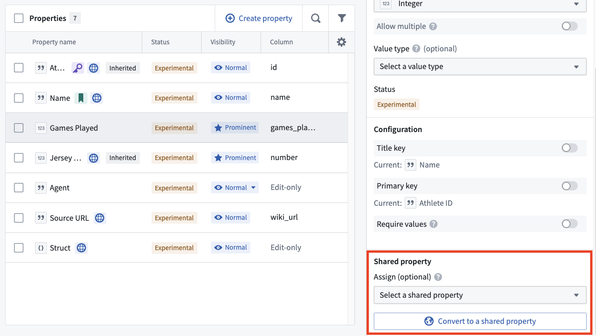
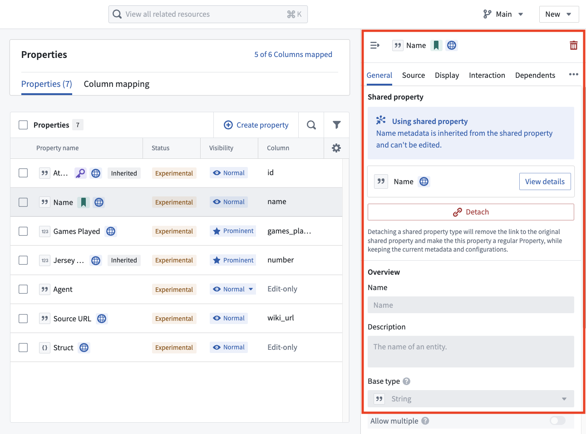

<!-- source: https://palantir.com/docs/foundry/object-link-types/use-shared-property/ · mirrored 2026-08-22 from Palantir Foundry docs -->

# Use shared properties on object types

To update a property on an object type to a shared property, complete the following steps:

1. Navigate to the object type in the Ontology Manager.
2. Select the property on the panel that you want to update, then scroll down to the **Shared Property** section of the configuration.

3. Use the dropdown menu to select an existing shared property to use, or convert the property to a new shared property with the [shared property creation](/docs/foundry/object-link-types/create-shared-property/) modal.

The property will then display as a shared property. To persist the use of the shared property to the Ontology, select **Save** in the upper right.

* When using a shared property on an object, the property ID and API name of the object-specific property will remain unchanged so as to not break existing downstream workflows that leverage them.
* While associated with a shared property, direct edits to property metadata that is inherited from the shared property will be disabled. You can still add, delete, or edit type classes. When the property is loaded, the resulting set of type classes will be a union of those from the property and its associated shared property.
* If the shared property you use has different [render hint](/docs/foundry/object-link-types/metadata-render-hints/) configuration values than the selected property, using the shared property will override the configuration values of the selected property. Make sure your shared property is configured with the proper render hints for your use case.

### Detach a shared property from an object

To detach a property from a shared property, use the same property panel on an object type in the Ontology Manager and select **Detach**.

Doing so will remove the association between the property and the shared property.
