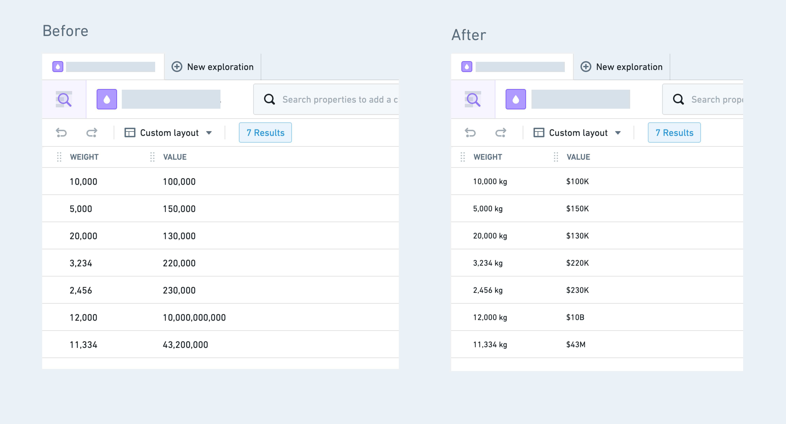
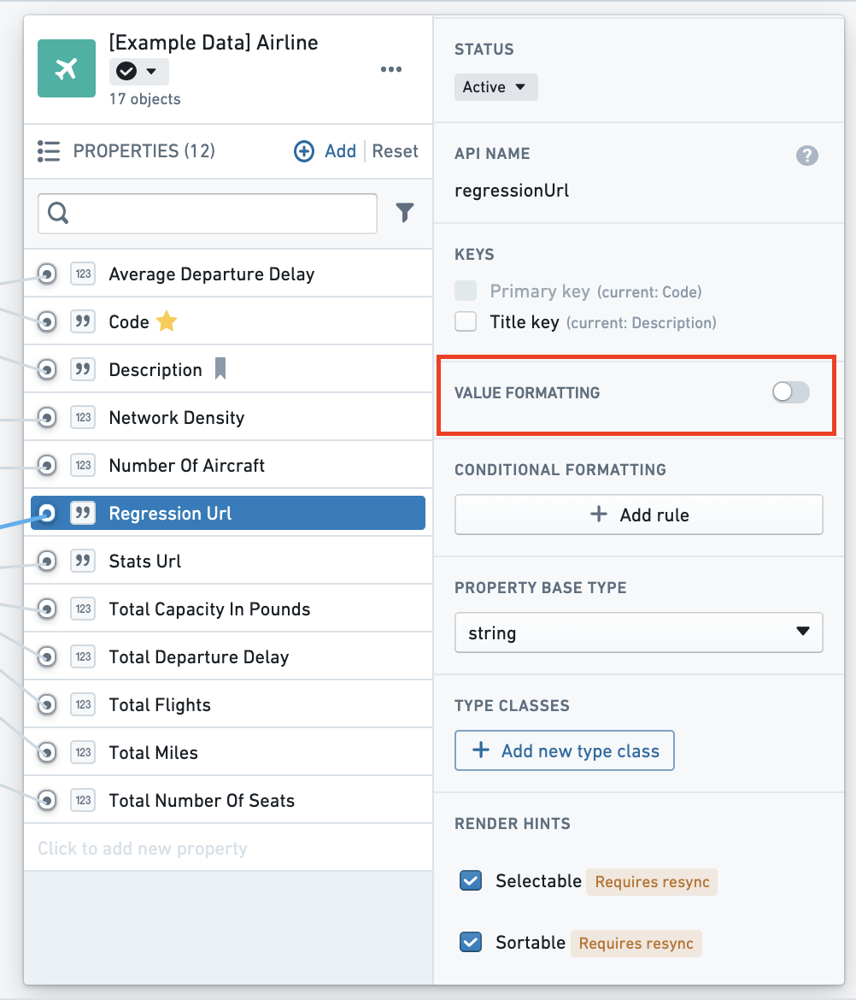
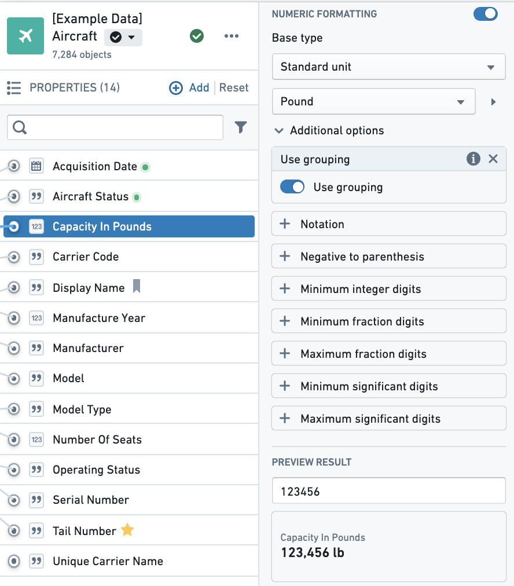
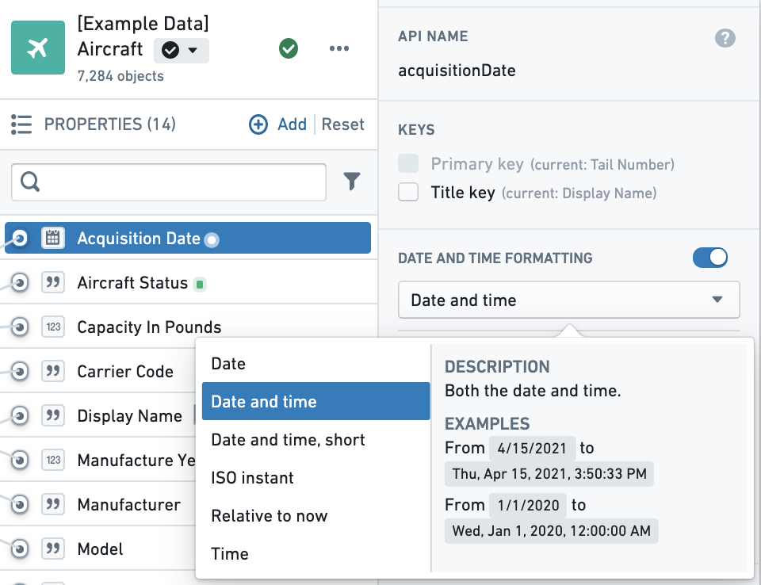
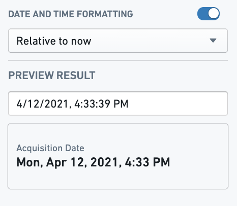

<!-- source: https://palantir.com/docs/foundry/object-link-types/value-formatting/ · mirrored 2026-08-06 from Palantir Foundry docs -->

# Add value formatting

**Value formatting** refers to applying a special formatter to the value of a property, transforming the raw value to a more readable version. In the image below, the left-hand side (**Before**) shows the `weight` and `value` columns without any formatting. The right-hand side (**After**) has a unit (“kg”) applied to the `weight` column and the `value` column is displayed in a more compact form with a currency sign (“$100K”). These are both examples of numeric formatting. The Ontology also supports date and time formatting, as well as user ID formatting, resource RID formatting, and artifact GID formatting.

## Supported value formatting

|Type	                   |Description	|
|---	                   |---	|
| Numeric formatting	   | Add currencies/units/prefixes, various types of notations (compact, scientific), and percentages. See the [numeric formatting section](#numeric-formatting-options) for more details. |
| Date and time formatting | Render timestamps and dates in a specific format as well as in a specific timezone. |
| Foundry ID formatting	   | Display a Foundry ID as a user's first and last name or group name. |
| Resource RID formatting  | Display a Foundry resource ID (RID) as an icon and resource name, with a clickable link that routes to that resource. |
| Artifact GID formatting  | Display an artifact global ID (GID) as an icon and artifact name, with a clickable link that routes to that artifact. |

## Add value formatting

In the property editor:

1. Select the property to which you want to add value formatting.
2. On the right hand side panel of the properties pane, you will see a type of formatting depending on the base type of the property (value formatting, numeric formatting, date and time formatting, etc.). Toggle on the formatting.

3. Additional formatting options are available for numeric formatting and date and time formatting, as described below:
   * [Numeric formatting options](#numeric-formatting-options)
   * [Date and time formatting options](#date-and-time-formatting-options)
4. As you select the available formatting options, you will see a preview for how values of the property will be rendered with the new formatting applied.

### Numeric formatting options

| Name                   | Description | Usage |
| ---                    | --- | --- |
| **Numeric formatting** | On/Off toggle. | Toggle this to remove/add numeric formatting. |
| **Base type**	         | Contains various types of formatting available (Currency, Unit, Percentage, Prefix/Suffix, Fixed Values) as well as examples and descriptions of each type. |If `Capacity in Pounds` has an associated unit, select "Unit" from this dropdown. |
| **Use grouping**	     | Adds locale-aware comma separator.	| Toggle this on to go from 123456 to 123,456. |
| **Notation**	         | Contains Compact/Scientific and Engineer notations. | Choose compact to approximate values, like 123K. |
| **Maximum fraction digits** | The most digits to show after the decimal point. Values with more decimals are rounded to this length. | Set to `2` to display `3.14159` as `3.14`. |
| **Minimum fraction digits** | The fewest digits to show after the decimal point. Shorter values are padded with trailing zeros. | Set to `2` to display `3.5` as `3.50`. |
| **Maximum/Minimum significant digits** | The most and fewest significant digits to display, counted from the first non-zero digit. | Set maximum significant digits to `3` to display `3.14159` as `3.14`. |
| **Minimum integer digits** | The fewest digits to show before the decimal point, padded with leading zeros. | Set to `2` to display `5` as `05`. |
| **Preview result**     | View and test numeric formatting. | Add any number in the input that is similar to what you'd expect to see in your property's values for a preview of the formatting. |

### Date and time formatting options

|Name   |Description    |Example    |
|---    |---    |---    |
|**Date**   |Only the date (no time)    |`Wed, Jul 22, 2020`  |
|**Date and time (long)**   |Both the date and time, in long form   |`Wed, July 22, 2020, 1:00:00 PM` |
|**Date and time (short)**  |Both the date and time, in short form  |`Jul 22, 2020, 1:00 PM`  |
|**ISO instant**    |Both the date and time (ISO 8601 format)   |`2020-07-22T13:00:00.000Z`   |
|**Relative to now**    |The date relative to right now |`8 minutes ago`  |
|**Time**   |Only the time (no date)    |`1:00 pm`    |

:::callout{theme="neutral"}
When formatting **Relative to now**, applications will only format in relative terms up to 24 hours ago. After this, it will render in **Date and time (short)** form with the day of the week: `Wed, Jul 22, 2020, 1:00 PM`.
:::

#### Time zones

If you are formatting a timestamp, you can specify which timezone to render the timestamp, either as a static timezone that you input, or as the application user's current timezone. When entering a static timezone, you can search for a timezone by inputting the UTC offset or the locale name.

### User ID formatting

Value formatting can be applied to strings that are Foundry/Multipass user IDs or group IDs and convert them to display the user's first and last name or the group name by selecting the **Multipass username** option. This value formatting option is typically used when you have created an [Action](/docs/foundry/action-types/overview/) that edits a property and stores a user ID or group ID in one of the property fields. In the backing data, this information will be stored as the user's Foundry user ID or group ID, and the value formatting can be applied to render the user's name or the group instead of the ID.

## FAQ

### Will this work with existing type classes?

Value formatting takes precedence over existing type classes in the UI. If you have both configured, value formatting will be displayed. You can however, use value formatting on one property and type classes on another.

### Will this work with editable properties in Object Views?

Value formatting is supported for properties configured for [inline edits](/docs/foundry/action-types/inline-edits/#object-explorer-inline-edits). Properties with the legacy `hubble:editable` type class will disable value formatting.
