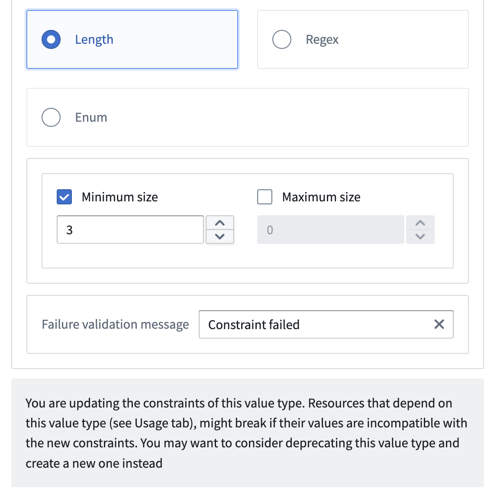

<!-- source: https://palantir.com/docs/foundry/object-link-types/value-types-versions/ · mirrored 2026-08-22 from Palantir Foundry docs -->

# Value type versions

Value types are versioned to handle breaking and non-breaking edits. Value type versions include two parts: metadata and constraints. The metadata values for name, description, and apiName can be changed whenever necessary. The base type metadata and the constraints that define the validation rules for the type are immutable.

If you choose to update the constraints of a value type, a new version of the value type is created. If your value type has no consumers, you can freely change these constraints. However, if you make breaking changes to the constraints and your value type has consumers, we recommend deprecating the current value type and creating a new one instead. This approach avoids potential runtime errors and data inconsistencies.

When you make non-breaking changes to a value type, a new version is also created. This new version will automatically propagate to the Ontology, ensuring that all uses of the value type across the Ontology are updated to the latest version.
